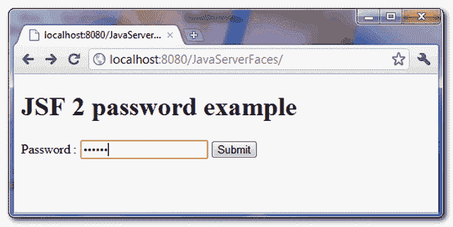
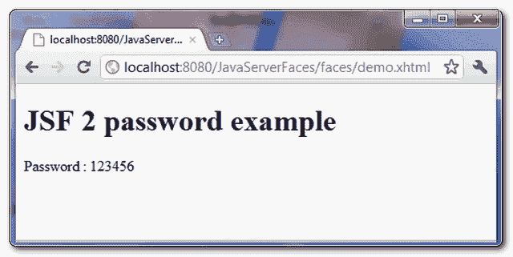

# JSF 新协议密码示例

> 原文：<http://web.archive.org/web/20230101150211/http://www.mkyong.com/jsf2/jsf-2-password-example/>

在 JSF，您可以使用 **< h:inputSecret / >** 标签来呈现一个 HTML 输入的 **type="password"** ，密码字段。举个例子，

JSF 标签…

```java
 <h:inputSecret /> 
```

呈现此 HTML 代码…

```java
 <input type="password" name="j_idt6:j_idt7"  /> 
```

*P.S 名称属性值由 JSF 随机生成。*

## JSF 密码示例

一个完整的 JSF 2 示例，通过 **< h:inputSecret / >** 标签呈现密码输入字段。

## 1.受管 Bean

一个简单的托管 bean，具有“密码”属性。

```java
 package com.mkyong.form;

import javax.faces.bean.ManagedBean;
import javax.faces.bean.SessionScoped;
import java.io.Serializable;

@ManagedBean
@SessionScoped
public class UserBean implements Serializable {

	private String password;

	public String getPassword() {
		return password;
	}

	public void setPassword(String password) {
		this.password = password;
	}

} 
```

## 2.查看页面

演示用了两页。

**demo . XHTML**——通过“h:inputSecret”呈现一个密码字段，通过“h:commandButton”呈现按钮，如果点击按钮，密码值将通过 setPassword()方法提交给“userBean.password”属性，并转发给“user.xhtml”。

```java
 <?xml version="1.0" encoding="UTF-8"?>
<!DOCTYPE html PUBLIC "-//W3C//DTD XHTML 1.0 Transitional//EN" 
"http://www.w3.org/TR/xhtml1/DTD/xhtml1-transitional.dtd">
<html    
      xmlns:h="http://java.sun.com/jsf/html">

    <h:body>
    	<h1>JSF 2 password example</h1>

	  <h:form>
    		Password : <h:inputSecret value="#{userBean.password}" />
    		<h:commandButton value="Submit" action="user" />
    	  </h:form>

    </h:body>
</html> 
```

**user . XHTML**–通过“h:outputText”显示提交的密码值

```java
 <?xml version="1.0" encoding="UTF-8"?>
<!DOCTYPE html PUBLIC "-//W3C//DTD XHTML 1.0 Transitional//EN" 
"http://www.w3.org/TR/xhtml1/DTD/xhtml1-transitional.dtd">
<html    
      xmlns:h="http://java.sun.com/jsf/html">

    <h:body>
    	<h1>JSF 2 password example</h1>

	  Password : <h:outputText value="#{userBean.password}" />

    </h:body>
</html> 
```

## 3.演示

*URL:http://localhost:8080/Java server faces/*

显示“demo.xhtml”页面

<noscript></noscript>


如果单击该按钮，将显示“user.xhtml”页面，以及提交的密码值。

<noscript></noscript>


## 下载源代码

Download It – [JSF-2-Password-Example.zip](http://web.archive.org/web/20201212022634/http://www.mkyong.com/wp-content/uploads/2010/09/JSF-2-Password-Example.zip) (9KB)

#### 参考

1.  [JSF < h:输入秘密/ > JavaDoc](http://web.archive.org/web/20201212022634/https://javaserverfaces.dev.java.net/nonav/docs/2.0/pdldocs/facelets/h/inputSecret.html)

标签: [jsf2](http://web.archive.org/web/20201212022634/https://mkyong.com/tag/jsf2/) [密码](http://web.archive.org/web/20201212022634/https://mkyong.com/tag/password/)<input type="hidden" id="mkyong-current-postId" value="7132">

### 相关文章

*   [Top 5 passwords](/web/20201212022634/https://mkyong.com/computer-tips/top-5-strongest-password/)
*   [Wicket password field example](/web/20201212022634/https://mkyong.com/wicket/wicket-password-field-example/)
*   [Java regex verification password example](/web/20201212022634/https://mkyong.com/regular-expressions/how-to-validate-password-with-regular-expression/)
*   [JSF 2 2。0 教程 JSF 2 预渲染事件示例](/web/20201212022634/https://mkyong.com/tutorials/jsf-2-0-tutorials/)
*   [ JSF multi-component verifier 2.0
*   [JSF2 multiple-choice listbox example](/web/20201212022634/https://mkyong.com/jsf2/jsf-2-multiple-select-listbox-example/)
*   [JSF 2 链接、commandLink 和输出链接示例](/web/20201212022634/https://mkyong.com/jsf2/jsf-2-link-commandlink-and-outputlink-example/)