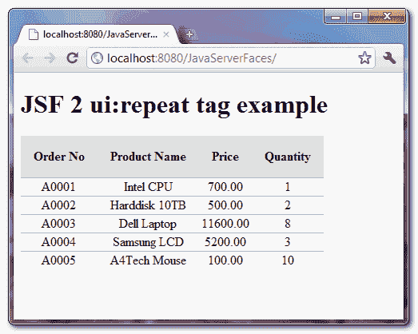

# JSF 2 重复标签示例

> 原文：<http://web.archive.org/web/20230101150211/http://www.mkyong.com/jsf2/jsf-2-repeat-tag-example/>

`ui:repeat`总是作为`h:dataTable`的替代，循环数组或列表，以 HTML 表格格式显示数据。请参见以下示例:

## 1.h:数据表

在数据表中，JSF 帮助你生成所有的 HTML 表格标签。

```java
 <h:dataTable value="#{order.orderList}" var="o">

	<h:column>
		#{o.orderNo}
	</h:column>

	<h:column>
		#{o.productName}
	</h:column>

	<h:column>
		#{o.price}
	</h:column>

	<h:column>
		#{o.qty}
	</h:column>

</h:dataTable> 
```

freestar.config.enabled_slots.push({ placementName: "mkyong_incontent_1", slotId: "mkyong_incontent_1" });

## 2.ui:重复

在重复标签中，你必须手工放置所有的 HTML 表格标签。

```java
 <table>

   <ui:repeat var="o" value="#{order.orderList}" varStatus="status">

	<tr>
		<td>#{o.orderNo}</td>
		<td>#{o.productName}</td>
		<td>#{o.price}</td>
		<td>#{o.qty}</td>
	</tr>

   </ui:repeat>

</table> 
```

**ui:重复示例**
这里有一个 JSF 2.0 **ui:重复**示例来渲染完全相同的 HTML 输出，就像这样 [h:dataTable 示例](http://web.archive.org/web/20210225180409/http://www.mkyong.com/jsf2/jsf-2-datatable-example/)。比较两者，找出不同之处。

*JSF…*

```java
 <?xml version="1.0" encoding="UTF-8"?>
<!DOCTYPE html PUBLIC "-//W3C//DTD XHTML 1.0 Transitional//EN" 
"http://www.w3.org/TR/xhtml1/DTD/xhtml1-transitional.dtd">
<html    
      xmlns:h="http://java.sun.com/jsf/html"
      xmlns:ui="http://java.sun.com/jsf/facelets"
      xmlns:c="http://java.sun.com/jsp/jstl/core"
      >
    <h:head>
    	<h:outputStylesheet library="css" name="table-style.css"  />
    </h:head>
    <h:body>

    	<h1>JSF 2 ui:repeat tag example</h1>

    	<table class="order-table">
    		<tr>
    			<th class="order-table-header">Order No</th>
    			<th class="order-table-header">Product Name</th>
    			<th class="order-table-header">Price</th>
    			<th class="order-table-header">Quantity</th>
    		</tr>
    		<tbody>
	    		<ui:repeat var="o" value="#{order.orderList}" varStatus="status">
	    			<h:panelGroup rendered="#{status.even}">
	   			  <tr>
		    			<td class="order-table-even-row">#{o.orderNo}</td>
		    			<td class="order-table-even-row">#{o.productName}</td>
		    			<td class="order-table-even-row">#{o.price}</td>
		    			<td class="order-table-even-row">#{o.qty}</td>
		    		  </tr>
	    			</h:panelGroup>
	    		        <h:panelGroup rendered="#{status.odd}">
	    			  <tr>
		    			<td class="order-table-odd-row">#{o.orderNo}</td>
		    			<td class="order-table-odd-row">#{o.productName}</td>
		    			<td class="order-table-odd-row">#{o.price}</td>
		    			<td class="order-table-odd-row">#{o.qty}</td>
		    		  </tr>
	    			</h:panelGroup>
	    		</ui:repeat>
    		</tbody>
    	</table>
    </h:body>
</html> 
```

**Note**
You can find the “order” managed bean source code in this [h:dataTable example](http://web.archive.org/web/20210225180409/http://www.mkyong.com/jsf2/jsf-2-datatable-example/).

“ **ui:repeat** ”标签带有许多有用的属性，如**偏移量**、**大小**、**状态**等。确保您检查了这个 [JSF 用户界面:重复 javadoc](http://web.archive.org/web/20210225180409/https://docs.oracle.com/javaee/6/javaserverfaces/2.1/docs/vdldocs/facelets/ui/repeat.html) 。

*输出*

<noscript></noscript>


## 下载源代码

Download It – [JSF-2-Repeat-Tag-Example.zip](http://web.archive.org/web/20210225180409/http://www.mkyong.com/wp-content/uploads/2010/10/JSF-2-Repeat-Tag-Example.zip) (10KB)

## 参考

1.  [JSF ui:重复 JavaDoc](http://web.archive.org/web/20210225180409/https://docs.oracle.com/javaee/6/javaserverfaces/2.1/docs/vdldocs/facelets/ui/repeat.html)
2.  JSF h:数据表 JavaDoc
3.  JSF h:panelGroup JavaDoc

Tags : [jsf2](http://web.archive.org/web/20210225180409/https://mkyong.com/tag/jsf2/)freestar.config.enabled_slots.push({ placementName: "mkyong_leaderboard_btf", slotId: "mkyong_leaderboard_btf" });<input type="hidden" id="mkyong-current-postId" value="7430">