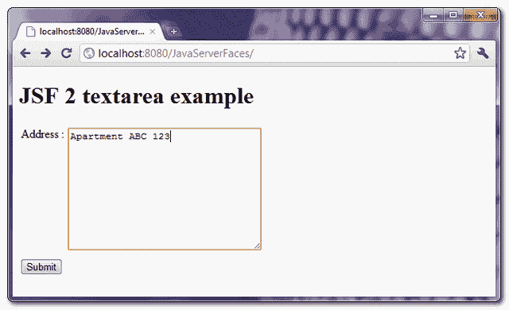
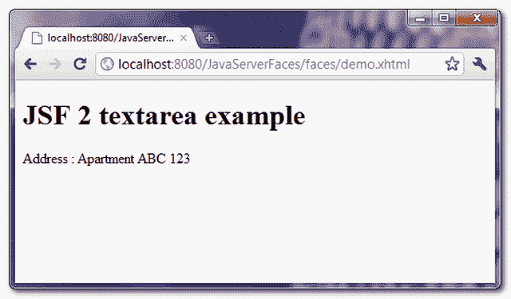

# JSF 2 文本区示例

> 原文：<http://web.archive.org/web/20230101150211/http://www.mkyong.com/jsf2/jsf-2-textarea-example/>

在 JSF，你可以使用 **< h:inputTextarea / >** 标签来呈现一个 HTML 文本区域字段。举个例子，

JSF 标签…

```java
 <h:inputTextarea cols="30" rows="10" /> 
```

呈现此 HTML 代码…

```java
 <textarea name="random value" cols="30" rows="10"></textarea> 
```

## JSF 文本区示例

一个完整的 JSF 2 示例，通过 **< h:inputTextarea / >** 标签呈现一个 textarea 字段。

## 1.受管 Bean

一个被管理的 bean，被声明为名称“user”。

```java
 package com.mkyong.form;

import javax.faces.bean.ManagedBean;
import javax.faces.bean.SessionScoped;
import java.io.Serializable;

@ManagedBean(name="user")
@SessionScoped
public class UserBean implements Serializable {

	private String address;

	public String getAddress() {
		return address;
	}

	public void setAddress(String address) {
		this.address = address;
	}

} 
```

## 2.查看页面

演示用了两页。

**demo . XHTML**–通过“h:inputTextarea”呈现一个 Textarea 字段，通过“h:commandButton”呈现按钮，如果点击按钮，textarea 值将通过 setAddress()方法提交给“userBean.address”属性，并转发给“user.xhtml”。

```java
 <?xml version="1.0" encoding="UTF-8"?>
<!DOCTYPE html PUBLIC "-//W3C//DTD XHTML 1.0 Transitional//EN" 
"http://www.w3.org/TR/xhtml1/DTD/xhtml1-transitional.dtd">
<html    
      xmlns:h="http://java.sun.com/jsf/html">

    <h:body>
    	<h1>JSF 2 textarea example</h1>

	  <h:form>
		<table>
    		<tr>
    		  <td valign="top">Address :</td>
    		  <td><h:inputTextarea value="#{user.address}" cols="30" rows="10" /></td>
    		</tr> 
    		</table>
    		<h:commandButton value="Submit" action="user" />
    	  </h:form>

    </h:body>
</html> 
```

**user . XHTML**–通过“h:outputText”显示提交的 textarea 值

```java
 <?xml version="1.0" encoding="UTF-8"?>
<!DOCTYPE html PUBLIC "-//W3C//DTD XHTML 1.0 Transitional//EN" 
"http://www.w3.org/TR/xhtml1/DTD/xhtml1-transitional.dtd">
<html    
      xmlns:h="http://java.sun.com/jsf/html">

    <h:body>
    	<h1>JSF 2 textarea example</h1>

	 Address : <h:outputText value="#{user.address}" />
    </h:body>
</html> 
```

## 3.演示

*URL:http://localhost:8080/Java server faces/*

显示“demo.xhtml”页面




如果单击该按钮，将显示“user.xhtml”页面，以及提交的 textarea 值。




## 下载源代码

Download It – [JSF-2-TextArea-Example.zip](http://web.archive.org/web/20201212022644/http://www.mkyong.com/wp-content/uploads/2010/09/JSF-2-TextArea-Example.zip) (9KB)

#### 参考

1.  [JSF<h:input textarea/>JavaDoc](http://web.archive.org/web/20201212022644/https://javaserverfaces.dev.java.net/nonav/docs/2.0/pdldocs/facelets/h/inputTextarea.html)

标签:[JSF 2](http://web.archive.org/web/20201212022644/https://mkyong.com/tag/jsf2/)[textarea](http://web.archive.org/web/20201212022644/https://mkyong.com/tag/textarea/)<input type="hidden" id="mkyong-current-postId" value="7140">

### 相关文章

*   [在文本区域上添加 maxlength 使用 jQuery](/web/20201212022644/https://www.mkyong.com/jquery/add-maxlength-on-textarea-using-jquery/)
*   [Wicket textArea 示例](/web/20201212022644/https://www.mkyong.com/wicket/wicket-textarea-example/)
*   [JSF 2.0 tutorial](/web/20201212022644/https://www.mkyong.com/tutorials/jsf-2-0-tutorials/)
*   [](/web/20201212022644/https://www.mkyong.com/struts/struts-htmltextarea-textarea-example/)
*   [JSF 2 PreRenderViewEvent 示例](/web/20201212022644/https://www.mkyong.com/jsf2/jsf-2-prerenderviewevent-example/)
*   [JSF 多组件验证器 2.0](/web/20201212022644/https://www.mkyong.com/jsf2/multi-components-validator-in-jsf-2-0/)
*   [JSF 2 多选列表框示例](/web/20201212022644/https://www.mkyong.com/jsf2/jsf-2-multiple-select-listbox-example/)
*   [JSF 2 链接、commandLink 和输出链接示例](/web/20201212022644/https://www.mkyong.com/jsf2/jsf-2-link-commandlink-and-outputlink-example/)