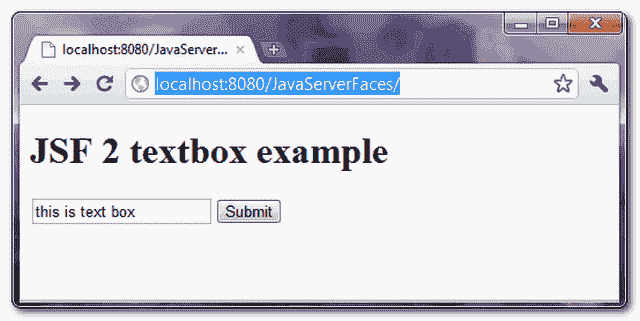
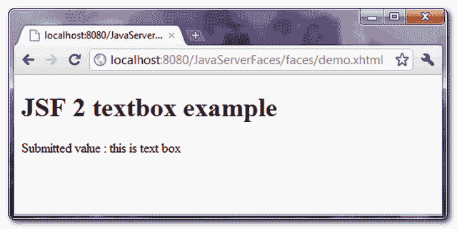

# JSF 2 文本框示例

> 原文：<http://web.archive.org/web/20230101150211/http://www.mkyong.com/jsf2/jsf-2-textbox-example/>

在 JSF，你可以使用 **< h:inputText / >** 标签来呈现一个 HTML 输入的 **type="text"** ，文本框。举个例子，

JSF 标签…

```java
 <h:inputText /> 
```

呈现此 HTML 代码…

```java
 <input type="text" name="j_idt6:j_idt7" /> 
```

*P.S 名称属性值由 JSF 随机生成。*

## JSF 文本框示例

一个完整的 JSF 2 示例，通过 **< h:inputText / >** 标签呈现一个文本框输入字段。

## 1.受管 Bean

一个简单的托管 bean，具有“用户名”属性。

```java
 package com.mkyong.form;

import javax.faces.bean.ManagedBean;
import javax.faces.bean.SessionScoped;
import java.io.Serializable;

@ManagedBean
@SessionScoped
public class UserBean implements Serializable {

	private String userName;

	public String getUserName() {
		return userName;
	}

	public void setUserName(String userName) {
		this.userName = userName;
	}
} 
```

## 2.查看页面

演示用了两页。

**demo . XHTML**–通过“h:inputText”呈现 textbox，通过“h:commandButton”呈现 button，如果点击按钮，textbox 的值将通过 setUserName()方法提交给“userBean.userName”属性，并转发给“user.xhtml”。

```java
 <?xml version="1.0" encoding="UTF-8"?>
<!DOCTYPE html PUBLIC "-//W3C//DTD XHTML 1.0 Transitional//EN" 
"http://www.w3.org/TR/xhtml1/DTD/xhtml1-transitional.dtd">
<html    
      xmlns:h="http://java.sun.com/jsf/html">

    <h:body>
    	<h1>JSF 2 textbox example</h1>

	  <h:form>
    		<h:inputText value="#{userBean.userName}" />
    		<h:commandButton value="Submit" action="user" />
    	  </h:form>

    </h:body>
</html> 
```

**user . XHTML**–通过“h:outputText”显示提交的文本框值

```java
 <?xml version="1.0" encoding="UTF-8"?>
<!DOCTYPE html PUBLIC "-//W3C//DTD XHTML 1.0 Transitional//EN" 
"http://www.w3.org/TR/xhtml1/DTD/xhtml1-transitional.dtd">
<html    
      xmlns:h="http://java.sun.com/jsf/html">

    <h:body>
    	<h1>JSF 2 textbox example</h1>

	Submitted value : <h:outputText value="#{userBean.userName}" />

    </h:body>
</html> 
```

## 3.演示

*URL:http://localhost:8080/Java server faces/*

显示“demo.xhtml”页面

<noscript></noscript>



如果单击按钮，显示“user.xhtml”页面和提交的文本框值

<noscript></noscript>


## 下载源代码

Download It – [JSF-2-TextBox-Example.zip](http://web.archive.org/web/20201212022629/http://www.mkyong.com/wp-content/uploads/2010/09/JSF-2-TextBox-Example.zip) (9KB)

#### 参考

1.  [JSF < h:输入文本/ > JavaDoc](http://web.archive.org/web/20201212022629/https://javaserverfaces.dev.java.net/nonav/docs/2.0/pdldocs/facelets/h/inputText.html)

标签:[JSF 2](http://web.archive.org/web/20201212022629/https://mkyong.com/tag/jsf2/)[textbox](http://web.archive.org/web/20201212022629/https://mkyong.com/tag/textbox/)<input type="hidden" id="mkyong-current-postId" value="7123">

### 相关文章

*   [How to get textbox value](/web/20201212022629/https://www.mkyong.com/jquery/how-to-get-textbox-value-with-jquery/) with jQuery
*   [How to add/remove textbox 【T1] dynamically with jQuer](/web/20201212022629/https://www.mkyong.com/jquery/how-to-add-remove-textbox-dynamically-with-jquery/)
*   [Wicket 文本框示例](/web/20201212022629/https://www.mkyong.com/wicket/wicket-textbox-example/)
*   [JSF 2.0 tutorial](/web/20201212022629/https://www.mkyong.com/tutorials/jsf-2-0-tutorials/)
*   [Struts < html:文本>文本框 103](/web/20201212022629/https://www.mkyong.com/struts/struts-htmltext-textbox-example/)

*   [Struts 2 < s:textfield >文本框 103](/web/20201212022629/https://www.mkyong.com/struts2/struts-2-stextfield-textbox-example/)
*   [Spring MVC](/web/20201212022629/https://www.mkyong.com/spring-mvc/spring-mvc-textbox-example/)