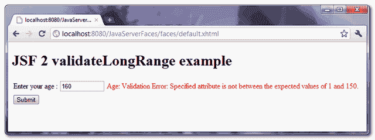

# JSF 2 有效范围示例

> 原文：<http://web.archive.org/web/20230101150211/http://www.mkyong.com/jsf2/jsf-2-validatelongrange-example/>

" **f:validateLongRange** "是一个 JSF 范围验证器标签，用于检查数值的范围。举个例子，

```java
 <h:inputText id="age" value="#{user.age}">
	<f:validateLongRange minimum="1" maximum="150" />
</h:inputText> 
```

提交表单时，验证器将确保“年龄”值在 1 到 150 的范围内。

## “f:validateLongRange”示例

一个 JSF 2.0 的例子，展示了如何使用" **f:validateLongRange** "标签来验证" age "输入域的范围，当验证器失败时，通过" **h:message** "标签显示错误消息。

freestar.config.enabled_slots.push({ placementName: "mkyong_incontent_1", slotId: "mkyong_incontent_1" });

## 1.受管 Bean

用户管理的 bean，具有“年龄”属性。

```java
 package com.mkyong;

import java.io.Serializable;
import javax.faces.bean.ManagedBean;
import javax.faces.bean.SessionScoped;

@ManagedBean(name="user")
@SessionScoped
public class UserBean implements Serializable{

	int age;

	public int getAge() {
		return age;
	}

	public void setAge(int age) {
		this.age = age;
	}

} 
```

## 2.JSF·佩奇

JSF XHTML 页面，展示了如何使用“ **f:validateLongRange** ”标签来确保“年龄”输入值在 1 到 150 的范围内。

```java
 <?xml version="1.0" encoding="UTF-8"?>
<!DOCTYPE html PUBLIC "-//W3C//DTD XHTML 1.0 Transitional//EN" 
"http://www.w3.org/TR/xhtml1/DTD/xhtml1-transitional.dtd">
<html    
      xmlns:h="http://java.sun.com/jsf/html"
      xmlns:f="http://java.sun.com/jsf/core"
      >
    <h:body>

    	<h1>JSF 2 validateLongRange example</h1>

	<h:form>

		<h:panelGrid columns="3">

			Enter your age : 

			<h:inputText id="age" value="#{user.age}" 
				size="10" required="true"
				label="Age" >
			        <f:validateLongRange maximum="150" minimum="1" />
			</h:inputText>

			<h:message for="age" style="color:red" />

		</h:panelGrid>

		<h:commandButton value="Submit" action="result" />

	</h:form>

    </h:body>
</html> 
```

## 3.演示

最大范围验证失败。




## 下载源代码

Download It – [JSF-2-ValidateLongRange-Example.zip](http://web.archive.org/web/20210220021055/http://www.mkyong.com/wp-content/uploads/2010/10/JSF-2-ValidateLongRange-Example.zip) (9KB)

## 参考

1.  [JSF 2 validate long range JavaDoc](http://web.archive.org/web/20210220021055/https://javaserverfaces.dev.java.net/nonav/docs/2.0/pdldocs/facelets/f/validateLongRange.html)

Tags : [jsf2](http://web.archive.org/web/20210220021055/https://mkyong.com/tag/jsf2/) [validation](http://web.archive.org/web/20210220021055/https://mkyong.com/tag/validation/)freestar.config.enabled_slots.push({ placementName: "mkyong_leaderboard_btf", slotId: "mkyong_leaderboard_btf" });<input type="hidden" id="mkyong-current-postId" value="7506">