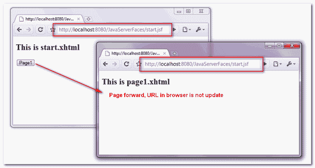
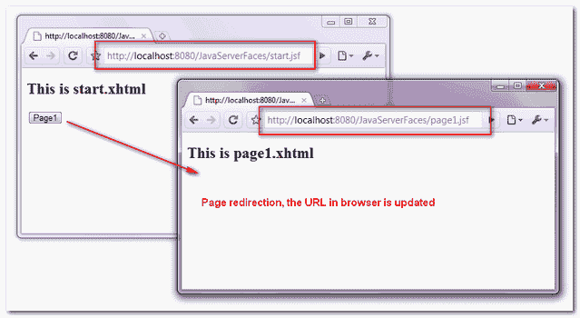

# JSF:页面转发 vs 页面重定向

> 原文：<http://web.archive.org/web/20230101150211/http://www.mkyong.com/jsf2/jsf-page-forward-vs-page-redirect/>

默认情况下，JSF 将在导航到另一个页面时向前执行一个服务器页面。请参见下面的示例来区分页面转发和页面重定向。

一个“`start.xhtml`”页面，带有一个导航到“`page1.xhtml`”页面的按钮。

## 1.向前翻页

下面是向前翻页的工作方式:

1.  浏览器发送一个“ **GET** 请求到 URL:http://localhost:8080/Java server faces/faces/start . XHTML。
2.  JSF 收到请求并返回“ **start.xhtml** ”。
3.  浏览器显示“ **start.xhtml** 的内容。
4.  用户点击按钮。
5.  JSF 收到动作，在服务器端执行一个**内部页面转发**到“ **page1.xhtml** ”。
6.  JSF 返回了" **page1.xhtml** "。
7.  浏览器显示" **page1.xhtml** 的内容。

在页面转发中，**浏览器的 URL 不更新**。



## 2.页面重定向

页面重定向的工作原理如下:

1.  浏览器发送一个“ **GET** 请求到 URL:http://localhost:8080/Java server faces/faces/start . XHTML。
2.  JSF 收到请求并返回“ **start.xhtml** ”。
3.  浏览器显示“ **start.xhtml** 的内容。
4.  用户点击按钮。
5.  JSF 收到这个动作，并向浏览器发回一个“**重定向**到“ **page1.xhtml** ”的响应。
6.  浏览器收到响应后，向 URL 发送另一个“ **GET** ”请求:http://localhost:8080/Java server faces/faces/page 1 . XHTML。
7.  JSF 收到请求并返回" **page1.xhtml** "。
8.  浏览器显示“ **page1.xhtml** 的内容，**浏览器的网址更新**。



要在 JSF 2.0 中启用页面重定向，可以在结果字符串的末尾附加“`faces-redirect=true`”。

**向前翻页。**

```java
 <h:form>
    <h:commandButton action="page1" value="Page1" />
</h:form> 
```

**页面重定向。**

```java
 <h:form>
    <h:commandButton action="page1?faces-redirect=true" value="Page1" />
</h:form> 
```

在导航规则中，您可以通过在`<navigation-case />`中添加一个`<redirect />`元素来启用页面重定向。

```java
 <navigation-rule>
	<from-view-id>start.xhtml</from-view-id>
	<navigation-case>
		<from-outcome>page1</from-outcome>
		<to-view-id>page1.xhtml</to-view-id>
		<redirect />
	</navigation-case>
</navigation-rule> 
```

## 结论

与页面重定向相比，默认页面转发机制更快，因为页面重定向向服务器添加了额外的 HTTP 请求。所以，只在必要的时候启用页面重定向，比如使用 **Post/Redirect/Get** 设计模式来解决经典的[重复表单提交问题](http://web.archive.org/web/20220722054155/http://www.mkyong.com/spring-mvc/handling-duplicate-form-submission-in-spring-mvc/)。

## 下载源代码

Download it – [JSF-2-Page-Redirection-Example.zip](http://web.archive.org/web/20220722054155/http://www.mkyong.com/wp-content/uploads/2010/09/JSF-2-Page-Redirection-Example.zip) (9KB)<input type="hidden" id="mkyong-current-postId" value="7100">