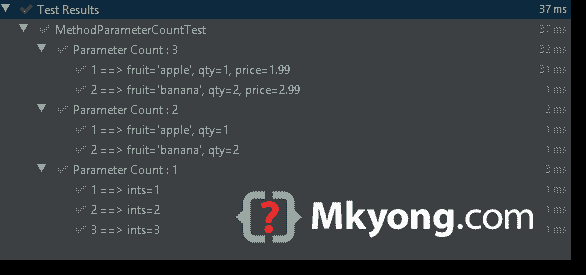

# JUnit 5 测试执行顺序

> 原文：<http://web.archive.org/web/20230101150211/https://mkyong.com/junit5/junit-5-test-execution-order/>


本文向您展示了如何通过下面的`MethodOrderer`类来控制 JUnit 5 测试的执行顺序:

*   含字母和数字的
*   订单注释
*   随意
*   定制订单

*用 JUnit 5.5.2 测试的 PS*

## 1.含字母和数字的

1.1 它按字母数字顺序对测试方法进行分类。

MethodAlphanumericTest.java

```java
 package com.mkyong.order;

import org.junit.jupiter.api.MethodOrderer;
import org.junit.jupiter.api.Test;
import org.junit.jupiter.api.TestMethodOrder;

import static org.junit.jupiter.api.Assertions.assertEquals;

@TestMethodOrder(MethodOrderer.Alphanumeric.class)
public class MethodAlphanumericTest {

    @Test
    void testZ() {
        assertEquals(2, 1 + 1);
    }

    @Test
    void testA() {
        assertEquals(2, 1 + 1);
    }

    @Test
    void testY() {
        assertEquals(2, 1 + 1);
    }

    @Test
    void testE() {
        assertEquals(2, 1 + 1);
    }

    @Test
    void testB() {
        assertEquals(2, 1 + 1);
    }

} 
```

输出

```java
 testA()
testB()
testE()
testY()
testZ() 
```

## 2.订单注释

2.1 根据`@Order`值对测试方法进行分类。

MethodOrderTest.java

```java
 package com.mkyong.order;

import org.junit.jupiter.api.MethodOrderer;
import org.junit.jupiter.api.Order;
import org.junit.jupiter.api.Test;
import org.junit.jupiter.api.TestMethodOrder;

import static org.junit.jupiter.api.Assertions.assertEquals;

@TestMethodOrder(MethodOrderer.OrderAnnotation.class)
public class MethodOrderTest {

    @Test
    void test0() {
        assertEquals(2, 1 + 1);
    }

    @Test
    @Order(3)
    void test1() {
        assertEquals(2, 1 + 1);
    }

    @Test
    @Order(1)
    void test2() {
        assertEquals(2, 1 + 1);
    }

    @Test
    @Order(2)
    void test3() {
        assertEquals(2, 1 + 1);
    }

    @Test
    void test4() {
        assertEquals(2, 1 + 1);
    }

} 
```

输出

```java
 test2()
test3()
test1()
test0()
test4() 
```

## 3.随意

3.1 它对测试方法进行伪随机排序，并支持自定义种子的配置:

```java
 junit.jupiter.execution.order.random.seed 
```

MethodRandomTest.java

```java
 package com.mkyong.order;

import org.junit.jupiter.api.MethodOrderer;
import org.junit.jupiter.api.Test;
import org.junit.jupiter.api.TestMethodOrder;

import static org.junit.jupiter.api.Assertions.assertEquals;

@TestMethodOrder(MethodOrderer.Random.class)
public class MethodRandomTest {

    @Test
    void testZ() {
        assertEquals(2, 1 + 1);
    }

    @Test
    void testA() {
        assertEquals(2, 1 + 1);
    }

    @Test
    void testY() {
        assertEquals(2, 1 + 1);
    }

    @Test
    void testE() {
        assertEquals(2, 1 + 1);
    }

    @Test
    void testB() {
        assertEquals(2, 1 + 1);
    }

} 
```

输出，随机。

```java
 # Run 1
testA()
testZ()
testE()
testY()
testB()

# Run 2
testY()
testE()
testZ()
testA()
testB()

# Run 3
testA()
testB()
testY()
testE()
testZ() 
```

3.2 配置一个定制种子`junit.jupiter.execution.order.random.seed`来创建一个可重复的测试构建

在属性文件中。

junit-platform.properties

```java
 junit.jupiter.execution.order.random.seed=99 
```

在 Maven 中，配置参数

pom.xml

```java
 <plugin>
		<groupId>org.apache.maven.plugins</groupId>
		<artifactId>maven-surefire-plugin</artifactId>
		<version>3.0.0-M3</version>
		<configuration>
			<properties>
				<configurationParameters>
					junit.jupiter.execution.order.random.seed=99
				</configurationParameters>
			</properties>
		</configuration>
	</plugin> 
```

在 Gradle 中，配置参数

build.gradle

```java
 test {

	useJUnitPlatform()

	systemProperties = [
			'junit.jupiter.execution.order.random.seed': 99
	]

} 
```

使用自定义种子再次运行它。

```java
 # Run 1 - seed 99
testA()
testZ()
testE()
testY()
testB()

# Run 2 - seed 99
testA()
testZ()
testE()
testY()
testB()

# Run 3 - seed 99
testA()
testZ()
testE()
testY()
testB() 
```

## 4.定制订单

4.1 执行`MethodOrderer`创建自定义测试订单。

4.2 以下示例是按参数计数排序的。

ParameterCountOrder.java

```java
 package com.mkyong.order;

import org.junit.jupiter.api.MethodDescriptor;
import org.junit.jupiter.api.MethodOrderer;
import org.junit.jupiter.api.MethodOrdererContext;

import java.util.Comparator;

public class ParameterCountOrder implements MethodOrderer {

    private Comparator<MethodDescriptor> comparator =
            Comparator.comparingInt(md1 -> md1.getMethod().getParameterCount());

    @Override
    public void orderMethods(MethodOrdererContext context) {

        context.getMethodDescriptors().sort(comparator.reversed());

    }

} 
```

4.3 用`@ParameterizedTest`测试上述定制订单

MethodParameterCountTest.java

```java
 package com.mkyong.order;

import org.junit.jupiter.api.DisplayName;
import org.junit.jupiter.api.TestMethodOrder;
import org.junit.jupiter.params.ParameterizedTest;
import org.junit.jupiter.params.provider.CsvSource;
import org.junit.jupiter.params.provider.ValueSource;

import java.math.BigDecimal;

import static org.junit.jupiter.api.Assertions.assertTrue;

@TestMethodOrder(ParameterCountOrder.class)
public class MethodParameterCountTest {

    @DisplayName("Parameter Count : 2")
    @ParameterizedTest(name = "{index} ==> fruit=''{0}'', qty={1}")
    @CsvSource({
            "apple,         1",
            "banana,        2"
    })
    void test2(String fruit, int qty) {
        assertTrue(true);
    }

    @DisplayName("Parameter Count : 1")
    @ParameterizedTest(name = "{index} ==> ints={0}")
    @ValueSource(ints = {1, 2, 3})
    void test1(int num1) {
        assertTrue(num1 < 4);
    }

    @DisplayName("Parameter Count : 3")
    @ParameterizedTest(name = "{index} ==> fruit=''{0}'', qty={1}, price={2}")
    @CsvSource({
            "apple,         1,  1.99",
            "banana,        2,  2.99"
    })
    void test3(String fruit, int qty, BigDecimal price) {
        assertTrue(true);
    }

} 
```

输出



4.4 拆卸`comparator.reversed()`

```java
 public class ParameterCountOrder implements MethodOrderer {

   //...

    @Override
    public void orderMethods(MethodOrdererContext context) {

        //context.getMethodDescriptors().sort(comparator.reversed());
        context.getMethodDescriptors().sort(comparator);
    }

} 
```

输出


## 下载源代码

$ git clone [https://github.com/mkyong/junit-examples](http://web.archive.org/web/20221225035521/https://github.com/mkyong/junit-examples)
$ cd junit5-examples
$ check src/test/java/com/mkyong/order/*.java

## 参考

*   [JUnit 5 测试执行顺序](http://web.archive.org/web/20221225035521/https://junit.org/junit5/docs/current/user-guide/#writing-tests-test-execution-order)
*   方法订购者。随机

<input type="hidden" id="mkyong-current-postId" value="15245">