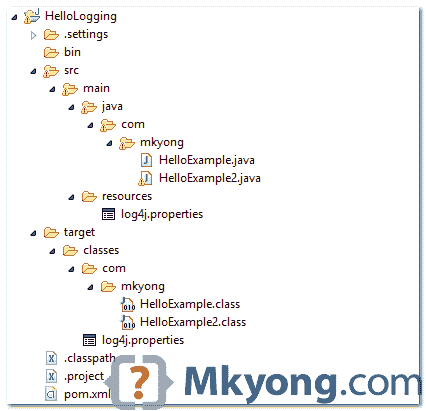

# Log4j hello world 示例

> 原文：<http://web.archive.org/web/20230101150211/http://www.mkyong.com/logging/log4j-hello-world-example/>

在本教程中，我们将向您展示如何使用经典的 log4j 1.2.x 来记录 Java 应用程序中的调试或错误消息。

## 1.项目目录

回顾最终的项目结构，一个标准的 Maven 风格的 Java 项目。



## 2.获取 Log4j

声明以下依赖项:

pom.xml

```java
 <dependency>
		<groupId>log4j</groupId>
		<artifactId>log4j</artifactId>
		<version>1.2.17</version>
	</dependency> 
```

非 Maven 用户，访问 [log4j 官方页面](http://web.archive.org/web/20221031160049/https://logging.apache.org/log4j/1.2/)，下载 jar，手动放入项目库路径。

## 3.log4j.properties

创建一个`log4j.properties`文件，并将其放入 resources 文件夹。请参考上面的步骤#1。

**Note**

1.  对于独立的 Java 应用程序，确保`log4j.properties`文件在`project/classes`目录下
2.  对于 Java web 应用程序，确保`log4j.properties`文件在`WEB-INF/classes`目录下

log4j.properties

```java
 # Root logger option
log4j.rootLogger=DEBUG, stdout, file

# Redirect log messages to console
log4j.appender.stdout=org.apache.log4j.ConsoleAppender
log4j.appender.stdout.Target=System.out
log4j.appender.stdout.layout=org.apache.log4j.PatternLayout
log4j.appender.stdout.layout.ConversionPattern=%d{yyyy-MM-dd HH:mm:ss} %-5p %c{1}:%L - %m%n

# Redirect log messages to a log file, support file rolling.
log4j.appender.file=org.apache.log4j.RollingFileAppender
log4j.appender.file.File=C:\\log4j-application.log
log4j.appender.file.MaxFileSize=5MB
log4j.appender.file.MaxBackupIndex=10
log4j.appender.file.layout=org.apache.log4j.PatternLayout
log4j.appender.file.layout.ConversionPattern=%d{yyyy-MM-dd HH:mm:ss} %-5p %c{1}:%L - %m%n 
```

**Note**
To understand the symbols in the `ConversionPattern`, please refer to this [log4j PatternLayout guide](http://web.archive.org/web/20221031160049/https://logging.apache.org/log4j/1.2/apidocs/org/apache/log4j/PatternLayout.html).

让我们来分解一下:

1.  %d{yyyy-MM-dd HH:mm:ss} =日期和时间格式，参考 [SimpleDateFormat](http://web.archive.org/web/20221031160049/https://docs.oracle.com/javase/7/docs/api/java/text/SimpleDateFormat.html) JavaDoc。
2.  %-5p =日志优先级，如调试或错误。对于漂亮的打印格式，5 是可选的。
3.  %c{1} =我们通过 getLogger()设置的日志名称，请参考 [log4j PatternLayout guide](http://web.archive.org/web/20221031160049/https://logging.apache.org/log4j/1.2/apidocs/org/apache/log4j/PatternLayout.html) 。
4.  %L =记录请求的行号。
5.  %m%n =要记录和换行的消息。

日志消息示例:

```java
 2014-07-02 20:52:39 DEBUG className:200 - This is debug message
2014-07-02 20:52:39 DEBUG className:201 - This is debug message2 
```

## 4.演示–如何记录消息？

要记录消息，首先，创建一个`final static`记录器并为记录器定义一个名称，通常，我们使用完整的包类名。

```java
 final static Logger logger = Logger.getLogger(classname.class); 
```

然后，记录具有不同优先级的消息，例如，调试、信息、警告、错误和致命。通常情况下，您只需要使用 debug 或 error。

```java
 //logs a debug message
	if(logger.isDebugEnabled()){
	    logger.debug("This is debug");
	}

	//logs an error message with parameter
	logger.error("This is error : " + parameter);

	//logs an exception thrown from somewhere
	logger.error("This is error", exception); 
```

*4.1 示例:*记录器被设置为**调试**优先级。

log4j.properties

```java
 log4j.rootLogger=DEBUG, stdout

#... 
```

HelloExample.java

```java
 package com.mkyong;

import org.apache.log4j.Logger;

public class HelloExample{

	final static Logger logger = Logger.getLogger(HelloExample.class);

	public static void main(String[] args) {

		HelloExample obj = new HelloExample();
		obj.runMe("mkyong");

	}

	private void runMe(String parameter){

		if(logger.isDebugEnabled()){
			logger.debug("This is debug : " + parameter);
		}

		if(logger.isInfoEnabled()){
			logger.info("This is info : " + parameter);
		}

		logger.warn("This is warn : " + parameter);
		logger.error("This is error : " + parameter);
		logger.fatal("This is fatal : " + parameter);

	}

} 
```

输出

```java
 2014-07-02 20:52:39 DEBUG HelloExample:19 - This is debug : mkyong
2014-07-02 20:52:39 INFO  HelloExample:23 - This is info : mkyong
2014-07-02 20:52:39 WARN  HelloExample:26 - This is warn : mkyong
2014-07-02 20:52:39 ERROR HelloExample:27 - This is error : mkyong
2014-07-02 20:52:39 FATAL HelloExample:28 - This is fatal : mkyong 
```

*4.2 示例—*记录器被设置为**错误**优先级。

log4j.properties

```java
 log4j.rootLogger=error, stdout

#... 
```

再次运行`HelloExample`,您将得到以下输出

```java
 2014-07-02 20:56:02 ERROR HelloExample:27 - This is error : mkyong
2014-07-02 20:56:02 FATAL HelloExample:28 - This is fatal : mkyong 
```

复习 log4j 的`Priority`类。

Priority.java

```java
 package org.apache.log4j;

public class Priority {

  public final static int OFF_INT = Integer.MAX_VALUE;
  public final static int FATAL_INT = 50000;
  public final static int ERROR_INT = 40000;
  public final static int WARN_INT  = 30000;
  public final static int INFO_INT  = 20000;
  public final static int DEBUG_INT = 10000;
    //public final static int FINE_INT = DEBUG_INT;
  public final static int ALL_INT = Integer.MIN_VALUE; 
```

如果在`log4j.properties`中定义了优先级，则只会记录相同或更高优先级的消息。

## 5.演示–如何记录异常

这个例子展示了如何使用 log4j 来记录一个异常。

HelloExample2.java

```java
 package com.mkyong;

import org.apache.log4j.Logger;

public class HelloExample2{

	final static Logger logger = Logger.getLogger(HelloExample2.class);

	public static void main(String[] args) {

		HelloExample2 obj = new HelloExample2();

		try{
			obj.divide();
		}catch(ArithmeticException ex){
			logger.error("Sorry, something wrong!", ex);
		}

	}

	private void divide(){

		int i = 10 /0;

	}

} 
```

输出

```java
 2014-07-02 21:03:10 ERROR HelloExample2:16 - Sorry, something wrong!
java.lang.ArithmeticException: / by zero
	at com.mkyong.HelloExample2.divide(HelloExample2.java:24)
	at com.mkyong.HelloExample2.main(HelloExample2.java:14) 
```

完成了。

## 下载源代码

Download Source Code – [log4j-hello-world-example.zip](http://web.archive.org/web/20221031160049/http://www.mkyong.com/wp-content/uploads/2014/07/log4j-hello-world.zip)(8 KB)

## 参考

1.  [log4j 1.2 官方页面](http://web.archive.org/web/20221031160049/https://logging.apache.org/log4j/1.2/)
2.  [log4j 模式布局](http://web.archive.org/web/20221031160049/https://logging.apache.org/log4j/1.2/apidocs/org/apache/log4j/PatternLayout.html)
3.  [维基百科:log4j](http://web.archive.org/web/20221031160049/https://en.wikipedia.org/wiki/Log4j)
4.  [Spring MVC + log4j 示例](http://web.archive.org/web/20221031160049/http://www.mkyong.com/spring-mvc/spring-mvc-log4j-integration-example/)
5.  [log4j.properties 示例](http://web.archive.org/web/20221031160049/http://www.mkyong.com/logging/log4j-log4j-properties-examples/)

<input type="hidden" id="mkyong-current-postId" value="13356">