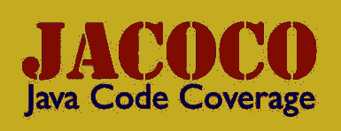
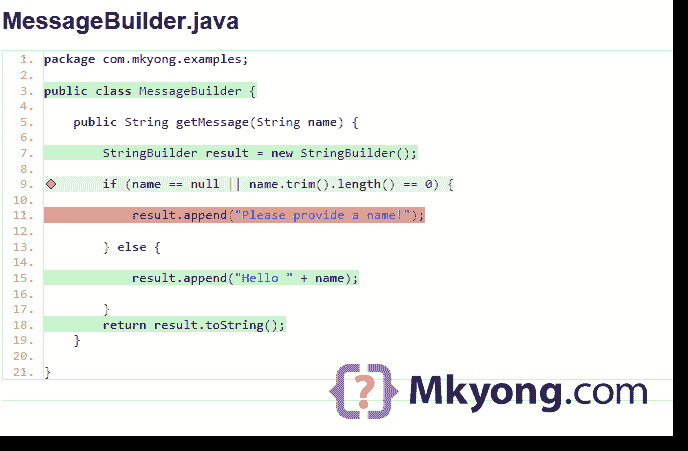
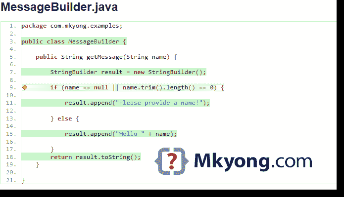
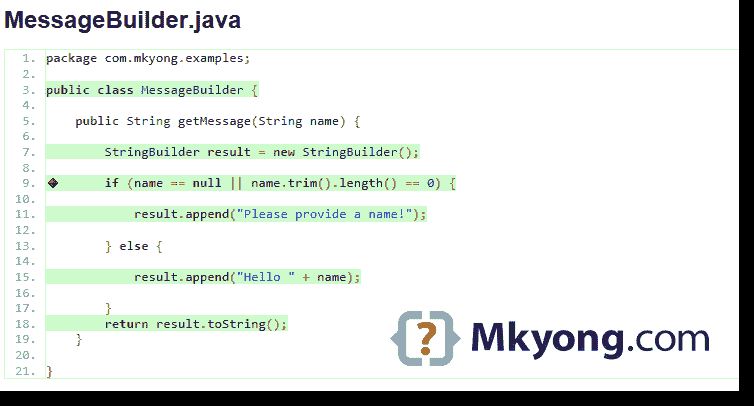

# maven–JaCoCo 代码覆盖示例

> 原文：<http://web.archive.org/web/20230101150211/https://www.mkyong.com/maven/maven-jacoco-code-coverage-example/>



在本文中，我们将向您展示如何使用一个 [JaCoCo Maven 插件](http://web.archive.org/web/20211005231822/https://www.jacoco.org/jacoco/trunk/doc/maven.html)来为一个 Java 项目生成代码覆盖报告。

测试对象

1.  Maven 3.5.3
2.  JUnit 5.3.1
3.  jacoco-maven 插件

**Note**
JaCoCo is an actively developed line coverage tool, that is used to measure how many lines of our code are tested.

## 1.JaCoCo Maven 插件

1.1 在`pom.xml`文件中声明下面的 JaCoCo 插件。

pom.xml

```java
 <plugin>
		<groupId>org.jacoco</groupId>
		<artifactId>jacoco-maven-plugin</artifactId>
		<version>0.8.2</version>
		<executions>
			<execution>
				<goals>
					<goal>prepare-agent</goal>
				</goals>
			</execution>
			<!-- attached to Maven test phase -->
			<execution>
				<id>report</id>
				<phase>test</phase>
				<goals>
					<goal>report</goal>
				</goals>
			</execution>
		</executions>
	</plugin> 
```

它将在 Maven 测试阶段运行 JaCoCo 的“报告”目标。

## 2.单元测试

2.1 一个简单的 Java 代码来返回一个消息，和一个空字符串检查。

MessageBuilder.java

```java
 package com.mkyong.examples;

public class MessageBuilder {

    public String getMessage(String name) {

        StringBuilder result = new StringBuilder();

        if (name == null || name.trim().length() == 0) {

            result.append("Please provide a name!");

        } else {

            result.append("Hello " + name);

        }
        return result.toString();
    }

} 
```

2.2 类以上单元测试。

TestMessageBuilder.java

```java
 package com.mkyong.examples;

import org.junit.jupiter.api.Test;

import static org.junit.jupiter.api.Assertions.assertEquals;

public class TestMessageBuilder {

    @Test
    public void testNameMkyong() {

        MessageBuilder obj = new MessageBuilder();
        assertEquals("Hello mkyong", obj.getMessage("mkyong"));

    }

} 
```

2.3 运行`mvn test`，将在`target/site/jacoco/*`生成 JaCoCo 代码覆盖报告

Terminal

```java
 $ mvn clean test

[INFO] -------------------------------------------------------
[INFO]  T E S T S
[INFO] -------------------------------------------------------
[INFO] Running com.mkyong.examples.TestMessageBuilder
[INFO] Tests run: 1, Failures: 0, Errors: 0, Skipped: 0, Time elapsed: 0.012 s - in com.mkyong.examples.TestMessageBuilder
[INFO]
[INFO] Results:
[INFO]
[INFO] Tests run: 1, Failures: 0, Errors: 0, Skipped: 0
[INFO]
[INFO]
[INFO] --- jacoco-maven-plugin:0.8.2:report (report) @ maven-code-coverage ---
[INFO] Loading execution data file D:\maven-examples\maven-code-coverage\target\jacoco.exec
[INFO] Analyzed bundle 'maven-code-coverage' with 1 classes
[INFO] ------------------------------------------------------------------------
[INFO] BUILD SUCCESS
[INFO] ------------------------------------------------------------------------
[INFO] Total time: 4.164 s
[INFO] Finished at: 2018-11-14T16:48:39+08:00
[INFO] ------------------------------------------------------------------------ 
```

2.4 打开`target/site/jacoco/index.html`文件，查看代码覆盖率报告:



1.  绿色–代码已经过测试或被覆盖。
2.  红色-代码未被测试或覆盖。
3.  黄色-代码部分测试或被覆盖。

## 3.改进单元测试

3.1 增加一项红线测试。

TestMessageBuilder.java

```java
 package com.mkyong.examples;

import org.junit.jupiter.api.Test;

import static org.junit.jupiter.api.Assertions.assertEquals;

public class TestMessageBuilder {

    @Test
    public void testNameMkyong() {

        MessageBuilder obj = new MessageBuilder();
        assertEquals("Hello mkyong", obj.getMessage("mkyong"));

    }

	@Test
    public void testNameEmpty() {

        MessageBuilder obj = new MessageBuilder();
        assertEquals("Please provide a name!", obj.getMessage(" "));

    }
} 
```

再次查看报告。

Terminal

```java
 $ mvn clean test 
```

`target/site/jacoco/index.html`



3.2 为黄线 if 条件增加一项试验。

TestMessageBuilder.java

```java
 package com.mkyong.examples;

import org.junit.jupiter.api.Test;

import static org.junit.jupiter.api.Assertions.assertEquals;

public class TestMessageBuilder {

    @Test
    public void testNameMkyong() {

        MessageBuilder obj = new MessageBuilder();
        assertEquals("Hello mkyong", obj.getMessage("mkyong"));

    }

    @Test
    public void testNameEmpty() {

        MessageBuilder obj = new MessageBuilder();
        assertEquals("Please provide a name!", obj.getMessage(" "));

    }

    @Test
    public void testNameNull() {

        MessageBuilder obj = new MessageBuilder();
        assertEquals("Please provide a name!", obj.getMessage(null));

    }

} 
```

再次查看报告。

Terminal

```java
 $ mvn clean test 
```

`target/site/jacoco/index.html`



最后，所有线路都经过测试，100%覆盖。

## 4.常见问题

4.1 确保线路覆盖率必须达到最低 90%。

pom.xml

```java
 <plugin>
		<groupId>org.jacoco</groupId>
		<artifactId>jacoco-maven-plugin</artifactId>
		<version>${jacoco.version}</version>
		<executions>
			<execution>
				<goals>
					<goal>prepare-agent</goal>
				</goals>
			</execution>
			<execution>
				<id>jacoco-report</id>
				<phase>test</phase>
				<goals>
					<goal>report</goal>
				</goals>
			</execution>
			<!-- Add this checking -->
			<execution>
				<id>jacoco-check</id>
				<goals>
					<goal>check</goal>
				</goals>
				<configuration>
					<rules>
						<rule>
							<element>PACKAGE</element>
							<limits>
								<limit>
									<counter>LINE</counter>
									<value>COVEREDRATIO</value>
									<minimum>0.9</minimum>
								</limit>
							</limits>
						</rule>
					</rules>
				</configuration>
			</execution>

		</executions>
	</plugin> 
```

`jacoco:check`目标附属于 Maven 验证阶段。

Terminal

```java
 $ mvn clean verify

[INFO] Analyzed bundle 'maven-code-coverage' with 1 classes
[WARNING] Rule violated for package com.mkyong.examples: lines covered ratio is 0.8, but expected minimum is 0.9 
```

**Note**
More [JaCoCo check](http://web.archive.org/web/20211005231822/https://www.jacoco.org/jacoco/trunk/doc/check-mojo.html) examples :

4.2 如何更新默认的 JaCoCo 输出文件夹？

pom.xml

```java
 <plugin>
		<groupId>org.jacoco</groupId>
		<artifactId>jacoco-maven-plugin</artifactId>
		<version>${jacoco.version}</version>
		<executions>
			<execution>
				<goals>
					<goal>prepare-agent</goal>
				</goals>
			</execution>
			<execution>
				<id>jacoco-report</id>
				<phase>test</phase>
				<goals>
					<goal>report</goal>
				</goals>
				<!-- default target/jscoco/site/* -->
				<configuration>
					<outputDirectory>target/jacoco-report</outputDirectory>
				</configuration>
			</execution>
		</executions>
	</plugin> 
```

## 下载源代码

$ git clone [https://github.com/mkyong/maven-examples.git](http://web.archive.org/web/20211005231822/https://github.com/mkyong/maven-examples.git)
$ cd maven-code-coverage

$ mvn clean test
#查看“target/site/jacoco/index.html”中的报告

## 参考

1.  [维基百科:Java 代码覆盖工具](http://web.archive.org/web/20211005231822/https://en.wikipedia.org/wiki/Java_code_coverage_tools)
2.  [JaCoCo Java 代码覆盖库](http://web.archive.org/web/20211005231822/https://www.jacoco.org/jacoco/)
3.  [Eclipse IDE 中的 JaCoCo](http://web.archive.org/web/20211005231822/https://www.mkyong.com/maven/jacoco-java-code-coverage-maven-example/)

<input type="hidden" id="mkyong-current-postId" value="14796">