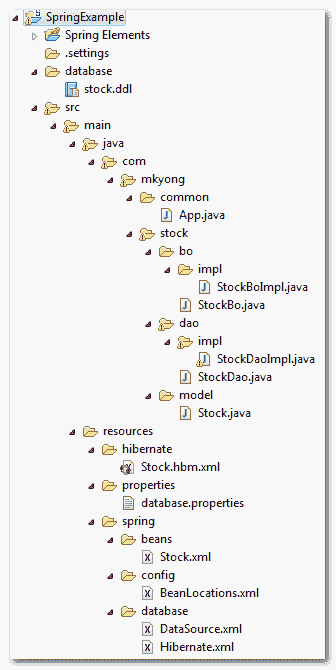

# Maven + Spring + Hibernate + MySql 示例

> 原文：<http://web.archive.org/web/20230101150211/http://www.mkyong.com/spring/maven-spring-hibernate-mysql-example/>

本例将使用 Maven 创建一个简单的 Java 项目结构，并演示如何在 Spring framework 中使用 Hibernate 对 MySQL 数据库进行数据操作(插入、选择、更新和删除)。

## 最终项目结构

您的最终项目文件结构应该看起来完全像下面这样，如果您在创建文件夹结构时迷失了方向，请在这里查看这个文件夹结构。



## 1.表格创建

在 MySQL 数据库中创建一个“股票”表。SQL 语句如下:

```java
 CREATE TABLE  `mkyong`.`stock` (
  `STOCK_ID` int(10) unsigned NOT NULL AUTO_INCREMENT,
  `STOCK_CODE` varchar(10) NOT NULL,
  `STOCK_NAME` varchar(20) NOT NULL,
  PRIMARY KEY (`STOCK_ID`) USING BTREE,
  UNIQUE KEY `UNI_STOCK_NAME` (`STOCK_NAME`),
  UNIQUE KEY `UNI_STOCK_ID` (`STOCK_CODE`) USING BTREE
) ENGINE=InnoDB AUTO_INCREMENT=11 DEFAULT CHARSET=utf8; 
```

## 2.项目文件结构

用 Maven 命令' **mvn 原型创建一个快速的项目文件结构:生成**'，[参见这里的例子](http://web.archive.org/web/20220709100523/http://www.mkyong.com/maven/how-to-create-a-project-with-maven-template/)。将其转换为 Eclipse 项目( **mvn eclipse:eclipse** )并导入 Eclipse IDE。

```java
 E:\workspace>mvn archetype:generate
[INFO] Scanning for projects...
...
Choose a number:  
(1/2/3....) 15: : 15
...
Define value for groupId: : com.mkyong.common
Define value for artifactId: : HibernateExample
Define value for version:  1.0-SNAPSHOT: :
Define value for package:  com.mkyong.common: : com.mkyong.common
[INFO] OldArchetype created in dir: E:\workspace\HibernateExample
[INFO] ------------------------------------------------------------------------
[INFO] BUILD SUCCESSFUL
[INFO] ------------------------------------------------------------------------ 
```

## 3.Pom.xml 文件配置

在 Maven 的 pom.xml 文件中添加 Spring、Hibernate、MySQL 及其依赖项。

```java
 <project  
  xmlns:xsi="http://www.w3.org/2001/XMLSchema-instance"
  xsi:schemaLocation="http://maven.apache.org/POM/4.0.0 
  http://maven.apache.org/maven-v4_0_0.xsd">
  <modelVersion>4.0.0</modelVersion>
  <groupId>com.mkyong.common</groupId>
  <artifactId>SpringExample</artifactId>
  <packaging>jar</packaging>
  <version>1.0-SNAPSHOT</version>
  <name>SpringExample</name>
  <url>http://maven.apache.org</url>

  <dependencies>

        <!-- JUnit testing framework -->
        <dependency>
                <groupId>junit</groupId>
                <artifactId>junit</artifactId>
                <version>3.8.1</version>
                <scope>test</scope>
        </dependency>

        <!-- Spring framework -->
        <dependency>
	        <groupId>org.springframework</groupId>
	        <artifactId>spring</artifactId>
	        <version>2.5.6</version>
        </dependency>

        <!-- Spring AOP dependency -->
        <dependency>
    	        <groupId>cglib</groupId>
		<artifactId>cglib</artifactId>
		<version>2.2</version>
	</dependency>

        <!-- MySQL database driver -->
	<dependency>
		<groupId>mysql</groupId>
		<artifactId>mysql-connector-java</artifactId>
		<version>5.1.9</version>
	</dependency>

	<!-- Hibernate framework -->
	<dependency>
		<groupId>hibernate</groupId>
		<artifactId>hibernate3</artifactId>
		<version>3.2.3.GA</version>
	</dependency>

	<!-- Hibernate library dependecy start -->
	<dependency>
		<groupId>dom4j</groupId>
		<artifactId>dom4j</artifactId>
		<version>1.6.1</version>
	</dependency>

	<dependency>
		<groupId>commons-logging</groupId>
		<artifactId>commons-logging</artifactId>
		<version>1.1.1</version>
	</dependency>

	<dependency>
		<groupId>commons-collections</groupId>
		<artifactId>commons-collections</artifactId>
		<version>3.2.1</version>
	</dependency>

	<dependency>
		<groupId>antlr</groupId>
		<artifactId>antlr</artifactId>
		<version>2.7.7</version>
	</dependency>
	<!-- Hibernate library dependecy end -->

  </dependencies>
</project> 
```

## 4.模型&博&道

**模型**、**业务对象** (BO)和**数据访问对象** (DAO)模式有助于清楚地识别层，避免弄乱项目结构。

##### 股票模型

稍后存储股票数据的股票模型类。

```java
 package com.mkyong.stock.model;

import java.io.Serializable;

public class Stock implements Serializable {

	private static final long serialVersionUID = 1L;

	private Long stockId;
	private String stockCode;
	private String stockName;

	//getter and setter methods...
} 
```

##### 库存业务对象(BO))

股票业务对象(BO)接口和实现，它用来存储项目的业务功能，真正的数据库操作(CRUD)工作不应该涉及这个类，相反它有一个 DAO (StockDao)类来做。

```java
 package com.mkyong.stock.bo;

import com.mkyong.stock.model.Stock;

public interface StockBo {

	void save(Stock stock);
	void update(Stock stock);
	void delete(Stock stock);
	Stock findByStockCode(String stockCode);
} 
```

```java
 package com.mkyong.stock.bo.impl;

import com.mkyong.stock.bo.StockBo;
import com.mkyong.stock.dao.StockDao;
import com.mkyong.stock.model.Stock;

public class StockBoImpl implements StockBo{

	StockDao stockDao;

	public void setStockDao(StockDao stockDao) {
		this.stockDao = stockDao;
	}

	public void save(Stock stock){
		stockDao.save(stock);
	}

	public void update(Stock stock){
		stockDao.update(stock);
	}

	public void delete(Stock stock){
		stockDao.delete(stock);
	}

	public Stock findByStockCode(String stockCode){
		return stockDao.findByStockCode(stockCode);
	}
} 
```

##### 股票数据访问对象

一个库存的 dao 接口和实现，DAO 实现类扩展了 Spring 的“ **HibernateDaoSupport** ”，使 Hibernate 支持 Spring 框架。现在，您可以通过 **getHibernateTemplate()** 来执行休眠功能。

```java
 package com.mkyong.stock.dao;

import com.mkyong.stock.model.Stock;

public interface StockDao {

	void save(Stock stock);
	void update(Stock stock);
	void delete(Stock stock);
	Stock findByStockCode(String stockCode);

} 
```

```java
 package com.mkyong.stock.dao.impl;

import java.util.List;

import org.springframework.orm.hibernate3.support.HibernateDaoSupport;

import com.mkyong.stock.dao.StockDao;
import com.mkyong.stock.model.Stock;

public class StockDaoImpl extends HibernateDaoSupport implements StockDao{

	public void save(Stock stock){
		getHibernateTemplate().save(stock);
	}

	public void update(Stock stock){
		getHibernateTemplate().update(stock);
	}

	public void delete(Stock stock){
		getHibernateTemplate().delete(stock);
	}

	public Stock findByStockCode(String stockCode){
		List list = getHibernateTemplate().find(
                      "from Stock where stockCode=?",stockCode
                );
		return (Stock)list.get(0);
	}

} 
```

## 5.资源配置

在**‘project _ name/main/Java/**’下创建一个“ **resources** ”文件夹，Maven 会将该文件夹下的所有文件视为资源文件。它将用于存储 Spring、Hibernate 和其他配置文件。

##### 休眠配置

为股票表创建一个 Hibernate 映射文件( **Stock.hbm.xml** )，放在“ **resources/hibernate/** 文件夹下。

```java
 <?xml version="1.0"?>
<!DOCTYPE hibernate-mapping PUBLIC "-//Hibernate/Hibernate Mapping DTD 3.0//EN"
"http://hibernate.sourceforge.net/hibernate-mapping-3.0.dtd">

<hibernate-mapping>
    <class name="com.mkyong.stock.model.Stock" table="stock" catalog="mkyong">
        <id name="stockId" type="java.lang.Long">
            <column name="STOCK_ID" />
            <generator class="identity" />
        </id>
        <property name="stockCode" type="string">
            <column name="STOCK_CODE" length="10" not-null="true" unique="true" />
        </property>
        <property name="stockName" type="string">
            <column name="STOCK_NAME" length="20" not-null="true" unique="true" />
        </property>
    </class>
</hibernate-mapping> 
```

##### 弹簧配置

数据库相关…

为数据库细节创建一个属性文件 **(database.properties** )，放入“**资源/属性**文件夹。将数据库细节和 Spring bean 配置分散到不同的文件中是一种很好的做法。

**数据库.属性**

```java
 jdbc.driverClassName=com.mysql.jdbc.Driver
jdbc.url=jdbc:mysql://localhost:3306/mkyong
jdbc.username=root
jdbc.password=password 
```

为您的数据库创建一个“data source”bean 配置文件( **DataSource.xml** )，从 database.properties 导入属性，放入**的“资源/数据库**文件夹中。

**DataSource.xml**

```java
 <beans 
xmlns:xsi="http://www.w3.org/2001/XMLSchema-instance"
xsi:schemaLocation="http://www.springframework.org/schema/beans
http://www.springframework.org/schema/beans/spring-beans-2.5.xsd">

<bean 
class="org.springframework.beans.factory.config.PropertyPlaceholderConfigurer">
	<property name="location">
		<value>properties/database.properties</value>
	</property>
</bean>

<bean id="dataSource" 
         class="org.springframework.jdbc.datasource.DriverManagerDataSource">
	<property name="driverClassName" value="${jdbc.driverClassName}" />
	<property name="url" value="${jdbc.url}" />
	<property name="username" value="${jdbc.username}" />
	<property name="password" value="${jdbc.password}" />
</bean>

</beans> 
```

冬眠相关的…

创建一个会话工厂 bean 配置文件 **(Hibernate.xml** ，放入**“资源/数据库**文件夹。这个 **LocalSessionFactoryBean** 类将在 Spring 应用程序上下文中设置一个共享的 Hibernate SessionFactory。

**Hibernate.xml**

```java
 <?xml version="1.0" encoding="UTF-8"?>
<beans 
xmlns:xsi="http://www.w3.org/2001/XMLSchema-instance"
xsi:schemaLocation="http://www.springframework.org/schema/beans
http://www.springframework.org/schema/beans/spring-beans-2.5.xsd">

<!-- Hibernate session factory -->
<bean id="sessionFactory" 
     class="org.springframework.orm.hibernate3.LocalSessionFactoryBean">

    <property name="dataSource">
      <ref bean="dataSource"/>
    </property>

    <property name="hibernateProperties">
       <props>
         <prop key="hibernate.dialect">org.hibernate.dialect.MySQLDialect</prop>
         <prop key="hibernate.show_sql">true</prop>
       </props>
     </property>

     <property name="mappingResources">
	<list>
           <value>/hibernate/Stock.hbm.xml</value>
	</list>
      </property>	

    </bean>
</beans> 
```

*春豆相关…*

为 BO 和 DAO 类创建一个 bean 配置文件( **Stock.xml** ，放入“ **resources/spring** 文件夹。依赖将 dao (stockDao) bean 注入到 bo (stockBo) bean 中；会话工厂豆到 stockDao。

**Stock.xml**

```java
 <beans 
xmlns:xsi="http://www.w3.org/2001/XMLSchema-instance"
xsi:schemaLocation="http://www.springframework.org/schema/beans
http://www.springframework.org/schema/beans/spring-beans-2.5.xsd">

    <!-- Stock business object -->
   <bean id="stockBo" class="com.mkyong.stock.bo.impl.StockBoImpl" >
   		<property name="stockDao" ref="stockDao" />
   </bean>

   <!-- Stock Data Access Object -->
   <bean id="stockDao" class="com.mkyong.stock.dao.impl.StockDaoImpl" >
   		<property name="sessionFactory" ref="sessionFactory"></property>
   </bean>

</beans> 
```

将所有 Spring 的 beans 配置文件导入到一个文件(BeanLocations.xml)中，将其放入“ **resources/config** 文件夹中。

**BeanLocations.xml**

```java
 <beans 
xmlns:xsi="http://www.w3.org/2001/XMLSchema-instance"
xsi:schemaLocation="http://www.springframework.org/schema/beans
http://www.springframework.org/schema/beans/spring-beans-2.5.xsd">

	<!-- Database Configuration -->
	<import resource="../database/DataSource.xml"/>
	<import resource="../database/Hibernate.xml"/>

	<!-- Beans Declaration -->
	<import resource="../beans/Stock.xml"/>

</beans> 
```

## 6.运行它

你有所有的文件和配置，运行它。

```java
 package com.mkyong.common;

import org.springframework.context.ApplicationContext;
import org.springframework.context.support.ClassPathXmlApplicationContext;

import com.mkyong.stock.bo.StockBo;
import com.mkyong.stock.model.Stock;

public class App 
{
    public static void main( String[] args )
    {
    	ApplicationContext appContext = 
    	  new ClassPathXmlApplicationContext("spring/config/BeanLocations.xml");

    	StockBo stockBo = (StockBo)appContext.getBean("stockBo");

    	/** insert **/
    	Stock stock = new Stock();
    	stock.setStockCode("7668");
    	stock.setStockName("HAIO");
    	stockBo.save(stock);

    	/** select **/
    	Stock stock2 = stockBo.findByStockCode("7668");
    	System.out.println(stock2);

    	/** update **/
    	stock2.setStockName("HAIO-1");
    	stockBo.update(stock2);

    	/** delete **/
    	stockBo.delete(stock2);

    	System.out.println("Done");
    }
} 
```

输出

```java
 Hibernate: insert into mkyong.stock (STOCK_CODE, STOCK_NAME) values (?, ?)
Hibernate: select stock0_.STOCK_ID as STOCK1_0_, 
stock0_.STOCK_CODE as STOCK2_0_, stock0_.STOCK_NAME as STOCK3_0_ 
from mkyong.stock stock0_ where stock0_.STOCK_CODE=?
Stock [stockCode=7668, stockId=11, stockName=HAIO]
Hibernate: update mkyong.stock set STOCK_CODE=?, STOCK_NAME=? where STOCK_ID=?
Hibernate: delete from mkyong.stock where STOCK_ID=?
Done 
```

Download it – [Spring-Hibernate-Example.zip](http://web.archive.org/web/20220709100523/http://www.mkyong.com/wp-content/uploads/2010/03/Spring-Hibernate-Example.zip)<input type="hidden" id="mkyong-current-postId" value="4033">