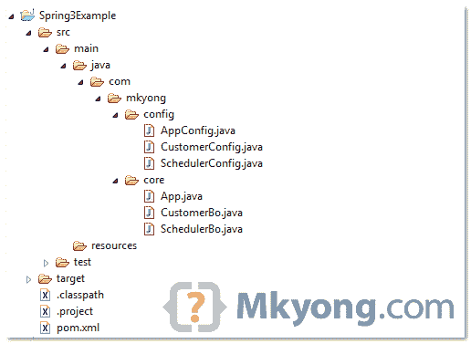

# Spring 3 JavaConfig @Import 示例

> 原文：<http://web.archive.org/web/20230101150211/http://www.mkyong.com/spring3/spring-3-javaconfig-import-example/>

通常，您会将一个大的 Spring XML bean 文件分割成多个小文件，按模块或类别分组，以使事情更易于维护和模块化。举个例子，

```java
 <beans 
	xmlns:xsi="http://www.w3.org/2001/XMLSchema-instance"
	xsi:schemaLocation="http://www.springframework.org/schema/beans
	http://www.springframework.org/schema/beans/spring-beans-2.5.xsd">

	<import resource="config/customer.xml"/>
        <import resource="config/scheduler.xml"/>

</beans> 
```

在 Spring3 JavaConfig 中，等效的功能是 **@Import** 。

```java
 package com.mkyong.config;

import org.springframework.context.annotation.Configuration;
import org.springframework.context.annotation.Import;

@Configuration
@Import({ CustomerConfig.class, SchedulerConfig.class })
public class AppConfig {

} 
```

## @导入示例

查看使用 JavaConfig **@Import** 的完整示例。

 ## 1.目录结构

这个例子的目录结构。

 ## 2.春豆

两个简单的春豆。

*文件:CustomerBo.java*

```java
 package com.mkyong.core;

public class CustomerBo {

	public void printMsg(String msg) {

		System.out.println("CustomerBo : " + msg);
	}

} 
```

*文件:SchedulerBo.java*

```java
 package com.mkyong.core;

public class SchedulerBo {

	public void printMsg(String msg) {

		System.out.println("SchedulerBo : " + msg);
	}

} 
```

## 3.@配置示例

现在，使用 JavaConfig**@ Configuration**来声明上面的 beans。

*文件:CustomerConfig.java*

```java
 package com.mkyong.config;

import org.springframework.context.annotation.Bean;
import org.springframework.context.annotation.Configuration;

import com.mkyong.core.CustomerBo;

@Configuration
public class CustomerConfig {

	@Bean(name="customer")
	public CustomerBo customerBo(){

		return new CustomerBo();

	}
} 
```

*文件:SchedulerConfig.java*

```java
 package com.mkyong.config;

import org.springframework.context.annotation.Bean;
import org.springframework.context.annotation.Configuration;
import com.mkyong.core.SchedulerBo;

@Configuration
public class SchedulerConfig {

	@Bean(name="scheduler")
	public SchedulerBo suchedulerBo(){

		return new SchedulerBo();

	}

} 
```

## 4.@导入示例

使用 **@Import** 加载多个配置文件。

*文件:AppConfig.java*

```java
 package com.mkyong.config;

import org.springframework.context.annotation.Configuration;
import org.springframework.context.annotation.Import;

@Configuration
@Import({ CustomerConfig.class, SchedulerConfig.class })
public class AppConfig {

} 
```

## 5.运行它

加载主配置文件，并测试它。

```java
 package com.mkyong.core;

import org.springframework.context.ApplicationContext;
import org.springframework.context.annotation.AnnotationConfigApplicationContext;
import com.mkyong.config.AppConfig;

public class App {
	public static void main(String[] args) {

		ApplicationContext context = new AnnotationConfigApplicationContext(
				AppConfig.class);

		CustomerBo customer = (CustomerBo) context.getBean("customer");
		customer.printMsg("Hello 1");

		SchedulerBo scheduler = (SchedulerBo) context.getBean("scheduler");
		scheduler.printMsg("Hello 2");

	}
} 
```

输出

```java
 CustomerBo : Hello 1
SchedulerBo : Hello 2 
```

## 下载源代码

Download It – [Spring3-JavaConfig-Import-Example.zip](http://web.archive.org/web/20190224163317/http://www.mkyong.com/wp-content/uploads/2011/06/Spring3-JavaConfig-Import-Example.zip) (7 KB)

## 参考

1.  [spring 3 @配置示例](http://web.archive.org/web/20190224163317/http://www.mkyong.com/spring3/spring-3-javaconfig-example/)
2.  [Spring XML 导入示例](http://web.archive.org/web/20190224163317/http://www.mkyong.com/spring/load-multiple-spring-bean-configuration-file/)

[javaconfig](http://web.archive.org/web/20190224163317/http://www.mkyong.com/tag/javaconfig/) [spring3](http://web.archive.org/web/20190224163317/http://www.mkyong.com/tag/spring3/)


