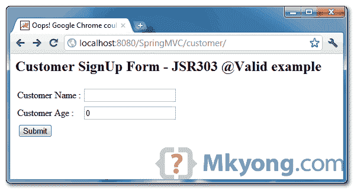
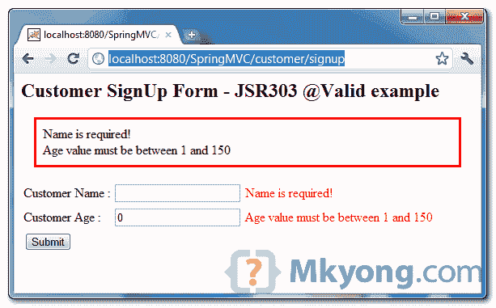

# Spring 3 MVC 和 JSR303 @Valid 示例

> 原文：<http://web.archive.org/web/20230101150211/http://www.mkyong.com/spring-mvc/spring-3-mvc-and-jsr303-valid-example/>

在 Spring 3 中，你可以启用“ [mvc:注释驱动的](http://web.archive.org/web/20210829083200/http://static.springsource.org/spring/docs/3.0.x/spring-framework-reference/html/mvc.html#mvc-annotation-driven)”来支持 [JSR303 bean 验证](http://web.archive.org/web/20210829083200/https://jcp.org/en/jsr/detail?id=303)通过`@Valid`注释，如果类路径上有任何 JSR303 验证器框架的话。

**Note**
Hibernate Validator is the reference implementation for JSR 303

在本教程中，我们将向您展示如何通过`@Valid`注释将 Hibernate validator 与 Spring MVC 集成在一起，以在 HTML 表单中执行 bean 验证。

使用的技术:

1.  弹簧 3.0.5 释放
2.  Hibernate 验证程序 4.2.0 .最终版
3.  JDK 1.6
4.  Eclipse 3.6
5.  maven3

## 1.项目相关性

Hibernate 验证器可以在 JBoss 公共存储库中获得。

```java
 <repositories>
		<repository>
			<id>JBoss repository</id>
			<url>http://repository.jboss.org/nexus/content/groups/public/</url>
		</repository>
	</repositories>

	<properties>
		<spring.version>3.0.5.RELEASE</spring.version>
	</properties>

	<dependencies>

		<!-- Spring 3 dependencies -->
		<dependency>
			<groupId>org.springframework</groupId>
			<artifactId>spring-core</artifactId>
			<version>${spring.version}</version>
		</dependency>

		<dependency>
			<groupId>org.springframework</groupId>
			<artifactId>spring-web</artifactId>
			<version>${spring.version}</version>
		</dependency>

		<dependency>
			<groupId>org.springframework</groupId>
			<artifactId>spring-webmvc</artifactId>
			<version>${spring.version}</version>
		</dependency>

		<!-- Hibernate Validator -->
		<dependency>
			<groupId>org.hibernate</groupId>
			<artifactId>hibernate-validator</artifactId>
			<version>4.2.0.Final</version>
		</dependency>

	</dependencies> 
```

## 2.JSR303 Bean 验证

一个简单的 POJO，用 Hibernate validator 注释进行了注释。

**Note**
Refer to this [Hibernate validator documentation](http://web.archive.org/web/20210829083200/http://docs.jboss.org/hibernate/validator/4.2/reference/en-US/html/) for detail explanation

```java
 package com.mkyong.common.model;

import org.hibernate.validator.constraints.NotEmpty;
import org.hibernate.validator.constraints.Range;

public class Customer {

	@NotEmpty //make sure name is not empty
	String name;

	@Range(min = 1, max = 150) //age need between 1 and 150
	int age;

	//getter and setter methods

} 
```

## 3.控制器+@有效

为了验证工作，只需通过`@Valid`对“JSR 注释模型对象”进行注释。仅此而已，其他东西只是普通的 Spring MVC 表单处理。

```java
 package com.mkyong.common.controller;

import javax.validation.Valid;
import org.springframework.stereotype.Controller;
import org.springframework.ui.ModelMap;
import org.springframework.validation.BindingResult;
import org.springframework.web.bind.annotation.RequestMapping;
import org.springframework.web.bind.annotation.RequestMethod;
import com.mkyong.common.model.Customer;

@Controller
@RequestMapping("/customer")
public class SignUpController {

	@RequestMapping(value = "/signup", method = RequestMethod.POST)
	public String addCustomer(@Valid Customer customer, BindingResult result) {

		if (result.hasErrors()) {
			return "SignUpForm";
		} else {
			return "Done";
		}

	}

	@RequestMapping(method = RequestMethod.GET)
	public String displayCustomerForm(ModelMap model) {

		model.addAttribute("customer", new Customer());
		return "SignUpForm";

	}

} 
```

## 4.出错信息

默认情况下，如果验证失败。

1.  `@NotEmpty`将显示"不得为空"
2.  `@Range`将显示“必须在 1 和 150 之间”

您可以很容易地覆盖它，用“key”和 message 创建一个属性。要知道哪个@注释绑定到哪个键，只需调试它并查看“`BindingResult result`”中值。正常情况下，key 为“**@ Annotation name . object . field name**”。

*文件:messages.properties*

```java
 NotEmpty.customer.name = Name is required!
Range.customer.age = Age value must be between 1 and 150 
```

## 5.mvc:注释驱动

启用“`mvc:annotation-driven`”使 Spring MVC 通过`@Valid`支持 JSR303 验证器，同时绑定你的属性文件。

```java
 <beans 
	xmlns:context="http://www.springframework.org/schema/context"
	xmlns:mvc="http://www.springframework.org/schema/mvc" 
        xmlns:xsi="http://www.w3.org/2001/XMLSchema-instance"
	xsi:schemaLocation="
        http://www.springframework.org/schema/beans     
        http://www.springframework.org/schema/beans/spring-beans-3.0.xsd
        http://www.springframework.org/schema/context 
        http://www.springframework.org/schema/context/spring-context-3.0.xsd
        http://www.springframework.org/schema/mvc
        http://www.springframework.org/schema/mvc/spring-mvc-3.0.xsd">

	<context:component-scan base-package="com.mkyong.common.controller" />

         <!-- support JSR303 annotation if JSR 303 validation present on classpath -->
	<mvc:annotation-driven />

	<bean id="viewResolver"
		class="org.springframework.web.servlet.view.InternalResourceViewResolver">
		<property name="prefix">
			<value>/WEB-INF/pages/</value>
		</property>
		<property name="suffix">
			<value>.jsp</value>
		</property>
	</bean>

        <!-- bind your messages.properties -->
	<bean class="org.springframework.context.support.ResourceBundleMessageSource"
		id="messageSource">
		<property name="basename" value="messages" />
	</bean>

</beans> 
```

## 6.JSP 页面

最后一个，带 Spring 表单标签库的普通 JSP 页面。

*文件:sign form . JSP*

```java
 <%@ taglib prefix="form" uri="http://www.springframework.org/tags/form"%>
<html>
<head>
<style>
.error {
	color: #ff0000;
}

.errorblock {
	color: #000;
	background-color: #ffEEEE;
	border: 3px solid #ff0000;
	padding: 8px;
	margin: 16px;
}
</style>
</head>

<body>
	<h2>Customer SignUp Form - JSR303 @Valid example</h2>

	<form:form method="POST" commandName="customer" action="customer/signup">
		<form:errors path="*" cssClass="errorblock" element="div" />
		<table>
			<tr>
				<td>Customer Name :</td>
				<td><form:input path="name" /></td>
				<td><form:errors path="name" cssClass="error" /></td>
			</tr>
			<tr>
				<td>Customer Age :</td>
				<td><form:input path="age" /></td>
				<td><form:errors path="age" cssClass="error" /></td>
			</tr>
			<tr>
				<td colspan="3"><input type="submit" /></td>
			</tr>
		</table>
	</form:form>

</body>
</html> 
```

*文件:Done.jsp*

```java
 <html>
<body>
	<h2>Done</h2>
</body>
</html> 
```

## 6.演示

*URL:http://localhost:8080/spring MVC/Customer*–客户表单页面，有 2 个文本框用于输入姓名和年龄。



*URL:http://localhost:8080/spring MVC/customer/sign up*–如果您没有填写表单并单击“提交”按钮，将显示您定制的验证错误消息。



## 下载源代码

Download it – [SpringMVC-Bean-Validation-JSR303-Example-2.zip](http://web.archive.org/web/20210829083200/http://www.mkyong.com/wp-content/uploads/2011/07/SpringMVC-Bean-Validation-JSR303-Example-2.zip) (9 KB)

## 参考

1.  [Spring JSR303 验证文档](http://web.archive.org/web/20210829083200/http://static.springsource.org/spring/docs/3.0.x/spring-framework-reference/html/validation.html#validation-mvc-jsr303)
2.  [JSR303 bean 验证](http://web.archive.org/web/20210829083200/https://jcp.org/en/jsr/detail?id=303)
3.  [休眠验证器](http://web.archive.org/web/20210829083200/http://www.hibernate.org/subprojects/validator.html)

Tags : [spring mvc](http://web.archive.org/web/20210829083200/https://mkyong.com/tag/spring-mvc/) [spring3](http://web.archive.org/web/20210829083200/https://mkyong.com/tag/spring3/) [validation](http://web.archive.org/web/20210829083200/https://mkyong.com/tag/validation/)<input type="hidden" id="mkyong-current-postId" value="9817">