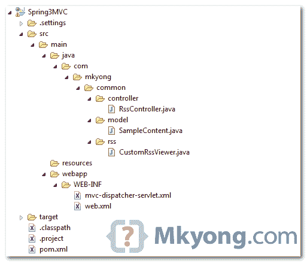

# Spring 3 MVC 和 RSS 提要示例

> 原文：<http://web.archive.org/web/20230101150211/http://www.mkyong.com/spring-mvc/spring-3-mvc-and-rss-feed-example/>

在 Spring 3 中，附带了一个抽象类" **AbstractRssFeedView** "来生成 RSS 提要视图，使用 java.net 的 ROME 包。在本教程中，我们将向您展示如何从 Spring MVC 框架中生成 RSS 提要视图。

使用的技术:

1.  弹簧 3.0.5 释放
2.  罗马 1.0.0
3.  JDK 1.6
4.  Eclipse 3.6
5.  maven3

在本教程的最后，当你访问这个 URL-*http://localhost:8080/spring MVC/rest/rssfeed*时，浏览器将返回以下 RSS feed 内容:

```java
 <?xml version="1.0" encoding="UTF-8"?>
<rss xmlns:content="http://purl.org/rss/1.0/modules/content/" version="2.0">
  <channel>
    <title>Mkyong Dot Com</title>
    <link>http://www.mkyong.com</link>
    <description>Java Tutorials and Examples</description>
    <item>
      <title>Spring MVC Tutorial 1</title>
      <link>http://www.mkyong.com/spring-mvc/tutorial-1</link>
      <content:encoded>Tutorial 1 summary ...</content:encoded>
      <pubDate>Tue, 26 Jul 2011 02:26:08 GMT</pubDate>
    </item>
    <item>
      <title>Spring MVC Tutorial 2</title>
      <link>http://www.mkyong.com/spring-mvc/tutorial-2</link>
      <content:encoded>Tutorial 2 summary ...</content:encoded>
      <pubDate>Tue, 26 Jul 2011 02:26:08 GMT</pubDate>
    </item>
  </channel>
</rss> 
```

## 1.目录结构

审查最终的项目结构。

 ## 2.项目相关性

对于 Maven，在您的`pom.xml`中声明以下依赖项。

```java
 <properties>
		<spring.version>3.0.5.RELEASE</spring.version>
	</properties>

	<dependencies>

		<!-- Spring 3 dependencies -->
		<dependency>
			<groupId>org.springframework</groupId>
			<artifactId>spring-core</artifactId>
			<version>${spring.version}</version>
		</dependency>

		<dependency>
			<groupId>org.springframework</groupId>
			<artifactId>spring-web</artifactId>
			<version>${spring.version}</version>
		</dependency>

		<dependency>
			<groupId>org.springframework</groupId>
			<artifactId>spring-webmvc</artifactId>
			<version>${spring.version}</version>
		</dependency>

		<!-- RSS -->
		<dependency>
			<groupId>net.java.dev.rome</groupId>
			<artifactId>rome</artifactId>
			<version>1.0.0</version>
		</dependency>

		<!-- for compile only, your container should have this -->
		<dependency>
			<groupId>javax.servlet</groupId>
			<artifactId>servlet-api</artifactId>
			<version>2.5</version>
			<scope>provided</scope>
		</dependency>

	</dependencies> 
```

 ## 3.模型

一个简单的 POJO，稍后使用这个对象来生成 RSS 提要内容。

```java
 package com.mkyong.common.model;

import java.util.Date;

public class SampleContent {

	String title;
	String url;
	String summary;
	Date createdDate;

	//getter and seeter methods
} 
```

## 4.摘要提要视图

创建一个类扩展 **AbstractRssFeedView** ，并覆盖`buildFeedMetadata`和`buildFeedItems`方法，下面的代码应该是不言自明的。

```java
 package com.mkyong.common.rss;

import java.util.ArrayList;
import java.util.List;
import java.util.Map;
import javax.servlet.http.HttpServletRequest;
import javax.servlet.http.HttpServletResponse;
import org.springframework.web.servlet.view.feed.AbstractRssFeedView;
import com.mkyong.common.model.SampleContent;
import com.sun.syndication.feed.rss.Channel;
import com.sun.syndication.feed.rss.Content;
import com.sun.syndication.feed.rss.Item;

public class CustomRssViewer extends AbstractRssFeedView {

	@Override
	protected void buildFeedMetadata(Map<String, Object> model, Channel feed,
		HttpServletRequest request) {

		feed.setTitle("Mkyong Dot Com");
		feed.setDescription("Java Tutorials and Examples");
		feed.setLink("http://www.mkyong.com");

		super.buildFeedMetadata(model, feed, request);
	}

	@Override
	protected List<Item> buildFeedItems(Map<String, Object> model,
		HttpServletRequest request, HttpServletResponse response)
		throws Exception {

		@SuppressWarnings("unchecked")
		List<SampleContent> listContent = (List<SampleContent>) model.get("feedContent");
		List<Item> items = new ArrayList<Item>(listContent.size());

		for(SampleContent tempContent : listContent ){

			Item item = new Item();

			Content content = new Content();
			content.setValue(tempContent.getSummary());
			item.setContent(content);

			item.setTitle(tempContent.getTitle());
			item.setLink(tempContent.getUrl());
			item.setPubDate(tempContent.getCreatedDate());

			items.add(item);
		}

		return items;
	}

} 
```

## 5.控制器

Spring MVC 控制器类，生成 rss feed 内容，并返回一个视图名" **rssViewer** "(这个视图名是属于上面的" **CustomRssViewer** "，将在后面的步骤 6 中注册)。

```java
 package com.mkyong.common.controller;

import java.util.ArrayList;
import java.util.Date;
import java.util.List;
import org.springframework.stereotype.Controller;
import org.springframework.web.bind.annotation.RequestMapping;
import org.springframework.web.bind.annotation.RequestMethod;
import org.springframework.web.servlet.ModelAndView;
import com.mkyong.common.model.SampleContent;

@Controller
public class RssController {

	@RequestMapping(value="/rssfeed", method = RequestMethod.GET)
	public ModelAndView getFeedInRss() {

		List<SampleContent> items = new ArrayList<SampleContent>();

		SampleContent content  = new SampleContent();
		content.setTitle("Spring MVC Tutorial 1");
		content.setUrl("http://www.mkyong.com/spring-mvc/tutorial-1");
		content.setSummary("Tutorial 1 summary ...");
		content.setCreatedDate(new Date());
		items.add(content);

		SampleContent content2  = new SampleContent();
		content2.setTitle("Spring MVC Tutorial 2");
		content2.setUrl("http://www.mkyong.com/spring-mvc/tutorial-2");
		content2.setSummary("Tutorial 2 summary ...");
		content2.setCreatedDate(new Date());
		items.add(content2);

		ModelAndView mav = new ModelAndView();
		mav.setViewName("rssViewer");
		mav.addObject("feedContent", items);

		return mav;

	}

} 
```

## 6.春豆注册

在一个 Spring bean 定义文件中，启用自动组件扫描，并注册您的“`CustomRssViewer`”类和“`BeanNameViewResolver`”视图解析器，这样当视图名“ **rssViewer** ”返回时，Spring 知道它应该映射到 bean id“**RSS viewer**”。

*文件:mvc-dispatcher-servlet.xml*

```java
 <beans 
	xmlns:context="http://www.springframework.org/schema/context"
	xmlns:xsi="http://www.w3.org/2001/XMLSchema-instance"
	xsi:schemaLocation="
        http://www.springframework.org/schema/beans     
        http://www.springframework.org/schema/beans/spring-beans-3.0.xsd
        http://www.springframework.org/schema/context 
        http://www.springframework.org/schema/context/spring-context-3.0.xsd">

	<context:component-scan base-package="com.mkyong.common.controller" />

	<!-- Map returned view name "rssViewer" to bean id "rssViewer" -->
	<bean class="org.springframework.web.servlet.view.BeanNameViewResolver" />

	<bean id="rssViewer" class="com.mkyong.common.rss.CustomRssViewer" />

</beans> 
```

**Note**
File content of `web.xml` is omitted, just a standard configuration, if you are interest, download this whole project at the end of the article.

## 7.演示

网址:*http://localhost:8080/spring MVC/rest/RSS feed*

**How about Atom?**
For Atom, you just need to extends `AbstractAtomFeedView`, instead of `AbstractRssFeedView`.

## 下载源代码

Download it – [SpringMVC-RSS-Feed-Example.zip](http://web.archive.org/web/20190216044019/http://www.mkyong.com/wp-content/uploads/2011/07/SpringMVC-RSS-Feed-Example.zip) (9 KB)

## 参考

1.  [罗马–RSS 提要的 Java 库](http://web.archive.org/web/20190216044019/http://java.net/projects/rome/)
2.  【javadoc 摘要种子
3.  [用 Java 创建 RSS 提要的例子](http://web.archive.org/web/20190216044019/http://codeidol.com/java/java-xml/Content-Syndication-with-RSS/Creating-an-RSS-Feed/target=)

[rss](http://web.archive.org/web/20190216044019/http://www.mkyong.com/tag/rss/) [spring mvc](http://web.archive.org/web/20190216044019/http://www.mkyong.com/tag/spring-mvc/) [spring3](http://web.archive.org/web/20190216044019/http://www.mkyong.com/tag/spring3/)


