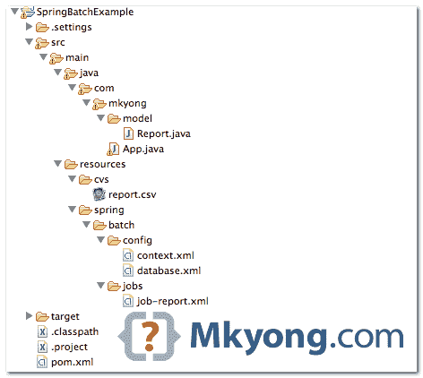
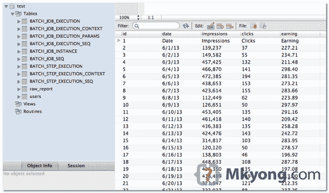

# Spring 批处理示例–CSV 文件到 MySQL 数据库

> 原文：<http://web.archive.org/web/20230101150211/http://www.mkyong.com/spring-batch/spring-batch-example-csv-file-to-database/>

在本教程中，我们将向您展示如何配置 Spring 批处理作业将数据从 CSV 文件读入数据库。

使用的工具和库:

1.  maven3
2.  Eclipse 4.2
3.  JDK 1.6
4.  弹簧芯 3.2.2 .释放
5.  春季批次 2.2.0 .发布
6.  MySQL Java 驱动程序 5.1.25

## 1.Java 项目

用 Maven 创建一个 Java 项目

```java
 $ mvn archetype:generate -DgroupId=com.mkyong -DartifactId=SpringBatchExample 
  -DarchetypeArtifactId=maven-archetype-quickstart -DinteractiveMode=false 
```

转换成 Eclipse 项目，并将其导入 Eclipse IDE。

```java
 $ cd SpringBatchExample/
$ mvn eclipse:eclipse 
```

 ## 2.项目相关性

在 *pom.xml* 中声明所有项目依赖关系。

pom.xml

```java
 <project  
	xmlns:xsi="http://www.w3.org/2001/XMLSchema-instance"
	xsi:schemaLocation="http://maven.apache.org/POM/4.0.0 
	http://maven.apache.org/maven-v4_0_0.xsd">
	<modelVersion>4.0.0</modelVersion>
	<groupId>com.mkyong</groupId>
	<artifactId>SpringBatchExample</artifactId>
	<packaging>jar</packaging>
	<version>1.0-SNAPSHOT</version>
	<name>SpringBatchExample</name>
	<url>http://maven.apache.org</url>

	<properties>
		<jdk.version>1.6</jdk.version>
		<spring.version>3.2.2.RELEASE</spring.version>
		<spring.batch.version>2.2.0.RELEASE</spring.batch.version>
		<mysql.driver.version>5.1.25</mysql.driver.version>
	</properties>

	<dependencies>

		<!-- Spring Core -->
		<dependency>
			<groupId>org.springframework</groupId>
			<artifactId>spring-core</artifactId>
			<version>${spring.version}</version>
		</dependency>

		<!-- Spring jdbc, for database -->
		<dependency>
			<groupId>org.springframework</groupId>
			<artifactId>spring-jdbc</artifactId>
			<version>${spring.version}</version>
		</dependency>

		<!-- Spring Batch dependencies -->
		<dependency>
			<groupId>org.springframework.batch</groupId>
			<artifactId>spring-batch-core</artifactId>
			<version>${spring.batch.version}</version>
		</dependency>
		<dependency>
			<groupId>org.springframework.batch</groupId>
			<artifactId>spring-batch-infrastructure</artifactId>
			<version>${spring.batch.version}</version>
		</dependency>

		<!-- MySQL database driver -->
		<dependency>
			<groupId>mysql</groupId>
			<artifactId>mysql-connector-java</artifactId>
			<version>${mysql.driver.version}</version>
		</dependency>

	</dependencies>
	<build>
		<finalName>spring-batch</finalName>
		<plugins>
		  <plugin>
			<groupId>org.apache.maven.plugins</groupId>
			<artifactId>maven-eclipse-plugin</artifactId>
			<version>2.9</version>
			<configuration>
				<downloadSources>true</downloadSources>
				<downloadJavadocs>false</downloadJavadocs>
			</configuration>
		  </plugin>
		  <plugin>
			<groupId>org.apache.maven.plugins</groupId>
			<artifactId>maven-compiler-plugin</artifactId>
			<version>2.3.2</version>
			<configuration>
				<source>${jdk.version}</source>
				<target>${jdk.version}</target>
			</configuration>
		  </plugin>
		</plugins>
	</build>
</project> 
```

 ## 3.项目目录结构

审查最终的项目结构。



## 4.CSV 文件

这是资源文件夹中的 csv 文件。

report.csv

```java
 Date,Impressions,Clicks,Earning
6/1/13,"139,237",37,227.21
6/2/13,"149,582",55,234.71
6/3/13,"457,425",132,211.48
6/4/13,"466,870",141,298.40
6/5/13,"472,385",194,281.35
...... 
```

## 5.MySQL 数据库

为 MySQL 数据库定义一个“数据源”bean。`jdbc:initialize-database`用于自动创建元数据表，Spring Batch 需要它来存储作业的细节。

resources/spring/batch/config/database.xml

```java
 <beans 
	xmlns:jdbc="http://www.springframework.org/schema/jdbc" 
	xmlns:xsi="http://www.w3.org/2001/XMLSchema-instance"
	xsi:schemaLocation="http://www.springframework.org/schema/beans 
	http://www.springframework.org/schema/beans/spring-beans-3.2.xsd
	http://www.springframework.org/schema/jdbc 
	http://www.springframework.org/schema/jdbc/spring-jdbc-3.2.xsd">

  <!-- connect to database -->
  <bean id="dataSource"
	class="org.springframework.jdbc.datasource.DriverManagerDataSource">
	<property name="driverClassName" value="com.mysql.jdbc.Driver" />
	<property name="url" value="jdbc:mysql://localhost:3306/test" />
	<property name="username" value="root" />
	<property name="password" value="" />
  </bean>

  <bean id="transactionManager"
	class="org.springframework.batch.support.transaction.ResourcelessTransactionManager" />

  <!-- create job-meta tables automatically -->
  <jdbc:initialize-database data-source="dataSource">
	<jdbc:script location="org/springframework/batch/core/schema-drop-mysql.sql" />
	<jdbc:script location="org/springframework/batch/core/schema-mysql.sql" />
  </jdbc:initialize-database>

</beans> 
```

## 6.弹簧批芯设置

定义`jobRepository`和`jobLauncher`。

resources/spring/batch/config/context.xml

```java
 <beans 
	xmlns:xsi="http://www.w3.org/2001/XMLSchema-instance"
	xsi:schemaLocation="
	http://www.springframework.org/schema/beans 
	http://www.springframework.org/schema/beans/spring-beans-3.2.xsd">

  <!-- stored job-metadata in database -->
  <bean id="jobRepository"
	class="org.springframework.batch.core.repository.support.JobRepositoryFactoryBean">
	<property name="dataSource" ref="dataSource" />
	<property name="transactionManager" ref="transactionManager" />
	<property name="databaseType" value="mysql" />
  </bean>

  <!-- stored job-metadata in memory -->
  <!-- 
  <bean id="jobRepository"
	class="org.springframework.batch.core.repository.support.MapJobRepositoryFactoryBean">
	<property name="transactionManager" ref="transactionManager" />
  </bean>
   -->

  <bean id="jobLauncher"
	class="org.springframework.batch.core.launch.support.SimpleJobLauncher">
	<property name="jobRepository" ref="jobRepository" />
  </bean>

</beans> 
```

## 7.春季批处理作业

这是配置 Spring 批处理作业的主要 xml 文件。这个`job-report.xml`文件定义了一个任务来读取一个`report.csv`文件，将它与`report` plain pojo 进行匹配，并将数据写入 MySQL 数据库。

看评论，应该不言自明。顺便说一下，记得手动创建“ **RAW_REPORT** 表。

resources/spring/batch/jobs/job-report.xml

```java
 <beans 
	xmlns:batch="http://www.springframework.org/schema/batch" 
	xmlns:task="http://www.springframework.org/schema/task"
	xmlns:xsi="http://www.w3.org/2001/XMLSchema-instance"
	xsi:schemaLocation="http://www.springframework.org/schema/batch
	http://www.springframework.org/schema/batch/spring-batch-2.2.xsd
	http://www.springframework.org/schema/beans 
	http://www.springframework.org/schema/beans/spring-beans-3.2.xsd">

  <bean id="report" class="com.mkyong.model.Report" scope="prototype" />

  <batch:job id="reportJob">
	<batch:step id="step1">
	  <batch:tasklet>
		<batch:chunk reader="cvsFileItemReader" writer="mysqlItemWriter"
			commit-interval="2">
		</batch:chunk>
	  </batch:tasklet>
	</batch:step>
  </batch:job>

  <bean id="cvsFileItemReader" class="org.springframework.batch.item.file.FlatFileItemReader">

	<!-- Read a csv file -->
	<property name="resource" value="classpath:cvs/report.csv" />

	<property name="lineMapper">
		<bean class="org.springframework.batch.item.file.mapping.DefaultLineMapper">
		  <!-- split it -->
		  <property name="lineTokenizer">
		        <bean
			  class="org.springframework.batch.item.file.transform.DelimitedLineTokenizer">
				<property name="names" value="date,impressions,clicks,earning" />
			</bean>
		  </property>
		  <property name="fieldSetMapper">   
		         <!-- return back to reader, rather than a mapped object. -->
		         <!--
			 <bean class="org.springframework.batch.item.file.mapping.PassThroughFieldSetMapper" />
		          --> 
			  <!-- map to an object -->
			  <bean
			    class="org.springframework.batch.item.file.mapping.BeanWrapperFieldSetMapper">
				<property name="prototypeBeanName" value="report" />
			  </bean>			
		  </property>

		  </bean>
	  </property>

  </bean>

  <bean id="mysqlItemWriter"
	class="org.springframework.batch.item.database.JdbcBatchItemWriter">
	<property name="dataSource" ref="dataSource" />
	<property name="sql">
	  <value>
            <![CDATA[        
            	insert into RAW_REPORT(DATE,IMPRESSIONS,CLICKS,EARNING) 
			values (:date, :impressions, :clicks, :earning)
            ]]>
	  </value>
	</property>
	<!-- It will take care matching between object property and sql name parameter -->
	<property name="itemSqlParameterSourceProvider">
		<bean
		class="org.springframework.batch.item.database.BeanPropertyItemSqlParameterSourceProvider" />
	</property>
  </bean>

</beans> 
```

com/mkyong/model/Report.java

```java
 package com.mkyong.model;

public class Report {

	private String Date;
	private String Impressions;
	private String Clicks;
	private String Earning;

	//getter and setter methods

} 
```

**Note**
For detail explanation, please refer to this [Spring batch references](http://web.archive.org/web/20190214233038/http://static.springsource.org/spring-batch/reference/html/).

## 8.运行它

加载所有内容并运行它`jobLauncher`。这是启动和测试它的最简单的方法，但是，在现实生活中，您可能需要使用 Spring task、Quartz 等调度程序框架或“cron”command 等系统调度程序来启动它(我将在接下来的教程中向您展示)。

com/mkyong/App.java

```java
 package com.mkyong;

import org.springframework.batch.core.Job;
import org.springframework.batch.core.JobExecution;
import org.springframework.batch.core.JobParameters;
import org.springframework.batch.core.launch.JobLauncher;
import org.springframework.context.ApplicationContext;
import org.springframework.context.support.ClassPathXmlApplicationContext;

public class App {
  public static void main(String[] args) {

	String[] springConfig  = 
		{	"spring/batch/config/database.xml", 
			"spring/batch/config/context.xml",
			"spring/batch/jobs/job-report.xml" 
		};

	ApplicationContext context = 
		new ClassPathXmlApplicationContext(springConfig);

	JobLauncher jobLauncher = (JobLauncher) context.getBean("jobLauncher");
	Job job = (Job) context.getBean("reportJob");

	try {

		JobExecution execution = jobLauncher.run(job, new JobParameters());
		System.out.println("Exit Status : " + execution.getStatus());

	} catch (Exception e) {
		e.printStackTrace();
	}

	System.out.println("Done");

  }
} 
```

输出。创建春季批量元数据表，`report.cvs`的内容被插入数据库表“ **RAW_REPORT** ”。



完成了。

## 下载源代码

Download it – [SpringBatch-CSV-Database-Example.zip](http://web.archive.org/web/20190214233038/http://www.mkyong.com/wp-content/uploads/2013/07/SpringBatch-CSV-Database-Example.zip) (18 kb)

## 参考

1.  [Spring Batch–配置和运行作业](http://web.archive.org/web/20190214233038/http://static.springsource.org/spring-batch/reference/html/configureJob.html)
2.  [Spring 批处理–元数据模式](http://web.archive.org/web/20190214233038/http://static.springsource.org/spring-batch/reference/html/metaDataSchema.html)
3.  [JdbcBatchItemWriter JavaDoc](http://web.archive.org/web/20190214233038/http://static.springsource.org/spring-batch/apidocs/org/springframework/batch/item/database/JdbcBatchItemWriter.html)
4.  [用 Maven 创建一个 Java 项目](http://web.archive.org/web/20190214233038/http://www.mkyong.com/maven/how-to-create-a-java-project-with-maven/)

[batch job](http://web.archive.org/web/20190214233038/http://www.mkyong.com/tag/batch-job/) [csv](http://web.archive.org/web/20190214233038/http://www.mkyong.com/tag/csv/) [spring batch](http://web.archive.org/web/20190214233038/http://www.mkyong.com/tag/spring-batch/)


