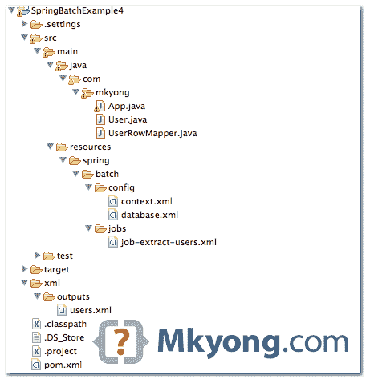

# Spring 批处理示例——MySQL 数据库到 XML

> 原文：<http://web.archive.org/web/20230101150211/http://www.mkyong.com/spring-batch/spring-batch-example-mysql-database-to-xml/>

在本教程中，我们将向您展示如何使用`JdbcCursorItemReader`和`JdbcPagingItemReader`从 MySQL 数据库中读取数据，并将其写入 XML 文件。

使用的工具和库

1.  maven3
2.  Eclipse 4.2
3.  JDK 1.6
4.  弹簧芯 3.2.2 .释放
5.  春季 OXM 3.2.2 .发布
6.  春季批次 2.2.0 .发布
7.  MySQL Java 驱动程序 5.1.25

这个例子是 MySQL JDBC(reader)-XML(writer)。

## 1.项目目录结构

回顾最终的项目结构，一个标准的 Maven 项目。

 ## 2.数据库ˌ资料库

一个“用户”表，只包含 5 条记录，稍后用 jdbc 读取它。

users table

```java
 id, user_login, password, age

'1','mkyong','password','30'
'2','user_a','password','25'
'3','user_b','password','10'
'4','user_c','password','25'
'5','user_d','password','40' 
```

 ## 3.项目阅读器

创建一个行映射器，将数据库值映射到“用户”对象。

User.java

```java
 package com.mkyong;

public class User {

	int id;
	String username;
	String password;
	int age;

	//... getter and setter methods

} 
```

UserRowMapper.java

```java
 package com.mkyong;

import java.sql.ResultSet;
import java.sql.SQLException;
import org.springframework.jdbc.core.RowMapper;

public class UserRowMapper implements RowMapper<User> {

	@Override
	public User mapRow(ResultSet rs, int rowNum) throws SQLException {

		User user = new User();

		user.setId(rs.getInt("id"));
		user.setUsername(rs.getString("user_login"));
		user.setPassword(rs.getString("user_pass"));
		user.setAge(rs.getInt("age"));

		return user;
	}

} 
```

从数据库中读取数据的例子。

job.xml

```java
 <bean id="itemReader"
	class="org.springframework.batch.item.database.JdbcCursorItemReader"
	scope="step">
	<property name="dataSource" ref="dataSource" />
	<property name="sql"
		value="select ID, USER_LOGIN, USER_PASS, AGE from USERS" />
	<property name="rowMapper">
		<bean class="com.mkyong.UserRowMapper" />
	</property>
  </bean> 
```

大记录可以用`JdbcPagingItemReader`。

job.xml

```java
 <bean id="pagingItemReader"
	class="org.springframework.batch.item.database.JdbcPagingItemReader"
	scope="step">
	<property name="dataSource" ref="dataSource" />
	<property name="queryProvider">
	  <bean
		class="org.springframework.batch.item.database.support.SqlPagingQueryProviderFactoryBean">
		<property name="dataSource" ref="dataSource" />
		<property name="selectClause" value="select id, user_login, user_pass, age" />
		<property name="fromClause" value="from users" />
		<property name="whereClause" value="where user_login=:name" />
		<property name="sortKey" value="id" />
	  </bean>
	</property>
	<property name="parameterValues">
	   <map>
		<entry key="name" value="#{jobParameters['name']}" />
	   </map>
	</property>
	<property name="pageSize" value="10" />
	<property name="rowMapper">
		<bean class="com.mkyong.UserRowMapper" />
	</property>
  </bean> 
```

## 4.项目作者

将数据写入 XML 文件。

job.xml

```java
 <bean id="itemWriter" 
                class="org.springframework.batch.item.xml.StaxEventItemWriter">
		<property name="resource" value="file:xml/outputs/users.xml" />
		<property name="marshaller" ref="userUnmarshaller" />
		<property name="rootTagName" value="users" />
	</bean>

	<bean id="userUnmarshaller" 
                class="org.springframework.oxm.xstream.XStreamMarshaller">
		<property name="aliases">
			<util:map id="aliases">
				<entry key="user" value="com.mkyong.User" />
			</util:map>
		</property>
	</bean> 
```

## 5.春季批处理作业

从 MySQL 中读取数据并将其写入 XML 文件的任务。

resources/spring/batch/jobs/job-extract-users.xml

```java
 <?xml version="1.0" encoding="UTF-8"?>
<beans 
	xmlns:batch="http://www.springframework.org/schema/batch" 
	xmlns:xsi="http://www.w3.org/2001/XMLSchema-instance"
	xsi:schemaLocation="http://www.springframework.org/schema/batch 
		http://www.springframework.org/schema/batch/spring-batch-2.2.xsd
		http://www.springframework.org/schema/beans 
		http://www.springframework.org/schema/beans/spring-beans-3.2.xsd
		">

  <import resource="../config/context.xml" />
  <import resource="../config/database.xml" />

  <bean id="itemReader"
	class="org.springframework.batch.item.database.JdbcCursorItemReader"
	scope="step">
	<property name="dataSource" ref="dataSource" />
	<property name="sql"
		value="select ID, USER_LOGIN, USER_PASS, AGE from USERS where age > #{jobParameters['age']}" />
	<property name="rowMapper">
		<bean class="com.mkyong.UserRowMapper" />
	</property>
  </bean>

  <job id="testJob" >
	<step id="step1">
	  <tasklet>
		<chunk reader="pagingItemReader" writer="itemWriter"
			commit-interval="1" />
	  </tasklet>
	</step>
  </job>

  <bean id="itemWriter" class="org.springframework.batch.item.xml.StaxEventItemWriter">
	<property name="resource" value="file:xml/outputs/users.xml" />
	<property name="marshaller" ref="userUnmarshaller" />
	<property name="rootTagName" value="users" />
  </bean>

  <bean id="userUnmarshaller" class="org.springframework.oxm.xstream.XStreamMarshaller">
	<property name="aliases">
		<util:map id="aliases">
			<entry key="user" value="com.mkyong.User" />
		</util:map>
	</property>
  </bean>	
</beans> 
```

resources/spring/batch/config/database.xml

```java
 <beans 
	xmlns:jdbc="http://www.springframework.org/schema/jdbc" 
	xmlns:xsi="http://www.w3.org/2001/XMLSchema-instance"
	xsi:schemaLocation="http://www.springframework.org/schema/beans 
		http://www.springframework.org/schema/beans/spring-beans-3.2.xsd
		http://www.springframework.org/schema/jdbc 
		http://www.springframework.org/schema/jdbc/spring-jdbc-3.2.xsd">

        <!-- connect to database -->
	<bean id="dataSource"
		class="org.springframework.jdbc.datasource.DriverManagerDataSource">
		<property name="driverClassName" value="com.mysql.jdbc.Driver" />
		<property name="url" value="jdbc:mysql://localhost:3306/test" />
		<property name="username" value="root" />
		<property name="password" value="" />
	</bean>

	<bean id="transactionManager"
	class="org.springframework.batch.support.transaction.ResourcelessTransactionManager" />

</beans> 
```

## 6.运行它

创建一个 Java 类并运行批处理作业。

App.java

```java
 package com.mkyong;

import org.springframework.batch.core.Job;
import org.springframework.batch.core.JobExecution;
import org.springframework.batch.core.JobParameters;
import org.springframework.batch.core.JobParametersBuilder;
import org.springframework.batch.core.launch.JobLauncher;
import org.springframework.context.ApplicationContext;
import org.springframework.context.support.ClassPathXmlApplicationContext;

public class App {

  public static void main(String[] args) {
	App obj = new App();
	obj.run();
  }

  private void run() {

	String[] springConfig = { "spring/batch/jobs/job-extract-users.xml" };

	ApplicationContext context = new ClassPathXmlApplicationContext(springConfig);

	JobLauncher jobLauncher = (JobLauncher) context.getBean("jobLauncher");
	Job job = (Job) context.getBean("testJob");

	try {

		JobParameters param = new JobParametersBuilder().addString("age", "20").toJobParameters();

		JobExecution execution = jobLauncher.run(job, param);
		System.out.println("Exit Status : " + execution.getStatus());
		System.out.println("Exit Status : " + execution.getAllFailureExceptions());

	} catch (Exception e) {
		e.printStackTrace();
	}
	System.out.println("Done");

  }

} 
```

输出。将所有“年龄大于 20 岁的用户”提取到 XML 文件中。

xml/outputs/users.xml

```java
 <?xml version="1.0" encoding="UTF-8"?>
<users>
	<user>
		<id>1</id>
		<username>mkyong</username>
		<password>password</password>
		<age>30</age>
	</user>
	<user>
		<id>2</id>
		<username>user_a</username>
		<password>password</password>
		<age>25</age>
	</user>
	<user>
		<id>4</id>
		<username>user_c</username>
		<password>password</password>
		<age>25</age>
	</user>
	<user>
		<id>5</id>
		<username>user_d</username>
		<password>password</password>
		<age>40</age>
	</user>
</users> 
```

## 下载源代码

Download it – [SpringBatch-MySQL-XML-Example.zip](http://web.archive.org/web/20190306162826/http://www.mkyong.com/wp-content/uploads/2013/07/SpringBatch-MySQL-XML-Example.zip) (22 kb)

## 参考

1.  [春季批次-读写器数据库](http://web.archive.org/web/20190306162826/http://static.springsource.org/spring-batch/reference/html/readersAndWriters.html#database)
2.  [staxeventitiveriter javadoc](http://web.archive.org/web/20190306162826/http://static.springsource.org/spring-batch/apidocs/org/springframework/batch/item/xml/StaxEventItemWriter.html)的缩写
3.  [JdbcPagingItemReader JavaDoc](http://web.archive.org/web/20190306162826/http://static.springsource.org/spring-batch/apidocs/org/springframework/batch/item/database/JdbcPagingItemReader.html)

[mysql](http://web.archive.org/web/20190306162826/http://www.mkyong.com/tag/mysql/) [spring batch](http://web.archive.org/web/20190306162826/http://www.mkyong.com/tag/spring-batch/) [xml](http://web.archive.org/web/20190306162826/http://www.mkyong.com/tag/xml/)


