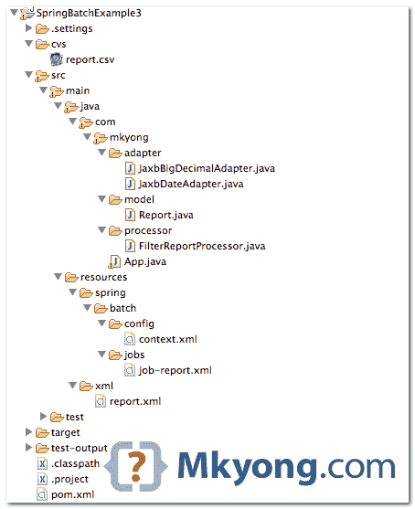
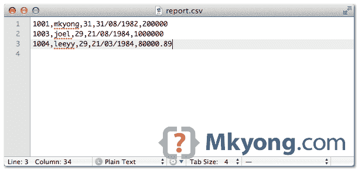

# Spring 批处理示例–XML 文件到 CSV 文件

> 原文：<http://web.archive.org/web/20230101150211/http://www.mkyong.com/spring-batch/spring-batch-example-xml-file-to-csv-file/>

在本教程中，我们将向您展示如何配置一个 Spring 批处理作业来将 XML 文件(`JAXB2`库)读入一个`csv`文件，并在使用`ItemProcessor`写入之前过滤掉记录。

使用的工具和库

1.  maven3
2.  Eclipse 4.2
3.  JDK 1.6
4.  弹簧芯 3.2.2 .释放
5.  春季批次 2.2.0 .发布
6.  春季 OXM 3.2.2 .发布

此示例–XML 文件(阅读器)–过滤(项目处理器)–CSV(编写器)。

## 1.简单的 Java 项目

1.用 Maven 创建一个快速启动 Java 项目，转换并导入到 Eclipse IDE 中。

```java
 $ mvn archetype:generate -DgroupId=com.mkyong -DartifactId=SpringBatchExample3 
  -DarchetypeArtifactId=maven-archetype-quickstart -DinteractiveMode=false 
```

```java
 $ cd SpringBatchExample3/
$ mvn eclipse:eclipse 
```

 <ins class="adsbygoogle" style="display:block; text-align:center;" data-ad-format="fluid" data-ad-layout="in-article" data-ad-client="ca-pub-2836379775501347" data-ad-slot="6894224149">## 2.项目相关性

在`pom.xml`中声明所有项目依赖关系

pom.xml

```java
 <project  
	xmlns:xsi="http://www.w3.org/2001/XMLSchema-instance"
	xsi:schemaLocation="http://maven.apache.org/POM/4.0.0 
	http://maven.apache.org/maven-v4_0_0.xsd">
	<modelVersion>4.0.0</modelVersion>
	<groupId>com.mkyong</groupId>
	<artifactId>SpringBatchExample</artifactId>
	<packaging>jar</packaging>
	<version>1.0-SNAPSHOT</version>
	<name>SpringBatchExample</name>
	<url>http://maven.apache.org</url>

	<properties>
		<jdk.version>1.6</jdk.version>
		<spring.version>3.2.2.RELEASE</spring.version>
		<spring.batch.version>2.2.0.RELEASE</spring.batch.version>
	</properties>

	<dependencies>

		<!-- Spring Core -->
		<dependency>
			<groupId>org.springframework</groupId>
			<artifactId>spring-core</artifactId>
			<version>${spring.version}</version>
		</dependency>

		<!-- Spring XML to/back object -->
		<dependency>
			<groupId>org.springframework</groupId>
			<artifactId>spring-oxm</artifactId>
			<version>${spring.version}</version>
		</dependency>

		<!-- Spring Batch dependencies -->
		<dependency>
			<groupId>org.springframework.batch</groupId>
			<artifactId>spring-batch-core</artifactId>
			<version>${spring.batch.version}</version>
		</dependency>
		<dependency>
			<groupId>org.springframework.batch</groupId>
			<artifactId>spring-batch-infrastructure</artifactId>
			<version>${spring.batch.version}</version>
		</dependency>

	</dependencies>
	<build>
	    <finalName>spring-batch</finalName>
	    <plugins>
		<plugin>
			<groupId>org.apache.maven.plugins</groupId>
			<artifactId>maven-eclipse-plugin</artifactId>
			<version>2.9</version>
			<configuration>
				<downloadSources>true</downloadSources>
				<downloadJavadocs>false</downloadJavadocs>
			</configuration>
		</plugin>
		<plugin>
			<groupId>org.apache.maven.plugins</groupId>
			<artifactId>maven-compiler-plugin</artifactId>
			<version>2.3.2</version>
			<configuration>
				<source>${jdk.version}</source>
				<target>${jdk.version}</target>
			</configuration>
		</plugin>
	    </plugins>
	</build>

</project> 
```

 <ins class="adsbygoogle" style="display:block" data-ad-client="ca-pub-2836379775501347" data-ad-slot="8821506761" data-ad-format="auto" data-ad-region="mkyongregion">## 3.项目目录结构

回顾最终的项目结构，了解下一步要做的事情。



## 4.XML 文件

resources/xml/report.xml

```java
 <?xml version="1.0" encoding="UTF-8" ?>
<company>
    <record refId="1001">
        <name>mkyong</name>
        <age>31</age>
        <dob>31/8/1982</dob>
        <income>200,000</income>
    </record>
    <record refId="1002">
        <name>kkwong</name>
        <age>30</age>
        <dob>26/7/1983</dob>
        <income>100,999</income>
    </record>
    <record refId="1003">
        <name>joel</name>
        <age>29</age>
        <dob>21/8/1984</dob>
        <income>1,000,000</income>
    </record>
    <record refId="1004">
        <name>leeyy</name>
        <age>29</age>
        <dob>21/3/1984</dob>
        <income>80,000.89</income>
    </record>
</company> 
```

## 5.读取 XML 文件

在这个例子中，我们使用`Jaxb2Marshaller`将 XML 值和属性映射到一个对象。

resources/spring/batch/jobs/job-report.xml

```java
 <!-- ...... -->
    <bean id="xmlItemReader" 
        class="org.springframework.batch.item.xml.StaxEventItemReader">
	<property name="fragmentRootElementName" value="record" />
	<property name="resource" value="classpath:xml/report.xml" />
	<property name="unmarshaller" ref="reportUnmarshaller" />
    </bean>

    <!-- Read and map values to object, via jaxb2 -->
    <bean id="reportUnmarshaller" 
        class="org.springframework.oxm.jaxb.Jaxb2Marshaller">
	<property name="classesToBeBound">
	  <list>
		<value>com.mkyong.model.Report</value>
	  </list>
	</property>
    </bean> 
```

注释`Report`,告诉它哪个 XML 值映射到哪个字段。

Report.java

```java
 package com.mkyong.model;

import java.math.BigDecimal;
import java.text.SimpleDateFormat;
import java.util.Date;
import javax.xml.bind.annotation.XmlAttribute;
import javax.xml.bind.annotation.XmlElement;
import javax.xml.bind.annotation.XmlRootElement;
import javax.xml.bind.annotation.adapters.XmlJavaTypeAdapter;
import com.mkyong.adapter.JaxbBigDecimalAdapter;
import com.mkyong.adapter.JaxbDateAdapter;

@XmlRootElement(name = "record")
public class Report {

	private int refId;
	private String name;
	private int age;
	private Date dob;
	private BigDecimal income;

	@XmlAttribute(name = "refId")
	public int getRefId() {
		return refId;
	}

	public void setRefId(int refId) {
		this.refId = refId;
	}

	@XmlElement(name = "age")
	public int getAge() {
		return age;
	}

	public void setAge(int age) {
		this.age = age;
	}

	@XmlElement
	public String getName() {
		return name;
	}

	public void setName(String name) {
		this.name = name;
	}

	@XmlJavaTypeAdapter(JaxbDateAdapter.class)
	@XmlElement
	public Date getDob() {
		return dob;
	}

	public void setDob(Date dob) {
		this.dob = dob;
	}

	@XmlJavaTypeAdapter(JaxbBigDecimalAdapter.class)
	@XmlElement
	public BigDecimal getIncome() {
		return income;
	}

	public void setIncome(BigDecimal income) {
		this.income = income;
	}

	// for csv file only
	public String getCsvDob() {

		SimpleDateFormat dateFormat = new SimpleDateFormat("dd/MM/yyyy");
		return dateFormat.format(getDob());

	}

} 
```

在 JAXB2 中，那些“复杂”的数据类型，如`Date`和`BigDecimal`，不会自动映射到字段，即使它是带注释的。

为了让 JAXB2 支持`Date`转换，您需要创建一个自定义适配器来手动处理`Date format`，然后通过`@XmlJavaTypeAdapter`连接适配器。

JaxbDateAdapter.java

```java
 package com.mkyong.adapter;

import java.text.SimpleDateFormat;
import java.util.Date;
import javax.xml.bind.annotation.adapters.XmlAdapter;

public class JaxbDateAdapter extends XmlAdapter<String, Date> {

	private SimpleDateFormat dateFormat = new SimpleDateFormat("dd/MM/yyyy");

	@Override
	public String marshal(Date date) throws Exception {
		return dateFormat.format(date);
	}

	@Override
	public Date unmarshal(String date) throws Exception {
		return dateFormat.parse(date);
	}

} 
```

与`BigDecimal`一样，XML 的 income 元素中的逗号“，”导致了转换问题，您也需要一个自定义适配器来处理它。

JaxbBigDecimalAdapter.java

```java
 package com.mkyong.adapter;

import java.math.BigDecimal;
import javax.xml.bind.annotation.adapters.XmlAdapter;

public class JaxbBigDecimalAdapter extends XmlAdapter<String, BigDecimal> {

	@Override
	public String marshal(BigDecimal obj) throws Exception {
		return obj.toString();
	}

	@Override
	public BigDecimal unmarshal(String obj) throws Exception {
		return new BigDecimal(obj.replaceAll(",", ""));
	}

} 
```

## 6.弹簧批芯设置

定义`jobRepository`和`jobLauncher`。

resources/spring/batch/config/context.xml

```java
 <beans 
	xmlns:xsi="http://www.w3.org/2001/XMLSchema-instance"
	xsi:schemaLocation="
	http://www.springframework.org/schema/beans 
	http://www.springframework.org/schema/beans/spring-beans-3.2.xsd">

    <!-- stored job-meta in memory --> 
    <bean id="jobRepository"
	class="org.springframework.batch.core.repository.support.MapJobRepositoryFactoryBean">
	<property name="transactionManager" ref="transactionManager" />
    </bean>

    <bean id="transactionManager"
	class="org.springframework.batch.support.transaction.ResourcelessTransactionManager" />

    <bean id="jobLauncher"
	class="org.springframework.batch.core.launch.support.SimpleJobLauncher">
	<property name="jobRepository" ref="jobRepository" />
    </bean>

</beans> 
```

## 7.春季批处理作业

一个 Spring 批处理作业，读取`report.xml`文件，映射到`Report`对象，写入 csv 文件。看评论，应该不言自明。

resources/spring/batch/jobs/job-report.xml

```java
 <beans 
	xmlns:batch="http://www.springframework.org/schema/batch" 
	xmlns:task="http://www.springframework.org/schema/task"
	xmlns:util="http://www.springframework.org/schema/util" 
	xmlns:xsi="http://www.w3.org/2001/XMLSchema-instance"
	xsi:schemaLocation="http://www.springframework.org/schema/batch
	http://www.springframework.org/schema/batch/spring-batch-2.2.xsd
	http://www.springframework.org/schema/beans 
	http://www.springframework.org/schema/beans/spring-beans-3.2.xsd
	http://www.springframework.org/schema/util 
	http://www.springframework.org/schema/util/spring-util-3.2.xsd">

  <batch:job id="reportJob">
	<batch:step id="step1">
	<batch:tasklet>
		<batch:chunk reader="xmlItemReader" 
			writer="cvsFileItemWriter" processor="filterReportProcessor"
			commit-interval="1">
		</batch:chunk>
	</batch:tasklet>
	</batch:step>
  </batch:job>

  <!-- Filtering process -->
  <bean id="filterReportProcessor" class="com.mkyong.processor.FilterReportProcessor" />

  <bean id="xmlItemReader" 
        class="org.springframework.batch.item.xml.StaxEventItemReader">
	<property name="fragmentRootElementName" value="record" />
	<property name="resource" value="classpath:xml/report.xml" />
	<property name="unmarshaller" ref="reportUnmarshaller" />
  </bean>

  <!-- Read and map values to object, via jaxb2 -->
  <bean id="reportUnmarshaller" class="org.springframework.oxm.jaxb.Jaxb2Marshaller">
    <property name="classesToBeBound">
	<list>
		<value>com.mkyong.model.Report</value>
	</list>
    </property>
  </bean>

  <bean id="cvsFileItemWriter" class="org.springframework.batch.item.file.FlatFileItemWriter">
	<!-- write to this csv file -->
	<property name="resource" value="file:cvs/report.csv" />
	<property name="shouldDeleteIfExists" value="true" />

	<property name="lineAggregator">
	  <bean
		class="org.springframework.batch.item.file.transform.DelimitedLineAggregator">
		<property name="delimiter" value="," />
		<property name="fieldExtractor">
		  <bean
			class="org.springframework.batch.item.file.transform.BeanWrapperFieldExtractor">
			<property name="names" value="refId, name, age, csvDob, income" />
		   </bean>
		</property>
	   </bean>
	</property>
  </bean>

</beans> 
```

## 8.春季批次–项目处理器

在 Spring batch 中，wired `Processor`将在写入任何资源之前被触发，因此，这是处理任何转换、过滤和业务逻辑的最佳位置。在本例中，如果其'`age`等于 30，则`Report`对象将被忽略(不写入 csv 文件)。

FilterReportProcessor.java

```java
 package com.mkyong.processor;

import org.springframework.batch.item.ItemProcessor;
import com.mkyong.model.Report;

//run before writing
public class FilterReportProcessor implements ItemProcessor<Report, Report> {

	@Override
	public Report process(Report item) throws Exception {

		//filter object which age = 30
		if(item.getAge()==30){
			return null; // null = ignore this object
		}
		return item;
	}

} 
```

## 9.运行它

运行批处理作业的最简单方法。

App.java

```java
 package com.mkyong;

import org.springframework.batch.core.Job;
import org.springframework.batch.core.JobExecution;
import org.springframework.batch.core.JobParameters;
import org.springframework.batch.core.launch.JobLauncher;
import org.springframework.context.ApplicationContext;
import org.springframework.context.support.ClassPathXmlApplicationContext;

public class App {
  public static void main(String[] args) {

	String[] springConfig  = 
	{	
		"spring/batch/config/context.xml",
		"spring/batch/jobs/job-report.xml" 
	};

	ApplicationContext context = 
		new ClassPathXmlApplicationContext(springConfig);

	JobLauncher jobLauncher = (JobLauncher) context.getBean("jobLauncher");
	Job job = (Job) context.getBean("reportJob");

	try {

		JobExecution execution = jobLauncher.run(job, new JobParameters());
		System.out.println("Exit Status : " + execution.getStatus());

	} catch (Exception e) {
		e.printStackTrace();
	}

	System.out.println("Done");

  }
} 
```

输出。XML 值被插入到 csv 文件中。

csv/report.csv

```java
 1001,mkyong,31,31/08/1982,200000
1003,joel,29,21/08/1984,1000000
1004,leeyy,29,21/03/1984,80000.89 
```



## 下载源代码

Download it – [SpringBatch-XML-CSV-Example.zip](http://web.archive.org/web/20190225210251/http://www.mkyong.com/wp-content/uploads/2013/07/SpringBatch-XML-CSV-Example.zip) (81 kb)

## 参考

1.  [Spring 批处理项目读取器和项目写入器](http://web.archive.org/web/20190225210251/http://static.springsource.org/spring-batch/reference/html/readersAndWriters.html)
2.  [JAXB 定制绑定–Java . util . date](http://web.archive.org/web/20190225210251/http://loianegroner.com/2011/06/jaxb-custom-binding-java-util-date-spring-3-serialization/)
3.  [如何使用 FlatFileItemWriter？](http://web.archive.org/web/20190225210251/http://forum.springsource.org/showthread.php?63282-How-to-use-FlatFileItemWriter)
4.  [flat file item writer JavaDoc](http://web.archive.org/web/20190225210251/http://static.springsource.org/spring-batch/apidocs/org/springframework/batch/item/file/FlatFileItemWriter.html)

[csv](http://web.archive.org/web/20190225210251/http://www.mkyong.com/tag/csv/) [spring batch](http://web.archive.org/web/20190225210251/http://www.mkyong.com/tag/spring-batch/) [xml](http://web.archive.org/web/20190225210251/http://www.mkyong.com/tag/xml/)


