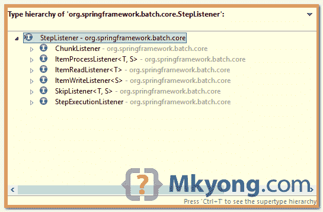

# Spring 批处理侦听器示例

> 原文：<http://web.archive.org/web/20230101150211/http://www.mkyong.com/spring-batch/spring-batch-listeners-example/>



在 Spring batch 中，有六个“监听器”来拦截步骤执行，我相信类名应该是不言自明的。

1.  StepExecutionListener
2.  itemreadlsitener
3.  ItemProcessListener
4.  ItemWriteListener
5.  ChunkListener
6.  SkipListener

## 1.监听器示例

三个监听器示例，什么也不做，只是打印出一条消息。

CustomStepListener.java

```java
 package com.mkyong.listeners;

import org.springframework.batch.core.ExitStatus;
import org.springframework.batch.core.StepExecution;
import org.springframework.batch.core.StepExecutionListener;

public class CustomStepListener implements StepExecutionListener {

	@Override
	public void beforeStep(StepExecution stepExecution) {
		System.out.println("StepExecutionListener - beforeStep");
	}

	@Override
	public ExitStatus afterStep(StepExecution stepExecution) {
		System.out.println("StepExecutionListener - afterStep");
		return null;
	}

} 
```

CustomItemReaderListener.java

```java
 package com.mkyong.listeners;

import org.springframework.batch.core.ItemReadListener;
import com.mkyong.Domain;

public class CustomItemReaderListener implements ItemReadListener<Domain> {

	@Override
	public void beforeRead() {
		System.out.println("ItemReadListener - beforeRead");
	}

	@Override
	public void afterRead(Domain item) {
		System.out.println("ItemReadListener - afterRead");
	}

	@Override
	public void onReadError(Exception ex) {
		System.out.println("ItemReadListener - onReadError");
	}

} 
```

CustomItemWriterListener.java

```java
 package com.mkyong.listeners;

import java.util.List;
import org.springframework.batch.core.ItemWriteListener;
import com.mkyong.Domain;

public class CustomItemWriterListener implements ItemWriteListener<Domain> {

	@Override
	public void beforeWrite(List<? extends Domain> items) {
		System.out.println("ItemWriteListener - beforeWrite");
	}

	@Override
	public void afterWrite(List<? extends Domain> items) {
		System.out.println("ItemWriteListener - afterWrite");
	}

	@Override
	public void onWriteError(Exception exception, List<? extends Domain> items) {
		System.out.println("ItemWriteListener - onWriteError");
	}

} 
```

 <ins class="adsbygoogle" style="display:block; text-align:center;" data-ad-format="fluid" data-ad-layout="in-article" data-ad-client="ca-pub-2836379775501347" data-ad-slot="6894224149">## 2.批处理作业

一个批处理作业，附加在三个侦听器上。

spring-batch-job.xml

```java
 <bean id="customStepListener" 
          class="com.mkyong.listeners.CustomStepListener" />
    <bean id="customItemReaderListener" 
          class="com.mkyong.listeners.CustomItemReaderListener" />
    <bean id="customItemWriterListener" 
          class="com.mkyong.listeners.CustomItemWriterListener" />

    <job id="readFileJob" >
	<step id="step1">
	    <tasklet>
		<chunk reader="multiResourceReader" writer="flatFileItemWriter"
			commit-interval="1" />
		    <listeners>
			<listener ref="customStepListener" />
			<listener ref="customItemReaderListener" />
			<listener ref="customItemWriterListener" />
		    </listeners>
	    </tasklet>
	</step>
    </job> 
```

假设加载了 csv 文件中的 3 条记录，并将其写入某个地方，控制台输出如下:

```java
 StepExecutionListener - beforeStep

ItemReadListener - beforeRead
ItemReadListener - afterRead
ItemWriteListener - beforeWrite
ItemWriteListener - afterWrite

ItemReadListener - beforeRead
ItemReadListener - afterRead
ItemWriteListener - beforeWrite
ItemWriteListener - afterWrite

ItemReadListener - beforeRead
ItemReadListener - afterRead
ItemWriteListener - beforeWrite
ItemWriteListener - afterWrite

StepExecutionListener - afterStep 
```

 <ins class="adsbygoogle" style="display:block" data-ad-client="ca-pub-2836379775501347" data-ad-slot="8821506761" data-ad-format="auto" data-ad-region="mkyongregion">## 下载源代码

Download it – [SpringBatch-Listener-Example.zip](http://web.archive.org/web/20190223085316/http://www.mkyong.com/wp-content/uploads/2013/07/SpringBatch-Listener-Example.zip) (14 KB)

## 参考

1.  [截取步骤执行](http://web.archive.org/web/20190223085316/http://static.springsource.org/spring-batch/reference/html/configureStep.html#interceptingStepExecution)
2.  [StepExecutionListener JavaDoc](http://web.archive.org/web/20190223085316/http://static.springsource.org/spring-batch/apidocs/org/springframework/batch/core/StepExecutionListener.html)
3.  [ItemReadListener JavaDoc](http://web.archive.org/web/20190223085316/http://static.springsource.org/spring-batch/apidocs/org/springframework/batch/core/ItemReadListener.html)
4.  [ItemProcessListener JavaDoc](http://web.archive.org/web/20190223085316/http://static.springsource.org/spring-batch/apidocs/org/springframework/batch/core/ItemProcessListener.html)
5.  [ItemWriteListener JavaDoc](http://web.archive.org/web/20190223085316/http://static.springsource.org/spring-batch/apidocs/org/springframework/batch/core/ItemWriteListener.html)
6.  [分块侦听器 JavaDoc](http://web.archive.org/web/20190223085316/http://static.springsource.org/spring-batch/apidocs/org/springframework/batch/core/ChunkListener.html)
7.  [SkipListener JavaDoc](http://web.archive.org/web/20190223085316/http://static.springsource.org/spring-batch/apidocs/org/springframework/batch/core/SkipListener.html)

[listener](http://web.archive.org/web/20190223085316/http://www.mkyong.com/tag/listener/) [spring batch](http://web.archive.org/web/20190223085316/http://www.mkyong.com/tag/spring-batch/)


