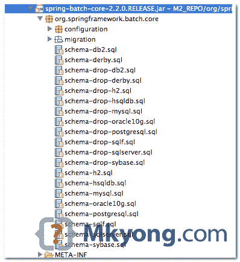

> 原文：<http://web.archive.org/web/20230101150211/http://www.mkyong.com/spring-batch/spring-batch-metadata-tables-are-not-created-automatically/>

# Spring 批量元数据表不是自动创建的？

如果使用`MapJobRepositoryFactoryBean`(内存中的元数据)创建了`jobRepository`，则 Spring 批处理作业正在成功运行。

spring-config.xml

```java
 <bean id="jobRepository"
    class="org.springframework.batch.core.repository.support.MapJobRepositoryFactoryBean">
    <property name="transactionManager" ref="transactionManager" />
  </bean> 
```

## 问题

更改`jobRepository`将元数据存储到数据库后:

spring-config.xml

```java
 <bean id="jobRepository"
	class="org.springframework.batch.core.repository.support.JobRepositoryFactoryBean">
	<property name="dataSource" ref="dataSource" />
	<property name="transactionManager" ref="transactionManager" />
	<property name="databaseType" value="mysql" />
  </bean>

  <bean id="jobLauncher"
	class="org.springframework.batch.core.launch.support.SimpleJobLauncher">
	<property name="jobRepository" ref="jobRepository" />
  </bean>

  <bean id="dataSource"
	class="org.springframework.jdbc.datasource.DriverManagerDataSource">
	<property name="driverClassName" value="com.mysql.jdbc.Driver" />
	<property name="url" value="jdbc:mysql://localhost:3306/test" />
	<property name="username" value="root" />
	<property name="password" value="" />
  </bean> 
```

它提示`batch_job_instance`表不存在？为什么 Spring 没有自动创建那些元表？

```java
 Caused by: com.mysql.jdbc.exceptions.jdbc4.MySQLSyntaxErrorException: Table db.batch_job_instance' doesn't exist
	at sun.reflect.NativeConstructorAccessorImpl.newInstance0(Native Method)
	at sun.reflect.NativeConstructorAccessorImpl.newInstance(NativeConstructorAccessorImpl.java:39)
	at sun.reflect.DelegatingConstructorAccessorImpl.newInstance(DelegatingConstructorAccessorImpl.java:27)
	at java.lang.reflect.Constructor.newInstance(Constructor.java:513)
	at com.mysql.jdbc.Util.handleNewInstance(Util.java:411) 
```

 <ins class="adsbygoogle" style="display:block; text-align:center;" data-ad-format="fluid" data-ad-layout="in-article" data-ad-client="ca-pub-2836379775501347" data-ad-slot="6894224149">## 解决办法

元表的脚本存储在`spring-batch.jar`中，您需要手动创建它。



通常，您可以通过 Spring XML 配置文件自动创建表脚本。举个例子，

spring-config.xml

```java
 <beans 
  xmlns:jdbc="http://www.springframework.org/schema/jdbc" 
  xmlns:xsi="http://www.w3.org/2001/XMLSchema-instance"
  xsi:schemaLocation="http://www.springframework.org/schema/beans 
	http://www.springframework.org/schema/beans/spring-beans-3.2.xsd
	http://www.springframework.org/schema/jdbc 
	http://www.springframework.org/schema/jdbc/spring-jdbc-3.2.xsd">

  <!-- connect to database -->
  <bean id="dataSource"
	class="org.springframework.jdbc.datasource.DriverManagerDataSource">
	<property name="driverClassName" value="com.mysql.jdbc.Driver" />
	<property name="url" value="jdbc:mysql://localhost:3306/test" />
	<property name="username" value="root" />
	<property name="password" value="" />
  </bean>

  <!-- create job-meta tables automatically -->
  <jdbc:initialize-database data-source="dataSource">
	<jdbc:script location="org/springframework/batch/core/schema-drop-mysql.sql" />
	<jdbc:script location="org/springframework/batch/core/schema-mysql.sql" />
  </jdbc:initialize-database>

</beans> 
```

再次运行 Spring 批处理作业，这些元表将被自动创建。

 <ins class="adsbygoogle" style="display:block" data-ad-client="ca-pub-2836379775501347" data-ad-slot="8821506761" data-ad-format="auto" data-ad-region="mkyongregion">## 参考

1.  [Spring 批处理–元数据模式](http://web.archive.org/web/20190226173225/http://static.springsource.org/spring-batch/reference/html/metaDataSchema.html)

[spring batch](http://web.archive.org/web/20190226173225/http://www.mkyong.com/tag/spring-batch/)


