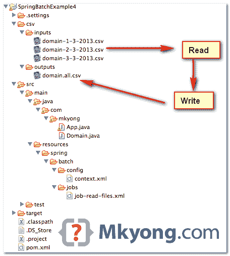

# spring Batch multi source item reader 示例

> 原文：<http://web.archive.org/web/20230101150211/http://www.mkyong.com/spring-batch/spring-batch-multiresourceitemreader-example/>

在本教程中，我们将向您展示如何从多个资源(多个 csv 文件)读取项目，并将项目写入单个 csv 文件。

使用的工具和库

1.  maven3
2.  Eclipse 4.2
3.  JDK 1.6
4.  弹簧芯 3.2.2 .释放
5.  春季批次 2.2.0 .发布

本例–3 个 CSV 文件(阅读器)–合并成一个 CSV 文件(写入器)。

## 1.项目目录结构

回顾最终的项目结构，一个标准的 Maven 项目。

 <ins class="adsbygoogle" style="display:block; text-align:center;" data-ad-format="fluid" data-ad-layout="in-article" data-ad-client="ca-pub-2836379775501347" data-ad-slot="6894224149">## 2.多个 CSV 文件

有 3 个 csv 文件，稍后我们将使用`MultiResourceItemReader`来逐个读取。

csv/inputs/domain-1-3-2013.csv

```java
 1,facebook.com
2,yahoo.com
3,google.com 
```

csv/inputs/domain-2-3-2013.csv

```java
 200,mkyong.com
300,stackoverflow.com
400,oracle.com 
```

csv/inputs/domain-3-3-2013.csv

```java
 999,eclipse.org
888,baidu.com 
```

 <ins class="adsbygoogle" style="display:block" data-ad-client="ca-pub-2836379775501347" data-ad-slot="8821506761" data-ad-format="auto" data-ad-region="mkyongregion">## 3.春季批处理作业

读取与这个模式`csv/inputs/domain-*.csv`匹配的资源，并将其写入单个 cvs 文件`domain.all.csv`的任务。

resources/spring/batch/jobs/job-read-files.xml

```java
 <?xml version="1.0" encoding="UTF-8"?>
<beans 
        xmlns:batch="http://www.springframework.org/schema/batch" 
	xmlns:xsi="http://www.w3.org/2001/XMLSchema-instance"
	xsi:schemaLocation="http://www.springframework.org/schema/batch 
	http://www.springframework.org/schema/batch/spring-batch-2.2.xsd
	http://www.springframework.org/schema/beans 
	http://www.springframework.org/schema/beans/spring-beans-3.2.xsd
	">

  <import resource="../config/context.xml" />

  <bean id="domain" class="com.mkyong.Domain" />

  <job id="readMultiFileJob" >
    <step id="step1">
	<tasklet>
		<chunk reader="multiResourceReader" writer="flatFileItemWriter"
			commit-interval="1" />
	</tasklet>
    </step>
  </job>

  <bean id="multiResourceReader"
	class=" org.springframework.batch.item.file.MultiResourceItemReader">
	<property name="resources" value="file:csv/inputs/domain-*.csv" />
	<property name="delegate" ref="flatFileItemReader" />
  </bean>

  <bean id="flatFileItemReader" 
        class="org.springframework.batch.item.file.FlatFileItemReader">
	<property name="lineMapper">
	  <bean class="org.springframework.batch.item.file.mapping.DefaultLineMapper">
		<property name="lineTokenizer">
		    <bean 
                    class="org.springframework.batch.item.file.transform.DelimitedLineTokenizer">
				<property name="names" value="id, domain" />
		    </bean>
		</property>
		<property name="fieldSetMapper">
		    <bean
		    class="org.springframework.batch.item.file.mapping.BeanWrapperFieldSetMapper">
				<property name="prototypeBeanName" value="domain" />
		    </bean>
		</property>
	  </bean>
	</property>
  </bean>

  <bean id="flatFileItemWriter" 
          class="org.springframework.batch.item.file.FlatFileItemWriter">
	<property name="resource" value="file:csv/outputs/domain.all.csv" />
	<property name="appendAllowed" value="true" />
	<property name="lineAggregator">
	  <bean
	  class="org.springframework.batch.item.file.transform.DelimitedLineAggregator">
		<property name="delimiter" value="," />
		<property name="fieldExtractor">
		  <bean	
                  class="org.springframework.batch.item.file.transform.BeanWrapperFieldExtractor">
			<property name="names" value="id, domain" />
		  </bean>
		</property>
	  </bean>
	</property>
  </bean>

</beans> 
```

resources/spring/batch/config/context.xml

```java
 <beans 
	xmlns:xsi="http://www.w3.org/2001/XMLSchema-instance"
	xsi:schemaLocation="
	http://www.springframework.org/schema/beans 
	http://www.springframework.org/schema/beans/spring-beans-3.2.xsd">

    <!-- stored job-meta in memory --> 
    <bean id="jobRepository"
	class="org.springframework.batch.core.repository.support.MapJobRepositoryFactoryBean">
	<property name="transactionManager" ref="transactionManager" />
    </bean>

    <bean id="transactionManager"
	class="org.springframework.batch.support.transaction.ResourcelessTransactionManager" />

    <bean id="jobLauncher"
	class="org.springframework.batch.core.launch.support.SimpleJobLauncher">
	<property name="jobRepository" ref="jobRepository" />
    </bean>

</beans> 
```

## 4.运行它

创建一个 Java 类并运行批处理作业。

App.java

```java
 package com.mkyong;

import org.springframework.batch.core.Job;
import org.springframework.batch.core.JobExecution;
import org.springframework.batch.core.JobParameters;
import org.springframework.batch.core.launch.JobLauncher;
import org.springframework.context.ApplicationContext;
import org.springframework.context.support.ClassPathXmlApplicationContext;

public class App {

  public static void main(String[] args) {
	App obj = new App();
	obj.run();
  }

  private void run() {

	String[] springConfig = { "spring/batch/jobs/job-read-files.xml" };

	ApplicationContext context = new ClassPathXmlApplicationContext(springConfig);

	JobLauncher jobLauncher = (JobLauncher) context.getBean("jobLauncher");
	Job job = (Job) context.getBean("readMultiFileJob");

	try {

		JobExecution execution = jobLauncher.run(job, new JobParameters());
		System.out.println("Exit Status : " + execution.getStatus());

	} catch (Exception e) {
		e.printStackTrace();
	}

	System.out.println("Done");

  }

} 
```

输出。三个 csv 文件内容被读取并组合成一个 csv 文件。

csv/outputs/domain.all.csv

```java
 1,facebook.com
2,yahoo.com
3,google.coms
200,mkyong.com
300,stackoverflow.com
400,oracle.com
999,eclipse.org
888,baidu.com 
```

## 下载源代码

Download it – [SpringBatch-MultiResourceItemReader-Example.zip](http://web.archive.org/web/20190214233556/http://www.mkyong.com/wp-content/uploads/2013/07/SpringBatch-MultiResourceItemReader-Example.zip) (12 kb)

## 参考

1.  [MultiResourceItemReader JavaDoc](http://web.archive.org/web/20190214233556/http://static.springsource.org/spring-batch/apidocs/org/springframework/batch/item/file/MultiResourceItemReader.html)
2.  [flat file item writer JavaDoc](http://web.archive.org/web/20190214233556/http://static.springsource.org/spring-batch/apidocs/org/springframework/batch/item/file/FlatFileItemWriter.html)
3.  [春季批量单据-多档案输入](http://web.archive.org/web/20190214233556/http://static.springsource.org/spring-batch/reference/html/readersAndWriters.html#multiFileInput)

[spring batch](http://web.archive.org/web/20190214233556/http://www.mkyong.com/tag/spring-batch/)


