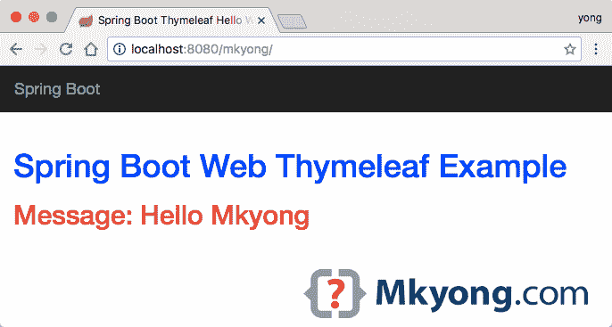

# Spring Boot-将 WAR 文件部署到 Tomcat

> 原文：<http://web.archive.org/web/20230101150211/https://mkyong.com/spring-boot/spring-boot-deploy-war-file-to-tomcat/>

在本文中，我们将向您展示如何将 Spring Boot 战争文件部署到 Tomcat servlet 容器中。

对于 Spring Boot 战争的部署，你需要做三个步骤:

1.  扩展 SpringBootServletInitializer
2.  将嵌入式 servlet 容器标记为已提供。
3.  将包装更新到 war

*已测试*

1.  Spring Boot 1.4.2 版本
2.  Tomcat 8.5.9
3.  maven3

**Note**
In Spring Boot, the final executable JAR file with embedded server solution may not suitable in all production environments, especially the deployment team (a team with good knowledge of server optimization and monitoring skills, but lack of, the development experience), they want full control of the server, and they don’t touch code.

## 1.扩展 SpringBootServletInitializer

使现有的`@SpringBootApplication`类扩展`SpringBootServletInitializer`

1.1 经典的 Spring Boot JAR 部署。(更新此文件以支持 WAR 部署)

SpringBootWebApplication.java

```java
 import org.springframework.boot.autoconfigure.SpringBootApplication;

@SpringBootApplication
public class SpringBootWebApplication {

    public static void main(String[] args) throws Exception {
        SpringApplication.run(SpringBootWebApplication.class, args);
    }

} 
```

1.2 Spring Boot 战争部署。

SpringBootWebApplication.java

```java
 import org.springframework.boot.SpringApplication;
import org.springframework.boot.autoconfigure.SpringBootApplication;
import org.springframework.boot.builder.SpringApplicationBuilder;
import org.springframework.boot.web.support.SpringBootServletInitializer;

@SpringBootApplication
public class SpringBootWebApplication extends SpringBootServletInitializer {

    @Override
    protected SpringApplicationBuilder configure(SpringApplicationBuilder application) {
        return application.sources(SpringBootWebApplication.class);
    }

    public static void main(String[] args) throws Exception {
        SpringApplication.run(SpringBootWebApplication.class, args);
    }

}

/*@SpringBootApplication
public class SpringBootWebApplication {

    public static void main(String[] args) throws Exception {
        SpringApplication.run(SpringBootWebApplication.class, args);
    }

}*/ 
```

如果您为部署创建一个额外的`SpringBootWebApplication`类，一定要告诉 Spring Boot 要启动哪个主类:

pom.xml

```java
 <properties>
        <start-class>com.mkyong.NewSpringBootWebApplicationForWAR</start-class>
  </properties> 
```

读读这个——[Spring Boot——从哪个主班开始](http://web.archive.org/web/20190306164208/http://www.mkyong.com/spring-boot/spring-boot-which-main-class-to-start/)

 ## 2.将嵌入式 servlet 容器标记为已提供

pom.xml

```java
 <dependencies>

	<dependency>
		<groupId>org.springframework.boot</groupId>
		<artifactId>spring-boot-starter-thymeleaf</artifactId>
	</dependency>

	<!-- marked the embedded servlet container as provided -->
	<dependency>
		<groupId>org.springframework.boot</groupId>
		<artifactId>spring-boot-starter-tomcat</artifactId>
		<scope>provided</scope>
	</dependency>

</dependencies> 
```

 ## 3.将包装更新到 war

pom.xml

```java
 <packaging>war</packaging> 
```

完成后，`mvn package`并将`$project/target/xxx.war`复制到 Tomcat 进行部署。

## 4.完整示例——Spring Boot 战争+ Tomcat 部署

4.1 以这个 [Spring Boot 百里香为例](http://web.archive.org/web/20190306164208/http://www.mkyong.com/spring-boot/spring-boot-hello-world-example-thymeleaf/)，手动更新并部署到 Tomcat。

4.2 更新现有的`SpringBootWebApplication`并使其扩展`SpringBootServletInitializer`

pom.xml

```java
 package com.mkyong;

import org.springframework.boot.SpringApplication;
import org.springframework.boot.autoconfigure.SpringBootApplication;
import org.springframework.boot.builder.SpringApplicationBuilder;
import org.springframework.boot.web.support.SpringBootServletInitializer;

@SpringBootApplication
public class SpringBootWebApplication extends SpringBootServletInitializer {

    @Override
    protected SpringApplicationBuilder configure(SpringApplicationBuilder application) {
        return application.sources(SpringBootWebApplication.class);
    }

    public static void main(String[] args) throws Exception {
        SpringApplication.run(SpringBootWebApplication.class, args);
    }

} 
```

4.3 将包装更新为`war`，并按规定标记`spring-boot-starter-tomcat`。

pom.xml

```java
 <?xml version="1.0" encoding="UTF-8"?>
<project  
	xmlns:xsi="http://www.w3.org/2001/XMLSchema-instance"
    xsi:schemaLocation="http://maven.apache.org/POM/4.0.0 
	http://maven.apache.org/xsd/maven-4.0.0.xsd">

    <modelVersion>4.0.0</modelVersion>

    <artifactId>spring-boot-web-thymeleaf</artifactId>
    <packaging>war</packaging>
    <name>Spring Boot Web Thymeleaf Example</name>
    <description>Spring Boot Web Thymeleaf Example</description>
    <url>https://www.mkyong.com</url>
    <version>1.0</version>

    <parent>
        <groupId>org.springframework.boot</groupId>
        <artifactId>spring-boot-starter-parent</artifactId>
        <version>1.4.2.RELEASE</version>
    </parent>

    <properties>
        <java.version>1.8</java.version>
    </properties>

    <dependencies>

        <dependency>
            <groupId>org.springframework.boot</groupId>
            <artifactId>spring-boot-starter-thymeleaf</artifactId>
        </dependency>

        <!-- marked the embedded servlet container as provided -->
        <dependency>
            <groupId>org.springframework.boot</groupId>
            <artifactId>spring-boot-starter-tomcat</artifactId>
            <scope>provided</scope>
        </dependency>

        <!-- hot swapping, disable cache for template, enable live reload -->
        <dependency>
            <groupId>org.springframework.boot</groupId>
            <artifactId>spring-boot-devtools</artifactId>
            <optional>true</optional>
        </dependency>

        <!-- Optional, for bootstrap -->
        <dependency>
            <groupId>org.webjars</groupId>
            <artifactId>bootstrap</artifactId>
            <version>3.3.7</version>
        </dependency>

    </dependencies>
    <build>
        <plugins>
            <!-- Package as an executable jar/war -->
            <plugin>
                <groupId>org.springframework.boot</groupId>
                <artifactId>spring-boot-maven-plugin</artifactId>
            </plugin>
        </plugins>
    </build>
</project> 
```

4.4 这是可选的，稍后更新`contextPath`到`/mkyong`进行演示。完成了。准备战争部署。

application.properties

```java
 welcome.message: Hello Mkyong

server.contextPath=/mkyong 
```

4.5 获取 Tomcat 并部署 WAR 文件。

Mac OS X : Terminal

```java
 # Get Tomcat 8.5.9
spring-boot-project$ curl -O  http://www-us.apache.org/dist/tomcat/tomcat-8/v8.5.9/bin/apache-tomcat-8.5.9.tar.gz
  % Total    % Received % Xferd  Average Speed   Time    Time     Time  Current
                                 Dload  Upload   Total   Spent    Left  Speed
100 9112k  100 9112k    0     0   799k      0  0:00:11  0:00:11 --:--:-- 1348k

# Extract it
$ tar -xvzf apache-tomcat-8.5.9.tar.gz 

# Maven clean and package everything into a WAR file.
$ mvn clean package

# Copy WAR to Tomcat/webapp, renamed to mkyong.war
# By default, Tomcat take the war file name as the context path
$ cp target/spring-boot-web-thymeleaf-1.0.war apache-tomcat-8.5.9/webapps/mkyong.war

# Start Tomcat
$ ./apache-tomcat-8.5.9/bin/startup.sh 
Using CATALINA_BASE:   /Users/mkyong/projects/spring-boot-web-thymeleaf/apache-tomcat-8.5.9
Using CATALINA_HOME:   /Users/mkyong/projects/spring-boot-web-thymeleaf/apache-tomcat-8.5.9
Using CATALINA_TMPDIR: /Users/mkyong/projects/spring-boot-web-thymeleaf/apache-tomcat-8.5.9/temp
Using JRE_HOME:        /Library/Java/JavaVirtualMachines/jdk1.8.0_74.jdk/Contents/Home
Using CLASSPATH:       /Users/mkyong/projects/spring-boot-web-thymeleaf/apache-tomcat-8.5.9/bin/bootstrap.jar:
/Users/mkyong/projects/spring-boot-web-thymeleaf/apache-tomcat-8.5.9/bin/tomcat-juli.jar
Tomcat started. 
```

4.6 访问*http://localhost:8080/mkyong/*



4.7 搞定。关闭 Tomcat。

Mac OS X : Terminal

```java
 $ ./apache-tomcat-8.5.9/bin/shutdown.sh 
```

## 下载源代码

Download – [spring-boot-war-tomcat.zip](http://web.archive.org/web/20190306164208/http://www.mkyong.com/wp-content/uploads/2017/01/spring-boot-war-tomcat.zip) (13 KB)

## 参考

1.  [Spring Boot–传统部署](http://web.archive.org/web/20190306164208/http://docs.spring.io/spring-boot/docs/current/reference/html/howto-traditional-deployment.html)
2.  [Spring Boot Hello World 示例–百里香叶](http://web.archive.org/web/20190306164208/http://www.mkyong.com/spring-boot/spring-boot-hello-world-example-thymeleaf/)
3.  [如何在 Debian 上安装 Apache Tomcat 8](http://web.archive.org/web/20190306164208/https://www.mkyong.com/tomcat/how-to-install-apache-tomcat-8-on-debian/)

[deployment](http://web.archive.org/web/20190306164208/http://www.mkyong.com/tag/deployment/) [spring boot](http://web.archive.org/web/20190306164208/http://www.mkyong.com/tag/spring-boot/) [tomcat](http://web.archive.org/web/20190306164208/http://www.mkyong.com/tag/tomcat/) [war](http://web.archive.org/web/20190306164208/http://www.mkyong.com/tag/war/)


