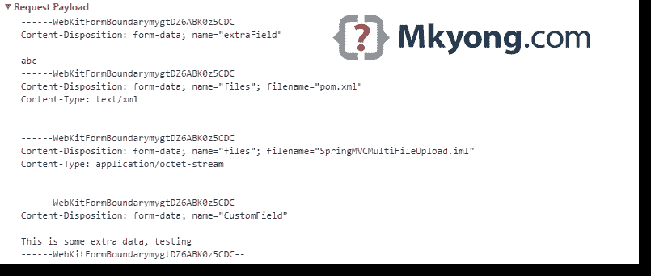

# Spring Boot 文件上传示例–Ajax 和 REST

> 原文：<http://web.archive.org/web/20230101150211/https://mkyong.com/spring-boot/spring-boot-file-upload-example-ajax-and-rest/>

这篇文章展示了如何使用 Ajax 请求在 Spring Boot web 应用程序(REST 结构)中上传文件。

本文中使用的工具:

1.  Spring Boot 1.4.3 版本
2.  弹簧 4.3.5 .释放
3.  百里香叶
4.  jQuery (webjars)
5.  专家
6.  嵌入式 Tomcat 8.5.6
7.  谷歌 Chrome 浏览器(网络检查)

## 1.项目结构

一个标准的 Maven 项目结构。

 <ins class="adsbygoogle" style="display:block; text-align:center;" data-ad-format="fluid" data-ad-layout="in-article" data-ad-client="ca-pub-2836379775501347" data-ad-slot="6894224149">## 2.项目依赖性

为 HTML 格式的 Ajax 请求声明一个额外的`jQuery` webjar 依赖项。

pom.xml

```java
 <project 
         xmlns:xsi="http://www.w3.org/2001/XMLSchema-instance"
         xsi:schemaLocation="http://maven.apache.org/POM/4.0.0
         http://maven.apache.org/maven-v4_0_0.xsd">
    <modelVersion>4.0.0</modelVersion>

    <groupId>com.mkyong</groupId>
    <artifactId>spring-boot-file-upload</artifactId>
    <packaging>jar</packaging>
    <version>1.0</version>

    <parent>
        <groupId>org.springframework.boot</groupId>
        <artifactId>spring-boot-starter-parent</artifactId>
        <version>1.4.3.RELEASE</version>
    </parent>

    <properties>
        <java.version>1.8</java.version>
    </properties>

    <dependencies>

        <dependency>
            <groupId>org.springframework.boot</groupId>
            <artifactId>spring-boot-starter-thymeleaf</artifactId>
        </dependency>

        <!-- hot swapping, disable cache for template, enable live reload -->
        <dependency>
            <groupId>org.springframework.boot</groupId>
            <artifactId>spring-boot-devtools</artifactId>
            <optional>true</optional>
        </dependency>

        <dependency>
            <groupId>org.webjars</groupId>
            <artifactId>jquery</artifactId>
            <version>2.2.4</version>
        </dependency>

    </dependencies>

    <build>
        <plugins>
            <!-- Package as an executable jar/war -->
            <plugin>
                <groupId>org.springframework.boot</groupId>
                <artifactId>spring-boot-maven-plugin</artifactId>
            </plugin>
        </plugins>
    </build>

</project> 
```

 <ins class="adsbygoogle" style="display:block" data-ad-client="ca-pub-2836379775501347" data-ad-slot="8821506761" data-ad-format="auto" data-ad-region="mkyongregion">## 3.文件上传

为了支持 Ajax 请求和响应，最简单的解决方案是返回一个`ResponseEntity`。

3.1 以下示例演示了上传文件的三种可能方式:

1.  单个文件上传-`MultipartFile`
2.  多文件上传-`MultipartFile[]`
3.  将地图文件上传到模型–`@ModelAttribute`

RestUploadController.java

```java
 package com.mkyong.controller;

import com.mkyong.model.UploadModel;
import org.slf4j.Logger;
import org.slf4j.LoggerFactory;
import org.springframework.http.HttpHeaders;
import org.springframework.http.HttpStatus;
import org.springframework.http.ResponseEntity;
import org.springframework.util.StringUtils;
import org.springframework.web.bind.annotation.ModelAttribute;
import org.springframework.web.bind.annotation.PostMapping;
import org.springframework.web.bind.annotation.RequestParam;
import org.springframework.web.bind.annotation.RestController;
import org.springframework.web.multipart.MultipartFile;

import java.io.IOException;
import java.nio.file.Files;
import java.nio.file.Path;
import java.nio.file.Paths;
import java.util.Arrays;
import java.util.List;
import java.util.stream.Collectors;

@RestController
public class RestUploadController {

    private final Logger logger = LoggerFactory.getLogger(RestUploadController.class);

    //Save the uploaded file to this folder
    private static String UPLOADED_FOLDER = "F://temp//";

    // 3.1.1 Single file upload
    @PostMapping("/api/upload")
    // If not @RestController, uncomment this
    //@ResponseBody
    public ResponseEntity<?> uploadFile(
            @RequestParam("file") MultipartFile uploadfile) {

        logger.debug("Single file upload!");

        if (uploadfile.isEmpty()) {
            return new ResponseEntity("please select a file!", HttpStatus.OK);
        }

        try {

            saveUploadedFiles(Arrays.asList(uploadfile));

        } catch (IOException e) {
            return new ResponseEntity<>(HttpStatus.BAD_REQUEST);
        }

        return new ResponseEntity("Successfully uploaded - " +
                uploadfile.getOriginalFilename(), new HttpHeaders(), HttpStatus.OK);

    }

    // 3.1.2 Multiple file upload
    @PostMapping("/api/upload/multi")
    public ResponseEntity<?> uploadFileMulti(
            @RequestParam("extraField") String extraField,
            @RequestParam("files") MultipartFile[] uploadfiles) {

        logger.debug("Multiple file upload!");

        // Get file name
        String uploadedFileName = Arrays.stream(uploadfiles).map(x -> x.getOriginalFilename())
                .filter(x -> !StringUtils.isEmpty(x)).collect(Collectors.joining(" , "));

        if (StringUtils.isEmpty(uploadedFileName)) {
            return new ResponseEntity("please select a file!", HttpStatus.OK);
        }

        try {

            saveUploadedFiles(Arrays.asList(uploadfiles));

        } catch (IOException e) {
            return new ResponseEntity<>(HttpStatus.BAD_REQUEST);
        }

        return new ResponseEntity("Successfully uploaded - "
                + uploadedFileName, HttpStatus.OK);

    }

    // 3.1.3 maps html form to a Model
    @PostMapping("/api/upload/multi/model")
    public ResponseEntity<?> multiUploadFileModel(@ModelAttribute UploadModel model) {

        logger.debug("Multiple file upload! With UploadModel");

        try {

            saveUploadedFiles(Arrays.asList(model.getFiles()));

        } catch (IOException e) {
            return new ResponseEntity<>(HttpStatus.BAD_REQUEST);
        }

        return new ResponseEntity("Successfully uploaded!", HttpStatus.OK);

    }

    //save file
    private void saveUploadedFiles(List<MultipartFile> files) throws IOException {

        for (MultipartFile file : files) {

            if (file.isEmpty()) {
                continue; //next pls
            }

            byte[] bytes = file.getBytes();
            Path path = Paths.get(UPLOADED_FOLDER + file.getOriginalFilename());
            Files.write(path, bytes);

        }

    }
} 
```

3.2 上述示例 3.1.3 的简单模型—`@ModelAttribute`

UploadModel.java

```java
 package com.mkyong.model;

import org.springframework.web.multipart.MultipartFile;

public class UploadModel {

    private String extraField;

    private MultipartFile[] files;

    //getters and setters
} 
```

## 4.风景

用于多文件上传的 HTML 表单。

upload.html

```java
 <!DOCTYPE html>
<html xmlns:th="http://www.thymeleaf.org">
<body>

<h1>Spring Boot - Multiple file upload example - AJAX</h1>

<form method="POST" enctype="multipart/form-data" id="fileUploadForm">
    <input type="text" name="extraField"/><br/><br/>
    <input type="file" name="files"/><br/><br/>
    <input type="file" name="files"/><br/><br/>
    <input type="submit" value="Submit" id="btnSubmit"/>
</form>

<h1>Ajax Post Result</h1>
<pre>
    <span id="result"></span>
</pre>

<script type="text/javascript"
        src="webjars/jquery/2.2.4/jquery.min.js"></script>

<script type="text/javascript" src="js/main.js"></script>

</body>
</html> 
```

## 5.jQuery–Ajax 请求

jQuery 通过表单`#id`获取表单，并通过 Ajax 请求发送多部分表单数据。

resources/static/js/main.js

```java
 $(document).ready(function () {

    $("#btnSubmit").click(function (event) {

        //stop submit the form, we will post it manually.
        event.preventDefault();

        fire_ajax_submit();

    });

});

function fire_ajax_submit() {

    // Get form
    var form = $('#fileUploadForm')[0];

    var data = new FormData(form);

    data.append("CustomField", "This is some extra data, testing");

    $("#btnSubmit").prop("disabled", true);

    $.ajax({
        type: "POST",
        enctype: 'multipart/form-data',
        url: "/api/upload/multi",
        data: data,
        //http://api.jquery.com/jQuery.ajax/
        //https://developer.mozilla.org/en-US/docs/Web/API/FormData/Using_FormData_Objects
        processData: false, //prevent jQuery from automatically transforming the data into a query string
        contentType: false,
        cache: false,
        timeout: 600000,
        success: function (data) {

            $("#result").text(data);
            console.log("SUCCESS : ", data);
            $("#btnSubmit").prop("disabled", false);

        },
        error: function (e) {

            $("#result").text(e.responseText);
            console.log("ERROR : ", e);
            $("#btnSubmit").prop("disabled", false);

        }
    });

} 
```

## 6.异常处理程序

为了处理来自 Ajax 请求的异常，只需扩展`ResponseEntityExceptionHandler`并返回一个`ResponseEntity`。

RestGlobalExceptionHandler.java

```java
 package com.mkyong.exception;

import org.springframework.http.HttpStatus;
import org.springframework.http.ResponseEntity;
import org.springframework.web.bind.annotation.ControllerAdvice;
import org.springframework.web.bind.annotation.ExceptionHandler;
import org.springframework.web.bind.annotation.ResponseBody;
import org.springframework.web.multipart.MultipartException;
import org.springframework.web.servlet.mvc.method.annotation.ResponseEntityExceptionHandler;

import javax.servlet.http.HttpServletRequest;

//http://docs.spring.io/spring-boot/docs/current/reference/htmlsingle/#boot-features-error-handling
@ControllerAdvice
public class RestGlobalExceptionHandler extends ResponseEntityExceptionHandler {

    // Catch file size exceeded exception!
    @ExceptionHandler(MultipartException.class)
    @ResponseBody
    ResponseEntity<?> handleControllerException(HttpServletRequest request, Throwable ex) {

        HttpStatus status = getStatus(request);
        return new ResponseEntity(ex.getMessage(), status);

        // example
        //return new ResponseEntity("success", responseHeaders, HttpStatus.OK);

    }

    private HttpStatus getStatus(HttpServletRequest request) {
        Integer statusCode = (Integer) request.getAttribute("javax.servlet.error.status_code");
        if (statusCode == null) {
            return HttpStatus.INTERNAL_SERVER_ERROR;
        }
        return HttpStatus.valueOf(statusCode);
    }

} 
```

## 7.演示

用默认的嵌入式 Tomcat `mvn spring-boot:run`启动 Spring Boot。

7.1 访问 *http://localhost:8080/* ，选择几个文件，点击提交，启动 ajax 请求。


7.2 Google Chrome，在“网络检查”中查看请求和响应


7.3 谷歌浏览器，“请求有效载荷”



## 8.卷曲测试

使用`cURL`命令进行更多测试。

8.1 测试单个文件上传。

Terminal

```java
 $ curl -F file=@"f:\\data.txt" http://localhost:8080/api/upload/
Successfully uploaded - data.txt 
```

8.2 测试多文件上传。

Terminal

```java
 $ curl -F extraField="abc" -F files=@"f://data.txt" -F files=@"f://data2.txt"  http://localhost:8080/api/upload/multi/
Successfully uploaded - data.txt , data2.txt 
```

8.3 测试多个文件上传，映射到模型。

Terminal

```java
 $ curl -F extraField="abc" -F files=@"f://data.txt" -F files=@"f://data2.txt"  http://localhost:8080/api/upload/multi/model
Successfully uploaded! 
```

8.4 测试一个大的电影文件(100MB)，会显示以下错误信息。

Terminal

```java
 $ curl -F file=@"F://movies//300//Sample.mkv"  http://localhost:8080/api/upload/
Attachment size exceeds the allowable limit! (10MB) 
```

## 9.cURL 测试+自定义错误对象

9.1 创建一个对象来存储错误详细信息。

CustomError.java

```java
 package com.mkyong.exception;

public class CustomError {

    String errCode;
    String errDesc;

    public CustomError(String errCode, String errDesc) {
        this.errCode = errCode;
        this.errDesc = errDesc;
    }

    //getters and setters
} 
```

9.2 更新全局异常处理程序以支持`CustomError`对象。

RestGlobalExceptionHandler.java

```java
 package com.mkyong.exception;

import org.springframework.http.HttpStatus;
import org.springframework.http.ResponseEntity;
import org.springframework.web.bind.annotation.ControllerAdvice;
import org.springframework.web.bind.annotation.ExceptionHandler;
import org.springframework.web.bind.annotation.ResponseBody;
import org.springframework.web.multipart.MultipartException;
import org.springframework.web.servlet.mvc.method.annotation.ResponseEntityExceptionHandler;

import javax.servlet.http.HttpServletRequest;

@ControllerAdvice
public class RestGlobalExceptionHandler extends ResponseEntityExceptionHandler {

    @ExceptionHandler(MultipartException.class)
    @ResponseBody
    ResponseEntity<?> handleControllerException(HttpServletRequest request, Throwable ex) {

        HttpStatus status = getStatus(request);

        return new ResponseEntity(new CustomError("0x000123", 
                "Attachment size exceeds the allowable limit! (10MB)"), status);

        //return new ResponseEntity("Attachment size exceeds the allowable limit! (10MB)", status);

    }

    private HttpStatus getStatus(HttpServletRequest request) {
        Integer statusCode = (Integer) request.getAttribute("javax.servlet.error.status_code");
        if (statusCode == null) {
            return HttpStatus.INTERNAL_SERVER_ERROR;
        }
        return HttpStatus.valueOf(statusCode);
    }

} 
```

9.3 cURL 再次上传大文件。

Terminal

```java
 $ curl -F file=@"F://movies//300//Sample.mkv"  http://localhost:8080/api/upload/

{"errCode":"0x000123","errDesc":"Attachment size exceeds the allowable limit! (10MB)"} 
```

完成了。欢迎反馈。

## 10.下载源代码

Download – [spring-boot-file-upload-ajax-rest.zip](http://web.archive.org/web/20190223022834/http://www.mkyong.com/wp-content/uploads/2017/01/spring-boot-file-upload-ajax-rest.zip) (11 KB)

## 参考

1.  [Spring Boot–错误处理](http://web.archive.org/web/20190223022834/http://docs.spring.io/spring-boot/docs/current/reference/htmlsingle/#boot-features-error-handling)
2.  [Spring Boot 文件上传示例](http://web.archive.org/web/20190223022834/http://www.mkyong.com/spring-boot/spring-boot-file-upload-example/)
3.  [Spring MVC 文件上传示例](http://web.archive.org/web/20190223022834/http://www.mkyong.com/spring-mvc/spring-mvc-file-upload-example/)
4.  [Spring Boot Hello World 示例–百里香叶](http://web.archive.org/web/20190223022834/http://www.mkyong.com/spring-boot/spring-boot-hello-world-example-thymeleaf/)
5.  [维基百科–卷曲](http://web.archive.org/web/20190223022834/https://en.wikipedia.org/wiki/CURL)
6.  [jQuery.ajax()](http://web.archive.org/web/20190223022834/http://api.jquery.com/jQuery.ajax/)
7.  [MDN–使用表单数据对象](http://web.archive.org/web/20190223022834/https://developer.mozilla.org/en-US/docs/Web/API/FormData/Using_FormData_Objects)

[ajax](http://web.archive.org/web/20190223022834/http://www.mkyong.com/tag/ajax/) [curl](http://web.archive.org/web/20190223022834/http://www.mkyong.com/tag/curl/) [file upload](http://web.archive.org/web/20190223022834/http://www.mkyong.com/tag/file-upload/) [jquery](http://web.archive.org/web/20190223022834/http://www.mkyong.com/tag/jquery/) [multipart](http://web.archive.org/web/20190223022834/http://www.mkyong.com/tag/multipart/) [rest](http://web.archive.org/web/20190223022834/http://www.mkyong.com/tag/rest/) [spring boot](http://web.archive.org/web/20190223022834/http://www.mkyong.com/tag/spring-boot/)


