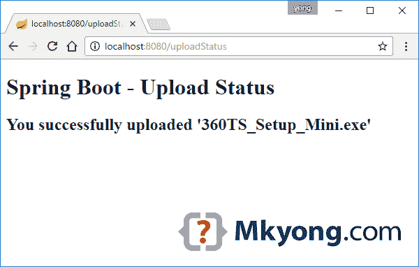
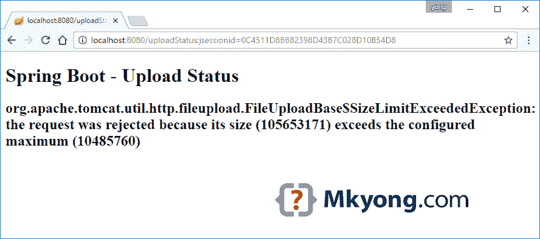

# Spring Boot 文件上传示例

> 原文：<http://web.archive.org/web/20230101150211/https://mkyong.com/spring-boot/spring-boot-file-upload-example/>

这篇文章向你展示了如何在 Spring Boot 网络应用程序中上传文件。

使用的工具:

1.  Spring Boot 1.4.3 版本
2.  弹簧 4.3.5 .释放
3.  百里香叶
4.  专家
5.  嵌入式 Tomcat 8.5.6

## 1.项目结构

标准项目结构。


## 2.项目依赖性

春季启动依赖，不需要额外的文件上传库。

pom.xml

```java
 <project 
         xmlns:xsi="http://www.w3.org/2001/XMLSchema-instance"
         xsi:schemaLocation="http://maven.apache.org/POM/4.0.0
         http://maven.apache.org/maven-v4_0_0.xsd">
         <modelVersion>4.0.0</modelVersion>

    <groupId>com.mkyong</groupId>
    <artifactId>spring-boot-file-upload</artifactId>
    <packaging>jar</packaging>
    <version>1.0</version>

    <parent>
        <groupId>org.springframework.boot</groupId>
        <artifactId>spring-boot-starter-parent</artifactId>
        <version>1.4.3.RELEASE</version>
    </parent>

    <properties>
        <java.version>1.8</java.version>
    </properties>

    <dependencies>

        <dependency>
            <groupId>org.springframework.boot</groupId>
            <artifactId>spring-boot-starter-thymeleaf</artifactId>
        </dependency>

        <!-- hot swapping, disable cache for template, enable live reload -->
        <dependency>
            <groupId>org.springframework.boot</groupId>
            <artifactId>spring-boot-devtools</artifactId>
            <optional>true</optional>
        </dependency>

    </dependencies>

    <build>
        <plugins>
            <!-- Package as an executable jar/war -->
            <plugin>
                <groupId>org.springframework.boot</groupId>
                <artifactId>spring-boot-maven-plugin</artifactId>
            </plugin>
        </plugins>
    </build>

</project> 
```

## 3.文件上传示例

春季开机文件上传，零配置。

3.1 在控制器中，将上传的文件映射到`MultipartFile`

UploadController.java

```java
 package com.mkyong.controller;

import org.springframework.stereotype.Controller;
import org.springframework.web.bind.annotation.GetMapping;
import org.springframework.web.bind.annotation.PostMapping;
import org.springframework.web.bind.annotation.RequestParam;
import org.springframework.web.multipart.MultipartFile;
import org.springframework.web.servlet.mvc.support.RedirectAttributes;

import java.io.IOException;
import java.nio.file.Files;
import java.nio.file.Path;
import java.nio.file.Paths;

@Controller
public class UploadController {

    //Save the uploaded file to this folder
    private static String UPLOADED_FOLDER = "F://temp//";

    @GetMapping("/")
    public String index() {
        return "upload";
    }

    @PostMapping("/upload") // //new annotation since 4.3
    public String singleFileUpload(@RequestParam("file") MultipartFile file,
                                   RedirectAttributes redirectAttributes) {

        if (file.isEmpty()) {
            redirectAttributes.addFlashAttribute("message", "Please select a file to upload");
            return "redirect:uploadStatus";
        }

        try {

            // Get the file and save it somewhere
            byte[] bytes = file.getBytes();
            Path path = Paths.get(UPLOADED_FOLDER + file.getOriginalFilename());
            Files.write(path, bytes);

            redirectAttributes.addFlashAttribute("message",
                    "You successfully uploaded '" + file.getOriginalFilename() + "'");

        } catch (IOException e) {
            e.printStackTrace();
        }

        return "redirect:/uploadStatus";
    }

    @GetMapping("/uploadStatus")
    public String uploadStatus() {
        return "uploadStatus";
    }

} 
```

3.2 在百里香里，只是一些普通的 HTML 文件标签。

upload.jsp

```java
 <!DOCTYPE html>
<html xmlns:th="http://www.thymeleaf.org">
<body>

<h1>Spring Boot file upload example</h1>

<form method="POST" action="/upload" enctype="multipart/form-data">
    <input type="file" name="file" /><br/><br/>
    <input type="submit" value="Submit" />
</form>

</body>
</html> 
```

3.3 上传状态的另一个页面

uploadStatus.jsp

```java
 <!DOCTYPE html>
<html lang="en" xmlns:th="http://www.thymeleaf.org">
<body>

<h1>Spring Boot - Upload Status</h1>

<div th:if="${message}">
    <h2 th:text="${message}"/>
</div>

</body>
</html> 
```

## 4.超过最大上传大小

为了处理超过最大上传大小的异常，声明一个`@ControllerAdvice`并捕捉`MultipartException`

GlobalExceptionHandler.java

```java
 package com.mkyong.controller;

import org.springframework.web.bind.annotation.ControllerAdvice;
import org.springframework.web.bind.annotation.ExceptionHandler;
import org.springframework.web.multipart.MultipartException;
import org.springframework.web.servlet.mvc.support.RedirectAttributes;

@ControllerAdvice
public class GlobalExceptionHandler {

    //https://jira.spring.io/browse/SPR-14651
    //Spring 4.3.5 supports RedirectAttributes
    @ExceptionHandler(MultipartException.class)
    public String handleError1(MultipartException e, RedirectAttributes redirectAttributes) {

        redirectAttributes.addFlashAttribute("message", e.getCause().getMessage());
        return "redirect:/uploadStatus";

    }

    /* Spring < 4.3.5
	@ExceptionHandler(MultipartException.class)
    public String handleError2(MultipartException e) {

        return "redirect:/errorPage";

    }*/

} 
```

## 5.Tomcat 连接重置

如果你部署到 Tomcat，配置`maxSwallowSize`来避免这个 [Tomcat 连接重置问题](http://web.archive.org/web/20221023054402/http://www.mkyong.com/spring/spring-file-upload-and-connection-reset-issue/)。对于嵌入式 Tomcat，声明如下的`TomcatEmbeddedServletContainerFactory`:

SpringBootWebApplication.java

```java
 package com.mkyong;

import org.apache.coyote.http11.AbstractHttp11Protocol;
import org.springframework.boot.SpringApplication;
import org.springframework.boot.autoconfigure.SpringBootApplication;
import org.springframework.boot.context.embedded.tomcat.TomcatConnectorCustomizer;
import org.springframework.boot.context.embedded.tomcat.TomcatEmbeddedServletContainerFactory;
import org.springframework.context.annotation.Bean;

@SpringBootApplication
public class SpringBootWebApplication {

    private int maxUploadSizeInMb = 10 * 1024 * 1024; // 10 MB

    public static void main(String[] args) throws Exception {
        SpringApplication.run(SpringBootWebApplication.class, args);
    }

    //Tomcat large file upload connection reset
    //http://www.mkyong.com/spring/spring-file-upload-and-connection-reset-issue/
    @Bean
    public TomcatEmbeddedServletContainerFactory tomcatEmbedded() {

        TomcatEmbeddedServletContainerFactory tomcat = new TomcatEmbeddedServletContainerFactory();

        tomcat.addConnectorCustomizers((TomcatConnectorCustomizer) connector -> {
            if ((connector.getProtocolHandler() instanceof AbstractHttp11Protocol<?>)) {
                //-1 means unlimited
                ((AbstractHttp11Protocol<?>) connector.getProtocolHandler()).setMaxSwallowSize(-1);
            }
        });

        return tomcat;

    }

} 
```

## 6.多部分文件大小

默认情况下，Spring Boot 最大文件上传大小为 1MB，您可以通过以下应用程序属性配置该值:

application.properties

```java
 #http://docs.spring.io/spring-boot/docs/current/reference/htmlsingle/#common-application-properties
#search multipart
spring.http.multipart.max-file-size=10MB
spring.http.multipart.max-request-size=10MB 
```

## 7.演示

用默认的嵌入式 Tomcat `mvn spring-boot:run`启动 Spring Boot。

Terminal

```java
 $ mvn spring-boot:run
 .   ____          _            __ _ _
 /\\ / ___'_ __ _ _(_)_ __  __ _ \ \ \ \
( ( )\___ | '_ | '_| | '_ \/ _` | \ \ \ \
 \\/  ___)| |_)| | | | | || (_| |  ) ) ) )
  '  |____| .__|_| |_|_| |_\__, | / / / /
 =========|_|==============|___/=/_/_/_/
 :: Spring Boot ::        (v1.4.3.RELEASE)

2017-01-21 07:48:53 INFO  com.mkyong.SpringBootWebApplication - Starting SpringBootWebApplication on MKYONG-WIN10 with PID 2384 (E:\spring-boot-file-upload\target\classes started by mkyong in E:\spring-boot-file-upload)
2017-01-21 07:48:53 DEBUG com.mkyong.SpringBootWebApplication - Running with Spring Boot v1.4.3.RELEASE, Spring v4.3.5.RELEASE
2017-01-21 07:48:53 INFO  com.mkyong.SpringBootWebApplication - No active profile set, falling back to default profiles: default
2017-01-21 07:48:55 INFO  com.mkyong.SpringBootWebApplication - Started SpringBootWebApplication in 2.54 seconds (JVM running for 2.924) 
```

7.1 访问 *http://localhost:8080/*


7.2 选择一个文件并上传。



7.3 选择一个大于 10mb 的文件，您将访问此页面。



## 8.下载源代码

Download – [spring-boot-file-upload-example.zip](http://web.archive.org/web/20221023054402/http://www.mkyong.com/wp-content/uploads/2017/01/spring-boot-file-upload-example.zip) (7 KB)

## 参考

1.  [Spring Boot 常用应用属性](http://web.archive.org/web/20221023054402/https://docs.spring.io/spring-boot/docs/current/reference/htmlsingle/#common-application-properties)
2.  [Spring MVC 文件上传示例](http://web.archive.org/web/20221023054402/http://www.mkyong.com/spring-mvc/spring-mvc-file-upload-example/)
3.  [Spring @ExceptionHandler 和 RedirectAttributes](http://web.archive.org/web/20221023054402/http://www.mkyong.com/spring/spring-exceptionhandler-and-redirectattributes/)
4.  [Spring Boot Hello World 示例–百里香叶](http://web.archive.org/web/20221023054402/http://www.mkyong.com/spring-boot/spring-boot-hello-world-example-thymeleaf/)

<input type="hidden" id="mkyong-current-postId" value="14379">