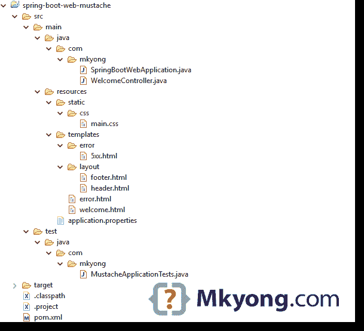
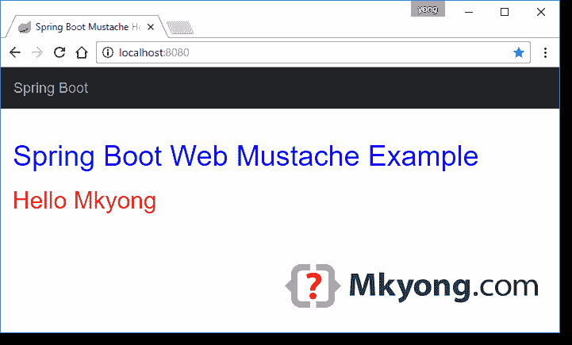

# Spring Boot Hello World 示例-小胡子

> 原文：<http://web.archive.org/web/20230101150211/https://mkyong.com/spring-boot/spring-boot-hello-world-example-mustache/>


一个 [Spring Boot](http://web.archive.org/web/20220909002550/https://projects.spring.io/spring-boot/) 的 web 应用实例，使用`embedded Tomcat + Mustache template engine`，并打包成一个可执行的`JAR`文件。

使用的技术:

1.  Spring Boot 1.5.2 .版本
2.  弹簧 4.3.7 .释放
3.  jmustache 1.13
4.  百里香叶
5.  Tomcat Embed 8.5.11
6.  maven3
7.  Java 8

**Note**
Spring Boot uses [jmustache](http://web.archive.org/web/20220909002550/https://github.com/samskivert/jmustache) to integrate [Mustache](http://web.archive.org/web/20220909002550/https://mustache.github.io/) as template engine.

## 1.项目目录



## 2.项目相关性

声明`spring-boot-starter-mustache`，它将获得开发`Spring + Mustache` web 应用程序所需的任何东西。

pom.xml

```java
 <?xml version="1.0" encoding="UTF-8"?>
<project  
	xmlns:xsi="http://www.w3.org/2001/XMLSchema-instance"
	xsi:schemaLocation="http://maven.apache.org/POM/4.0.0 
	http://maven.apache.org/xsd/maven-4.0.0.xsd">
	<modelVersion>4.0.0</modelVersion>

	<artifactId>spring-boot-web-mustache</artifactId>
	<packaging>jar</packaging>
	<name>Spring Boot Web Mustache Example</name>
	<description>Spring Boot Web Mustache Example</description>
	<url>https://www.mkyong.com</url>
	<version>1.0</version>

	<parent>
		<groupId>org.springframework.boot</groupId>
		<artifactId>spring-boot-starter-parent</artifactId>
		<version>1.5.2.RELEASE</version>
	</parent>

	<properties>
		<java.version>1.8</java.version>
	</properties>

	<dependencies>

		<dependency>
			<groupId>org.springframework.boot</groupId>
			<artifactId>spring-boot-starter-mustache</artifactId>
		</dependency>

		<dependency>
			<groupId>org.springframework.boot</groupId>
			<artifactId>spring-boot-starter-test</artifactId>
			<scope>test</scope>
		</dependency>

		<!-- hot swapping, live reload -->
		<dependency>
			<groupId>org.springframework.boot</groupId>
			<artifactId>spring-boot-devtools</artifactId>
			<optional>true</optional>
		</dependency>

		<!-- Optional, for bootstrap -->
		<dependency>
			<groupId>org.webjars</groupId>
			<artifactId>bootstrap</artifactId>
			<version>3.3.7</version>
		</dependency>

	</dependencies>

	<build>
		<plugins>
			<!-- Package as an executable jar/war -->
			<plugin>
				<groupId>org.springframework.boot</groupId>
				<artifactId>spring-boot-maven-plugin</artifactId>
			</plugin>
		</plugins>
	</build>
</project> 
```

显示项目相关性:

```java
 $ mvn dependency:tree

[INFO] Scanning for projects...
[INFO]
[INFO] ------------------------------------------------------------------------
[INFO] Building Spring Boot Web Mustache Example 1.0
[INFO] ------------------------------------------------------------------------
[INFO]
[INFO] --- maven-dependency-plugin:2.10:tree (default-cli) @ spring-boot-web-mustache ---
                               [INFO] org.springframework.boot:spring-boot-web-mustache:jar:1.0
[INFO] +- org.springframework.boot:spring-boot-starter-mustache:jar:1.5.2.RELEASE:compile
[INFO] |  +- org.springframework.boot:spring-boot-starter:jar:1.5.2.RELEASE:compile
[INFO] |  |  +- org.springframework.boot:spring-boot-starter-logging:jar:1.5.2.RELEASE:compile
[INFO] |  |  |  +- ch.qos.logback:logback-classic:jar:1.1.11:compile
[INFO] |  |  |  |  \- ch.qos.logback:logback-core:jar:1.1.11:compile
[INFO] |  |  |  +- org.slf4j:jcl-over-slf4j:jar:1.7.24:compile
[INFO] |  |  |  +- org.slf4j:jul-to-slf4j:jar:1.7.24:compile
[INFO] |  |  |  \- org.slf4j:log4j-over-slf4j:jar:1.7.24:compile
[INFO] |  |  \- org.yaml:snakeyaml:jar:1.17:runtime
[INFO] |  +- org.springframework.boot:spring-boot-starter-web:jar:1.5.2.RELEASE:compile
[INFO] |  |  +- org.springframework.boot:spring-boot-starter-tomcat:jar:1.5.2.RELEASE:compile
[INFO] |  |  |  +- org.apache.tomcat.embed:tomcat-embed-core:jar:8.5.11:compile
[INFO] |  |  |  +- org.apache.tomcat.embed:tomcat-embed-el:jar:8.5.11:compile
[INFO] |  |  |  \- org.apache.tomcat.embed:tomcat-embed-websocket:jar:8.5.11:compile
[INFO] |  |  +- org.hibernate:hibernate-validator:jar:5.3.4.Final:compile
[INFO] |  |  |  +- javax.validation:validation-api:jar:1.1.0.Final:compile
[INFO] |  |  |  +- org.jboss.logging:jboss-logging:jar:3.3.0.Final:compile
[INFO] |  |  |  \- com.fasterxml:classmate:jar:1.3.3:compile
[INFO] |  |  +- com.fasterxml.jackson.core:jackson-databind:jar:2.8.7:compile
[INFO] |  |  |  +- com.fasterxml.jackson.core:jackson-annotations:jar:2.8.0:compile
[INFO] |  |  |  \- com.fasterxml.jackson.core:jackson-core:jar:2.8.7:compile
[INFO] |  |  +- org.springframework:spring-web:jar:4.3.7.RELEASE:compile
[INFO] |  |  |  +- org.springframework:spring-aop:jar:4.3.7.RELEASE:compile
[INFO] |  |  |  \- org.springframework:spring-beans:jar:4.3.7.RELEASE:compile
[INFO] |  |  \- org.springframework:spring-webmvc:jar:4.3.7.RELEASE:compile
[INFO] |  |     \- org.springframework:spring-expression:jar:4.3.7.RELEASE:compile
[INFO] |  \- com.samskivert:jmustache:jar:1.13:compile
[INFO] +- org.springframework.boot:spring-boot-starter-test:jar:1.5.2.RELEASE:test
[INFO] |  +- org.springframework.boot:spring-boot-test:jar:1.5.2.RELEASE:test
[INFO] |  +- org.springframework.boot:spring-boot-test-autoconfigure:jar:1.5.2.RELEASE:test
[INFO] |  +- com.jayway.jsonpath:json-path:jar:2.2.0:test
[INFO] |  |  +- net.minidev:json-smart:jar:2.2.1:test
[INFO] |  |  |  \- net.minidev:accessors-smart:jar:1.1:test
[INFO] |  |  |     \- org.ow2.asm:asm:jar:5.0.3:test
[INFO] |  |  \- org.slf4j:slf4j-api:jar:1.7.24:compile
[INFO] |  +- junit:junit:jar:4.12:test
[INFO] |  +- org.assertj:assertj-core:jar:2.6.0:test
[INFO] |  +- org.mockito:mockito-core:jar:1.10.19:test
[INFO] |  |  \- org.objenesis:objenesis:jar:2.1:test
[INFO] |  +- org.hamcrest:hamcrest-core:jar:1.3:test
[INFO] |  +- org.hamcrest:hamcrest-library:jar:1.3:test
[INFO] |  +- org.skyscreamer:jsonassert:jar:1.4.0:test
[INFO] |  |  \- com.vaadin.external.google:android-json:jar:0.0.20131108.vaadin1:test
[INFO] |  +- org.springframework:spring-core:jar:4.3.7.RELEASE:compile
[INFO] |  \- org.springframework:spring-test:jar:4.3.7.RELEASE:test
[INFO] +- org.springframework.boot:spring-boot-devtools:jar:1.5.2.RELEASE:compile
[INFO] |  +- org.springframework.boot:spring-boot:jar:1.5.2.RELEASE:compile
[INFO] |  |  \- org.springframework:spring-context:jar:4.3.7.RELEASE:compile
[INFO] |  \- org.springframework.boot:spring-boot-autoconfigure:jar:1.5.2.RELEASE:compile
[INFO] \- org.webjars:bootstrap:jar:3.3.7:compile
[INFO]    \- org.webjars:jquery:jar:1.11.1:compile
[INFO] ------------------------------------------------------------------------
[INFO] BUILD SUCCESS
[INFO] ------------------------------------------------------------------------
[INFO] Total time: 1.796 s
[INFO] Finished at: 2017-04-19T11:46:09+08:00
[INFO] Final Memory: 22M/437M
[INFO] ------------------------------------------------------------------------ 
```

## 3.Spring Boot

3.1 创建一个`@SpringBootApplication`类。运行这个类来启动 Spring Boot web 应用程序。

SpringBootWebApplication.java

```java
 package com.mkyong;

import org.springframework.boot.SpringApplication;
import org.springframework.boot.autoconfigure.SpringBootApplication;

@SpringBootApplication
public class SpringBootWebApplication {

	public static void main(String[] args) throws Exception {
		SpringApplication.run(SpringBootWebApplication.class, args);
	}

} 
```

3.2 一个简单的控制器类。

WelcomeController.java

```java
 package com.mkyong;

import java.util.Map;

import org.springframework.beans.factory.annotation.Value;
import org.springframework.stereotype.Controller;
import org.springframework.web.bind.annotation.RequestMapping;

@Controller
public class WelcomeController {

	// inject via application.properties
	@Value("${app.welcome.message}")
	private String MESSAGE = "";

	@Value("${app.welcome.title}")
	private String TITLE = "";

	@RequestMapping("/")
	public String welcome(Map<String, Object> model) {
		model.put("title", TITLE);
		model.put("message", MESSAGE);
		return "welcome";
	}

	// test 5xx errors
	@RequestMapping("/5xx")
	public String ServiceUnavailable() {
		throw new RuntimeException("ABC");
	}

} 
```

## 4.小胡子+资源+静态文件

4.1 对于小胡子模板文件，放入`src/main/resources/templates/`

src/main/resources/templates/layout/header.html

```java
 <!DOCTYPE HTML>
<head>

<title>{{title}}</title>
<meta http-equiv="Content-Type" content="text/html; charset=UTF-8" />

<link rel="stylesheet" type="text/css" href="webjars/bootstrap/3.3.7/css/bootstrap.min.css" />
<link rel="stylesheet" href="css/main.css" />

</head>
<!--  this is header --> 
```

src/main/resources/templates/layout/footer.html

```java
 <!--  this is footer -->
</html> 
```

src/main/resources/templates/welcome.html

```java
 {{>layout/header}}
<body>

	<nav class="navbar navbar-inverse">
		<div class="container">
			<div class="navbar-header">
				<a class="navbar-brand" href="#">Spring Boot</a>
			</div>
		</div>
	</nav>

	<div class="container">

		<div class="starter-template">
			<h1>Spring Boot Web Mustache Example</h1>
			<h2>
				{{message}}
			</h2>
		</div>

	</div>
	<!-- /.container -->

	<script type="text/javascript" src="webjars/bootstrap/3.3.7/js/bootstrap.min.js"></script>

</body>
{{>layout/footer}} 
```

4.2 对于 CSS 或 Javascript 等静态文件，放入`/src/main/resources/static/`

/src/main/resources/static/css/main.css

```java
 h1{
	color:#0000FF;
}

h2{
	color:#FF0000;
} 
```

4.3 对于错误模板。

**Note**
Read this [Spring Boot – Error Handling](http://web.archive.org/web/20220909002550/https://docs.spring.io/spring-boot/docs/current/reference/html/boot-features-developing-web-applications.html#boot-features-error-handling) to understand how the default error mapping page works.src/main/resources/templates/error.html

```java
 <!DOCTYPE html>

<html lang="en">

<body>
	Something went wrong: {{status}} {{error}}
</body>

</html> 
```

src/main/resources/templates/error/5xx.html

```java
 <!DOCTYPE html>

<html lang="en">

<body>
	I'm a 5xx
</body>

</html> 
```

4.4 对于属性文件，输入`/src/main/resources/`

/src/main/resources/application.properties

```java
 app.welcome.message: Hello Mkyong
app.welcome.title: Spring Boot Mustache Hello World Example 
```

**Note**
Read this [Spring Boot Serving static content](http://web.archive.org/web/20220909002550/https://docs.spring.io/spring-boot/docs/current/reference/htmlsingle/#boot-features-spring-mvc-static-content) to understand the resource mapping.

## 5.单元测试

5.1 单元测试示例测试上面的 Spring Boot web 应用程序。

MustacheApplicationTests

```java
 package com.mkyong;

import static org.assertj.core.api.Assertions.assertThat;

import java.util.Arrays;

import org.junit.Test;
import org.junit.runner.RunWith;
import org.springframework.beans.factory.annotation.Autowired;
import org.springframework.boot.test.context.SpringBootTest;
import org.springframework.boot.test.context.SpringBootTest.WebEnvironment;
import org.springframework.boot.test.web.client.TestRestTemplate;
import org.springframework.http.HttpEntity;
import org.springframework.http.HttpHeaders;
import org.springframework.http.HttpMethod;
import org.springframework.http.HttpStatus;
import org.springframework.http.MediaType;
import org.springframework.http.ResponseEntity;
import org.springframework.test.annotation.DirtiesContext;
import org.springframework.test.context.junit4.SpringRunner;

@RunWith(SpringRunner.class)
@SpringBootTest(webEnvironment = WebEnvironment.RANDOM_PORT)
@DirtiesContext
public class MustacheApplicationTests {

	@Autowired
	private TestRestTemplate restTemplate;

	@Test
	public void testMainPage() throws Exception {

		ResponseEntity<String> entity = this.restTemplate.getForEntity("/", String.class);
		assertThat(entity.getStatusCode()).isEqualTo(HttpStatus.OK);
		assertThat(entity.getBody()).contains("Hello Mkyong");

	}

	@Test
	public void test404Page() throws Exception {

		HttpHeaders headers = new HttpHeaders();
		headers.setAccept(Arrays.asList(MediaType.TEXT_HTML));
		HttpEntity<String> requestEntity = new HttpEntity<String>(headers);
		ResponseEntity<String> responseEntity = this.restTemplate.exchange("/uri-not-exist", HttpMethod.GET,
				requestEntity, String.class);
		assertThat(responseEntity.getStatusCode()).isEqualTo(HttpStatus.NOT_FOUND);
		assertThat(responseEntity.getBody()).contains("Something went wrong: 404 Not Found");

	}

	@Test
	public void test5xxPage() throws Exception {

		HttpHeaders headers = new HttpHeaders();
		headers.setAccept(Arrays.asList(MediaType.TEXT_HTML));
		HttpEntity<String> requestEntity = new HttpEntity<String>(headers);
		ResponseEntity<String> responseEntity = this.restTemplate.exchange("/5xx", HttpMethod.GET, requestEntity,
				String.class);
		assertThat(responseEntity.getStatusCode()).isEqualTo(HttpStatus.INTERNAL_SERVER_ERROR);
		assertThat(responseEntity.getBody()).contains("I'm a 5xx");

	}

} 
```

## 6.演示

Note
In IDE, run the `@SpringBootApplication` annotated class, and the entire Spring Boot application will be started.

6.1 启动 Spring Boot 网络应用程序。

Terminal

```java
 project$ mvn spring-boot:run

//...
  .   ____          _            __ _ _
 /\\ / ___'_ __ _ _(_)_ __  __ _ \ \ \ \
( ( )\___ | '_ | '_| | '_ \/ _` | \ \ \ \
 \\/  ___)| |_)| | | | | || (_| |  ) ) ) )
  '  |____| .__|_| |_|_| |_\__, | / / / /
 =========|_|==============|___/=/_/_/_/
 :: Spring Boot ::        (v1.5.2.RELEASE)

2017-04-19 12:17:38.014  INFO 6232 --- [  restartedMain] com.mkyong.SpringBootWebApplication      : Starting SpringBootWebApplication on MKYONG-WIN10 with PID 6232 (C:\spring-boot\spring-boot-examples\spring-boot-web-mustache\target\classes started by mkyong in C:\spring-boot\spring-boot-examples\spring-boot-web-mustache)
2017-04-19 12:17:38.015  INFO 6232 --- [  restartedMain] com.mkyong.SpringBootWebApplication      : No active profile set, falling back to default profiles: default
2017-04-19 12:17:38.074  INFO 6232 --- [  restartedMain] ationConfigEmbeddedWebApplicationContext : Refreshing org.springframework.boot.context.embedded.AnnotationConfigEmbeddedWebApplicationContext@af1619: startup date [Wed Apr 19 12:17:38 SGT 2017]; root of context hierarchy
2017-04-19 12:17:39.352  INFO 6232 --- [  restartedMain] s.b.c.e.t.TomcatEmbeddedServletContainer : Tomcat initialized with port(s): 8080 (http)
2017-04-19 12:17:39.370  INFO 6232 --- [  restartedMain] o.apache.catalina.core.StandardService   : Starting service Tomcat
2017-04-19 12:17:39.372  INFO 6232 --- [  restartedMain] org.apache.catalina.core.StandardEngine  : Starting Servlet Engine: Apache Tomcat/8.5.11
2017-04-19 12:17:39.481  INFO 6232 --- [ost-startStop-1] o.a.c.c.C.[Tomcat].[localhost].[/]       : Initializing Spring embedded WebApplicationContext
2017-04-19 12:17:39.481  INFO 6232 --- [ost-startStop-1] o.s.web.context.ContextLoader            : Root WebApplicationContext: initialization completed in 1410 ms
2017-04-19 12:17:39.649  INFO 6232 --- [ost-startStop-1] o.s.b.w.servlet.ServletRegistrationBean  : Mapping servlet: 'dispatcherServlet' to [/]
2017-04-19 12:17:39.658  INFO 6232 --- [ost-startStop-1] o.s.b.w.servlet.FilterRegistrationBean   : Mapping filter: 'characterEncodingFilter' to: [/*]
2017-04-19 12:17:39.659  INFO 6232 --- [ost-startStop-1] o.s.b.w.servlet.FilterRegistrationBean   : Mapping filter: 'hiddenHttpMethodFilter' to: [/*]
2017-04-19 12:17:39.659  INFO 6232 --- [ost-startStop-1] o.s.b.w.servlet.FilterRegistrationBean   : Mapping filter: 'httpPutFormContentFilter' to: [/*]
2017-04-19 12:17:39.660  INFO 6232 --- [ost-startStop-1] o.s.b.w.servlet.FilterRegistrationBean   : Mapping filter: 'requestContextFilter' to: [/*]
2017-04-19 12:17:39.938  INFO 6232 --- [  restartedMain] s.w.s.m.m.a.RequestMappingHandlerAdapter : Looking for @ControllerAdvice: org.springframework.boot.context.embedded.AnnotationConfigEmbeddedWebApplicationContext@af1619: startup date [Wed Apr 19 12:17:38 SGT 2017]; root of context hierarchy
2017-04-19 12:17:39.997  INFO 6232 --- [  restartedMain] s.w.s.m.m.a.RequestMappingHandlerMapping : Mapped "{[/]}" onto public java.lang.String com.mkyong.WelcomeController.welcome(java.util.Map<java.lang.String, java.lang.Object>)
2017-04-19 12:17:39.997  INFO 6232 --- [  restartedMain] s.w.s.m.m.a.RequestMappingHandlerMapping : Mapped "{[/5xx]}" onto public java.lang.String com.mkyong.WelcomeController.ServiceUnavailable()
2017-04-19 12:17:40.006  INFO 6232 --- [  restartedMain] s.w.s.m.m.a.RequestMappingHandlerMapping : Mapped "{[/error]}" onto public org.springframework.http.ResponseEntity<java.util.Map<java.lang.String, java.lang.Object>> org.springframework.boot.autoconfigure.web.BasicErrorController.error(javax.servlet.http.HttpServletRequest)
2017-04-19 12:17:40.006  INFO 6232 --- [  restartedMain] s.w.s.m.m.a.RequestMappingHandlerMapping : Mapped "{[/error],produces=[text/html]}" onto public org.springframework.web.servlet.ModelAndView org.springframework.boot.autoconfigure.web.BasicErrorController.errorHtml(javax.servlet.http.HttpServletRequest,javax.servlet.http.HttpServletResponse)
2017-04-19 12:17:40.041  INFO 6232 --- [  restartedMain] o.s.w.s.handler.SimpleUrlHandlerMapping  : Mapped URL path [/webjars/**] onto handler of type [class org.springframework.web.servlet.resource.ResourceHttpRequestHandler]
2017-04-19 12:17:40.041  INFO 6232 --- [  restartedMain] o.s.w.s.handler.SimpleUrlHandlerMapping  : Mapped URL path [/**] onto handler of type [class org.springframework.web.servlet.resource.ResourceHttpRequestHandler]
2017-04-19 12:17:40.090  INFO 6232 --- [  restartedMain] o.s.w.s.handler.SimpleUrlHandlerMapping  : Mapped URL path [/**/favicon.ico] onto handler of type [class org.springframework.web.servlet.resource.ResourceHttpRequestHandler]
2017-04-19 12:17:40.332  INFO 6232 --- [  restartedMain] o.s.b.d.a.OptionalLiveReloadServer       : LiveReload server is running on port 35729
2017-04-19 12:17:40.373  INFO 6232 --- [  restartedMain] o.s.j.e.a.AnnotationMBeanExporter        : Registering beans for JMX exposure on startup
2017-04-19 12:17:40.427  INFO 6232 --- [  restartedMain] s.b.c.e.t.TomcatEmbeddedServletContainer : Tomcat started on port(s): 8080 (http)
2017-04-19 12:17:40.435  INFO 6232 --- [  restartedMain] com.mkyong.SpringBootWebApplication      : Started SpringBootWebApplication in 2.737 seconds (JVM running for 3.124) 
```

6.2 访问 *http://localhost:8080*



6.2 访问*http://localhost:8080/uri-not-exist*


6.2 访问*http://localhost:8080/5xx*


## 6.构建可执行的 JAR

6.1 将项目打包，创建一个可执行的`JAR`文件。

```java
 project$ mvn clean package 
```

6.2 运行它，再次访问 *http://localhost:8080* 。

```java
 project$ java -jar target/spring-boot-web-mustache-1.0.jar 
```

## 下载源代码

Download it – [spring-boot-web-mustache.zip](http://web.archive.org/web/20220909002550/http://www.mkyong.com/wp-content/uploads/2017/04/spring-boot-web-mustache.zip) (11 KB)

## 参考

1.  [小胡子模板引擎](http://web.archive.org/web/20220909002550/https://mustache.github.io/)
2.  jmustache——Mustache 模板语言的 Java 实现
3.  [Spring Boot–错误处理](http://web.archive.org/web/20220909002550/https://docs.spring.io/spring-boot/docs/current/reference/html/boot-features-developing-web-applications.html#boot-features-error-handling)
4.  [Spring Boot–静态内容](http://web.archive.org/web/20220909002550/https://docs.spring.io/spring-boot/docs/current/reference/htmlsingle/#boot-features-spring-mvc-static-content)
5.  [部署 Spring Boot 应用](http://web.archive.org/web/20220909002550/https://spring.io/blog/2014/03/07/deploying-spring-boot-applications)
6.  [spring MVC–in ucci CSS 文件](http://web.archive.org/web/20220909002550/https://www.mkyong.com/spring-mvc/spring-mvc-how-to-include-js-or-css-files-in-a-jsp-page/)
7.  [Spring Boot——开发者工具](http://web.archive.org/web/20220909002550/https://docs.spring.io/spring-boot/docs/current/reference/htmlsingle/#using-boot-devtools)
8.  [使用 Spring MVC 提供 Web 内容](http://web.archive.org/web/20220909002550/https://spring.io/guides/gs/serving-web-content/)
9.  [Spring Boot Hello World 示例–JSP](http://web.archive.org/web/20220909002550/http://www.mkyong.com/spring-boot/spring-boot-hello-world-example-jsp/)

<input type="hidden" id="mkyong-current-postId" value="14550">