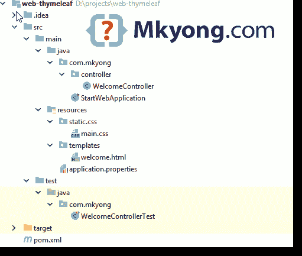
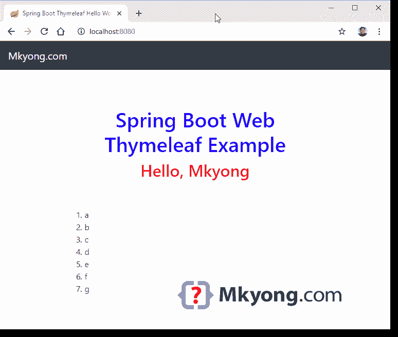
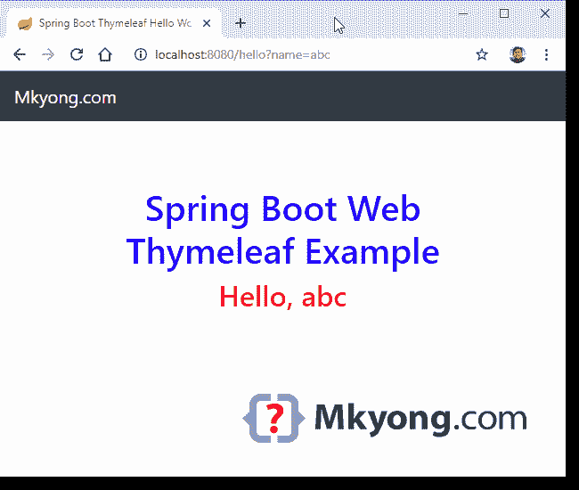

# Spring Boot Hello World 示例-百里香叶

> 原文：<http://web.archive.org/web/20230101150211/https://mkyong.com/spring-boot/spring-boot-hello-world-example-thymeleaf/>


在本文中，我们将向您展示如何开发一个 Spring Boot web 应用程序，使用百里香叶视图，嵌入式 Tomcat，并将其打包为一个可执行的`JAR`文件。

使用的技术:

*   Spring Boot 2.1.2 .版本
*   弹簧 5.1.4 释放
*   百里香叶
*   Tomcat embed 9.0.14
*   JUnit 4.12
*   maven3
*   Java 8

## 1.项目目录



## 2.专家

放上`spring-boot-starter-web`和`spring-boot-starter-thymeleaf`，它将获得我们开发 Spring MVC + Thymeleaf web 应用程序所需的任何东西，包括嵌入式 Tomcat 服务器。

pom.xml

```java
 <?xml version="1.0" encoding="UTF-8"?>
<project  
		 xmlns:xsi="http://www.w3.org/2001/XMLSchema-instance"
         xsi:schemaLocation="http://maven.apache.org/POM/4.0.0 
		 http://maven.apache.org/xsd/maven-4.0.0.xsd">
    <modelVersion>4.0.0</modelVersion>

    <artifactId>web-thymeleaf</artifactId>
    <packaging>jar</packaging>
    <name>Spring Boot Web Thymeleaf Example</name>
    <description>Spring Boot Web Thymeleaf Example</description>
    <version>1.0</version>

    <parent>
        <groupId>org.springframework.boot</groupId>
        <artifactId>spring-boot-starter-parent</artifactId>
        <version>2.1.2.RELEASE</version>
    </parent>

    <properties>
        <java.version>1.8</java.version>
        <bootstrap.version>4.2.1</bootstrap.version>
    </properties>

    <dependencies>

        <!-- web mvc -->
        <dependency>
            <groupId>org.springframework.boot</groupId>
            <artifactId>spring-boot-starter-web</artifactId>
        </dependency>

        <!-- thymeleaf -->
        <dependency>
            <groupId>org.springframework.boot</groupId>
            <artifactId>spring-boot-starter-thymeleaf</artifactId>
        </dependency>

        <!-- test -->
        <dependency>
            <groupId>org.springframework.boot</groupId>
            <artifactId>spring-boot-starter-test</artifactId>
            <scope>test</scope>
        </dependency>

        <!-- hot swapping, disable cache for template, enable live reload -->
        <dependency>
            <groupId>org.springframework.boot</groupId>
            <artifactId>spring-boot-devtools</artifactId>
            <optional>true</optional>
        </dependency>

        <!-- Optional, for bootstrap -->
        <dependency>
            <groupId>org.webjars</groupId>
            <artifactId>bootstrap</artifactId>
            <version>${bootstrap.version}</version>
        </dependency>

    </dependencies>
    <build>
        <plugins>

            <!-- Package as an executable jar/war -->
            <plugin>
                <groupId>org.springframework.boot</groupId>
                <artifactId>spring-boot-maven-plugin</artifactId>
                <configuration>
                    <addResources>true</addResources>
                </configuration>
            </plugin>

            <plugin>
                <groupId>org.apache.maven.plugins</groupId>
                <artifactId>maven-surefire-plugin</artifactId>
                <version>2.22.0</version>
            </plugin>

        </plugins>

    </build>
</project> 
```

显示项目依赖关系。

```java
 $ mvn dependency:tree

[INFO] org.springframework.boot:web-thymeleaf:jar:1.0
[INFO] +- org.springframework.boot:spring-boot-starter-web:jar:2.1.2.RELEASE:compile
[INFO] |  +- org.springframework.boot:spring-boot-starter:jar:2.1.2.RELEASE:compile
[INFO] |  |  +- org.springframework.boot:spring-boot-starter-logging:jar:2.1.2.RELEASE:compile
[INFO] |  |  |  +- ch.qos.logback:logback-classic:jar:1.2.3:compile
[INFO] |  |  |  |  \- ch.qos.logback:logback-core:jar:1.2.3:compile
[INFO] |  |  |  +- org.apache.logging.log4j:log4j-to-slf4j:jar:2.11.1:compile
[INFO] |  |  |  |  \- org.apache.logging.log4j:log4j-api:jar:2.11.1:compile
[INFO] |  |  |  \- org.slf4j:jul-to-slf4j:jar:1.7.25:compile
[INFO] |  |  +- javax.annotation:javax.annotation-api:jar:1.3.2:compile
[INFO] |  |  \- org.yaml:snakeyaml:jar:1.23:runtime
[INFO] |  +- org.springframework.boot:spring-boot-starter-json:jar:2.1.2.RELEASE:compile
[INFO] |  |  +- com.fasterxml.jackson.core:jackson-databind:jar:2.9.8:compile
[INFO] |  |  |  +- com.fasterxml.jackson.core:jackson-annotations:jar:2.9.0:compile
[INFO] |  |  |  \- com.fasterxml.jackson.core:jackson-core:jar:2.9.8:compile
[INFO] |  |  +- com.fasterxml.jackson.datatype:jackson-datatype-jdk8:jar:2.9.8:compile
[INFO] |  |  +- com.fasterxml.jackson.datatype:jackson-datatype-jsr310:jar:2.9.8:compile
[INFO] |  |  \- com.fasterxml.jackson.module:jackson-module-parameter-names:jar:2.9.8:compile
[INFO] |  +- org.springframework.boot:spring-boot-starter-tomcat:jar:2.1.2.RELEASE:compile
[INFO] |  |  +- org.apache.tomcat.embed:tomcat-embed-core:jar:9.0.14:compile
[INFO] |  |  +- org.apache.tomcat.embed:tomcat-embed-el:jar:9.0.14:compile
[INFO] |  |  \- org.apache.tomcat.embed:tomcat-embed-websocket:jar:9.0.14:compile
[INFO] |  +- org.hibernate.validator:hibernate-validator:jar:6.0.14.Final:compile
[INFO] |  |  +- javax.validation:validation-api:jar:2.0.1.Final:compile
[INFO] |  |  +- org.jboss.logging:jboss-logging:jar:3.3.2.Final:compile
[INFO] |  |  \- com.fasterxml:classmate:jar:1.4.0:compile
[INFO] |  +- org.springframework:spring-web:jar:5.1.4.RELEASE:compile
[INFO] |  |  \- org.springframework:spring-beans:jar:5.1.4.RELEASE:compile
[INFO] |  \- org.springframework:spring-webmvc:jar:5.1.4.RELEASE:compile
[INFO] |     +- org.springframework:spring-aop:jar:5.1.4.RELEASE:compile
[INFO] |     +- org.springframework:spring-context:jar:5.1.4.RELEASE:compile
[INFO] |     \- org.springframework:spring-expression:jar:5.1.4.RELEASE:compile
[INFO] +- org.springframework.boot:spring-boot-starter-thymeleaf:jar:2.1.2.RELEASE:compile
[INFO] |  +- org.thymeleaf:thymeleaf-spring5:jar:3.0.11.RELEASE:compile
[INFO] |  |  +- org.thymeleaf:thymeleaf:jar:3.0.11.RELEASE:compile
[INFO] |  |  |  +- org.attoparser:attoparser:jar:2.0.5.RELEASE:compile
[INFO] |  |  |  \- org.unbescape:unbescape:jar:1.1.6.RELEASE:compile
[INFO] |  |  \- org.slf4j:slf4j-api:jar:1.7.25:compile
[INFO] |  \- org.thymeleaf.extras:thymeleaf-extras-java8time:jar:3.0.2.RELEASE:compile
[INFO] +- org.springframework.boot:spring-boot-starter-test:jar:2.1.2.RELEASE:test
[INFO] |  +- org.springframework.boot:spring-boot-test:jar:2.1.2.RELEASE:test
[INFO] |  +- org.springframework.boot:spring-boot-test-autoconfigure:jar:2.1.2.RELEASE:test
[INFO] |  +- com.jayway.jsonpath:json-path:jar:2.4.0:test
[INFO] |  |  \- net.minidev:json-smart:jar:2.3:test
[INFO] |  |     \- net.minidev:accessors-smart:jar:1.2:test
[INFO] |  |        \- org.ow2.asm:asm:jar:5.0.4:test
[INFO] |  +- junit:junit:jar:4.12:test
[INFO] |  +- org.assertj:assertj-core:jar:3.11.1:test
[INFO] |  +- org.mockito:mockito-core:jar:2.23.4:test
[INFO] |  |  +- net.bytebuddy:byte-buddy:jar:1.9.7:test
[INFO] |  |  +- net.bytebuddy:byte-buddy-agent:jar:1.9.7:test
[INFO] |  |  \- org.objenesis:objenesis:jar:2.6:test
[INFO] |  +- org.hamcrest:hamcrest-core:jar:1.3:test
[INFO] |  +- org.hamcrest:hamcrest-library:jar:1.3:test
[INFO] |  +- org.skyscreamer:jsonassert:jar:1.5.0:test
[INFO] |  |  \- com.vaadin.external.google:android-json:jar:0.0.20131108.vaadin1:test
[INFO] |  +- org.springframework:spring-core:jar:5.1.4.RELEASE:compile
[INFO] |  |  \- org.springframework:spring-jcl:jar:5.1.4.RELEASE:compile
[INFO] |  +- org.springframework:spring-test:jar:5.1.4.RELEASE:test
[INFO] |  \- org.xmlunit:xmlunit-core:jar:2.6.2:test
[INFO] |     \- javax.xml.bind:jaxb-api:jar:2.3.1:test
[INFO] |        \- javax.activation:javax.activation-api:jar:1.2.0:test
[INFO] +- org.springframework.boot:spring-boot-devtools:jar:2.1.2.RELEASE:compile (optional)
[INFO] |  +- org.springframework.boot:spring-boot:jar:2.1.2.RELEASE:compile
[INFO] |  \- org.springframework.boot:spring-boot-autoconfigure:jar:2.1.2.RELEASE:compile
[INFO] \- org.webjars:bootstrap:jar:4.2.1:compile
[INFO]    +- org.webjars:jquery:jar:3.0.0:compile
[INFO]    \- org.webjars:popper.js:jar:1.14.3:compile 
```

## 3.开发者工具

```java
 <dependency>
		<groupId>org.springframework.boot</groupId>
		<artifactId>spring-boot-devtools</artifactId>
		<optional>true</optional>
	</dependency> 
```

这个`spring-boot-devtools`有助于禁用高速缓存并启用热插拔，这样开发人员将总是看到最后的更改。有利于发展。阅读此–[Spring Boot–开发者工具](http://web.archive.org/web/20221118095836/https://docs.spring.io/spring-boot/docs/current/reference/htmlsingle/#using-boot-devtools)尝试修改百里香模板或属性文件，刷新浏览器以查看更改是否立即生效。

*   对于 Eclipse IDE 来说，它与`spring-boot-devtools`集成得很好。
*   对于 Intellij IDEA，需要额外的步骤，阅读此[重新加载静态文件不工作](http://web.archive.org/web/20221118095836/https://www.mkyong.com/spring-boot/intellij-idea-spring-boot-template-reload-is-not-working/)

## 4.Spring Boot + MVC

4.1 简单的控制器。

WelcomeController.java

```java
 package com.mkyong.controller;

import org.springframework.beans.factory.annotation.Value;
import org.springframework.stereotype.Controller;
import org.springframework.ui.Model;
import org.springframework.web.bind.annotation.GetMapping;
import org.springframework.web.bind.annotation.RequestParam;

import java.util.Arrays;
import java.util.List;

@Controller
public class WelcomeController {

    // inject via application.properties
    @Value("${welcome.message}")
    private String message;

    private List<String> tasks = Arrays.asList("a", "b", "c", "d", "e", "f", "g");

    @GetMapping("/")
    public String main(Model model) {
        model.addAttribute("message", message);
        model.addAttribute("tasks", tasks);

        return "welcome"; //view
    }

    // /hello?name=kotlin
    @GetMapping("/hello")
    public String mainWithParam(
            @RequestParam(name = "name", required = false, defaultValue = "") 
			String name, Model model) {

        model.addAttribute("message", name);

        return "welcome"; //view
    }

} 
```

4.2 创建一个类并用`@SpringBootApplication`标注。在 IDE 中，运行此类来启动整个 web 应用程序。

StartWebApplication.java

```java
 package com.mkyong;

import org.springframework.boot.SpringApplication;
import org.springframework.boot.autoconfigure.SpringBootApplication;

@SpringBootApplication
public class StartWebApplication {

    public static void main(String[] args) {
        SpringApplication.run(StartWebApplication.class, args);
    }

} 
```

## 5.百里香+静态文件

**Note**
Read this [Spring Boot Serving static content](http://web.archive.org/web/20221118095836/https://docs.spring.io/spring-boot/docs/current/reference/htmlsingle/#boot-features-spring-mvc-static-content) to understand the resource mapping.

5.1 对于百里香模板文件，放入`src/main/resources/templates/`

src/main/resources/templates/welcome.html

```java
 <!DOCTYPE HTML>
<html lang="en" xmlns:th="http://www.thymeleaf.org">
<head>
    <meta charset="utf-8">
    <meta name="viewport" content="width=device-width, initial-scale=1, shrink-to-fit=no">

    <title>Spring Boot Thymeleaf Hello World Example</title>

    <link rel="stylesheet" th:href="@{webjars/bootstrap/4.2.1/css/bootstrap.min.css}"/>
    <link rel="stylesheet" th:href="@{/css/main.css}"/>

</head>

<body>

<nav class="navbar navbar-expand-md navbar-dark bg-dark fixed-top">
    <a class="navbar-brand" href="#">Mkyong.com</a>
</nav>

<main role="main" class="container">

    <div class="starter-template">
        <h1>Spring Boot Web Thymeleaf Example</h1>
        <h2>
            <span th:text="'Hello, ' + ${message}"></span>
        </h2>
    </div>

    <ol>
        <li th:each="task : ${tasks}" th:text="${task}"></li>
    </ol>

</main>
<!-- /.container -->

<script type="text/javascript" th:src="@{webjars/bootstrap/4.2.1/js/bootstrap.min.js}"></script>
</body>
</html> 
```

5.2 Spring Boot [通用应用属性](http://web.archive.org/web/20221118095836/https://docs.spring.io/spring-boot/docs/current/reference/html/common-application-properties.html)

src/main/resources/application.properties

```java
 welcome.message: Mkyong

spring.thymeleaf.cache=false 
```

5.3 对于 CSS 或 JS 等静态文件，放入`src/main/resources/static/`

src/main/resources/static/css/main.css

```java
 body {
  padding-top: 5rem;
}
.starter-template {
  padding: 3rem 1.5rem;
  text-align: center;
}

h1{
	color:#0000FF;
}

h2{
	color:#FF0000;
} 
```

## 6.单元测试

`MockMvc`测试 Spring MVC 控制器。

WelcomeControllerTest.java

```java
 package com.mkyong;

import com.mkyong.controller.WelcomeController;
import org.junit.Test;
import org.junit.runner.RunWith;
import org.springframework.beans.factory.annotation.Autowired;
import org.springframework.boot.test.autoconfigure.web.servlet.WebMvcTest;
import org.springframework.test.context.junit4.SpringRunner;
import org.springframework.test.web.servlet.MockMvc;
import org.springframework.test.web.servlet.MvcResult;
import org.springframework.test.web.servlet.ResultActions;
import org.springframework.web.servlet.ModelAndView;

import java.util.Arrays;
import java.util.List;

import static org.hamcrest.Matchers.containsString;
import static org.hamcrest.Matchers.is;
import static org.hamcrest.core.IsEqual.equalTo;
import static org.springframework.test.web.servlet.request.MockMvcRequestBuilders.get;
import static org.springframework.test.web.servlet.result.MockMvcResultMatchers.*;

@RunWith(SpringRunner.class)
@WebMvcTest(controllers = WelcomeController.class)
public class WelcomeControllerTest {

    @Autowired
    private MockMvc mockMvc;

    List<String> expectedList = Arrays.asList("a", "b", "c", "d", "e", "f", "g");

    @Test
    public void main() throws Exception {
        ResultActions resultActions = mockMvc.perform(get("/"))
                .andExpect(status().isOk())
                .andExpect(view().name("welcome"))
                .andExpect(model().attribute("message", equalTo("Mkyong")))
                .andExpect(model().attribute("tasks", is(expectedList)))
                .andExpect(content().string(containsString("Hello, Mkyong")));

        MvcResult mvcResult = resultActions.andReturn();
        ModelAndView mv = mvcResult.getModelAndView();
        //
    }

    // Get request with Param
    @Test
    public void hello() throws Exception {
        mockMvc.perform(get("/hello").param("name", "I Love Kotlin!"))
                .andExpect(status().isOk())
                .andExpect(view().name("welcome"))
                .andExpect(model().attribute("message", equalTo("I Love Kotlin!")))
                .andExpect(content().string(containsString("Hello, I Love Kotlin!")));
    }

} 
```

## 7.演示

```java
 $ mvn spring-boot:run

: Tomcat initialized with port(s): 8080 (http)
: Starting service [Tomcat]
: Starting Servlet engine: [Apache Tomcat/9.0.14]

: Tomcat started on port(s): 8080 (http) with context path ''
 Started StartWebApplication in 1.858 seconds (JVM running for 2.222) 
```

URL = *http://localhost:8080*



URL =*http://localhost:8080/hello？name=abc*



## 8.创建可执行的 JAR

对于部署，只需普通的 Maven 包来创建一个可执行的 JAR 文件。

```java
 $ mvn clean package

$ java -jar target\web-thymeleaf-1.0.jar 
```

## 下载源代码

$ git clone [https://github.com/mkyong/spring-boot.git](http://web.archive.org/web/20221118095836/https://github.com/mkyong/spring-boot.git)
$ cd web-thymeleaf
$ mvn spring-boot:run

## 参考

*   [使用 Spring MVC 提供 Web 内容](http://web.archive.org/web/20221118095836/https://spring.io/guides/gs/serving-web-content/)
*   [JUnit–如何测试列表](http://web.archive.org/web/20221118095836/https://www.mkyong.com/unittest/junit-how-to-test-a-list/)
*   [Spring Boot +朱尼特 5 +莫奇托](http://web.archive.org/web/20221118095836/https://www.mkyong.com/spring-boot/spring-boot-junit-5-mockito/)
*   [常用应用属性](http://web.archive.org/web/20221118095836/https://docs.spring.io/spring-boot/docs/current/reference/html/common-application-properties.html)
*   [Intellij IDEA–Spring boot 重新加载静态文件不起作用](http://web.archive.org/web/20221118095836/https://www.mkyong.com/spring-boot/intellij-idea-spring-boot-template-reload-is-not-working/)
*   [百里香官网](http://web.archive.org/web/20221118095836/https://www.thymeleaf.org/)
*   [Spring Boot–静态内容](http://web.archive.org/web/20221118095836/https://docs.spring.io/spring-boot/docs/current/reference/htmlsingle/#boot-features-spring-mvc-static-content)
*   [Spring Boot——开发者工具](http://web.archive.org/web/20221118095836/https://docs.spring.io/spring-boot/docs/current/reference/htmlsingle/#using-boot-devtools)
*   [部署 Spring Boot 应用](http://web.archive.org/web/20221118095836/https://spring.io/blog/2014/03/07/deploying-spring-boot-applications)
*   [spring MVC–in ucci CSS 文件](http://web.archive.org/web/20221118095836/https://www.mkyong.com/spring-mvc/spring-mvc-how-to-include-js-or-css-files-in-a-jsp-page/)
*   [Spring Boot Hello World 示例–JSP](http://web.archive.org/web/20221118095836/https://www.mkyong.com/spring-boot/spring-boot-hello-world-example-jsp/)

<input type="hidden" id="mkyong-current-postId" value="14216">