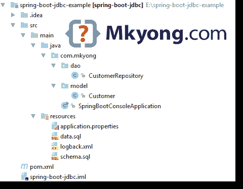

# Spring Boot JDBC + MySQL + HikariCP 的例子

> 原文：<http://web.archive.org/web/20230101150211/https://mkyong.com/spring-boot/spring-boot-jdbc-mysql-hikaricp-example/>

在这篇文章中，我们将向您展示如何创建一个 Spring Boot JDBC 应用+ MySQL 和 HikariCP。

本文中使用的工具:

1.  Spring Boot 1.5.1 .版本
2.  MySQL 5.7.x
3.  HikariCP 2.6
4.  专家
5.  Java 8

**Note**
Related – [Spring Boot JDBC + Oracle database + Commons DBCP2 example](http://web.archive.org/web/20190310100522/http://www.mkyong.com/spring-boot/spring-boot-jdbc-oracle-database-commons-dbcp2-example/)

## 1.项目结构

一个标准的 Maven 项目结构。

 <ins class="adsbygoogle" style="display:block; text-align:center;" data-ad-format="fluid" data-ad-layout="in-article" data-ad-client="ca-pub-2836379775501347" data-ad-slot="6894224149">## 2.项目依赖性

为 JDBC 应用程序声明一个`spring-boot-starter-jdbc`。

pom.xml

```java
 <project 
         xmlns:xsi="http://www.w3.org/2001/XMLSchema-instance"
         xsi:schemaLocation="http://maven.apache.org/POM/4.0.0
  http://maven.apache.org/maven-v4_0_0.xsd">
    <modelVersion>4.0.0</modelVersion>

    <groupId>com.mkyong</groupId>
    <artifactId>spring-boot-jdbc</artifactId>
    <packaging>jar</packaging>
    <version>1.0</version>

    <parent>
        <groupId>org.springframework.boot</groupId>
        <artifactId>spring-boot-starter-parent</artifactId>
        <version>1.5.1.RELEASE</version>
    </parent>

    <properties>
        <java.version>1.8</java.version>
    </properties>

    <dependencies>

        <dependency>
            <groupId>org.springframework.boot</groupId>
            <artifactId>spring-boot-starter</artifactId>
        </dependency>

		<!-- exclude tomcat jdbc connection pool, use HikariCP -->
        <dependency>
            <groupId>org.springframework.boot</groupId>
            <artifactId>spring-boot-starter-jdbc</artifactId>
            <exclusions>
                <exclusion>
                    <groupId>org.apache.tomcat</groupId>
                    <artifactId>tomcat-jdbc</artifactId>
                </exclusion>
            </exclusions>
        </dependency>

        <!-- exclude tomcat-jdbc, Spring Boot will use HikariCP automatically  -->
        <dependency>
            <groupId>com.zaxxer</groupId>
            <artifactId>HikariCP</artifactId>
            <version>2.6.0</version>
        </dependency>

        <!-- For MySQL -->
        <dependency>
            <groupId>mysql</groupId>
            <artifactId>mysql-connector-java</artifactId>
            <version>5.1.40</version>
        </dependency>

    </dependencies>

    <build>
        <plugins>
            <!-- Package as an executable jar/war -->
            <plugin>
                <groupId>org.springframework.boot</groupId>
                <artifactId>spring-boot-maven-plugin</artifactId>
            </plugin>

        </plugins>
    </build>

</project> 
```

Terminal

```java
 $ mvn dependency:tree
[INFO] Scanning for projects...
[INFO]
[INFO] ------------------------------------------------------------------------
[INFO] Building spring-boot-jdbc 1.0
[INFO] ------------------------------------------------------------------------
[INFO]
[INFO] --- maven-dependency-plugin:2.10:tree (default-cli) @ spring-boot-jdbc ---
[INFO] com.mkyong:spring-boot-jdbc:jar:1.0
[INFO] +- org.springframework.boot:spring-boot-starter:jar:1.5.1.RELEASE:compile
[INFO] |  +- org.springframework.boot:spring-boot:jar:1.5.1.RELEASE:compile
[INFO] |  |  \- org.springframework:spring-context:jar:4.3.6.RELEASE:compile
[INFO] |  |     +- org.springframework:spring-aop:jar:4.3.6.RELEASE:compile
[INFO] |  |     \- org.springframework:spring-expression:jar:4.3.6.RELEASE:compile
[INFO] |  +- org.springframework.boot:spring-boot-autoconfigure:jar:1.5.1.RELEASE:compile
[INFO] |  +- org.springframework.boot:spring-boot-starter-logging:jar:1.5.1.RELEASE:compile
[INFO] |  |  +- ch.qos.logback:logback-classic:jar:1.1.9:compile
[INFO] |  |  |  \- ch.qos.logback:logback-core:jar:1.1.9:compile
[INFO] |  |  +- org.slf4j:jcl-over-slf4j:jar:1.7.22:compile
[INFO] |  |  +- org.slf4j:jul-to-slf4j:jar:1.7.22:compile
[INFO] |  |  \- org.slf4j:log4j-over-slf4j:jar:1.7.22:compile
[INFO] |  +- org.springframework:spring-core:jar:4.3.6.RELEASE:compile
[INFO] |  \- org.yaml:snakeyaml:jar:1.17:runtime
[INFO] +- org.springframework.boot:spring-boot-starter-jdbc:jar:1.5.1.RELEASE:compile
[INFO] |  \- org.springframework:spring-jdbc:jar:4.3.6.RELEASE:compile
[INFO] |     +- org.springframework:spring-beans:jar:4.3.6.RELEASE:compile
[INFO] |     \- org.springframework:spring-tx:jar:4.3.6.RELEASE:compile
[INFO] +- com.zaxxer:HikariCP:jar:2.6.0:compile
[INFO] |  \- org.slf4j:slf4j-api:jar:1.7.22:compile
[INFO] \- mysql:mysql-connector-java:jar:5.1.40:compile
[INFO] ------------------------------------------------------------------------
[INFO] BUILD SUCCESS
[INFO] ------------------------------------------------------------------------
[INFO] Total time: 1.164 s
[INFO] Finished at: 2017-02-12T23:42:47+08:00
[INFO] Final Memory: 20M/309M
[INFO] ------------------------------------------------------------------------ 
```

**Database Connection Pooling**
Spring Boot uses Tomcat pooling `tomcat-jdbc` by default, and follow this sequence to find the connection pool :

```java
 Tomcat pool -->> - HikariCP -->>  Commons DBCP -->>  Commons DBCP2 
```

阅读 Spring Boot 官方文档—[连接到生产数据库](http://web.archive.org/web/20190310100522/https://docs.spring.io/spring-boot/docs/current/reference/html/boot-features-sql.html#boot-features-connect-to-production-database)

 <ins class="adsbygoogle" style="display:block" data-ad-client="ca-pub-2836379775501347" data-ad-slot="8821506761" data-ad-format="auto" data-ad-region="mkyongregion">## 3.JDBC 模板

3.1 Spring Boot 将自动注册一个`JdbcTemplate` bean，通过`@Autowired`注入它

CustomerRepository.java

```java
 package com.mkyong.dao;

import com.mkyong.model.Customer;
import org.springframework.beans.factory.annotation.Autowired;
import org.springframework.jdbc.core.JdbcTemplate;
import org.springframework.stereotype.Repository;

import java.util.Date;
import java.util.List;

@Repository
public class CustomerRepository {

    @Autowired
    private JdbcTemplate jdbcTemplate;

	// Find all customers, thanks Java 8, you can create a custom RowMapper like this : 
    public List<Customer> findAll() {

        List<Customer> result = jdbcTemplate.query(
                "SELECT id, name, email, created_date FROM customer",
                (rs, rowNum) -> new Customer(rs.getInt("id"),
                        rs.getString("name"), rs.getString("email"), rs.getDate("created_date"))
        );

        return result;

    }

	// Add new customer
    public void addCustomer(String name, String email) {

        jdbcTemplate.update("INSERT INTO customer(name, email, created_date) VALUES (?,?,?)",
                name, email, new Date());

    }

} 
```

3.2 客户模型。

Customer.java

```java
 package com.mkyong.model;

import java.util.Date;

public class Customer {

    int id;
    String name;
    String email;
    Date date;

    public Customer(int id, String name, String email, Date date) {
        this.id = id;
        this.name = name;
        this.email = email;
        this.date = date;
    }

    //getters and setters and toString...
} 
```

## 4.数据库初始化

Spring boot 默认启用数据源初始化器，并从类路径的根加载 SQL 脚本(`schema.sql`和`data.sql`)。

4.1 创建一个`customer`表。

schema.sql

```java
 DROP TABLE IF EXISTS customer;
CREATE TABLE customer (
  id INT NOT NULL AUTO_INCREMENT,
  name VARCHAR(100) NOT NULL,
  email VARCHAR(100) NOT NULL,
  created_date DATE NOT NULL,
  PRIMARY KEY (id)); 
```

4.2 在`customer`表中插入 3 行。

data.sql

```java
 INSERT INTO customer(name,email,created_date)VALUES('mkyong','111@yahoo.com', '2017-02-11');
INSERT INTO customer(name,email,created_date)VALUES('yflow','222@yahoo.com', '2017-02-12');
INSERT INTO customer(name,email,created_date)VALUES('zilap','333@yahoo.com', '2017-02-13'); 
```

**Note**
For detail, please refer to this official article – [Spring Database initialization](http://web.archive.org/web/20190310100522/https://docs.spring.io/spring-boot/docs/current/reference/html/howto-database-initialization.html)

4.3 要记录上述 SQL 脚本，请启用`org.springframework.jdbc`的调试

logback.xml

```java
 <?xml version="1.0" encoding="UTF-8"?>
<configuration>

    <statusListener class="ch.qos.logback.core.status.NopStatusListener" />

    <appender name="STDOUT" class="ch.qos.logback.core.ConsoleAppender">
        <layout class="ch.qos.logback.classic.PatternLayout">
            <Pattern>
                %d{yyyy-MM-dd HH:mm:ss} %-5level %logger{36} - %msg%n
            </Pattern>
        </layout>
    </appender>

    <logger name="org.springframework.jdbc" level="error" additivity="false">
        <appender-ref ref="STDOUT"/>
    </logger>

    <logger name="com.mkyong" level="error" additivity="false">
        <appender-ref ref="STDOUT"/>
    </logger>

    <root level="error">
        <appender-ref ref="STDOUT"/>
    </root>

</configuration> 
```

## 5.配置

配置 MySQL 和 [HikariCP 设置](http://web.archive.org/web/20190310100522/https://github.com/brettwooldridge/HikariCP)。

application.properties

```java
 #disbale Spring banner
spring.main.banner-mode=off

# Loads SQL scripts? schema.sql and data.sql
#spring.datasource.initialize=true

spring.datasource.url=jdbc:mysql://localhost/mkyong?useSSL=false
spring.datasource.username=root
spring.datasource.password=password
spring.datasource.driver-class-name=com.mysql.jdbc.Driver

# HikariCP settings
# spring.datasource.hikari.*

#60 sec
spring.datasource.hikari.connection-timeout=60000
# max 5
spring.datasource.hikari.maximum-pool-size=5 
```

## 6.@SpringBootApplication

Spring Boot 控制台或`CommandLineRunner`应用程序，接受参数来执行“显示”或“插入”功能。

SpringBootConsoleApplication.java

```java
 package com.mkyong;

import com.mkyong.dao.CustomerRepository;
import com.mkyong.model.Customer;
import org.springframework.beans.factory.annotation.Autowired;
import org.springframework.boot.CommandLineRunner;
import org.springframework.boot.SpringApplication;
import org.springframework.boot.autoconfigure.SpringBootApplication;

import javax.sql.DataSource;
import java.util.List;

import static java.lang.System.exit;

@SpringBootApplication
public class SpringBootConsoleApplication implements CommandLineRunner {

    @Autowired
    DataSource dataSource;

    @Autowired
    private CustomerRepository customerRepository;

    public static void main(String[] args) throws Exception {
        SpringApplication.run(SpringBootConsoleApplication.class, args);
    }

    @Override
    public void run(String... args) throws Exception {

        System.out.println("DATASOURCE = " + dataSource);

        // If you want to check the HikariDataSource settings
        //HikariDataSource newds = (HikariDataSource)dataSource;
        //System.out.println("DATASOURCE = " + newds.getMaximumPoolSize());

        if (args.length <= 0) {
            System.err.println("[Usage] java xxx.jar {insert name email | display}");
        } else {
            if (args[0].equalsIgnoreCase("insert")) {
                System.out.println("Add customer...");
                String name = args[1];
                String email = args[2];
                customerRepository.addCustomer(name, email);
            }

            if (args[0].equalsIgnoreCase("display")) {
                System.out.println("Display all customers...");
                List<Customer> list = customerRepository.findAll();
                list.forEach(x -> System.out.println(x));
            }
            System.out.println("Done!");
        }
        exit(0);
    }
} 
```

完成了。

## 7.演示

Terminal

```java
 $ mvn package

# 1\. The database is initialized, the table is created, data is inserted
$ java -jar target/spring-boot-jdbc-1.0.jar

DATASOURCE = HikariDataSource (HikariPool-1)
[Usage] java xxx.jar {insert name email | display}

# 2\. Disable database initialize process, and insert a new customer
$ java -Dspring.datasource.initialize=false -jar target/spring-boot-jdbc-1.0.jar insert newUser newPassword

DATASOURCE = HikariDataSource (null)
Add customer...
Done!

# 3\. Display all customers
$ java -Dspring.datasource.initialize=false -jar target/spring-boot-jdbc-1.0.jar display
DATASOURCE = HikariDataSource (null)
Display all customers...
Customer{id=1, name='mkyong', email='111@yahoo.com', date=2017-02-11}
Customer{id=2, name='yflow', email='222@yahoo.com', date=2017-02-12}
Customer{id=3, name='zilap', email='333@yahoo.com', date=2017-02-13}
Customer{id=4, name='newUser', email='newPassword', date=2017-02-12}
Done! 
```

## 下载源代码

Download – [spring-boot-jdbc-example.zip](http://web.archive.org/web/20190310100522/http://www.mkyong.com/wp-content/uploads/2017/02/spring-boot-jdbc-example.zip) (7 KB)

## 参考

1.  [Spring Boot——使用 SQL 数据库](http://web.archive.org/web/20190310100522/https://docs.spring.io/spring-boot/docs/current/reference/html/boot-features-sql.html)
2.  [Spring Boot–数据库初始化](http://web.archive.org/web/20190310100522/https://docs.spring.io/spring-boot/docs/current/reference/html/howto-database-initialization.html)
3.  [Spring Boot 常用应用属性](http://web.archive.org/web/20190310100522/http://docs.spring.io/spring-boot/docs/current/reference/html/common-application-properties.html)
4.  [Spring Boot–数据源构建器](http://web.archive.org/web/20190310100522/https://github.com/spring-projects/spring-boot/blob/master/spring-boot-autoconfigure/src/main/java/org/springframework/boot/autoconfigure/jdbc/DataSourceBuilder.java)
5.  [鼠标指针](http://web.archive.org/web/20190310100522/https://github.com/brettwooldridge/HikariCP)

[connection pool](http://web.archive.org/web/20190310100522/http://www.mkyong.com/tag/connection-pool/) [hikaricp](http://web.archive.org/web/20190310100522/http://www.mkyong.com/tag/hikaricp/) [jdbc](http://web.archive.org/web/20190310100522/http://www.mkyong.com/tag/jdbc/) [mysql](http://web.archive.org/web/20190310100522/http://www.mkyong.com/tag/mysql/) [spring boot](http://web.archive.org/web/20190310100522/http://www.mkyong.com/tag/spring-boot/) [spring jdbc](http://web.archive.org/web/20190310100522/http://www.mkyong.com/tag/spring-jdbc/)


