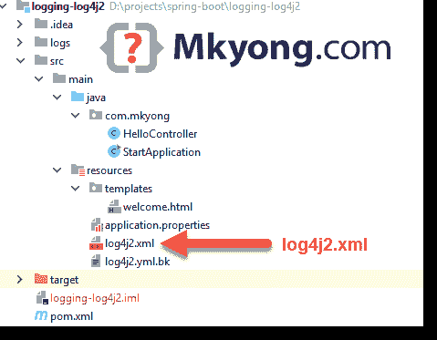

# Spring Boot Log4j 2 示例

> 原文：<http://web.archive.org/web/20230101150211/https://mkyong.com/spring-boot/spring-boot-log4j-2-example/>


在本教程中，我们将向您展示如何在 Spring Boot 框架中使用 [Apache Log4j 2](http://web.archive.org/web/20221004102333/https://logging.apache.org/log4j/2.x/) 。

使用的技术:

*   Spring Boot 2.1.2 .版本
*   弹簧 5.1.4 释放
*   Log4j 2.11.1
*   maven3
*   Java 8

## 1.项目目录



## 2.专家

关键是排除默认`logback`，用`spring-boot-starter-log4j2`包含`log4j`

pom.xml

```java
 <?xml version="1.0" encoding="UTF-8"?>
<project 
         xmlns:xsi="http://www.w3.org/2001/XMLSchema-instance"
         xsi:schemaLocation="http://maven.apache.org/POM/4.0.0
	http://maven.apache.org/xsd/maven-4.0.0.xsd">
    <modelVersion>4.0.0</modelVersion>

    <artifactId>logging-log4j2</artifactId>
    <packaging>jar</packaging>
    <name>Spring Boot log4j2 Example</name>
    <url>https://www.mkyong.com</url>
    <version>1.0</version>

    <parent>
        <groupId>org.springframework.boot</groupId>
        <artifactId>spring-boot-starter-parent</artifactId>
        <version>2.1.2.RELEASE</version>
    </parent>

    <properties>
        <java.version>1.8</java.version>
    </properties>

    <dependencies>

        <dependency>
            <groupId>org.springframework.boot</groupId>
            <artifactId>spring-boot-starter-web</artifactId>
        </dependency>

        <dependency>
            <groupId>org.springframework.boot</groupId>
            <artifactId>spring-boot-starter-thymeleaf</artifactId>
        </dependency>

        <!-- exclude logback , add log4j2 -->
        <dependency>
            <groupId>org.springframework.boot</groupId>
            <artifactId>spring-boot-starter</artifactId>
            <exclusions>
                <exclusion>
                    <groupId>org.springframework.boot</groupId>
                    <artifactId>spring-boot-starter-logging</artifactId>
                </exclusion>
            </exclusions>
        </dependency>

        <dependency>
            <groupId>org.springframework.boot</groupId>
            <artifactId>spring-boot-starter-log4j2</artifactId>
        </dependency>

        <!-- asynchronous loggers -->
        <dependency>
            <groupId>com.lmax</groupId>
            <artifactId>disruptor</artifactId>
            <version>3.4.2</version>
        </dependency>

        <!-- for log4j2.yml, need jackson-databind and jackson-dataformat-yaml -->
        <!-- spring-boot-starter-web -> spring-boot-starter-json -> jackson-databind-->
        <!-- included by spring boot
        <dependency>
            <groupId>com.fasterxml.jackson.core</groupId>
            <artifactId>jackson-databind</artifactId>
        </dependency>
        -->

        <dependency>
            <groupId>com.fasterxml.jackson.dataformat</groupId>
            <artifactId>jackson-dataformat-yaml</artifactId>
        </dependency>

    </dependencies>

    <build>
        <plugins>
            <!-- Package as an executable jar/war -->
            <plugin>
                <groupId>org.springframework.boot</groupId>
                <artifactId>spring-boot-maven-plugin</artifactId>
            </plugin>

            <plugin>
                <groupId>org.apache.maven.plugins</groupId>
                <artifactId>maven-surefire-plugin</artifactId>
                <version>2.22.0</version>
            </plugin>

        </plugins>
    </build>
</project> 
```

显示项目依赖关系。

```java
 $ mvn dependency:tree

[INFO] \- org.springframework.boot:spring-boot-starter-log4j2:jar:2.1.2.RELEASE:compile
[INFO]    +- org.apache.logging.log4j:log4j-slf4j-impl:jar:2.11.1:compile <--- slf4j to log4j bridge
[INFO]    |  \- org.apache.logging.log4j:log4j-api:jar:2.11.1:compile
[INFO]    +- org.apache.logging.log4j:log4j-core:jar:2.11.1:compile
[INFO]    +- org.apache.logging.log4j:log4j-jul:jar:2.11.1:compile
[INFO]    \- org.slf4j:jul-to-slf4j:jar:1.7.25:compile 
```

```java
 $ mvn dependency:tree

[INFO] org.springframework.boot:logging-log4j2:jar:1.0
[INFO] +- org.springframework.boot:spring-boot-starter-web:jar:2.1.2.RELEASE:compile
[INFO] |  +- org.springframework.boot:spring-boot-starter-json:jar:2.1.2.RELEASE:compile
[INFO] |  |  +- com.fasterxml.jackson.core:jackson-databind:jar:2.9.8:compile
[INFO] |  |  |  \- com.fasterxml.jackson.core:jackson-annotations:jar:2.9.0:compile
[INFO] |  |  +- com.fasterxml.jackson.datatype:jackson-datatype-jdk8:jar:2.9.8:compile
[INFO] |  |  +- com.fasterxml.jackson.datatype:jackson-datatype-jsr310:jar:2.9.8:compile
[INFO] |  |  \- com.fasterxml.jackson.module:jackson-module-parameter-names:jar:2.9.8:compile
[INFO] |  +- org.springframework.boot:spring-boot-starter-tomcat:jar:2.1.2.RELEASE:compile
[INFO] |  |  +- org.apache.tomcat.embed:tomcat-embed-core:jar:9.0.14:compile
[INFO] |  |  +- org.apache.tomcat.embed:tomcat-embed-el:jar:9.0.14:compile
[INFO] |  |  \- org.apache.tomcat.embed:tomcat-embed-websocket:jar:9.0.14:compile
[INFO] |  +- org.hibernate.validator:hibernate-validator:jar:6.0.14.Final:compile
[INFO] |  |  +- javax.validation:validation-api:jar:2.0.1.Final:compile
[INFO] |  |  +- org.jboss.logging:jboss-logging:jar:3.3.2.Final:compile
[INFO] |  |  \- com.fasterxml:classmate:jar:1.4.0:compile
[INFO] |  +- org.springframework:spring-web:jar:5.1.4.RELEASE:compile
[INFO] |  |  \- org.springframework:spring-beans:jar:5.1.4.RELEASE:compile
[INFO] |  \- org.springframework:spring-webmvc:jar:5.1.4.RELEASE:compile
[INFO] |     +- org.springframework:spring-aop:jar:5.1.4.RELEASE:compile
[INFO] |     +- org.springframework:spring-context:jar:5.1.4.RELEASE:compile
[INFO] |     \- org.springframework:spring-expression:jar:5.1.4.RELEASE:compile
[INFO] +- org.springframework.boot:spring-boot-starter-thymeleaf:jar:2.1.2.RELEASE:compile
[INFO] |  +- org.thymeleaf:thymeleaf-spring5:jar:3.0.11.RELEASE:compile
[INFO] |  |  +- org.thymeleaf:thymeleaf:jar:3.0.11.RELEASE:compile
[INFO] |  |  |  +- org.attoparser:attoparser:jar:2.0.5.RELEASE:compile
[INFO] |  |  |  \- org.unbescape:unbescape:jar:1.1.6.RELEASE:compile
[INFO] |  |  \- org.slf4j:slf4j-api:jar:1.7.25:compile
[INFO] |  \- org.thymeleaf.extras:thymeleaf-extras-java8time:jar:3.0.2.RELEASE:compile
[INFO] +- org.springframework.boot:spring-boot-starter:jar:2.1.2.RELEASE:compile
[INFO] |  +- org.springframework.boot:spring-boot:jar:2.1.2.RELEASE:compile
[INFO] |  +- org.springframework.boot:spring-boot-autoconfigure:jar:2.1.2.RELEASE:compile
[INFO] |  +- javax.annotation:javax.annotation-api:jar:1.3.2:compile
[INFO] |  +- org.springframework:spring-core:jar:5.1.4.RELEASE:compile
[INFO] |  |  \- org.springframework:spring-jcl:jar:5.1.4.RELEASE:compile
[INFO] |  \- org.yaml:snakeyaml:jar:1.23:compile
[INFO] +- org.springframework.boot:spring-boot-starter-log4j2:jar:2.1.2.RELEASE:compile
[INFO] |  +- org.apache.logging.log4j:log4j-slf4j-impl:jar:2.11.1:compile
[INFO] |  |  \- org.apache.logging.log4j:log4j-api:jar:2.11.1:compile
[INFO] |  +- org.apache.logging.log4j:log4j-core:jar:2.11.1:compile
[INFO] |  +- org.apache.logging.log4j:log4j-jul:jar:2.11.1:compile
[INFO] |  \- org.slf4j:jul-to-slf4j:jar:1.7.25:compile
[INFO] +- com.lmax:disruptor:jar:3.4.2:compile
[INFO] \- com.fasterxml.jackson.dataformat:jackson-dataformat-yaml:jar:2.9.8:compile
[INFO]    \- com.fasterxml.jackson.core:jackson-core:jar:2.9.8:compile 
```

## 3.log4j2.xml

3.1 在项目类路径中创建一个`log4j2.xml`，`src/resources/`

src/resources/log4j2.xml

```java
 <?xml version="1.0" encoding="UTF-8"?>
<Configuration status="DEBUG">
    <Appenders>
        <Console name="LogToConsole" target="SYSTEM_OUT">
            <PatternLayout pattern="%d{HH:mm:ss.SSS} [%t] %-5level %logger{36} - %msg%n"/>
        </Console>
        <File name="LogToFile" fileName="logs/app.log">
            <PatternLayout>
                <Pattern>%d %p %c{1.} [%t] %m%n</Pattern>
            </PatternLayout>
        </File>
    </Appenders>
    <Loggers>
        <Logger name="com.mkyong" level="debug" additivity="false">
            <AppenderRef ref="LogToFile"/>
            <AppenderRef ref="LogToConsole"/>
        </Logger>
        <Logger name="org.springframework.boot" level="error" additivity="false">
            <AppenderRef ref="LogToConsole"/>
        </Logger>
        <Root level="error">
            <AppenderRef ref="LogToFile"/>
            <AppenderRef ref="LogToConsole"/>
        </Root>
    </Loggers>
</Configuration> 
```

3.2 对于`log4j2.yml`，我们需要包含`jackson-databind`和`jackson-dataformat-yaml`，因为`jackson-databind`已经包含在 Spring Boot 启动器中，所以我们只需要包含`jackson-dataformat-yaml`

pom.xml

```java
 <!-- spring-boot-starter-web -> spring-boot-starter-json -> jackson-databind-->
	<!-- included by spring boot
	<dependency>
		<groupId>com.fasterxml.jackson.core</groupId>
		<artifactId>jackson-databind</artifactId>
	</dependency>
	-->

	<dependency>
		<groupId>com.fasterxml.jackson.dataformat</groupId>
		<artifactId>jackson-dataformat-yaml</artifactId>
	</dependency> 
```

log4j2.yml

```java
 Configuration:
  status: debug

  appenders:
    Console:
      name: LogToConsole
      PatternLayout:
        Pattern: "[%-5level] %d{yyyy-MM-dd HH:mm:ss.SSS} [%t] %c{1} - %msg%n"

    RollingFile:
      - name: LogToRollingFile
        fileName: logs/app.log
        filePattern: "logs/$${date:yyyy-MM}/app-%d{MM-dd-yyyy}-%i.log.gz"
        PatternLayout:
          pattern: "[%-5level] %d{yyyy-MM-dd HH:mm:ss.SSS} [%t] %c{1} - %msg%n"
        Policies:
          SizeBasedTriggeringPolicy:
            size: 10MB
        DefaultRollOverStrategy:
          max: 10

  Loggers:
    logger:
      - name: com.mkyong
        level: debug
        additivity: false
        AppenderRef:
          - ref: LogToConsole
          - ref: LogToRollingFile

    Root:
      level: error
      AppenderRef:
        ref: LogToConsole 
```

## 4.你好 log4j2

4.1 一个简单的 Spring MVC web 应用，用 log4j2 登录。

HelloController.java

```java
 package com.mkyong;

import org.apache.logging.log4j.LogManager;
import org.apache.logging.log4j.Logger;
import org.springframework.stereotype.Controller;
import org.springframework.ui.Model;
import org.springframework.web.bind.annotation.GetMapping;

import java.util.Arrays;
import java.util.List;

@Controller
public class HelloController {

    private static final Logger logger = LogManager.getLogger(HelloController.class);

    private List<Integer> num = Arrays.asList(1, 2, 3, 4, 5);

    @GetMapping("/")
    public String main(Model model) {

        // pre-java 8
        if (logger.isDebugEnabled()) {
            logger.debug("Hello from Log4j 2 - num : {}", num);
        }

        // java 8 lambda, no need to check log level
        logger.debug("Hello from Log4j 2 - num : {}", () -> num);

        model.addAttribute("tasks", num);
        return "welcome"; //view
    }

    private int getNum() {
        return 100;
    }

} 
```

4.2 模板

src/resources/templates/welcome.html

```java
 <!DOCTYPE HTML>
<html lang="en" xmlns:th="http://www.thymeleaf.org">
<head></head>
<body>

<h1>Spring Boot + log4j2 example</h1>
<ul>
    <li th:each="task : ${tasks}" th:text="${task}"></li>
</ul>

</body>
</html> 
```

## 5.演示

5.1 启动 Spring Boot

StartApplication.java

```java
 package com.mkyong;

import org.springframework.boot.SpringApplication;
import org.springframework.boot.autoconfigure.SpringBootApplication;

@SpringBootApplication
public class StartApplication {

    public static void main(String[] args) {
        SpringApplication.run(StartApplication.class, args);
    }

} 
```

*http://localhost:8080*


查看日志记录:

Terminal

```java
 19:10:08.723 [http-nio-8080-exec-1] DEBUG com.mkyong.HelloController - Hello from Log4j 2 - num : [1, 2, 3, 4, 5]
19:10:08.724 [http-nio-8080-exec-1] DEBUG com.mkyong.HelloController - Hello from Log4j 2 - num : [1, 2, 3, 4, 5] 
```

## 6.log4j 2–异步记录器

6.1 要启用异步日志，我们需要包含`disruptor`

pom.xml

```java
 <dependency>
		<groupId>com.lmax</groupId>
		<artifactId>disruptor</artifactId>
		<version>3.4.2</version>
	</dependency> 
```

6.2 设置系统属性`log4j2.contextSelector=org.apache.logging.log4j.core.async.AsyncLoggerContextSelector`

Terminal

```java
 $ mvn package 

$ java -Dlog4j2.contextSelector=org.apache.logging.log4j.core.async.AsyncLoggerContextSelector -jar target/logging-log4j2-1.0.jar

019-03-27 19:28:57,185 main DEBUG Registering MBean org.apache.logging.log4j2:type=AsyncContext@578486a3
2019-03-27 19:28:57,189 main DEBUG Registering MBean org.apache.logging.log4j2:type=AsyncContext@578486a3,component=AsyncLoggerRingBuffer
2019-03-27 19:28:57,194 main DEBUG Registering MBean org.apache.logging.log4j2:type=AsyncContext@578486a3,component=StatusLogger
2019-03-27 19:28:57,195 main DEBUG Registering MBean org.apache.logging.log4j2:type=AsyncContext@578486a3,component=ContextSelector
2019-03-27 19:28:57,195 main DEBUG Registering MBean org.apache.logging.log4j2:type=AsyncContext@578486a3,component=Loggers,name=org.springframework.boot
2019-03-27 19:28:57,196 main DEBUG Registering MBean org.apache.logging.log4j2:type=AsyncContext@578486a3,component=Loggers,name=
2019-03-27 19:28:57,196 main DEBUG Registering MBean org.apache.logging.log4j2:type=AsyncContext@578486a3,component=Loggers,name=com.mkyong
2019-03-27 19:28:57,197 main DEBUG Registering MBean org.apache.logging.log4j2:type=AsyncContext@578486a3,component=Appenders,name=LogToConsole
2019-03-27 19:28:57,200 main DEBUG Registering MBean org.apache.logging.log4j2:type=AsyncContext@578486a3,component=Appenders,name=LogToFile 
```

## 下载源代码

$ git clone [https://github.com/mkyong/spring-boot.git](http://web.archive.org/web/20221004102333/https://github.com/mkyong/spring-boot.git)
$ cd logging-log4j2
$ mvn spring-boot:run
Access *localhost:8080*

$ mvn 包
$ Java-dlog 4j 2 . context selector = org . Apache . logging . log4j . core . async . asyncloggercontextselector-jar target/logging-log4j 2-1.0 . jar
Access*localhost:8080*

## 参考

*   [Spring Boot 测井](http://web.archive.org/web/20221004102333/https://docs.spring.io/spring-boot/docs/current/reference/html/howto-logging.html)
*   [阿帕奇 Log4j 2](http://web.archive.org/web/20221004102333/https://logging.apache.org/log4j/2.x/)
*   [Apache Log4j 2 教程](/web/20221004102333/https://mkyong.com/logging/apache-log4j-2-tutorials/)
*   [用于低延迟记录的异步记录器](http://web.archive.org/web/20221004102333/https://logging.apache.org/log4j/2.x/manual/async.html)

<input type="hidden" id="mkyong-current-postId" value="15012">