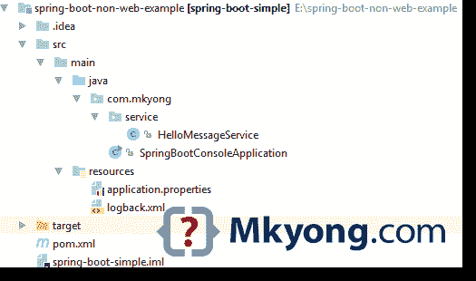

# Spring Boot 非 web 应用示例

> 原文：<http://web.archive.org/web/20230101150211/https://mkyong.com/spring-boot/spring-boot-non-web-application-example/>

在 Spring Boot，要创建一个非 web 应用程序，实现`CommandLineRunner`并覆盖`run`方法，例如:

```java
 import org.springframework.boot.CommandLineRunner;

@SpringBootApplication
public class SpringBootConsoleApplication implements CommandLineRunner {

    public static void main(String[] args) throws Exception {

        SpringApplication.run(SpringBootConsoleApplication.class, args);

    }

    //access command line arguments
    @Override
    public void run(String... args) throws Exception {

        //do something

    }
} 
```

## 1.项目结构

一个标准的 Maven 项目结构。




## 2.项目依赖性

仅`spring-boot-starter`

pom.xml

```java
 <project 
         xmlns:xsi="http://www.w3.org/2001/XMLSchema-instance"
         xsi:schemaLocation="http://maven.apache.org/POM/4.0.0
  http://maven.apache.org/maven-v4_0_0.xsd">
    <modelVersion>4.0.0</modelVersion>

    <groupId>com.mkyong</groupId>
    <artifactId>spring-boot-simple</artifactId>
    <packaging>jar</packaging>
    <version>1.0</version>

    <parent>
        <groupId>org.springframework.boot</groupId>
        <artifactId>spring-boot-starter-parent</artifactId>
        <version>1.5.1.RELEASE</version>
    </parent>

    <properties>
        <java.version>1.8</java.version>
    </properties>

    <dependencies>

        <dependency>
            <groupId>org.springframework.boot</groupId>
            <artifactId>spring-boot-starter</artifactId>
        </dependency>

    </dependencies>

    <build>
        <plugins>
            <!-- Package as an executable jar/war -->
            <plugin>
                <groupId>org.springframework.boot</groupId>
                <artifactId>spring-boot-maven-plugin</artifactId>
            </plugin>
        </plugins>
    </build>

</project> 
```

## 3.春天

3.1 返回消息的服务。

HelloMessageService.java

```java
 package com.mkyong.service;

import org.springframework.beans.factory.annotation.Value;
import org.springframework.stereotype.Service;

@Service
public class HelloMessageService {

    @Value("${name:unknown}")
    private String name;

    public String getMessage() {
        return getMessage(name);
    }

    public String getMessage(String name) {
        return "Hello " + name;
    }

} 
```

application.properties

```java
 name=mkyong 
```

3.2 `CommandLineRunner`示例。如果您运行这个 Spring Boot，那么`run`方法将是入口点。

SpringBootConsoleApplication.java

```java
 package com.mkyong;

import com.mkyong.service.HelloMessageService;
import org.springframework.beans.factory.annotation.Autowired;
import org.springframework.boot.Banner;
import org.springframework.boot.CommandLineRunner;
import org.springframework.boot.SpringApplication;
import org.springframework.boot.autoconfigure.SpringBootApplication;

import static java.lang.System.exit;

@SpringBootApplication
public class SpringBootConsoleApplication implements CommandLineRunner {

    @Autowired
    private HelloMessageService helloService;

    public static void main(String[] args) throws Exception {

        //disabled banner, don't want to see the spring logo
        SpringApplication app = new SpringApplication(SpringBootConsoleApplication.class);
        app.setBannerMode(Banner.Mode.OFF);
        app.run(args);

    }

	// Put your logic here.
    @Override
    public void run(String... args) throws Exception {

        if (args.length > 0) {
            System.out.println(helloService.getMessage(args[0].toString()));
        } else {
            System.out.println(helloService.getMessage());
        }

        exit(0);
    }
} 
```

## 4.演示

打包并运行它。

```java
 ## Go to project directory
## package it
$ mvn package

$ java -jar target/spring-boot-simple-1.0.jar
Hello mkyong

$ java -jar target/spring-boot-simple-1.0.jar "donald trump"
Hello donald trump 
```

## 下载源代码

Download – [spring-boot-non-web-example.zip](http://web.archive.org/web/20201209120906/http://www.mkyong.com/wp-content/uploads/2017/02/spring-boot-non-web-example.zip) (5 KB)

## 参考

1.  [命令行运行程序 JavaDoc](http://web.archive.org/web/20201209120906/http://docs.spring.io/spring-boot/docs/current/api/org/springframework/boot/CommandLineRunner.html)

Tags : [CommandLineRunner](http://web.archive.org/web/20201209120906/https://mkyong.com/tag/commandlinerunner/) [executable jar](http://web.archive.org/web/20201209120906/https://mkyong.com/tag/executable-jar/) [jar](http://web.archive.org/web/20201209120906/https://mkyong.com/tag/jar/) [spring boot](http://web.archive.org/web/20201209120906/https://mkyong.com/tag/spring-boot/)<input type="hidden" id="mkyong-current-postId" value="14437">

### 相关文章

*   [Spring Boot——开始哪个主班](/web/20201209120906/https://mkyong.com/spring-boot/spring-boot-which-main-class-to-start/)
*   [Maven -如何创建一个 Java 项目](/web/20201209120906/https://mkyong.com/maven/how-to-create-a-java-project-with-maven/)
*   [Spring Boot -应用程序启动时运行代码](/web/20201209120906/https://mkyong.com/spring-boot/spring-boot-run-code-when-the-application-starts/)
*   [如何制作 Java exe 文件或可执行 JAR 文件](/web/20201209120906/https://mkyong.com/java/how-to-make-an-executable-jar-file/)
*   [如何将清单添加到 Jar 文件中](/web/20201209120906/https://mkyong.com/java/how-to-add-your-manifest-into-a-jar-file/)

*   [Java 归档工具(JAR)示例](/web/20201209120906/https://mkyong.com/java/the-java-archive-tool-jar-examples/)
*   [Java -从资源文件夹中读取文件](/web/20201209120906/https://mkyong.com/java/java-read-a-file-from-resources-folder/)
*   [如何用 Maven 创建 jar 文件](/web/20201209120906/https://mkyong.com/maven/how-to-create-a-jar-file-with-maven/)
*   [Gradle -创建一个具有依赖关系的 Jar 文件](/web/20201209120906/https://mkyong.com/gradle/gradle-create-a-jar-file-with-dependencies/)
*   [Spring Boot Hello World 示例- JSP](/web/20201209120906/https://mkyong.com/spring-boot/spring-boot-hello-world-example-jsp/)