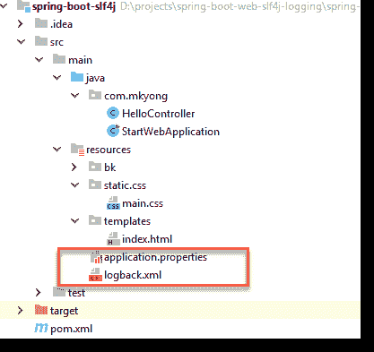
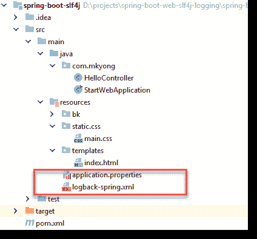
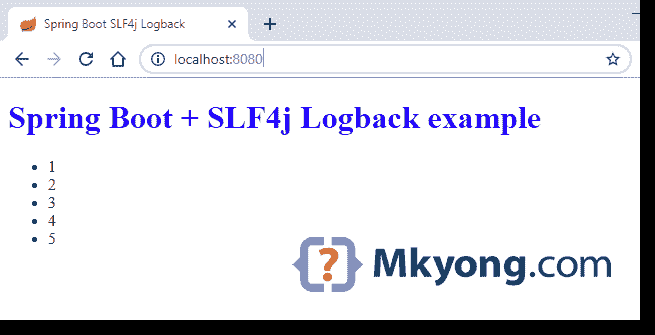

# Spring Boot SLF4j 回溯示例

> 原文：<http://web.archive.org/web/20230101150211/https://mkyong.com/spring-boot/spring-boot-slf4j-logging-example/>


在本教程中，我们将向您展示如何在 Spring Boot 框架中使用 [Logback](http://web.archive.org/web/20220815221140/https://logback.qos.ch/) 。

使用的技术:

*   Spring Boot 2.1.2 .版本
*   弹簧 5.1.4 释放
*   回溯 1.2.3
*   maven3
*   Java 8

## 1.项目目录


## 2.专家

在 Spring Boot，Logback 是默认的日志框架，只需添加`spring-boot-starter-web`，它将引入`logback`依赖项。

pom.xml

```java
 <?xml version="1.0" encoding="UTF-8"?>
<project  
	xmlns:xsi="http://www.w3.org/2001/XMLSchema-instance"
         xsi:schemaLocation="http://maven.apache.org/POM/4.0.0 
		 http://maven.apache.org/xsd/maven-4.0.0.xsd">
    <modelVersion>4.0.0</modelVersion>

    <artifactId>spring-boot-slf4j</artifactId>
    <packaging>jar</packaging>
    <name>Spring Boot SLF4j</name>
    <version>1.0</version>

    <parent>
        <groupId>org.springframework.boot</groupId>
        <artifactId>spring-boot-starter-parent</artifactId>
        <version>2.1.2.RELEASE</version>
    </parent>

    <properties>
        <java.version>1.8</java.version>
    </properties>

    <dependencies>

        <dependency>
            <groupId>org.springframework.boot</groupId>
            <artifactId>spring-boot-starter-web</artifactId>
        </dependency>

        <dependency>
            <groupId>org.springframework.boot</groupId>
            <artifactId>spring-boot-starter-thymeleaf</artifactId>
        </dependency>

        <dependency>
            <groupId>org.springframework.boot</groupId>
            <artifactId>spring-boot-devtools</artifactId>
            <optional>true</optional>
        </dependency>

    </dependencies>
    <build>
        <plugins>
            <!-- Package as an executable jar/war -->
            <plugin>
                <groupId>org.springframework.boot</groupId>
                <artifactId>spring-boot-maven-plugin</artifactId>
            </plugin>
            <plugin>
                <groupId>org.apache.maven.plugins</groupId>
                <artifactId>maven-surefire-plugin</artifactId>
                <version>2.22.0</version>
            </plugin>
        </plugins>
    </build>
</project> 
```

显示项目依赖关系。

```java
 $ mvn dependency:tree

+- org.springframework.boot:spring-boot-starter-web:jar:2.1.2.RELEASE:compile
[INFO] |  +- org.springframework.boot:spring-boot-starter:jar:2.1.2.RELEASE:compile
[INFO] |  |  +- org.springframework.boot:spring-boot-starter-logging:jar:2.1.2.RELEASE:compile
[INFO] |  |  |  +- ch.qos.logback:logback-classic:jar:1.2.3:compile
[INFO] |  |  |  |  \- ch.qos.logback:logback-core:jar:1.2.3:compile 
```

```java
 $ mvn dependency:tree

org.springframework.boot:spring-boot-slf4j:jar:1.0
[INFO] +- org.springframework.boot:spring-boot-starter-web:jar:2.1.2.RELEASE:compile
[INFO] |  +- org.springframework.boot:spring-boot-starter:jar:2.1.2.RELEASE:compile
[INFO] |  |  +- org.springframework.boot:spring-boot-starter-logging:jar:2.1.2.RELEASE:compile
[INFO] |  |  |  +- ch.qos.logback:logback-classic:jar:1.2.3:compile
[INFO] |  |  |  |  \- ch.qos.logback:logback-core:jar:1.2.3:compile
[INFO] |  |  |  +- org.apache.logging.log4j:log4j-to-slf4j:jar:2.11.1:compile
[INFO] |  |  |  |  \- org.apache.logging.log4j:log4j-api:jar:2.11.1:compile
[INFO] |  |  |  \- org.slf4j:jul-to-slf4j:jar:1.7.25:compile
[INFO] |  |  +- javax.annotation:javax.annotation-api:jar:1.3.2:compile
[INFO] |  |  +- org.springframework:spring-core:jar:5.1.4.RELEASE:compile
[INFO] |  |  |  \- org.springframework:spring-jcl:jar:5.1.4.RELEASE:compile
[INFO] |  |  \- org.yaml:snakeyaml:jar:1.23:runtime
[INFO] |  +- org.springframework.boot:spring-boot-starter-json:jar:2.1.2.RELEASE:compile
[INFO] |  |  +- com.fasterxml.jackson.core:jackson-databind:jar:2.9.8:compile
[INFO] |  |  |  +- com.fasterxml.jackson.core:jackson-annotations:jar:2.9.0:compile
[INFO] |  |  |  \- com.fasterxml.jackson.core:jackson-core:jar:2.9.8:compile
[INFO] |  |  +- com.fasterxml.jackson.datatype:jackson-datatype-jdk8:jar:2.9.8:compile
[INFO] |  |  +- com.fasterxml.jackson.datatype:jackson-datatype-jsr310:jar:2.9.8:compile
[INFO] |  |  \- com.fasterxml.jackson.module:jackson-module-parameter-names:jar:2.9.8:compile
[INFO] |  +- org.springframework.boot:spring-boot-starter-tomcat:jar:2.1.2.RELEASE:compile
[INFO] |  |  +- org.apache.tomcat.embed:tomcat-embed-core:jar:9.0.14:compile
[INFO] |  |  +- org.apache.tomcat.embed:tomcat-embed-el:jar:9.0.14:compile
[INFO] |  |  \- org.apache.tomcat.embed:tomcat-embed-websocket:jar:9.0.14:compile
[INFO] |  +- org.hibernate.validator:hibernate-validator:jar:6.0.14.Final:compile
[INFO] |  |  +- javax.validation:validation-api:jar:2.0.1.Final:compile
[INFO] |  |  +- org.jboss.logging:jboss-logging:jar:3.3.2.Final:compile
[INFO] |  |  \- com.fasterxml:classmate:jar:1.4.0:compile
[INFO] |  +- org.springframework:spring-web:jar:5.1.4.RELEASE:compile
[INFO] |  |  \- org.springframework:spring-beans:jar:5.1.4.RELEASE:compile
[INFO] |  \- org.springframework:spring-webmvc:jar:5.1.4.RELEASE:compile
[INFO] |     +- org.springframework:spring-aop:jar:5.1.4.RELEASE:compile
[INFO] |     +- org.springframework:spring-context:jar:5.1.4.RELEASE:compile
[INFO] |     \- org.springframework:spring-expression:jar:5.1.4.RELEASE:compile
[INFO] +- org.springframework.boot:spring-boot-starter-thymeleaf:jar:2.1.2.RELEASE:compile
[INFO] |  +- org.thymeleaf:thymeleaf-spring5:jar:3.0.11.RELEASE:compile
[INFO] |  |  +- org.thymeleaf:thymeleaf:jar:3.0.11.RELEASE:compile
[INFO] |  |  |  +- org.attoparser:attoparser:jar:2.0.5.RELEASE:compile
[INFO] |  |  |  \- org.unbescape:unbescape:jar:1.1.6.RELEASE:compile
[INFO] |  |  \- org.slf4j:slf4j-api:jar:1.7.25:compile
[INFO] |  \- org.thymeleaf.extras:thymeleaf-extras-java8time:jar:3.0.2.RELEASE:compile
[INFO] \- org.springframework.boot:spring-boot-devtools:jar:2.1.2.RELEASE:compile (optional)
[INFO]    +- org.springframework.boot:spring-boot:jar:2.1.2.RELEASE:compile
[INFO]    \- org.springframework.boot:spring-boot-autoconfigure:jar:2.1.2.RELEASE:compile 
```

## 3.应用程序.属性

3.1 在`application.properties`中配置记录

application.properties

```java
 # logging level
logging.level.org.springframework=ERROR
logging.level.com.mkyong=DEBUG

# output to a file
logging.file=app.log

# temp folder example
#logging.file=${java.io.tmpdir}/app.log

logging.pattern.file=%d %p %c{1.} [%t] %m%n

logging.pattern.console=%d{HH:mm:ss.SSS} [%t] %-5level %logger{36} - %msg%n

## if no active profile, default is 'default'
##spring.profiles.active=prod

# root level
#logging.level.=INFO 
```

3.2 这相当于 YAML 格式。

application.yml

```java
 logging:
  level:
    org.springframework: ERROR
    com.mkyong: DEBUG
  pattern:
    console: "%d{HH:mm:ss.SSS} [%t] %-5level %logger{36} - %msg%n"
    file: "%d %p %c{1.} [%t] %m%n"
  file: app.log 
```

## 4.logback.xml

上面的日志配置对于开发来说已经足够了。对于生产，我们需要更多的日志功能，如文件滚动或 SMTP。在 Spring Boot，我们仍然允许通过标准`logback.xml`配置回退

logback.xml

```java
 <?xml version="1.0" encoding="UTF-8"?>
<configuration>

    <property name="HOME_LOG" value="logs/app.log"/>

    <appender name="FILE-ROLLING" class="ch.qos.logback.core.rolling.RollingFileAppender">
        <file>${HOME_LOG}</file>

        <rollingPolicy class="ch.qos.logback.core.rolling.SizeAndTimeBasedRollingPolicy">
            <fileNamePattern>logs/archived/app.%d{yyyy-MM-dd}.%i.log</fileNamePattern>
            <!-- each archived file, size max 10MB -->
            <maxFileSize>10MB</maxFileSize>
            <!-- total size of all archive files, if total size > 20GB, 
				it will delete old archived file -->
            <totalSizeCap>20GB</totalSizeCap>
            <!-- 60 days to keep -->
            <maxHistory>60</maxHistory>
        </rollingPolicy>

        <encoder>
            <pattern>%d %p %c{1.} [%t] %m%n</pattern>
        </encoder>
    </appender>

    <logger name="com.mkyong" level="debug" additivity="false">
        <appender-ref ref="FILE-ROLLING"/>
    </logger>

    <root level="error">
        <appender-ref ref="FILE-ROLLING"/>
    </root>

</configuration> 
```

## 5.按剖面进行 Spring Boot 测井

**Note**
Read this – [Profile-specific configuration](http://web.archive.org/web/20220815221140/https://docs.spring.io/spring-boot/docs/current/reference/html/boot-features-logging.html#_profile_specific_configuration)

为了利用 Spring Boot 提供的模板特性，我们可以在类路径的根目录下创建一个`logback-spring.xml`。



在下面的配置中:

*   如果没有活动的配置文件(默认)，则记录到控制台。
*   如果配置文件是`prod`，记录到一个滚动文件。

logback-spring.xml

```java
 <?xml version="1.0" encoding="UTF-8"?>
<configuration>
    <include resource="org/springframework/boot/logging/logback/defaults.xml" />

    <springProfile name="default">
        <include resource="org/springframework/boot/logging/logback/console-appender.xml"/>

        <root level="INFO">
            <appender-ref ref="CONSOLE"/>
        </root>
    </springProfile>

    <springProfile name="prod">

        <appender name="FILE-ROLLING" class="ch.qos.logback.core.rolling.RollingFileAppender">
            <file>app.log</file>

            <rollingPolicy class="ch.qos.logback.core.rolling.SizeAndTimeBasedRollingPolicy">
                <fileNamePattern>logs/archived/app.%d{yyyy-MM-dd}.%i.log</fileNamePattern>
                <!-- each archived file, size max 10MB -->
                <maxFileSize>10MB</maxFileSize>
                <!-- total size of all archive files, if total size > 20GB, it will delete old archived file -->
                <totalSizeCap>20GB</totalSizeCap>
                <!-- 60 days to keep -->
                <maxHistory>60</maxHistory>
            </rollingPolicy>

            <encoder>
                <pattern>%d %p %c{1.} [%t] %m%n</pattern>
            </encoder>
        </appender>

        <logger name="org.springframework" level="INFO"/>
        <logger name="com.mkyong" level="DEBUG"/>
        <root level="ERROR">
            <appender-ref ref="FILE-ROLLING"/>
        </root>
    </springProfile>

</configuration> 
```

定义一个`spring.profiles.active`属性来设置当前活动的配置文件。

application.properties

```java
 ## if no active profile, default is 'default'
spring.profiles.active=prod 
```

## 6.你好 Logback

6.1 一个简单的 Spring MVC web 应用程序，记录一些东西。

HelloController.java

```java
 package com.mkyong;

import org.slf4j.Logger;
import org.slf4j.LoggerFactory;
import org.springframework.stereotype.Controller;
import org.springframework.ui.Model;
import org.springframework.web.bind.annotation.GetMapping;

import java.util.Arrays;
import java.util.List;

@Controller
public class HelloController {

    private static final Logger logger = LoggerFactory.getLogger(HelloController.class);

    @GetMapping("/")
    public String hello(Model model) {

        List<Integer> data = Arrays.asList(1, 2, 3, 4, 5);

        logger.debug("Hello from Logback {}", data);

        model.addAttribute("num", data);

        return "index"; // index.html
    }

} 
```

6.2 模板

src/resources/templates/index.html

```java
 <!DOCTYPE HTML>
<html xmlns:th="http://www.thymeleaf.org">
<head>
    <title>Spring Boot SLF4j Logback</title>
    <link rel="stylesheet" th:href="@{/css/main.css}" href="../../css/main.css"/>
</head>
<body>

<h1>Spring Boot + SLF4j Logback example</h1>
<ul>
    <li th:each="n : ${num}" th:text="${n}"></li>
</ul>

</body>
</html> 
```

6.3 CSS

src/resources/static/css/main.css

```java
 h1{
	color:#0000FF;
} 
```

## 7.演示

7.1 启动 Spring Boot

StartWebApplication.java

```java
 package com.mkyong;

import org.springframework.boot.SpringApplication;
import org.springframework.boot.autoconfigure.SpringBootApplication;

@SpringBootApplication
public class StartWebApplication {

	public static void main(String[] args) {
		SpringApplication.run(StartWebApplication.class, args);
	}

} 
```

*http://localhost:8080*

Terminal

```java
 15:15:11.588 [http-nio-8080-exec-1] DEBUG com.mkyong.HelloController - Hello from Logback [1, 2, 3, 4, 5] 
```

## 下载源代码

$ git clone [https://github.com/mkyong/spring-boot.git](http://web.archive.org/web/20220815221140/https://github.com/mkyong/spring-boot.git)
$ cd logging-slf4j-logback
$ mvn spring-boot:run

访问 *localhost:8080*
查看控制台记录信息。

## 参考

*   [Spring Boot 测井](http://web.archive.org/web/20220815221140/https://docs.spring.io/spring-boot/docs/current/reference/html/howto-logging.html)
*   [回溯项目](http://web.archive.org/web/20220815221140/https://logback.qos.ch/)
*   stack overflow–Spring Boot:我如何用 application.properties 设置日志级别？
*   [SLF4J 后勤指南](http://web.archive.org/web/20220815221140/https://www.mkyong.com/logging/slf4j-logback-tutorial/)
*   [logback.xml 示例](/web/20220815221140/https://mkyong.com/logging/logback-xml-example/)

<input type="hidden" id="mkyong-current-postId" value="14263">