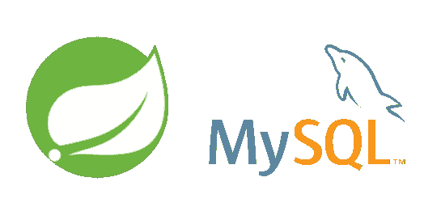

# Spring Boot +春天数据 JPA + MySQL

> 原文：<http://web.archive.org/web/20230101150211/https://mkyong.com/spring-boot/spring-boot-spring-data-jpa-mysql-example/>



之前的 [Spring Boot + Spring 数据 JPA](/web/20220930231922/https://mkyong.com/spring-boot/spring-boot-spring-data-jpa/) 将被重用，修改为支持 MySQL 数据库。

使用的技术:

*   Spring Boot 2.1.2 .版本
*   弹簧 5.1.4 释放
*   休眠 5.3.7
*   HikariCP 3.2.0
*   MySQL-连接器-java:jar 8.0.13
*   maven3
*   Java 8

## 1.专家

为了连接一个 MySQL，声明`mysql-connector-java`

pom.xml

```java
 <dependency>
		<groupId>mysql</groupId>
		<artifactId>mysql-connector-java</artifactId>
	</dependency> 
```

pom.xml

```java
 <?xml version="1.0" encoding="UTF-8"?>
<project 
         xmlns:xsi="http://www.w3.org/2001/XMLSchema-instance"
         xsi:schemaLocation="http://maven.apache.org/POM/4.0.0 
		 http://maven.apache.org/xsd/maven-4.0.0.xsd">
    <modelVersion>4.0.0</modelVersion>

    <artifactId>spring-boot-data-jpa</artifactId>
    <packaging>jar</packaging>
    <name>Spring Boot Spring Data JPA</name>
    <version>1.0</version>

    <parent>
        <groupId>org.springframework.boot</groupId>
        <artifactId>spring-boot-starter-parent</artifactId>
        <version>2.1.2.RELEASE</version>
    </parent>

    <properties>
        <java.version>1.8</java.version>
        <downloadSources>true</downloadSources>
        <downloadJavadocs>true</downloadJavadocs>
    </properties>

    <dependencies>

        <!-- jpa, crud repository -->
        <dependency>
            <groupId>org.springframework.boot</groupId>
            <artifactId>spring-boot-starter-data-jpa</artifactId>
        </dependency>

        <!-- MySQL -->
        <dependency>
            <groupId>mysql</groupId>
            <artifactId>mysql-connector-java</artifactId>
        </dependency>

        <dependency>
            <groupId>org.springframework.boot</groupId>
            <artifactId>spring-boot-starter-test</artifactId>
            <scope>test</scope>
        </dependency>

    </dependencies>

    <build>
        <plugins>

            <plugin>
                <groupId>org.springframework.boot</groupId>
                <artifactId>spring-boot-maven-plugin</artifactId>
            </plugin>

            <plugin>
                <groupId>org.apache.maven.plugins</groupId>
                <artifactId>maven-surefire-plugin</artifactId>
                <version>2.22.0</version>
            </plugin>

        </plugins>

    </build>
</project> 
```

## 2.配置 MySQL

2.1 更新`spring.datasource.*`中的 MySQL 设置

application.properties

```java
 ## MySQL
spring.datasource.url=jdbc:mysql://localhost:3306/wordpress
spring.datasource.username=mkyong
spring.datasource.password=password

#`hibernate_sequence' doesn't exist
spring.jpa.hibernate.use-new-id-generator-mappings=false

# drop n create table, good for testing, comment this in production
spring.jpa.hibernate.ddl-auto=create 
```

完成了。

## 下载源代码

$ git clone [https://github.com/mkyong/spring-boot.git](http://web.archive.org/web/20220930231922/https://github.com/mkyong/spring-boot.git)
$ cd spring-data-jpa-mysql
$ mvn spring-boot:run

## 参考

*   [鼠标指针](http://web.archive.org/web/20220930231922/https://github.com/brettwooldridge/HikariCP)
*   [春季数据 JPA 文档](http://web.archive.org/web/20220930231922/https://docs.spring.io/spring-data/jpa/docs/current/reference/html/)
*   [使用 SQL 数据库](http://web.archive.org/web/20220930231922/https://docs.spring.io/spring-boot/docs/2.1.3.RELEASE/reference/htmlsingle/#boot-features-sql)
*   [常用应用属性](http://web.archive.org/web/20220930231922/https://docs.spring.io/spring-boot/docs/current/reference/html/common-application-properties.html)
*   [使用 MySQL 访问数据](http://web.archive.org/web/20220930231922/https://spring.io/guides/gs/accessing-data-mysql/)

<input type="hidden" id="mkyong-current-postId" value="14987">