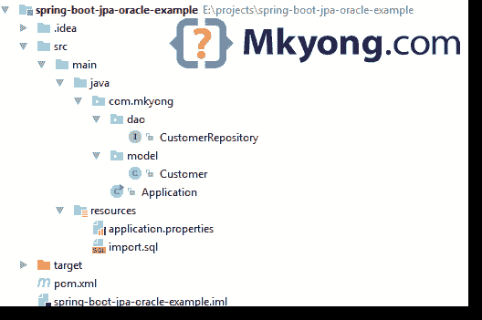

# Spring Boot +春季数据 JPA + Oracle 示例

> 原文：<http://web.archive.org/web/20230101150211/https://mkyong.com/spring-boot/spring-boot-spring-data-jpa-oracle-example/>

在本文中，我们将向您展示如何创建一个 Spring Boot+Spring Data JPA+Oracle+hikari CP 连接池示例。

本文中使用的工具:

1.  Spring Boot 1.5.1 .版本
2.  春季数据 1.13.0 .发布
3.  休眠 5
4.  Oracle 数据库 11g 快速版
5.  Oracle JDBC 驱动程序 ojdbc7.jar
6.  HikariCP 2.6
7.  专家
8.  Java 8

## 1.项目结构

一个标准的 Maven 项目结构。



## 2.项目依赖性

声明`spring-boot-starter-data-jpa`，它抓取 Spring 数据，Hibernate 和 JPA 相关的东西。

pom.xml

```java
 <project 
         xmlns:xsi="http://www.w3.org/2001/XMLSchema-instance"
         xsi:schemaLocation="http://maven.apache.org/POM/4.0.0
  http://maven.apache.org/maven-v4_0_0.xsd">
    <modelVersion>4.0.0</modelVersion>

    <groupId>com.mkyong</groupId>
    <artifactId>spring-boot-jpa-oracle-example</artifactId>
    <packaging>jar</packaging>
    <version>1.0</version>

    <parent>
        <groupId>org.springframework.boot</groupId>
        <artifactId>spring-boot-starter-parent</artifactId>
        <version>1.5.1.RELEASE</version>
    </parent>

    <properties>
        <java.version>1.8</java.version>
    </properties>

    <dependencies>

        <dependency>
            <groupId>org.springframework.boot</groupId>
            <artifactId>spring-boot-starter</artifactId>
        </dependency>

        <!-- Spring data JPA, default tomcat pool, exclude it -->
        <dependency>
            <groupId>org.springframework.boot</groupId>
            <artifactId>spring-boot-starter-data-jpa</artifactId>
            <exclusions>
                <exclusion>
                    <groupId>org.apache.tomcat</groupId>
                    <artifactId>tomcat-jdbc</artifactId>
                </exclusion>
            </exclusions>
        </dependency>

        <!-- Oracle JDBC driver -->
        <dependency>
            <groupId>com.oracle</groupId>
            <artifactId>ojdbc7</artifactId>
            <version>12.1.0</version>
        </dependency>

        <!-- HikariCP connection pool -->
        <dependency>
            <groupId>com.zaxxer</groupId>
            <artifactId>HikariCP</artifactId>
            <version>2.6.0</version>
        </dependency>

    </dependencies>

    <build>
        <plugins>
            <!-- Package as an executable jar/war -->
            <plugin>
                <groupId>org.springframework.boot</groupId>
                <artifactId>spring-boot-maven-plugin</artifactId>
            </plugin>

        </plugins>
    </build>

</project> 
```

详细检查项目依赖关系。

Terminal

```java
 $ mvn dependency:tree
[INFO] ------------------------------------------------------------------------
[INFO] Building spring-boot-jpa-oracle-example 1.0
[INFO] ------------------------------------------------------------------------
[INFO]
[INFO] --- maven-dependency-plugin:2.10:tree (default-cli) @ spring-boot-jpa-oracle-example ---
[INFO] com.mkyong:spring-boot-jpa-oracle-example:jar:1.0
[INFO] +- org.springframework.boot:spring-boot-starter:jar:1.5.1.RELEASE:compile
[INFO] |  +- org.springframework.boot:spring-boot:jar:1.5.1.RELEASE:compile
[INFO] |  |  \- org.springframework:spring-context:jar:4.3.6.RELEASE:compile
[INFO] |  |     \- org.springframework:spring-expression:jar:4.3.6.RELEASE:compile
[INFO] |  +- org.springframework.boot:spring-boot-autoconfigure:jar:1.5.1.RELEASE:compile
[INFO] |  +- org.springframework.boot:spring-boot-starter-logging:jar:1.5.1.RELEASE:compile
[INFO] |  |  +- ch.qos.logback:logback-classic:jar:1.1.9:compile
[INFO] |  |  |  \- ch.qos.logback:logback-core:jar:1.1.9:compile
[INFO] |  |  +- org.slf4j:jcl-over-slf4j:jar:1.7.22:compile
[INFO] |  |  +- org.slf4j:jul-to-slf4j:jar:1.7.22:compile
[INFO] |  |  \- org.slf4j:log4j-over-slf4j:jar:1.7.22:compile
[INFO] |  +- org.springframework:spring-core:jar:4.3.6.RELEASE:compile
[INFO] |  \- org.yaml:snakeyaml:jar:1.17:runtime
[INFO] +- org.springframework.boot:spring-boot-starter-data-jpa:jar:1.5.1.RELEASE:compile
[INFO] |  +- org.springframework.boot:spring-boot-starter-aop:jar:1.5.1.RELEASE:compile
[INFO] |  |  +- org.springframework:spring-aop:jar:4.3.6.RELEASE:compile
[INFO] |  |  \- org.aspectj:aspectjweaver:jar:1.8.9:compile
[INFO] |  +- org.springframework.boot:spring-boot-starter-jdbc:jar:1.5.1.RELEASE:compile
[INFO] |  |  \- org.springframework:spring-jdbc:jar:4.3.6.RELEASE:compile
[INFO] |  +- org.hibernate:hibernate-core:jar:5.0.11.Final:compile
[INFO] |  |  +- org.jboss.logging:jboss-logging:jar:3.3.0.Final:compile
[INFO] |  |  +- org.hibernate.javax.persistence:hibernate-jpa-2.1-api:jar:1.0.0.Final:compile
[INFO] |  |  +- org.javassist:javassist:jar:3.21.0-GA:compile
[INFO] |  |  +- antlr:antlr:jar:2.7.7:compile
[INFO] |  |  +- org.jboss:jandex:jar:2.0.0.Final:compile
[INFO] |  |  +- dom4j:dom4j:jar:1.6.1:compile
[INFO] |  |  \- org.hibernate.common:hibernate-commons-annotations:jar:5.0.1.Final:compile
[INFO] |  +- org.hibernate:hibernate-entitymanager:jar:5.0.11.Final:compile
[INFO] |  +- javax.transaction:javax.transaction-api:jar:1.2:compile
[INFO] |  +- org.springframework.data:spring-data-jpa:jar:1.11.0.RELEASE:compile
[INFO] |  |  +- org.springframework.data:spring-data-commons:jar:1.13.0.RELEASE:compile
[INFO] |  |  +- org.springframework:spring-orm:jar:4.3.6.RELEASE:compile
[INFO] |  |  +- org.springframework:spring-tx:jar:4.3.6.RELEASE:compile
[INFO] |  |  \- org.springframework:spring-beans:jar:4.3.6.RELEASE:compile
[INFO] |  \- org.springframework:spring-aspects:jar:4.3.6.RELEASE:compile
[INFO] +- com.oracle:ojdbc7:jar:12.1.0:compile
[INFO] \- com.zaxxer:HikariCP:jar:2.6.0:compile
[INFO]    \- org.slf4j:slf4j-api:jar:1.7.22:compile
[INFO] ------------------------------------------------------------------------
[INFO] BUILD SUCCESS
[INFO] ------------------------------------------------------------------------ 
```

**Note**
Read this – [Maven Install Oracle JDBC driver](http://web.archive.org/web/20220930231922/https://www.mkyong.com/maven/how-to-add-oracle-jdbc-driver-in-your-maven-local-repository/)

## 3.Java 持久性 API–JPA

3.1 客户模型。添加 JPA 注释，并使用“sequence”来生成自动增加的主 ID。

Customer.java

```java
 package com.mkyong.model;

import javax.persistence.*;
import java.util.Date;

@Entity
public class Customer {

	// "customer_seq" is Oracle sequence name.
    @Id
    @GeneratedValue(strategy = GenerationType.SEQUENCE, generator = "CUST_SEQ")
    @SequenceGenerator(sequenceName = "customer_seq", allocationSize = 1, name = "CUST_SEQ")
    Long id;

    String name;

	String email;

    @Column(name = "CREATED_DATE")
    Date date;

    //getters and setters, contructors
} 
```

## 4.配置+数据库初始化

4.1 配置 Oracle 数据源、HikariCP 设置并显示 Hibernate 查询。

application.properties

```java
 spring.main.banner-mode=off

# create and drop tables and sequences, loads import.sql
spring.jpa.hibernate.ddl-auto=create-drop

# Oracle settings
spring.datasource.url=jdbc:oracle:thin:@localhost:1521:xe
spring.datasource.username=system
spring.datasource.password=password
spring.datasource.driver-class-oracle.jdbc.driver.OracleDriver

# HikariCP settings
# spring.datasource.hikari.*

spring.datasource.hikari.connection-timeout=60000
spring.datasource.hikari.maximum-pool-size=5

# logging
logging.pattern.console=%d{yyyy-MM-dd HH:mm:ss} %-5level %logger{36} - %msg%n
logging.level.org.hibernate.SQL=debug
#logging.level.org.hibernate.type.descriptor.sql=trace
logging.level.=error 
```

4.2 如果在类路径中找到了`import.sql`，Hibernate 会自动加载。

import.sql

```java
 INSERT INTO "CUSTOMER" (ID, NAME, EMAIL, CREATED_DATE) VALUES(1, 'mkyong','111@yahoo.com', TO_DATE('2017-02-11', 'yyyy-mm-dd'));
INSERT INTO "CUSTOMER" (ID, NAME, EMAIL, CREATED_DATE) VALUES(2, 'yflow','222@yahoo.com', TO_DATE('2017-02-12', 'yyyy-mm-dd'));
INSERT INTO "CUSTOMER" (ID, NAME, EMAIL, CREATED_DATE) VALUES(3, 'zilap','333@yahoo.com', TO_DATE('2017-02-13', 'yyyy-mm-dd')); 
```

**Note**
Read this – [Spring Database initialization](http://web.archive.org/web/20220930231922/https://docs.spring.io/spring-boot/docs/current/reference/html/howto-database-initialization.html)

## 5.@仓库

5.1 创建接口并扩展 Spring 数据`CrudRepository`

CustomerRepository.java

```java
 package com.mkyong.dao;

import com.mkyong.model.Customer;
import org.springframework.data.jpa.repository.Query;
import org.springframework.data.repository.CrudRepository;
import org.springframework.data.repository.query.Param;

import java.util.Date;
import java.util.List;
import java.util.stream.Stream;

public interface CustomerRepository extends CrudRepository<Customer, Long> {

    List<Customer> findByEmail(String email);

    List<Customer> findByDate(Date date);

	// custom query example and return a stream
    @Query("select c from Customer c where c.email = :email")
    Stream<Customer> findByEmailReturnStream(@Param("email") String email);

} 
```

**Note**
No need implementation, Spring data will create the common implementation by field name, like findByfieldName (). Read this [working with Spring Data Repositories](http://web.archive.org/web/20220930231922/https://docs.spring.io/spring-data/data-commons/docs/current/reference/html/#repositories)

## 6.Spring Boot 起动器

Application.java

```java
 package com.mkyong;

import com.mkyong.dao.CustomerRepository;
import com.mkyong.model.Customer;
import org.springframework.beans.factory.annotation.Autowired;
import org.springframework.boot.CommandLineRunner;
import org.springframework.boot.SpringApplication;
import org.springframework.boot.autoconfigure.SpringBootApplication;
import org.springframework.transaction.annotation.Transactional;

import javax.sql.DataSource;
import java.text.SimpleDateFormat;
import java.util.stream.Stream;

import static java.lang.System.exit;

@SpringBootApplication
public class Application implements CommandLineRunner {

    private static final SimpleDateFormat sdf = new SimpleDateFormat("yyyy-MM-dd");

    @Autowired
    DataSource dataSource;

    @Autowired
    CustomerRepository customerRepository;

    public static void main(String[] args) throws Exception {
        SpringApplication.run(Application.class, args);
    }

    @Transactional(readOnly = true)
    @Override
    public void run(String... args) throws Exception {

        System.out.println("DATASOURCE = " + dataSource);

        System.out.println("\n1.findAll()...");
        for (Customer customer : customerRepository.findAll()) {
            System.out.println(customer);
        }

        System.out.println("\n2.findByEmail(String email)...");
        for (Customer customer : customerRepository.findByEmail("222@yahoo.com")) {
            System.out.println(customer);
        }

        System.out.println("\n3.findByDate(Date date)...");
        for (Customer customer : customerRepository.findByDate(sdf.parse("2017-02-12"))) {
            System.out.println(customer);
        }

        // For Stream, need @Transactional
        System.out.println("\n4.findByEmailReturnStream(@Param(\"email\") String email)...");
        try (Stream<Customer> stream = customerRepository.findByEmailReturnStream("333@yahoo.com")) {
            stream.forEach(x -> System.out.println(x));
        }

        System.out.println("Done!");

        exit(0);
    }

} 
```

## 8.演示

运行它，阅读控制台不言自明。

Terminal

```java
 2017-02-22 12:36:49 DEBUG org.hibernate.SQL - drop table customer cascade constraints
2017-02-22 12:36:49 ERROR o.h.tool.hbm2ddl.SchemaExport - HHH000389: Unsuccessful: drop table customer cascade constraints
2017-02-22 12:36:49 ERROR o.h.tool.hbm2ddl.SchemaExport - ORA-00942: table or view does not exist

2017-02-22 12:36:49 DEBUG org.hibernate.SQL - drop sequence customer_seq
2017-02-22 12:36:49 ERROR o.h.tool.hbm2ddl.SchemaExport - HHH000389: Unsuccessful: drop sequence customer_seq
2017-02-22 12:36:49 ERROR o.h.tool.hbm2ddl.SchemaExport - ORA-02289: sequence does not exist

2017-02-22 12:36:49 DEBUG org.hibernate.SQL - create sequence customer_seq start with 1 increment by 1
2017-02-22 12:36:49 DEBUG org.hibernate.SQL - create table customer (id number(19,0) not null, created_date timestamp, email varchar2(255 char), name varchar2(255 char), primary key (id))
DATASOURCE = HikariDataSource (HikariPool-1)

1.findAll()...
2017-02-22 12:36:50 DEBUG org.hibernate.SQL - select customer0_.id as id1_0_, customer0_.created_date as created_date2_0_, customer0_.email as email3_0_, customer0_.name as name4_0_ from customer customer0_
Customer{id=1, name='mkyong', email='111@yahoo.com', date=2017-02-11 00:00:00.0}
Customer{id=2, name='yflow', email='222@yahoo.com', date=2017-02-12 00:00:00.0}
Customer{id=3, name='zilap', email='333@yahoo.com', date=2017-02-13 00:00:00.0}

2.findByEmail(String email)...
2017-02-22 12:36:50 DEBUG org.hibernate.SQL - select customer0_.id as id1_0_, customer0_.created_date as created_date2_0_, customer0_.email as email3_0_, customer0_.name as name4_0_ from customer customer0_ where customer0_.email=?
Customer{id=2, name='yflow', email='222@yahoo.com', date=2017-02-12 00:00:00.0}

3.findByDate(Date date)...
2017-02-22 12:36:50 DEBUG org.hibernate.SQL - select customer0_.id as id1_0_, customer0_.created_date as created_date2_0_, customer0_.email as email3_0_, customer0_.name as name4_0_ from customer customer0_ where customer0_.created_date=?
Customer{id=2, name='yflow', email='222@yahoo.com', date=2017-02-12 00:00:00.0}

4.findByEmailReturnStream(@Param("email") String email)...
2017-02-22 12:36:50 DEBUG org.hibernate.SQL - select customer0_.id as id1_0_, customer0_.created_date as created_date2_0_, customer0_.email as email3_0_, customer0_.name as name4_0_ from customer customer0_ where customer0_.email=?
Customer{id=3, name='zilap', email='333@yahoo.com', date=2017-02-13 00:00:00.0}
Done!
2017-02-22 12:36:50 DEBUG org.hibernate.SQL - drop table customer cascade constraints
2017-02-22 12:36:50 DEBUG org.hibernate.SQL - drop sequence customer_seq

Process finished with exit code 0 
```

## 下载源代码

Download – [spring-boot-jpa-oracle-example.zip](http://web.archive.org/web/20220930231922/http://www.mkyong.com/wp-content/uploads/2017/02/spring-boot-jpa-oracle-example.zip) (6 KB)

## 参考

1.  [Maven 安装甲骨文 JDBC 驱动](http://web.archive.org/web/20220930231922/https://www.mkyong.com/maven/how-to-add-oracle-jdbc-driver-in-your-maven-local-repository/)
2.  [使用 JPA 初始化数据库](http://web.archive.org/web/20220930231922/https://docs.spring.io/spring-boot/docs/current/reference/html/howto-database-initialization.html)
3.  [弹簧靴 ddl 自动发电机](http://web.archive.org/web/20220930231922/https://stackoverflow.com/questions/21113154/spring-boot-ddl-auto-generator)
4.  [Spring 数据共享——参考文档](http://web.archive.org/web/20220930231922/https://docs.spring.io/spring-data/data-commons/docs/current/reference/html/)
5.  [使用 JPA 访问数据](http://web.archive.org/web/20220930231922/https://spring.io/guides/gs/accessing-data-jpa/)
6.  [TopLink JPA:如何配置主键生成](http://web.archive.org/web/20220930231922/http://www.oracle.com/technetwork/middleware/ias/id-generation-083058.html)
7.  [Oracle / PLSQL:序列(自动编号)](http://web.archive.org/web/20220930231922/https://www.techonthenet.com/oracle/sequences.php)
8.  [Spring Boot JDBC + Oracle 数据库+ Commons DBCP2 示例](http://web.archive.org/web/20220930231922/http://www.mkyong.com/spring-boot/spring-boot-jdbc-oracle-database-commons-dbcp2-example/)

<input type="hidden" id="mkyong-current-postId" value="14457">