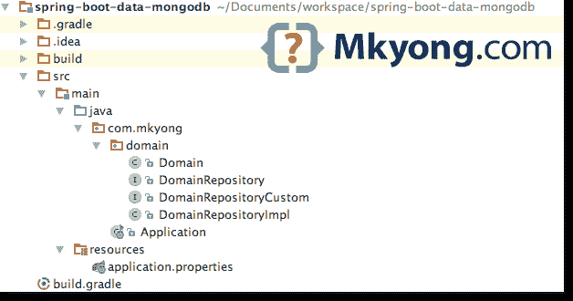

# Spring Boot + Spring 数据 MongoDB 示例

> 原文：<http://web.archive.org/web/20230101150211/https://mkyong.com/spring-boot/spring-boot-spring-data-mongodb-example/>

在本文中，我们将向您展示如何使用 Gradle 构建工具创建一个 Spring Boot + Spring 数据 MongoDB 应用程序。

1.  Spring Boot 1.5.1 .版本
2.  MongoDB
3.  Gradle
4.  Java 8

## 1.项目结构

标准项目结构。

 ## 2.项目依赖性

2.1 一个 Gradle 构建文件。

build.gradle

```java
 buildscript {
    repositories {
        mavenCentral()
    }
    dependencies {
        classpath("org.springframework.boot:spring-boot-gradle-plugin:1.5.1.RELEASE")
    }
}

apply plugin: 'java'
apply plugin: 'eclipse'
apply plugin: 'idea'
apply plugin: 'org.springframework.boot'

jar {
    baseName = 'spring-data-mongodb-example'
    version =  '1.0'
}

repositories {
    mavenCentral()
}

sourceCompatibility = 1.8
targetCompatibility = 1.8

dependencies {
    compile 'org.springframework.boot:spring-boot-starter-data-mongodb'
} 
```

2.2 声明了一个`spring-boot-starter-data-mongodb`，它抓取了大量的库，查看以下依赖项:

Console

```java
 $ gradle dependencies --configuration runtime
:dependencies

------------------------------------------------------------
Root project
------------------------------------------------------------

runtime - Runtime classpath for source set 'main'.
\--- org.springframework.boot:spring-boot-starter-data-mongodb: -> 1.5.1.RELEASE
     +--- org.springframework.boot:spring-boot-starter:1.5.1.RELEASE
     |    +--- org.springframework.boot:spring-boot:1.5.1.RELEASE
     |    |    +--- org.springframework:spring-core:4.3.6.RELEASE
     |    |    \--- org.springframework:spring-context:4.3.6.RELEASE
     |    |         +--- org.springframework:spring-aop:4.3.6.RELEASE
     |    |         |    +--- org.springframework:spring-beans:4.3.6.RELEASE
     |    |         |    |    \--- org.springframework:spring-core:4.3.6.RELEASE
     |    |         |    \--- org.springframework:spring-core:4.3.6.RELEASE
     |    |         +--- org.springframework:spring-beans:4.3.6.RELEASE (*)
     |    |         +--- org.springframework:spring-core:4.3.6.RELEASE
     |    |         \--- org.springframework:spring-expression:4.3.6.RELEASE
     |    |              \--- org.springframework:spring-core:4.3.6.RELEASE
     |    +--- org.springframework.boot:spring-boot-autoconfigure:1.5.1.RELEASE
     |    |    \--- org.springframework.boot:spring-boot:1.5.1.RELEASE (*)
     |    +--- org.springframework.boot:spring-boot-starter-logging:1.5.1.RELEASE
     |    |    +--- ch.qos.logback:logback-classic:1.1.9
     |    |    |    +--- ch.qos.logback:logback-core:1.1.9
     |    |    |    \--- org.slf4j:slf4j-api:1.7.22
     |    |    +--- org.slf4j:jcl-over-slf4j:1.7.22
     |    |    |    \--- org.slf4j:slf4j-api:1.7.22
     |    |    +--- org.slf4j:jul-to-slf4j:1.7.22
     |    |    |    \--- org.slf4j:slf4j-api:1.7.22
     |    |    \--- org.slf4j:log4j-over-slf4j:1.7.22
     |    |         \--- org.slf4j:slf4j-api:1.7.22
     |    +--- org.springframework:spring-core:4.3.6.RELEASE
     |    \--- org.yaml:snakeyaml:1.17
     +--- org.mongodb:mongodb-driver:3.4.1
     |    +--- org.mongodb:mongodb-driver-core:3.4.1
     |    |    \--- org.mongodb:bson:3.4.1
     |    \--- org.mongodb:bson:3.4.1
     \--- org.springframework.data:spring-data-mongodb:1.10.0.RELEASE
          +--- org.springframework:spring-tx:4.3.6.RELEASE
          |    +--- org.springframework:spring-beans:4.3.6.RELEASE (*)
          |    \--- org.springframework:spring-core:4.3.6.RELEASE
          +--- org.springframework:spring-context:4.3.6.RELEASE (*)
          +--- org.springframework:spring-beans:4.3.6.RELEASE (*)
          +--- org.springframework:spring-core:4.3.6.RELEASE
          +--- org.springframework:spring-expression:4.3.6.RELEASE (*)
          +--- org.springframework.data:spring-data-commons:1.13.0.RELEASE
          |    +--- org.springframework:spring-core:4.3.6.RELEASE
          |    +--- org.springframework:spring-beans:4.3.6.RELEASE (*)
          |    +--- org.slf4j:slf4j-api:1.7.22
          |    \--- org.slf4j:jcl-over-slf4j:1.7.22 (*)
          +--- org.slf4j:slf4j-api:1.7.22
          \--- org.slf4j:jcl-over-slf4j:1.7.22 (*) 
```

 ## 3.MongoDB 配置

application.properties

```java
 #mongodb
spring.data.mongodb.host=localhost
spring.data.mongodb.port=27017
spring.data.mongodb.database=app1

#logging
logging.level.org.springframework.data=debug
logging.level.=error 
```

## 4.Spring 数据–mongo repository

4.1 带有 Spring 数据注释的简单模型。

Domain.java

```java
 package com.mkyong.domain;

import org.springframework.data.annotation.Id;
import org.springframework.data.mongodb.core.index.Indexed;
import org.springframework.data.mongodb.core.mapping.Document;

@Document(collection = "domain")
public class Domain {

    @Id
    private long id;

    @Indexed(unique = true)
    private String domain;

    private boolean displayAds;

    //getters and setters 
} 
```

4.2 扩展`MongoRepository`，自动拥有 CRUD 功能。Spring 数据附带了许多神奇的`findBy`查询，查看官方[Spring data MongoDB–查询方法](http://web.archive.org/web/20190224163503/http://docs.spring.io/spring-data/data-document/docs/current/reference/html/#mongodb.repositories.queries)了解详情。

DomainRepository.java

```java
 package com.mkyong.domain;

import org.springframework.data.mongodb.repository.MongoRepository;
import org.springframework.data.mongodb.repository.Query;

import java.util.List;

// No need implementation, just one interface, and you have CRUD, thanks Spring Data
public interface DomainRepository extends MongoRepository<Domain, Long> {

    Domain findFirstByDomain(String domain);

    Domain findByDomainAndDisplayAds(String domain, boolean displayAds);

    //Supports native JSON query string
    @Query("{domain:'?0'}")
    Domain findCustomByDomain(String domain);

    @Query("{domain: { $regex: ?0 } })")
    List<Domain> findCustomByRegExDomain(String domain);

} 
```

4.3 要为`DomainRepository`创建自定义方法，您需要在另一个文件中创建实现，并让`DomainRepository`扩展它。

以下示例将自定义的“更新特定字段”方法添加到`MongoRepository`

自定义界面

DomainRepositoryCustom.java

```java
 package com.mkyong.domain;

public interface DomainRepositoryCustom {

    int updateDomain(String domain, boolean displayAds);

} 
```

4.3.2 实现类的名字很严格，名字必须是`"CoreRepositoryInterface" + Impl`，读这个 [Spring data MongoDB 自定义实现](http://web.archive.org/web/20190224163503/http://docs.spring.io/spring-data/data-document/docs/current/reference/html/#repositories.custom-implementations)

DomainRepositoryCustom.java

```java
 package com.mkyong.domain;

import com.mongodb.WriteResult;
import org.springframework.beans.factory.annotation.Autowired;
import org.springframework.data.mongodb.core.MongoTemplate;
import org.springframework.data.mongodb.core.query.Criteria;
import org.springframework.data.mongodb.core.query.Query;
import org.springframework.data.mongodb.core.query.Update;

//Impl postfix of the name on it compared to the core repository interface
public class DomainRepositoryImpl implements DomainRepositoryCustom {

    @Autowired
    MongoTemplate mongoTemplate;

    @Override
    public int updateDomain(String domain, boolean displayAds) {

        Query query = new Query(Criteria.where("domain").is(domain));
        Update update = new Update();
        update.set("displayAds", displayAds);

        WriteResult result = mongoTemplate.updateFirst(query, update, Domain.class);

        if(result!=null)
            return result.getN();
        else
            return 0;

    }
} 
```

4.3.3 `DomainRepository`扩展自定义接口`DomainRepositoryCustom`

DomainRepository.java

```java
 package com.mkyong.domain;

import org.springframework.data.mongodb.repository.MongoRepository;
import org.springframework.data.mongodb.repository.Query;

import java.util.List;

public interface DomainRepository extends MongoRepository<Domain, Long>, DomainRepositoryCustom {

	//other methods

} 
```

## 5.奔跑

5.1 Spring Boot 应用程序。

Application.java

```java
 package com.mkyong;

import com.mkyong.domain.Domain;
import com.mkyong.domain.DomainRepository;
import org.springframework.boot.CommandLineRunner;
import org.springframework.boot.SpringApplication;
import org.springframework.boot.autoconfigure.SpringBootApplication;
import org.springframework.context.annotation.Bean;

@SpringBootApplication
public class Application {

    public static void main(String[] args) {
        SpringApplication.run(Application.class, args);
    }

    @Bean
    CommandLineRunner init(DomainRepository domainRepository) {

        return args -> {

            Domain obj = domainRepository.findOne(7L);
            System.out.println(obj);

            Domain obj2 = domainRepository.findFirstByDomain("mkyong.com");
            System.out.println(obj2);

            int n = domainRepository.updateDomain("mkyong.com", true);
            System.out.println("Number of records updated : " + n);

        };

    }

} 
```

5.2 Gradle 构建并运行它。

Terminal

```java
 $ gradle build

$ java -jar build/libs/spring-data-mongodb-example-1.0.jar

  .   ____          _            __ _ _
 /\\ / ___'_ __ _ _(_)_ __  __ _ \ \ \ \
( ( )\___ | '_ | '_| | '_ \/ _` | \ \ \ \
 \\/  ___)| |_)| | | | | || (_| |  ) ) ) )
  '  |____| .__|_| |_|_| |_\__, | / / / /
 =========|_|==============|___/=/_/_/_/
 :: Spring Boot ::        (v1.5.1.RELEASE)

//blah blah blah 
```

## 6.常见问题

6.1 如何创建自定义`MongoTemple`？
答:声明一个新的`MongoTemplate` bean 来覆盖默认值。在下面的例子中，它创建了一个自定义的`MongoTemplate`来删除`_class`字段。

Application.java

```java
 package com.mkyong;

import org.springframework.boot.SpringApplication;
import org.springframework.boot.autoconfigure.SpringBootApplication;
import org.springframework.context.annotation.Bean;
import org.springframework.data.mongodb.MongoDbFactory;
import org.springframework.data.mongodb.core.MongoTemplate;
import org.springframework.data.mongodb.core.convert.DefaultDbRefResolver;
import org.springframework.data.mongodb.core.convert.DefaultMongoTypeMapper;
import org.springframework.data.mongodb.core.convert.MappingMongoConverter;
import org.springframework.data.mongodb.core.mapping.MongoMappingContext;

@SpringBootApplication
public class Application {

    public static void main(String[] args) {
        SpringApplication.run(Application.class, args);
    }

    //remove _class
    @Bean
    public MongoTemplate mongoTemplate(MongoDbFactory mongoDbFactory,
                                       MongoMappingContext context) {

        MappingMongoConverter converter =
                new MappingMongoConverter(new DefaultDbRefResolver(mongoDbFactory), context);
        converter.setTypeMapper(new DefaultMongoTypeMapper(null));

        MongoTemplate mongoTemplate = new MongoTemplate(mongoDbFactory, converter);

        return mongoTemplate;

    }

} 
```

## 下载源代码

Download – [spring-boot-data-mongodb-example.zip](http://web.archive.org/web/20190224163503/http://www.mkyong.com/wp-content/uploads/2017/03/spring-boot-data-mongodb-example.zip) (7 KB)

## 参考

1.  [Spring Data MongoDB–参考文档](http://web.archive.org/web/20190224163503/http://docs.spring.io/spring-data/data-document/docs/current/reference/html/)
2.  [与 NoSQL 科技合作](http://web.archive.org/web/20190224163503/http://docs.spring.io/spring-boot/docs/current/reference/html/boot-features-nosql.html)
3.  [Spring Boot Gradle 插件](http://web.archive.org/web/20190224163503/http://docs.spring.io/spring-boot/docs/current/reference/html/build-tool-plugins-gradle-plugin.html)
4.  [用 Spring Boot 构建应用](http://web.archive.org/web/20190224163503/https://spring.io/guides/gs/spring-boot/)
5.  [Gradle–显示项目相关性](http://web.archive.org/web/20190224163503/https://www.mkyong.com/gradle/gradle-display-project-dependency/)

[gradle](http://web.archive.org/web/20190224163503/http://www.mkyong.com/tag/gradle/) [mongodb](http://web.archive.org/web/20190224163503/http://www.mkyong.com/tag/mongodb/) [spring boot](http://web.archive.org/web/20190224163503/http://www.mkyong.com/tag/spring-boot/) [spring-data](http://web.archive.org/web/20190224163503/http://www.mkyong.com/tag/spring-data/)


