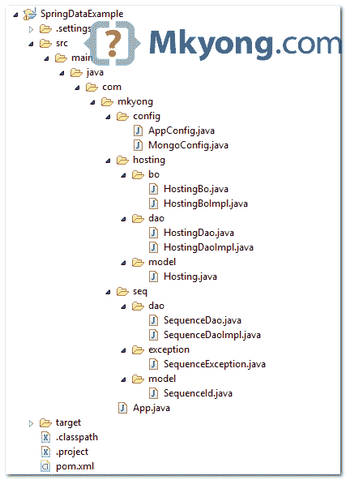

# Spring 数据 MongoDB–自动序列 ID 示例

> 原文：<http://web.archive.org/web/20230101150211/http://www.mkyong.com/mongodb/spring-data-mongodb-auto-sequence-id-example/>

在本教程中，我们将向您展示如何在 MongoDB + Spring 数据环境中生成一个自动递增的序列 id。

本项目中使用的工具:

1.  Spring Data MongoDB 1.2.1.RELEASE
2.  MongoDB 2.4.5
3.  Eclipse 4.2
4.  maven3

在本教程结束时，如果保存了集合名称“hosting ”,将会分配一个新的自动递增序列 id。下面是生成序列 id 的 Java 代码片段。

```java
 public long getNextSequenceId(String key) {

	Query query = new Query(Criteria.where("_id").is(key));

        Update update = new Update();
	update.inc("seq", 1);

	FindAndModifyOptions options = new FindAndModifyOptions();
	options.returnNew(true);

	SequenceId seqId = 
            mongoOperation.findAndModify(query, update, options, SequenceId.class);

	return seqId.getSeq();

  } 
```

## 1.项目结构

查看项目目录结构，这是一个标准的 Maven 项目。

 ## 2.Maven Pom

如果您对项目依赖关系感兴趣。

pom.xml

```java
 <project ...>
	<properties>
		<jdk.version>1.6</jdk.version>
		<spring.version>3.2.2.RELEASE</spring.version>
		<mongojavadriver.version>2.11.1</mongojavadriver.version>
		<springdata.version>1.2.1.RELEASE</springdata.version>
	</properties>

	<dependencies>

		<!-- Spring Core -->
		<dependency>
			<groupId>org.springframework</groupId>
			<artifactId>spring-core</artifactId>
			<version>${spring.version}</version>
		</dependency>

		<!-- need this for @Configuration -->
		<dependency>
			<groupId>cglib</groupId>
			<artifactId>cglib</artifactId>
			<version>2.2.2</version>
		</dependency>

		<!-- Spring Data for MongoDB -->
		<dependency>
			<groupId>org.springframework.data</groupId>
			<artifactId>spring-data-mongodb</artifactId>
			<version>${springdata.version}</version>
		</dependency>

		<!-- Java MongoDB Driver -->
		<dependency>
			<groupId>org.mongodb</groupId>
			<artifactId>mongo-java-driver</artifactId>
			<version>${mongojavadriver.version}</version>
		</dependency>

	</dependencies>
	<build>
		<finalName>SpringData</finalName>
		<plugins>
		  <plugin>
			<groupId>org.apache.maven.plugins</groupId>
			<artifactId>maven-compiler-plugin</artifactId>
			<version>2.3.2</version>
			<configuration>
				<source>${jdk.version}</source>
				<target>${jdk.version}</target>
			</configuration>
		  </plugin>
		</plugins>
	</build>

</project> 
```

 ## 3.序列集合

我们创建一个名为“sequence”的集合来存储自动增加的序列 id。参考下面的`SequenceDaoImpl.java`，它显示了生成序列 id 的代码。

**Note**
Create the “sequence” collection in your MongoDB first!

```java
 db.sequence.insert({_id: "hosting",seq: 0}) 
```

SequenceId.java

```java
 package com.mkyong.seq.model;

import org.springframework.data.annotation.Id;
import org.springframework.data.mongodb.core.mapping.Document;

@Document(collection = "sequence")
public class SequenceId {

	@Id
	private String id;

	private long seq;

	//get, set, toString...
} 
```

SequenceDao.java

```java
 package com.mkyong.seq.dao;

import com.mkyong.seq.exception.SequenceException;

public interface SequenceDao {

	long getNextSequenceId(String key) throws SequenceException;

} 
```

SequenceDaoImpl.java

```java
 package com.mkyong.seq.dao;

import org.springframework.beans.factory.annotation.Autowired;
import org.springframework.data.mongodb.core.FindAndModifyOptions;
import org.springframework.data.mongodb.core.MongoOperations;
import org.springframework.data.mongodb.core.query.Criteria;
import org.springframework.data.mongodb.core.query.Query;
import org.springframework.data.mongodb.core.query.Update;
import org.springframework.stereotype.Repository;

import com.mkyong.seq.exception.SequenceException;
import com.mkyong.seq.model.SequenceId;

@Repository
public class SequenceDaoImpl implements SequenceDao {

	@Autowired
	private MongoOperations mongoOperation;

	@Override
	public long getNextSequenceId(String key) throws SequenceException {

	  //get sequence id
	  Query query = new Query(Criteria.where("_id").is(key));

	  //increase sequence id by 1
	  Update update = new Update();
	  update.inc("seq", 1);

	  //return new increased id
	  FindAndModifyOptions options = new FindAndModifyOptions();
	  options.returnNew(true);

	  //this is the magic happened.
	  SequenceId seqId = 
            mongoOperation.findAndModify(query, update, options, SequenceId.class);

	  //if no id, throws SequenceException
          //optional, just a way to tell user when the sequence id is failed to generate.
	  if (seqId == null) {
		throw new SequenceException("Unable to get sequence id for key : " + key);
	  }

	  return seqId.getSeq();

	}

} 
```

SequenceException.java

```java
 package com.mkyong.seq.exception;

public class SequenceException extends RuntimeException {

	private static final long serialVersionUID = 1L;

	private String errCode;
	private String errMsg;

	//get, set...
	public SequenceException(String errMsg) {
		this.errMsg = errMsg;
	}

} 
```

## 4.获取序列 ID

为了获得序列 id，使用`sequenceDao.getNextSequenceId("key")`。

HostingBo.java

```java
 package com.mkyong.hosting.bo;

import com.mkyong.seq.exception.SequenceException;

public interface HostingBo {

	void save(String name) throws SequenceException;

} 
```

HostingBoImpl.java

```java
 package com.mkyong.hosting.bo;

import org.springframework.beans.factory.annotation.Autowired;
import org.springframework.stereotype.Service;

import com.mkyong.hosting.dao.HostingDao;
import com.mkyong.hosting.model.Hosting;
import com.mkyong.seq.dao.SequenceDao;
import com.mkyong.seq.exception.SequenceException;

@Service
public class HostingBoImpl implements HostingBo {

	private static final String HOSTING_SEQ_KEY = "hosting";

	@Autowired
	private SequenceDao sequenceDao;

	@Autowired
	private HostingDao hostingDao;

	@Override
	public void save(String name) throws SequenceException {

		Hosting hosting = new Hosting();

		hosting.setId(sequenceDao.getNextSequenceId(HOSTING_SEQ_KEY));
		hosting.setName(name);
		hostingDao.save(hosting);

		System.out.println(hosting);

	}

} 
```

## 5.测试

运行一个简单的测试。

```java
 package com.mkyong;

import org.springframework.context.ApplicationContext;
import org.springframework.context.annotation.AnnotationConfigApplicationContext;

import com.mkyong.config.AppConfig;
import com.mkyong.hosting.bo.HostingBo;
import com.mkyong.seq.exception.SequenceException;

public class App {

  public static void main(String[] args) {

	ApplicationContext ctx = 
            new AnnotationConfigApplicationContext(AppConfig.class);
	HostingBo hostingBo = (HostingBo) ctx.getBean("hostingBoImpl");

	try {

		hostingBo.save("cloud.google.com");
		hostingBo.save("heroku.com");
		hostingBo.save("cloudbees.com");

	} catch (SequenceException e) {
		System.out.println(e.getErrMsg());
	}

  }
} 
```

输出–Java 控制台

```java
 Hosting [id=1, name=cloud.google.com]
Hosting [id=2, name=heroku.com]
Hosting [id=3, name=cloudbees.com] 
```

MongoDB 控制台。

```java
 >mongo

> db.sequence.find()
{ "_id" : "hosting", "seq" : 3 }

> db.hosting.find()
{ "_id" : NumberLong(1), "_class" : "com.mkyong.hosting.model.Hosting", "name" : "cloud.google.com" }
{ "_id" : NumberLong(2), "_class" : "com.mkyong.hosting.model.Hosting", "name" : "heroku.com" }
{ "_id" : NumberLong(3), "_class" : "com.mkyong.hosting.model.Hosting", "name" : "cloudbees.com" }
> 
```

## 6.常见问题

q . sequence exception–无法获取密钥的序列 id:hosting？
A .记得创建“序列”集合！

```java
 db.sequence.insert({_id: "hosting",seq: 0}) 
```

## 下载源代码

Download – [SpringData-Auto-Sequence-Example.zip](http://web.archive.org/web/20190214221642/http://www.mkyong.com/wp-content/uploads/2014/03/SpringData-Auto-Sequence-Example.zip) (24 KB)

## 参考

1.  [MongoDB–创建一个自动递增序列字段](http://web.archive.org/web/20190214221642/http://docs.mongodb.org/manual/tutorial/create-an-auto-incrementing-field/)

[sequence id](http://web.archive.org/web/20190214221642/http://www.mkyong.com/tag/sequence-id/) [spring-data](http://web.archive.org/web/20190214221642/http://www.mkyong.com/tag/spring-data/)


