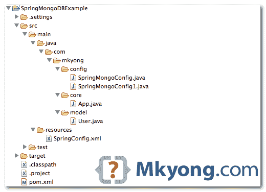

# Spring 数据 MongoDB hello world 示例

> 原文：<http://web.archive.org/web/20230101150211/http://www.mkyong.com/mongodb/spring-data-mongodb-hello-world-example/>

在本教程中，我们将向您展示如何使用" [SpringData for MongoDB](http://web.archive.org/web/20201112042503/http://www.springsource.org/spring-data/mongodb) "框架，通过 Spring 的注释和 XML schema 在 MongoDB 中执行 CRUD 操作。

**Updated on 1/04/2013**
Article is updated to use latest SpringData v 1.2.0.RELEASE, it was v1.0.0.M2.

使用的工具和技术:

1.  spring Data MongoDB–1 . 2 . 0 . release
2.  弹簧芯–3 . 2 . 2 .释放
3.  Java Mongo 驱动程序–2 . 11 . 0
4.  eclipse–4.2
5.  jdk 1.6
6.  maven–3 . 0 . 3

*P.S Spring 数据要求 JDK 6.0 及以上，Spring Framework 3.0.x 及以上。*

## 1.项目结构

一个经典的 Maven 风格的 Java 项目目录结构。

<noscript></noscript>



## 2.属国

需要以下库:

~~**spring-data-mongodb**
Currently, the “`spring-data-mongodb`” jar is only available in “*http://maven.springframework.org/milestone*“, so, you have to declare this repository also.~~

**更新于 2012 年 13 月 9 日**
`spring-data-mongodb`在 Maven 中央存储库中可用，不再需要 Spring 存储库。

pom.xml

```java
 <project  
    xmlns:xsi="http://www.w3.org/2001/XMLSchema-instance"
	xsi:schemaLocation="http://maven.apache.org/POM/4.0.0 
	http://maven.apache.org/maven-v4_0_0.xsd">
	<modelVersion>4.0.0</modelVersion>
	<groupId>com.mkyong.core</groupId>
	<artifactId>SpringMongoDBExample</artifactId>
	<packaging>jar</packaging>
	<version>1.0</version>
	<name>SpringMongoExample</name>
	<url>http://maven.apache.org</url>

	<dependencies>

		<!-- Spring framework -->
		<dependency>
			<groupId>org.springframework</groupId>
			<artifactId>spring-core</artifactId>
			<version>3.2.2.RELEASE</version>
		</dependency>

		<dependency>
			<groupId>org.springframework</groupId>
			<artifactId>spring-context</artifactId>
			<version>3.2.2.RELEASE</version>
		</dependency>

		<!-- mongodb java driver -->
		<dependency>
			<groupId>org.mongodb</groupId>
			<artifactId>mongo-java-driver</artifactId>
			<version>2.11.0</version>
		</dependency>

		<!-- Spring data mongodb -->
		<dependency>
			<groupId>org.springframework.data</groupId>
			<artifactId>spring-data-mongodb</artifactId>
			<version>1.2.0.RELEASE</version>
		</dependency>

		<dependency>
			<groupId>cglib</groupId>
			<artifactId>cglib</artifactId>
			<version>2.2.2</version>
		</dependency>

	</dependencies>

	<build>
		<plugins>
			<plugin>
				<artifactId>maven-compiler-plugin</artifactId>
				<version>3.0</version>
				<configuration>
					<source>1.6</source>
					<target>1.6</target>
				</configuration>
			</plugin>
			<plugin>
				<groupId>org.apache.maven.plugins</groupId>
				<artifactId>maven-eclipse-plugin</artifactId>
				<version>2.9</version>
				<configuration>
					<downloadSources>true</downloadSources>
					<downloadJavadocs>true</downloadJavadocs>
				</configuration>
			</plugin>
		</plugins>
	</build>

</project> 
```

## 3.Spring 配置、注释和 XML

在这里，我们向您展示了两种配置 Spring 数据和连接到 MongoDB 的方法，分别是通过注释和 XML schema。

Note
Refer to this official reference [Connecting to MongoDB with Spring](http://web.archive.org/web/20201112042503/http://static.springsource.org/spring-data/data-mongodb/docs/current/reference/html/mongo.core.html#mongodb-connectors).

**3.1 注释**
扩展了`AbstractMongoConfiguration`是最快的方式，它有助于配置你需要启动的一切，像`mongoTemplate`对象。

SpringMongoConfig.java

```java
 package com.mkyong.config;

import org.springframework.context.annotation.Bean;
import org.springframework.context.annotation.Configuration;
import org.springframework.data.mongodb.config.AbstractMongoConfiguration;

import com.mongodb.Mongo;
import com.mongodb.MongoClient;

@Configuration
public class SpringMongoConfig extends AbstractMongoConfiguration {

	@Override
	public String getDatabaseName() {
		return "yourdb";
	}

	@Override
	@Bean
	public Mongo mongo() throws Exception {
		return new MongoClient("127.0.0.1");
	}
} 
```

或者，我更喜欢这个，更灵活地配置一切。

SpringMongoConfig1.java

```java
 package com.mkyong.config;

import org.springframework.context.annotation.Bean;
import org.springframework.context.annotation.Configuration;
import org.springframework.data.mongodb.MongoDbFactory;
import org.springframework.data.mongodb.core.MongoTemplate;
import org.springframework.data.mongodb.core.SimpleMongoDbFactory;

import com.mongodb.MongoClient;

@Configuration
public class SpringMongoConfig1 {

	public @Bean
	MongoDbFactory mongoDbFactory() throws Exception {
		return new SimpleMongoDbFactory(new MongoClient(), "yourdb");
	}

	public @Bean
	MongoTemplate mongoTemplate() throws Exception {

		MongoTemplate mongoTemplate = new MongoTemplate(mongoDbFactory());

		return mongoTemplate;

	}

} 
```

并载入`AnnotationConfigApplicationContext`:

```java
 ApplicationContext ctx = new AnnotationConfigApplicationContext(SpringMongoConfig.class);
    MongoOperations mongoOperation = (MongoOperations)ctx.getBean("mongoTemplate"); 
```

**3.2 XML 模式**

SpringConfig.xml

```java
 <beans 
	xmlns:xsi="http://www.w3.org/2001/XMLSchema-instance" 
	xmlns:context="http://www.springframework.org/schema/context"
	xmlns:mongo="http://www.springframework.org/schema/data/mongo"
	xsi:schemaLocation="http://www.springframework.org/schema/context
          http://www.springframework.org/schema/context/spring-context-3.0.xsd
          http://www.springframework.org/schema/data/mongo
          http://www.springframework.org/schema/data/mongo/spring-mongo-1.0.xsd
          http://www.springframework.org/schema/beans
          http://www.springframework.org/schema/beans/spring-beans-3.0.xsd">

	<mongo:mongo host="127.0.0.1" port="27017" />
	<mongo:db-factory dbname="yourdb" />

	<bean id="mongoTemplate" class="org.springframework.data.mongodb.core.MongoTemplate">
		<constructor-arg name="mongoDbFactory" ref="mongoDbFactory" />
	</bean>

</beans> 
```

并将其包含在 Spring 的`GenericXmlApplicationContext`:

```java
 ApplicationContext ctx = new GenericXmlApplicationContext("SpringConfig.xml");
   MongoOperations mongoOperation = (MongoOperations)ctx.getBean("mongoTemplate"); 
```

**So, XML or Annotation?**
Actually, both are doing the same thing, it’s just based on personal preferences. Personally, I like XML to configure things.

## 4.用户模型

一个用户对象，annotated @ Document——保存哪个集合。稍后，我们将向您展示如何使用 Spring 数据将该对象绑定到 MongoDB 或从 MongoDB 绑定。

User.java

```java
 package com.mkyong.model;

import org.springframework.data.annotation.Id;
import org.springframework.data.mongodb.core.mapping.Document;

@Document(collection = "users")
public class User {

	@Id
	private String id;

	String username;

	String password;

	//getter, setter, toString, Constructors

} 
```

## 5.演示–CRUD 操作

完整的示例向您展示了如何使用 Spring 数据在 MongoDB 中执行 CRUD 操作。Spring 数据 API 非常简洁，应该是不言自明的。

App.java

```java
 package com.mkyong.core;

import java.util.List;

import org.springframework.context.ApplicationContext;
import org.springframework.context.annotation.AnnotationConfigApplicationContext;
import org.springframework.data.mongodb.core.MongoOperations;
import org.springframework.data.mongodb.core.query.Criteria;
import org.springframework.data.mongodb.core.query.Query;
import org.springframework.data.mongodb.core.query.Update;

import com.mkyong.config.SpringMongoConfig;
import com.mkyong.model.User;
//import org.springframework.context.support.GenericXmlApplicationContext;

public class App {

    public static void main(String[] args) {

	// For XML
	//ApplicationContext ctx = new GenericXmlApplicationContext("SpringConfig.xml");

	// For Annotation
	ApplicationContext ctx = 
             new AnnotationConfigApplicationContext(SpringMongoConfig.class);
	MongoOperations mongoOperation = (MongoOperations) ctx.getBean("mongoTemplate");

	User user = new User("mkyong", "password123");

	// save
	mongoOperation.save(user);

	// now user object got the created id.
	System.out.println("1\. user : " + user);

	// query to search user
	Query searchUserQuery = new Query(Criteria.where("username").is("mkyong"));

	// find the saved user again.
	User savedUser = mongoOperation.findOne(searchUserQuery, User.class);
	System.out.println("2\. find - savedUser : " + savedUser);

	// update password
	mongoOperation.updateFirst(searchUserQuery, 
                         Update.update("password", "new password"),User.class);

	// find the updated user object
	User updatedUser = mongoOperation.findOne(searchUserQuery, User.class);

	System.out.println("3\. updatedUser : " + updatedUser);

	// delete
	mongoOperation.remove(searchUserQuery, User.class);

	// List, it should be empty now.
	List<User> listUser = mongoOperation.findAll(User.class);
	System.out.println("4\. Number of user = " + listUser.size());

    }

} 
```

*输出*

```java
 1\. user : User [id=516627653004953049d9ddf0, username=mkyong, password=password123]
2\. find - savedUser : User [id=516627653004953049d9ddf0, username=mkyong, password=password123]
3\. updatedUser : User [id=516627653004953049d9ddf0, username=mkyong, password=new password]
4\. Number of user = 0 
```

## 下载源代码

Download it – [SpringMongoDB-HelloWorld-Example.zip](http://web.archive.org/web/20201112042503/http://www.mkyong.com/wp-content/uploads/2011/05/SpringMongoDB-HelloWorld-Example.zip) (24 KB)

## 参考

1.  【MongoDB 的春季数据
2.  [用 Spring 连接到 MongoDB】](http://web.archive.org/web/20201112042503/http://static.springsource.org/spring-data/data-mongodb/docs/current/reference/html/mongo.core.html#mongodb-connectors)
3.  [奥雷利春天数据 mongodb 教程](http://web.archive.org/web/20201112042503/http://ofps.oreilly.com/titles/9781449323950/id2318796_07-mongodb.html)
4.  [又一个好的春季数据 mongodb 教程](http://web.archive.org/web/20201112042503/http://krams915.blogspot.com/2011/02/spring-data-mongodb-tutorial.html)

Tags : [hello world](http://web.archive.org/web/20201112042503/https://mkyong.com/tag/hello-world/) [mongodb](http://web.archive.org/web/20201112042503/https://mkyong.com/tag/mongodb/) [spring-data](http://web.archive.org/web/20201112042503/https://mkyong.com/tag/spring-data/)<input type="hidden" id="mkyong-current-postId" value="8863">

### 相关文章

*   [由于基础科目的限制，你不能](/web/20201112042503/https://mkyong.com/java/due-to-limitations-of-the-basicdbobject-you-cant-add-a-second-and/)
*   [Spring Data MongoDB:插入文档](/web/20201112042503/https://mkyong.com/mongodb/spring-data-mongodb-insert-document/)
*   [Spring Data MongoDB:更新文档](/web/20201112042503/https://mkyong.com/mongodb/spring-data-mongodb-update-document/)
*   [Spring Data MongoDB:查询文档](/web/20201112042503/https://mkyong.com/mongodb/spring-data-mongodb-query-document/)
*   [Spring Data MongoDB:删除文档](/web/20201112042503/https://mkyong.com/mongodb/spring-data-mongodb-delete-document/)

*   [MongoDB hello world 示例](/web/20201112042503/https://mkyong.com/mongodb/mongodb-hello-world-example/)
*   [Spring Data MongoDB:保存二进制文件，GridFS exa](/web/20201112042503/https://mkyong.com/mongodb/spring-data-mongodb-save-binary-file-gridfs-example/)
*   [Spring Data MongoDB remove _ class 列](/web/20201112042503/https://mkyong.com/mongodb/spring-data-mongodb-remove-_class-column/)
*   [Spring Data MongoDB:获取最后修改的记录(d](/web/20201112042503/https://mkyong.com/mongodb/spring-data-mongodb-get-last-modified-records-date-sorting/)
*   [Spring Data MongoDB -选择要返回的字段](/web/20201112042503/https://mkyong.com/mongodb/spring-data-mongodb-select-fields-to-return/)