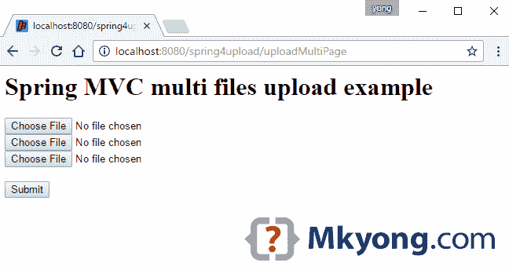

# Spring MVC 文件上传示例

> 原文：<http://web.archive.org/web/20230101150211/http://www.mkyong.com/spring-mvc/spring-mvc-file-upload-example/>

Spring 使用`MultipartResolver`接口来处理 web 应用中的文件上传，有两种实现方式:

1.  `StandardServletMultipartResolver`–Servlet 3.0 多部分请求解析。
2.  `CommonsMultipartResolver`–Classic commons-file upload . jar

本文中使用的工具:

1.  弹簧 4.3.5 .释放
2.  maven3
3.  Tomcat 7 或 8、Jetty 9 或任何 Servlet 3.0 容器

简而言之，本文向您展示了如何在 Spring MVC web 应用程序中处理文件上传，以及如何处理常见的超出最大文件大小异常。

**Note**
This article will focus on the Servlet 3.0 multipart request parsing.

*P.S 文章从 Spring 2.5.x 更新到 Spring 4.3.x*

## 1.项目结构

一个标准的 Maven 项目结构。

 <ins class="adsbygoogle" style="display:block; text-align:center;" data-ad-format="fluid" data-ad-layout="in-article" data-ad-client="ca-pub-2836379775501347" data-ad-slot="6894224149">## 2.项目依赖性

标准的 Spring 依赖，不需要额外的文件上传库。

pom.xml

```java
 <project 
         xmlns:xsi="http://www.w3.org/2001/XMLSchema-instance"
         xsi:schemaLocation="http://maven.apache.org/POM/4.0.0
  http://maven.apache.org/maven-v4_0_0.xsd">
    <modelVersion>4.0.0</modelVersion>
    <groupId>com.mkyong</groupId>
    <artifactId>spring-mvc-file-upload</artifactId>
    <packaging>war</packaging>
    <version>1.0-SNAPSHOT</version>
    <name>Spring MVC file upload</name>

    <properties>
        <jdk.version>1.8</jdk.version>
        <spring.version>4.3.5.RELEASE</spring.version>
        <jstl.version>1.2</jstl.version>
        <servletapi.version>3.1.0</servletapi.version>
        <logback.version>1.1.3</logback.version>
        <jcl.slf4j.version>1.7.12</jcl.slf4j.version>
    </properties>

    <dependencies>

        <dependency>
            <groupId>org.springframework</groupId>
            <artifactId>spring-webmvc</artifactId>
            <version>${spring.version}</version>
            <exclusions>
                <exclusion>
                    <groupId>commons-logging</groupId>
                    <artifactId>commons-logging</artifactId>
                </exclusion>
            </exclusions>
        </dependency>

        <dependency>
            <groupId>javax.servlet</groupId>
            <artifactId>jstl</artifactId>
            <version>${jstl.version}</version>
        </dependency>

        <!-- compile only, deployed container will provide this -->
        <dependency>
            <groupId>javax.servlet</groupId>
            <artifactId>javax.servlet-api</artifactId>
            <version>${servletapi.version}</version>
            <scope>provided</scope>
        </dependency>

		<!-- Logging -->
        <dependency>
            <groupId>org.slf4j</groupId>
            <artifactId>jcl-over-slf4j</artifactId>
            <version>${jcl.slf4j.version}</version>
        </dependency>

        <dependency>
            <groupId>ch.qos.logback</groupId>
            <artifactId>logback-classic</artifactId>
            <version>${logback.version}</version>
        </dependency>

    </dependencies>

    <build>
        <plugins>

            <plugin>
                <groupId>org.apache.maven.plugins</groupId>
                <artifactId>maven-compiler-plugin</artifactId>
                <version>3.3</version>
                <configuration>
                    <source>${jdk.version}</source>
                    <target>${jdk.version}</target>
                </configuration>
            </plugin>

            <!-- embedded Jetty server, for testing -->
            <plugin>
                <groupId>org.eclipse.jetty</groupId>
                <artifactId>jetty-maven-plugin</artifactId>
                <version>9.2.11.v20150529</version>
                <configuration>
                    <scanIntervalSeconds>10</scanIntervalSeconds>
                    <webApp>
                        <contextPath>/spring4upload</contextPath>
                    </webApp>
                </configuration>
            </plugin>

            <!-- configure Eclipse workspace -->
            <plugin>
                <groupId>org.apache.maven.plugins</groupId>
                <artifactId>maven-eclipse-plugin</artifactId>
                <version>2.9</version>
                <configuration>
                    <downloadSources>true</downloadSources>
                    <downloadJavadocs>true</downloadJavadocs>
                    <wtpversion>2.0</wtpversion>
                    <wtpContextName>/spring4upload</wtpContextName>
                </configuration>
            </plugin>

        </plugins>
    </build>

</project> 
```

 <ins class="adsbygoogle" style="display:block" data-ad-client="ca-pub-2836379775501347" data-ad-slot="8821506761" data-ad-format="auto" data-ad-region="mkyongregion">## 3.MultipartConfigElement

创建一个 Servlet 初始化器类并注册一个`javax.servlet.MultipartConfigElement`

MyWebInitializer.java

```java
 package com.mkyong;

import org.springframework.web.servlet.support.AbstractAnnotationConfigDispatcherServletInitializer;

import javax.servlet.MultipartConfigElement;
import javax.servlet.ServletRegistration;
import java.io.File;

public class MyWebInitializer extends
        AbstractAnnotationConfigDispatcherServletInitializer {

    private int maxUploadSizeInMb = 5 * 1024 * 1024; // 5 MB

    @Override
    protected Class<?>[] getServletConfigClasses() {
        return new Class[]{SpringWebMvcConfig.class};
    }

    @Override
    protected String[] getServletMappings() {
        return new String[]{"/"};
    }

    @Override
    protected Class<?>[] getRootConfigClasses() {
        return null;
    }

    @Override
    protected void customizeRegistration(ServletRegistration.Dynamic registration) {

        // upload temp file will put here
        File uploadDirectory = new File(System.getProperty("java.io.tmpdir"));

        // register a MultipartConfigElement
        MultipartConfigElement multipartConfigElement =
                new MultipartConfigElement(uploadDirectory.getAbsolutePath(),
                        maxUploadSizeInMb, maxUploadSizeInMb * 2, maxUploadSizeInMb / 2);

        registration.setMultipartConfig(multipartConfigElement);

    }

} 
```

查看 [MultipartConfigElement](http://web.archive.org/web/20190225100939/http://docs.oracle.com/javaee/6/api/javax/servlet/MultipartConfigElement.html) 方法签名。

```java
 public MultipartConfigElement(java.lang.String location,
                              long maxFileSize,
                              long maxRequestSize,
                              int fileSizeThreshold) 
```

## 4.弹簧配置

注册一个`multipartResolver` bean，并返回`StandardServletMultipartResolver`

SpringWebMvcConfig.java

```java
 package com.mkyong;

import org.springframework.context.annotation.Bean;
import org.springframework.context.annotation.ComponentScan;
import org.springframework.context.annotation.Configuration;
import org.springframework.web.multipart.MultipartResolver;
import org.springframework.web.multipart.support.StandardServletMultipartResolver;
import org.springframework.web.servlet.config.annotation.EnableWebMvc;
import org.springframework.web.servlet.config.annotation.WebMvcConfigurerAdapter;
import org.springframework.web.servlet.view.InternalResourceViewResolver;
import org.springframework.web.servlet.view.JstlView;

@EnableWebMvc
@Configuration
@ComponentScan({"com.mkyong"})
public class SpringWebMvcConfig extends WebMvcConfigurerAdapter {

	// Bean name must be "multipartResolver", by default Spring uses method name as bean name.
    @Bean
    public MultipartResolver multipartResolver() {
        return new StandardServletMultipartResolver();
    }

	/*
	// if the method name is different, you must define the bean name manually like this :
	@Bean(name = "multipartResolver")
    public MultipartResolver createMultipartResolver() {
        return new StandardServletMultipartResolver();
    }*/

    @Bean
    public InternalResourceViewResolver viewResolver() {
        InternalResourceViewResolver viewResolver = new InternalResourceViewResolver();
        viewResolver.setViewClass(JstlView.class);
        viewResolver.setPrefix("/WEB-INF/views/jsp/");
        viewResolver.setSuffix(".jsp");
        return viewResolver;
    }

} 
```

在这个阶段，Servlet 3.0 多部分请求解析配置正确，您可以开始上传文件了。

## 4.单个文件上传

4.1 普通 HTML 表单标签。

upload.jsp

```java
 <html>

<body>
<h1>Spring MVC file upload example</h1>

<form method="POST" action="${pageContext.request.contextPath}/upload" enctype="multipart/form-data">
    <input type="file" name="file" /><br/>
    <input type="submit" value="Submit" />
</form>

</body>
</html> 
```

4.2 显示上传状态的另一个页面。

uploadStatus.jsp

```java
 <html>
<body>
<h1>Upload Status</h1>
<h2>Message : ${message}</h2>
</body>
</html> 
```

4.3 在控制器中，将上传的文件映射到`MultipartFile`

UploadController.java

```java
 package com.mkyong.controller;

import org.springframework.stereotype.Controller;
import org.springframework.util.StringUtils;
import org.springframework.web.bind.annotation.GetMapping;
import org.springframework.web.bind.annotation.PostMapping;
import org.springframework.web.bind.annotation.RequestParam;
import org.springframework.web.multipart.MultipartFile;
import org.springframework.web.servlet.mvc.support.RedirectAttributes;

import java.io.IOException;
import java.nio.file.Files;
import java.nio.file.Path;
import java.nio.file.Paths;
import java.util.StringJoiner;

@Controller
public class UploadController {

	//Save the uploaded file to this folder
    private static String UPLOADED_FOLDER = "F://temp//";

    @GetMapping("/")
    public String index() {
        return "upload";
    }

    //@RequestMapping(value = "/upload", method = RequestMethod.POST)
    @PostMapping("/upload") // //new annotation since 4.3
    public String singleFileUpload(@RequestParam("file") MultipartFile file,
                                   RedirectAttributes redirectAttributes) {

        if (file.isEmpty()) {
            redirectAttributes.addFlashAttribute("message", "Please select a file to upload");
            return "redirect:uploadStatus";
        }

        try {

            // Get the file and save it somewhere
            byte[] bytes = file.getBytes();
            Path path = Paths.get(UPLOADED_FOLDER + file.getOriginalFilename());
            Files.write(path, bytes);

            redirectAttributes.addFlashAttribute("message", 
                        "You successfully uploaded '" + file.getOriginalFilename() + "'");

        } catch (IOException e) {
            e.printStackTrace();
        }

        return "redirect:/uploadStatus";
    }

    @GetMapping("/uploadStatus")
    public String uploadStatus() {
        return "uploadStatus";
    }

} 
```

## 5.多文件上传

5.1 只需添加更多的文件输入。

uploadMulti.jsp

```java
 <html>

<body>
<h1>Spring MVC multi files upload example</h1>

<form method="POST" action="${pageContext.request.contextPath}/uploadMulti" enctype="multipart/form-data">
    <input type="file" name="files" /><br/>
    <input type="file" name="files" /><br/>
    <input type="file" name="files" /><br/>
    <input type="submit" value="Submit" />
</form>

</body>
</html> 
```

5.2 在 Spring Controller 中，将多个上传的文件映射到`MultipartFile []`

UploadController.java

```java
 //...

    @PostMapping("/uploadMulti")
    public String multiFileUpload(@RequestParam("files") MultipartFile[] files,
                                  RedirectAttributes redirectAttributes) {

        StringJoiner sj = new StringJoiner(" , ");

        for (MultipartFile file : files) {

            if (file.isEmpty()) {
                continue; //next pls
            }

            try {

                byte[] bytes = file.getBytes();
                Path path = Paths.get(UPLOADED_FOLDER + file.getOriginalFilename());
                Files.write(path, bytes);

                sj.add(file.getOriginalFilename());

            } catch (IOException e) {
                e.printStackTrace();
            }

        }

        String uploadedFileName = sj.toString();
        if (StringUtils.isEmpty(uploadedFileName)) {
            redirectAttributes.addFlashAttribute("message", 
                        "Please select a file to upload");
        } else {
            redirectAttributes.addFlashAttribute("message", 
                        "You successfully uploaded '" + uploadedFileName + "'");
        }

        return "redirect:/uploadStatus";

    }

    @GetMapping("/uploadMultiPage")
    public String uploadMultiPage() {
        return "uploadMulti";
    }
    //... 
```

## 6.超过句柄最大上传大小

为了处理常见的超过最大上传大小的异常，声明一个`@ControllerAdvice`并捕获`MultipartException`

GlobalExceptionHandler.java

```java
 package com.mkyong.exception;

import org.springframework.web.bind.annotation.ControllerAdvice;
import org.springframework.web.bind.annotation.ExceptionHandler;
import org.springframework.web.multipart.MultipartException;
import org.springframework.web.servlet.mvc.support.RedirectAttributes;

@ControllerAdvice
public class GlobalExceptionHandler {

    @ExceptionHandler(MultipartException.class)
    public String handleError1(MultipartException e, RedirectAttributes redirectAttributes) {

        redirectAttributes.addFlashAttribute("message", e.getCause().getMessage());
        return "redirect:/uploadStatus";

    }

	// For commons-fileupload solution
    /*@ExceptionHandler(MaxUploadSizeExceededException.class)
    public String handleError2(MaxUploadSizeExceededException e, RedirectAttributes redirectAttributes) {

        redirectAttributes.addFlashAttribute("message", e.getCause().getMessage());
        return "redirect:/uploadStatus";

    }*/
} 
```

**Tomcat Connection Reset**
If you deployed to Tomcat, and unable to catch the file size exceeded exception, this may cause by the Tomcat `maxSwallowSize` setting. Read this – [Spring file upload and connection reset issue](http://web.archive.org/web/20190225100939/http://www.mkyong.com/spring/spring-file-upload-and-connection-reset-issue/)

## 7.演示

获取下面的源代码，并使用嵌入式 Jetty 服务器`mvn jetty:run`进行测试。

7.1 回顾上面的`pom.xml`，嵌入式 Jetty 将在这个`/spring4upload`上下文中部署 web 应用程序。

Terminal

```java
 project $ mvn jetty:run
//...
[INFO] Started o.e.j.m.p.JettyWebAppContext@341672e{/spring4upload,
	file:/SpringMVCUploadExample/src/main/webapp/,AVAILABLE}{file:/SpringMVCUploadExample/src/main/webapp/}
[WARNING] !RequestLog
[INFO] Started ServerConnector@3ba1308d{HTTP/1.1}{0.0.0.0:8080}
[INFO] Started @3743ms
[INFO] Started Jetty Server
[INFO] Starting scanner at interval of 10 seconds. 
```

7.2 访问*http://localhost:8080/spring 4 upload*


7.3 选择一个文件'*myfirstexel . XML*'并上传。


7.4 访问*http://localhost:8080/spring 4 upload/upload multipage*



7.5 选择几个文件并上传。


7.6 选择一个大于 5mb 的文件，您将访问此页面。


## 8.下载源代码

Download – [spring-mvc-file-upload-example.zip](http://web.archive.org/web/20190225100939/http://www.mkyong.com/wp-content/uploads/2010/08/spring-mvc-file-upload-example.zip) (10 KB)

*P.S 对于 Spring 2.5.x，试试这个[Spring . 2.5-file-upload-example . zip](http://web.archive.org/web/20190225100939/http://www.mkyong.com/wp-content/uploads/2010/08/SpringMVCForm-FileUpload-Example.zip)(10KB)*

## 参考

1.  [春季上传文件](http://web.archive.org/web/20190225100939/https://spring.io/guides/gs/uploading-files/)
2.  [Spring 的多部分(文件上传)支持](http://web.archive.org/web/20190225100939/https://docs.spring.io/spring/docs/current/spring-framework-reference/html/mvc.html#mvc-multipart)

[file upload](http://web.archive.org/web/20190225100939/http://www.mkyong.com/tag/file-upload/) [multipart](http://web.archive.org/web/20190225100939/http://www.mkyong.com/tag/multipart/) [spring mvc](http://web.archive.org/web/20190225100939/http://www.mkyong.com/tag/spring-mvc/)


