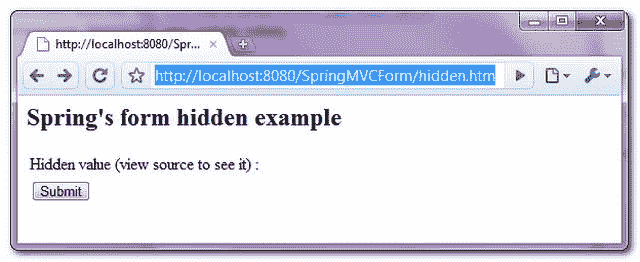
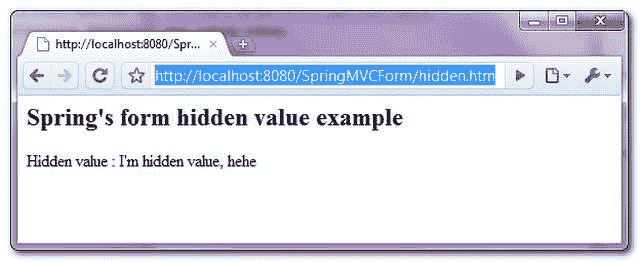

> 原文：<http://web.archive.org/web/20230101150211/http://www.mkyong.com/spring-mvc/spring-mvc-hidden-value-example/>

# Spring MVC 隐藏值示例

在 Spring MVC 中，可以使用 **< form:hidden / >** 来渲染一个 HTML 隐藏值字段。举个例子，

```java
 <form:hidden path="secretValue" /> 
```

它将呈现以下 HTML 代码

```java
 <input id="secretValue" name="secretValue" type="hidden" value="I'm hidden value"/> 
```

*P.S 假设“ **secretValue** ”属性包含值“我是隐藏值”。*

在本教程中，我们将向您展示如何使用 Spring 的表单标签“ **< form:hidden / >** ”来**呈现一个 HTML 隐藏值**。

## 1.控制器

A `SimpleFormController`处理表单隐藏值，用“我是隐藏值，呵呵”初始化隐藏值。

*文件:HiddenController.java*

```java
 package com.mkyong.customer.controller;

import javax.servlet.http.HttpServletRequest;
import javax.servlet.http.HttpServletResponse;
import org.springframework.validation.BindException;
import org.springframework.web.servlet.ModelAndView;
import org.springframework.web.servlet.mvc.SimpleFormController;
import com.mkyong.customer.model.Customer;

public class HiddenController extends SimpleFormController{

	public HiddenController(){
		setCommandClass(Customer.class);
		setCommandName("customerForm");
	}

	@Override
	protected Object formBackingObject(HttpServletRequest request)
		throws Exception {
		Customer cust = new Customer();
		cust.setSecretValue("I'm hidden value, hehe");
		return cust;
	}

	@Override
	protected ModelAndView onSubmit(HttpServletRequest request,
		HttpServletResponse response, Object command, BindException errors)
		throws Exception {
		Customer customer = (Customer)command;
		return new ModelAndView("CustomerSuccess","customer",customer);
	}
} 
```

 <ins class="adsbygoogle" style="display:block; text-align:center;" data-ad-format="fluid" data-ad-layout="in-article" data-ad-client="ca-pub-2836379775501347" data-ad-slot="6894224149">## 2.模型

存储窗体隐藏值的客户对象。

*文件:Customer.java*

```java
 package com.mkyong.customer.model;

public class Customer{
	String secretValue;
	//getter and setter methods
} 
```

 <ins class="adsbygoogle" style="display:block" data-ad-client="ca-pub-2836379775501347" data-ad-slot="8821506761" data-ad-format="auto" data-ad-region="mkyongregion">## 3.视角

一个 JSP 页面使用 Spring 的表单标签" **< form:hidden / >** "来呈现一个 HTML 隐藏值。

*文件:CustomerForm.jsp*

```java
 <%@ taglib prefix="form" uri="http://www.springframework.org/tags/form"%>
<html>
<body>
	<h2>Spring's form hidden example</h2>

	<form:form method="POST" commandName="customerForm">
		<table>
			<tr>
				<td>Hidden value (view source to see it) :</td>
				<td><form:hidden path="secretValue" /></td>
			</tr>
			<tr>
				<td><input type="submit" /></td>
			</tr>
		</table>
	</form:form>

</body>
</html> 
```

如果表单已提交，则呈现成功页面并显示提交的隐藏值。

*文件:CustomerSuccess.jsp*

```java
 <html>
<body>
	<h2>Spring's form hidden value example</h2>

	Hidden value : ${customer.secretValue}
	<br />
</body>
</html> 
```

## 4.弹簧豆配置

全部链接起来~

```java
 <beans 
	xmlns:xsi="http://www.w3.org/2001/XMLSchema-instance"
	xsi:schemaLocation="http://www.springframework.org/schema/beans 
	http://www.springframework.org/schema/beans/spring-beans-2.5.xsd">

  <bean
  class="org.springframework.web.servlet.mvc.support.ControllerClassNameHandlerMapping" />

	<bean class="com.mkyong.customer.controller.HiddenController">
		<property name="formView" value="CustomerForm" />
		<property name="successView" value="CustomerSuccess" />
	</bean>

	<bean id="viewResolver"
		class="org.springframework.web.servlet.view.InternalResourceViewResolver">
		<property name="prefix">
			<value>/WEB-INF/pages/</value>
		</property>
		<property name="suffix">
			<value>.jsp</value>
		</property>
	</bean>
</beans> 
```

## 5.演示

访问页面-**http://localhost:8080/SpringMVCForm/hidden . htm**



如果表单提交成功，只显示提交的隐藏值。



## 下载源代码

Download it – [SpringMVCForm-HiddenValue-Example.zip](http://web.archive.org/web/20190306164448/http://www.mkyong.com/wp-content/uploads/2010/08/SpringMVCForm-HiddenValue-Example.zip) (8KB)[hidden value](http://web.archive.org/web/20190306164448/http://www.mkyong.com/tag/hidden-value/) [spring mvc](http://web.archive.org/web/20190306164448/http://www.mkyong.com/tag/spring-mvc/)


