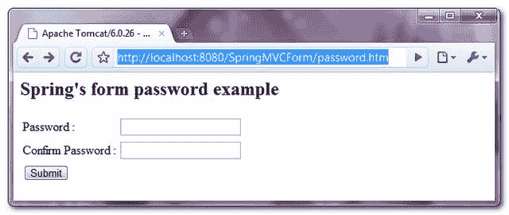
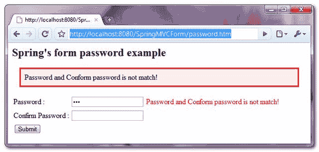
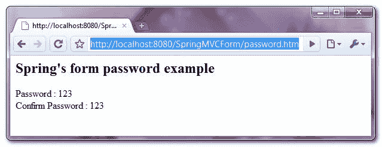

# Spring MVC 密码示例

> 原文：<http://web.archive.org/web/20230101150211/http://www.mkyong.com/spring-mvc/spring-mvc-password-example/>

在 Spring MVC 中，可以使用 **< form:password / >** 标签来呈现一个 HTML 密码字段。举个例子，

```java
 <form:password path="password" /> 
```

它将呈现以下 HTML 代码

```java
 <input id="password" name="password" type="password" value=""/> 
```

**Note**
In Spring’s documentation, it mention about the ‘**showPassword**‘ attribute will display the password value, but it’s failed in my testing, may be you can try it yourself.

在本教程中，我们将向您展示如何使用 Spring 的表单标签“ **password** ”来**呈现两个 HTML 密码**字段——“password”和“confirmPassword”。此外，添加一个验证器检查两个密码字段:不得为空，并且“密码”字段必须与“确认密码”字段匹配。

## 1.控制器

一个 **SimpleFormController** 来处理表单值。

*文件:PasswordController.java*

```java
 package com.mkyong.customer.controller;

import javax.servlet.http.HttpServletRequest;
import javax.servlet.http.HttpServletResponse;

import org.springframework.validation.BindException;
import org.springframework.web.servlet.ModelAndView;
import org.springframework.web.servlet.mvc.SimpleFormController;
import com.mkyong.customer.model.Customer;

public class PasswordController extends SimpleFormController{

	public PasswordController(){
		setCommandClass(Customer.class);
		setCommandName("customerForm");
	}

	@Override
	protected ModelAndView onSubmit(HttpServletRequest request,
			HttpServletResponse response, Object command, BindException errors)
			throws Exception {

		Customer customer = (Customer)command;
		return new ModelAndView("CustomerSuccess","customer",customer);

	}

} 
```

 ## 2.模型

存储密码值的客户对象。

*文件:Customer.java*

```java
 package com.mkyong.customer.model;

public class Customer{

	String password;
	String confirmPassword;
	//getter and setter methods for password and confirmPassword
} 
```

 ## 3.表单验证器

创建一个密码验证器类来检查两个密码字段:不得为空，“密码”和“确认密码”必须匹配。否则，从资源包(属性文件)中获取相应的消息。

*文件:PasswordValidator.java*

```java
 package com.mkyong.customer.validator;

import org.springframework.validation.Errors;
import org.springframework.validation.ValidationUtils;
import org.springframework.validation.Validator;

import com.mkyong.customer.model.Customer;

public class PasswordValidator implements Validator{

	@Override
	public boolean supports(Class clazz) {
		//just validate the Customer instances
		return Customer.class.isAssignableFrom(clazz);
	}

	@Override
	public void validate(Object target, Errors errors) {

		ValidationUtils.rejectIfEmptyOrWhitespace(errors, "password",
			"required.password", "Field name is required.");

		ValidationUtils.rejectIfEmptyOrWhitespace(errors, "confirmPassword",
				"required.confirmPassword", "Field name is required.");

		Customer cust = (Customer)target;

		if(!(cust.getPassword().equals(cust.getConfirmPassword()))){
			errors.rejectValue("password", "notmatch.password");
		}

	}

} 
```

*文件:message.properties*

```java
 required.password = Password is required!
required.passwordConfirm = Confirm password is required!
notmatch.password = Password and Conform password is not match! 
```

## 4.视角

一个 JSP 页面使用 Spring 的表单标签" **password** "来呈现两个 HTML 密码字段，并放置一些 CSS 样式来突出显示错误消息。

*文件:CustomerForm.jsp*

```java
 <%@ taglib prefix="form" uri="http://www.springframework.org/tags/form"%>
<html>
<head>
<style>
.error {
	color: #ff0000;
}

.errorblock {
	color: #000;
	background-color: #ffEEEE;
	border: 3px solid #ff0000;
	padding: 8px;
	margin: 16px;
}
</style>
</head>

<body>
	<h2>Spring's form password example</h2>

	<form:form method="POST" commandName="customerForm">
		<form:errors path="*" cssClass="errorblock" element="div" />
		<table>
			<tr>
				<td>Password :</td>
				<td><form:password path="password" />
				</td>
				<td><form:errors path="password" cssClass="error" />
				</td>
			</tr>
			<tr>
				<td>Confirm Password :</td>
				<td><form:password path="confirmPassword" />
				</td>
				<td><form:errors path="confirmPassword" cssClass="error" />
				</td>
			</tr>
			<tr>
				<td colspan="3"><input type="submit" />
				</td>
			</tr>
		</table>
	</form:form>

</body>
</html> 
```

如果表单已提交，则呈现成功页面并显示提交的密码值。

*文件:CustomerSuccess.jsp*

```java
 <html>
<body>
	<h2>Spring's form password example</h2>

	Password : ${customer.password}
	<br /> Confirm Password : ${customer.confirmPassword}

</body>
</html> 
```

## 5.弹簧豆配置

全部链接起来~

```java
 <beans 
	xmlns:xsi="http://www.w3.org/2001/XMLSchema-instance"
	xsi:schemaLocation="http://www.springframework.org/schema/beans 
	http://www.springframework.org/schema/beans/spring-beans-2.5.xsd">

  <bean
  class="org.springframework.web.servlet.mvc.support.ControllerClassNameHandlerMapping" />

	<bean class="com.mkyong.customer.controller.PasswordController">
		<property name="formView" value="CustomerForm" />
		<property name="successView" value="CustomerSuccess" />

		<!-- Map a validator -->
		<property name="validator">
			<bean class="com.mkyong.customer.validator.PasswordValidator" />
		</property>
	</bean>

	<!-- Register the Customer.properties -->
	<bean id="messageSource"
		class="org.springframework.context.support.ResourceBundleMessageSource">
		<property name="basename" value="message" />
	</bean>

	<bean id="viewResolver"
		class="org.springframework.web.servlet.view.InternalResourceViewResolver">
		<property name="prefix">
			<value>/WEB-INF/pages/</value>
		</property>
		<property name="suffix">
			<value>.jsp</value>
		</property>
	</bean>

</beans> 
```

## 6.演示

访问页面-**http://localhost:8080/SpringMVCForm/password . htm**



如果提交表单时“密码”与“确认密码”不匹配，则显示并突出显示错误消息。



如果表单提交成功，只需显示提交的密码值。



## 下载源代码

Download it – [SpringMVCForm-Password-Example.zip](http://web.archive.org/web/20190223082357/http://www.mkyong.com/wp-content/uploads/2010/08/SpringMVCForm-Password-Example.zip) (9KB)[password](http://web.archive.org/web/20190223082357/http://www.mkyong.com/tag/password/) [spring mvc](http://web.archive.org/web/20190223082357/http://www.mkyong.com/tag/spring-mvc/)


