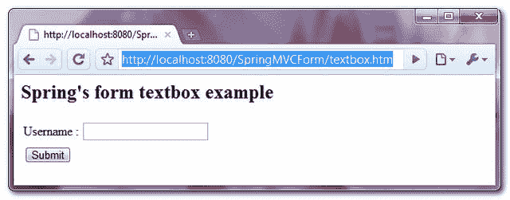
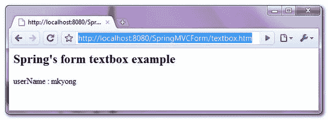

> 原文：<http://web.archive.org/web/20230101150211/http://www.mkyong.com/spring-mvc/spring-mvc-textbox-example/>

# Spring MVC 文本框示例

在 Spring MVC 中，可以使用 **< form:input / >** 标签来呈现一个 HTML textbox 字段。举个例子，

```java
 <form:input path="userName" /> 
```

它将呈现以下 HTML 代码

```java
 <input id="userName" name="userName" type="text" value=""/> 
```

在本教程中，我们将向您展示如何使用 Spring 的表单标签" **input** "来**呈现一个 HTML textbox** 来存储"**用户名**"。此外，添加一个空检查验证器来确保 textbox 值不为空。

## 1.控制器

一个 **SimpleFormController** 来处理表单值，并将表单值链接到客户对象。

*文件:TextBoxController.java*

```java
 package com.mkyong.customer.controller;

import javax.servlet.http.HttpServletRequest;
import javax.servlet.http.HttpServletResponse;
import org.springframework.validation.BindException;
import org.springframework.web.servlet.ModelAndView;
import org.springframework.web.servlet.mvc.SimpleFormController;
import com.mkyong.customer.model.Customer;

public class TextBoxController extends SimpleFormController{

	public TextBoxController(){
		setCommandClass(Customer.class);
		setCommandName("customerForm");
	}

	@Override
	protected ModelAndView onSubmit(HttpServletRequest request,
		HttpServletResponse response, Object command, BindException errors)
		throws Exception {

		Customer customer = (Customer)command;
		return new ModelAndView("CustomerSuccess","customer",customer);

	}
} 
```

 <ins class="adsbygoogle" style="display:block; text-align:center;" data-ad-format="fluid" data-ad-layout="in-article" data-ad-client="ca-pub-2836379775501347" data-ad-slot="6894224149">## 2.模型

存储文本框值的客户对象。

*文件:Customer.java*

```java
 package com.mkyong.customer.model;

public class Customer{

	String userName;
	//getter and setter methods
} 
```

 <ins class="adsbygoogle" style="display:block" data-ad-client="ca-pub-2836379775501347" data-ad-slot="8821506761" data-ad-format="auto" data-ad-region="mkyongregion">## 3.表单验证器

创建一个表单验证器类，并使用 **ValidationUtils** 类来确保“用户名”不为空，否则，从相应的资源包(属性文件)中获取“ **required.userName** 消息。

*文件:CustomerValidator.java*

```java
 package com.mkyong.customer.validator;

import org.springframework.validation.Errors;
import org.springframework.validation.ValidationUtils;
import org.springframework.validation.Validator;
import com.mkyong.customer.model.Customer;

public class CustomerValidator implements Validator{

	@Override
	public boolean supports(Class clazz) {
		//just validate the Customer instances
		return Customer.class.isAssignableFrom(clazz);
	}

	@Override
	public void validate(Object target, Errors errors) {

		ValidationUtils.rejectIfEmptyOrWhitespace(errors, "userName",
			"required.userName", "Field name is required.");

	}

} 
```

*文件:message.properties*

```java
 required.userName = username is required! 
```

## 4.视角

一个 JSP 页面使用 Spring 的表单标签" **input** "来呈现一个 HTML textbox，并放置一些 CSS 样式来突出显示错误消息。

*文件:CustomerForm.jsp*

```java
 <%@ taglib prefix="form" uri="http://www.springframework.org/tags/form"%>
<html>
<head>
<style>
.error {
	color: #ff0000;
}

.errorblock {
	color: #000;
	background-color: #ffEEEE;
	border: 3px solid #ff0000;
	padding: 8px;
	margin: 16px;
}
</style>
</head>

<body>
	<h2>Spring's form textbox example</h2>

	<form:form method="POST" commandName="customerForm">
		<form:errors path="*" cssClass="errorblock" element="div" />
		<table>
			<tr>
				<td>Username :</td>
				<td><form:input path="userName" />
				</td>
				<td><form:errors path="userName" cssClass="error" />
				</td>
			</tr>
			<tr>
				<td colspan="3"><input type="submit" />
				</td>
			</tr>
		</table>
	</form:form>

</body>
</html> 
```

如果表单已提交，则呈现成功的页面并显示已提交的文本框值。

*文件:CustomerSuccess.jsp*

```java
 <html>
<body>
	<h2>Spring's form textbox example</h2>

	userName : ${customer.userName}

</body>
</html> 
```

## 5.弹簧豆配置

全部链接起来~

```java
 <beans 
	xmlns:xsi="http://www.w3.org/2001/XMLSchema-instance"
	xsi:schemaLocation="http://www.springframework.org/schema/beans 
	http://www.springframework.org/schema/beans/spring-beans-2.5.xsd">

  <bean
  class="org.springframework.web.servlet.mvc.support.ControllerClassNameHandlerMapping" />

	<bean class="com.mkyong.customer.controller.TextBoxController">
		<property name="formView" value="CustomerForm" />
		<property name="successView" value="CustomerSuccess" />

		<!-- Map a validator -->
		<property name="validator">
			<bean class="com.mkyong.customer.validator.CustomerValidator" />
		</property>
	</bean>

	<!-- Register the Customer.properties -->
	<bean id="messageSource"
		class="org.springframework.context.support.ResourceBundleMessageSource">
		<property name="basename" value="message" />
	</bean>

	<bean id="viewResolver"
		class="org.springframework.web.servlet.view.InternalResourceViewResolver">
		<property name="prefix">
			<value>/WEB-INF/pages/</value>
		</property>
		<property name="suffix">
			<value>.jsp</value>
		</property>
	</bean>

</beans> 
```

## 6.演示

访问页面-**http://localhost:8080/SpringMVCForm/textbox . htm**



如果提交表单时文本框值为空，则显示并突出显示错误消息。


如果表单提交成功，只显示提交的文本框值。



## 下载源代码

Download it – [SpringMVCForm-TextBox-Example.zip](http://web.archive.org/web/20190210093604/http://www.mkyong.com/wp-content/uploads/2010/08/SpringMVCForm-TextBox-Example.zip) (9KB)[spring mvc](http://web.archive.org/web/20190210093604/http://www.mkyong.com/tag/spring-mvc/) [textbox](http://web.archive.org/web/20190210093604/http://www.mkyong.com/tag/textbox/)


