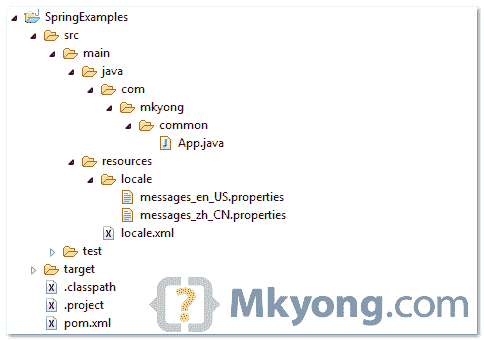
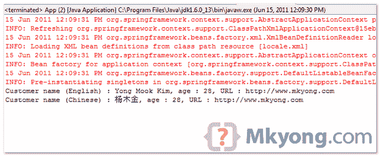

# 带有 ResourceBundleMessageSource 示例的 Spring 资源包

> 原文：<http://web.archive.org/web/20230101150211/http://www.mkyong.com/spring/spring-resource-bundle-with-resourcebundlemessagesource-example/>

在 Spring 中，您可以使用`ResourceBundleMessageSource`来解析来自属性文件的文本消息，基于所选择的地区。请参见以下示例:

## 1.目录结构

查看此示例的目录结构。




## 2.属性文件

创建两个属性文件，一个用于英文字符(`messages_en_US.properties`)，另一个用于中文字符(`messages_zh_CN.properties`)。将其放入项目类路径中(见上图)。

*文件:messages_en_US.properties*

```java
 customer.name=Yong Mook Kim, age : {0}, URL : {1} 
```

*文件:messages_zh_CN.properties*

```java
 customer.name=\ufeff\u6768\u6728\u91d1, age : {0}, URL : {1} 
```

'**\ u eff \ u 6768 \ u 6728 \ u91d 1**'为中文 Unicode 字符。

**Note**
To display the Chinese characters correctly, you have to use “[native2ascii](http://web.archive.org/web/20200616055144/http://www.mkyong.com/java/java-convert-chinese-character-to-unicode-with-native2ascii/)” tool to convert the Chinese characters into Unicode characters.

## 3.Bean 配置文件

将属性文件包含到 bean 配置文件中。“**messages _ en _ us . properties**”和“**messages _ zh _ cn . properties**”在 Spring 中都被认为是一个文件，你只需要包含文件名一次，Spring 就会自动找到正确的区域设置。

```java
 <?xml version="1.0" encoding="UTF-8"?>
<beans 
	xmlns:xsi="http://www.w3.org/2001/XMLSchema-instance"
	xsi:schemaLocation="http://www.springframework.org/schema/beans 
	http://www.springframework.org/schema/beans/spring-beans-2.5.xsd">

	<bean id="messageSource"
		class="org.springframework.context.support.ResourceBundleMessageSource">
		<property name="basename">
			<value>locale\customer\messages</value>
		</property>
	</bean>

</beans> 
```

假设这两个文件都位于“资源\区域\客户”文件夹。

## 4.运行它

```java
 package com.mkyong.common;

import java.util.Locale;
import org.springframework.context.ApplicationContext;
import org.springframework.context.support.ClassPathXmlApplicationContext;

public class App {
	public static void main(String[] args) {

		ApplicationContext context 
			= new ClassPathXmlApplicationContext("locale.xml");

		String name = context.getMessage("customer.name", 
				new Object[] { 28,"http://www.mkyong.com" }, Locale.US);

		System.out.println("Customer name (English) : " + name);

		String namechinese = context.getMessage("customer.name", 
				new Object[] {28, "http://www.mkyong.com" }, 
                                        Locale.SIMPLIFIED_CHINESE);

		System.out.println("Customer name (Chinese) : " + namechinese);

	}
} 
```

*输出*


**Note**
Make sure your [Eclipse is able to display Chinese output](http://web.archive.org/web/20200616055144/http://www.mkyong.com/java/how-to-display-chinese-character-in-eclipse-console/).

##### 说明

1.在`context.getMessage()`中，第二个参数是消息参数，你必须将其作为对象数组传递。如果没有可用的参数值，可以只传递一个 null。

```java
 context.getMessage("customer.name",null, Locale.US); 
```

2.地点。US 将从'**messages _ en _ US . properties**'中检索消息。简体中文将从“**messages _ zh _ cn . properties**中检索消息。

**More …**
Read this article to know how to access the [MessageSource inside a bean](http://web.archive.org/web/20200616055144/http://www.mkyong.com/spring/spring-how-to-access-messagesource-in-bean-messagesourceaware/).

## 下载源代码

Download it – [Spring-MessageSource-Example.zip](http://web.archive.org/web/20200616055144/http://www.mkyong.com/wp-content/uploads/2010/03/Spring-MessageSource-Example.zip)Tags : [resource bundle](http://web.archive.org/web/20200616055144/https://mkyong.com/tag/resource-bundle/) [spring](http://web.archive.org/web/20200616055144/https://mkyong.com/tag/spring/)<input type="hidden" id="mkyong-current-postId" value="3932">