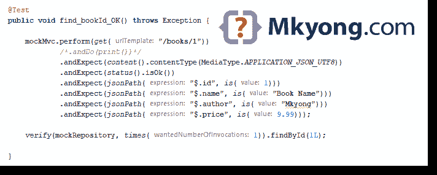

# 弹簧座集成测试示例

> 原文：<http://web.archive.org/web/20230101150211/https://mkyong.com/spring-boot/spring-rest-integration-test-example/>



在本文中，我们将向您展示如何测试 Spring Boot REST 应用程序。通常，我们使用`MockMvc`或`TestRestTemplate`进行集成测试。

使用的技术:

*   Spring Boot 2.1.2 .版本
*   弹簧 5.1.4 释放
*   maven3
*   Java 8

pom.xml

```java
 <!-- spring integration test -->
	<dependency>
		<groupId>org.springframework.boot</groupId>
		<artifactId>spring-boot-starter-test</artifactId>
		<scope>test</scope>
	</dependency>

	<!-- spring integration test for security-->
	<dependency>
		<groupId>org.springframework.security</groupId>
		<artifactId>spring-security-test</artifactId>
		<scope>test</scope>
	</dependency> 
```

## 1\. MockMvc

```java
 @RunWith(SpringRunner.class)
@SpringBootTest
@AutoConfigureMockMvc
public class BookControllerTest {

    @Autowired
    private MockMvc mockMvc; 
```

1.1 本 [Spring REST Hello World 示例的 CRUD 测试](/web/20190311102322/http://www.mkyong.com/spring-boot/spring-rest-hello-world-example/)

```java
 package com.mkyong;

import com.fasterxml.jackson.core.JsonProcessingException;
import com.fasterxml.jackson.databind.ObjectMapper;
import org.junit.Before;
import org.junit.Test;
import org.junit.runner.RunWith;
import org.springframework.beans.factory.annotation.Autowired;
import org.springframework.boot.test.autoconfigure.web.servlet.AutoConfigureMockMvc;
import org.springframework.boot.test.context.SpringBootTest;
import org.springframework.boot.test.mock.mockito.MockBean;
import org.springframework.http.HttpHeaders;
import org.springframework.http.MediaType;
import org.springframework.test.context.ActiveProfiles;
import org.springframework.test.context.junit4.SpringRunner;
import org.springframework.test.web.servlet.MockMvc;

import java.math.BigDecimal;
import java.util.Arrays;
import java.util.List;
import java.util.Optional;

import static org.hamcrest.Matchers.is;
import static org.hamcrest.collection.IsCollectionWithSize.hasSize;
import static org.mockito.ArgumentMatchers.any;
import static org.mockito.Mockito.*;
import static org.springframework.test.web.servlet.request.MockMvcRequestBuilders.*;
import static org.springframework.test.web.servlet.result.MockMvcResultMatchers.*;

//@WebMvcTest(BookController.class)
@RunWith(SpringRunner.class)
@SpringBootTest
@AutoConfigureMockMvc
@ActiveProfiles("test")
public class BookControllerTest {

    private static final ObjectMapper om = new ObjectMapper();

    @Autowired
    private MockMvc mockMvc;

    @MockBean
    private BookRepository mockRepository;

    @Before
    public void init() {
        Book book = new Book(1L, "Book Name", "Mkyong", new BigDecimal("9.99"));
        when(mockRepository.findById(1L)).thenReturn(Optional.of(book));
    }

    @Test
    public void find_bookId_OK() throws Exception {

        mockMvc.perform(get("/books/1"))
                /*.andDo(print())*/
                .andExpect(content().contentType(MediaType.APPLICATION_JSON_UTF8))
                .andExpect(status().isOk())
                .andExpect(jsonPath("$.id", is(1)))
                .andExpect(jsonPath("$.name", is("Book Name")))
                .andExpect(jsonPath("$.author", is("Mkyong")))
                .andExpect(jsonPath("$.price", is(9.99)));

        verify(mockRepository, times(1)).findById(1L);

    }

    @Test
    public void find_allBook_OK() throws Exception {

        List<Book> books = Arrays.asList(
                new Book(1L, "Book A", "Ah Pig", new BigDecimal("1.99")),
                new Book(2L, "Book B", "Ah Dog", new BigDecimal("2.99")));

        when(mockRepository.findAll()).thenReturn(books);

        mockMvc.perform(get("/books"))
                .andExpect(content().contentType(MediaType.APPLICATION_JSON_UTF8))
                .andExpect(status().isOk())
                .andExpect(jsonPath("$", hasSize(2)))
                .andExpect(jsonPath("$[0].id", is(1)))
                .andExpect(jsonPath("$[0].name", is("Book A")))
                .andExpect(jsonPath("$[0].author", is("Ah Pig")))
                .andExpect(jsonPath("$[0].price", is(1.99)))
                .andExpect(jsonPath("$[1].id", is(2)))
                .andExpect(jsonPath("$[1].name", is("Book B")))
                .andExpect(jsonPath("$[1].author", is("Ah Dog")))
                .andExpect(jsonPath("$[1].price", is(2.99)));

        verify(mockRepository, times(1)).findAll();
    }

    @Test
    public void find_bookIdNotFound_404() throws Exception {
        mockMvc.perform(get("/books/5")).andExpect(status().isNotFound());
    }

    @Test
    public void save_book_OK() throws Exception {

        Book newBook = new Book(1L, "Spring Boot Guide", "mkyong", new BigDecimal("2.99"));
        when(mockRepository.save(any(Book.class))).thenReturn(newBook);

        mockMvc.perform(post("/books")
                .content(om.writeValueAsString(newBook))
                .header(HttpHeaders.CONTENT_TYPE, MediaType.APPLICATION_JSON))
                /*.andDo(print())*/
                .andExpect(status().isCreated())
                .andExpect(jsonPath("$.id", is(1)))
                .andExpect(jsonPath("$.name", is("Spring Boot Guide")))
                .andExpect(jsonPath("$.author", is("mkyong")))
                .andExpect(jsonPath("$.price", is(2.99)));

        verify(mockRepository, times(1)).save(any(Book.class));

    }

    @Test
    public void update_book_OK() throws Exception {

        Book updateBook = new Book(1L, "ABC", "mkyong", new BigDecimal("19.99"));
        when(mockRepository.save(any(Book.class))).thenReturn(updateBook);

        mockMvc.perform(put("/books/1")
                .content(om.writeValueAsString(updateBook))
                .header(HttpHeaders.CONTENT_TYPE, MediaType.APPLICATION_JSON))
                .andExpect(content().contentType(MediaType.APPLICATION_JSON_UTF8))
                .andExpect(status().isOk())
                .andExpect(jsonPath("$.id", is(1)))
                .andExpect(jsonPath("$.name", is("ABC")))
                .andExpect(jsonPath("$.author", is("mkyong")))
                .andExpect(jsonPath("$.price", is(19.99)));

    }

    @Test
    public void patch_bookAuthor_OK() throws Exception {

        when(mockRepository.save(any(Book.class))).thenReturn(new Book());
        String patchInJson = "{\"author\":\"ultraman\"}";

        mockMvc.perform(patch("/books/1")
                .content(patchInJson)
                .header(HttpHeaders.CONTENT_TYPE, MediaType.APPLICATION_JSON))
                .andExpect(content().contentType(MediaType.APPLICATION_JSON_UTF8))
                .andExpect(status().isOk());

        verify(mockRepository, times(1)).findById(1L);
        verify(mockRepository, times(1)).save(any(Book.class));

    }

    @Test
    public void patch_bookPrice_405() throws Exception {

        String patchInJson = "{\"price\":\"99.99\"}";

        mockMvc.perform(patch("/books/1")
                .content(patchInJson)
                .header(HttpHeaders.CONTENT_TYPE, MediaType.APPLICATION_JSON))
                .andExpect(status().isMethodNotAllowed());

        verify(mockRepository, times(1)).findById(1L);
        verify(mockRepository, times(0)).save(any(Book.class));
    }

    @Test
    public void delete_book_OK() throws Exception {

        doNothing().when(mockRepository).deleteById(1L);

        mockMvc.perform(delete("/books/1"))
                /*.andDo(print())*/
                .andExpect(status().isOk());

        verify(mockRepository, times(1)).deleteById(1L);
    }

    private static void printJSON(Object object) {
        String result;
        try {
            result = om.writerWithDefaultPrettyPrinter().writeValueAsString(object);
            System.out.println(result);
        } catch (JsonProcessingException e) {
            e.printStackTrace();
        }
    }

} 
```

1.2 此[弹簧座验证的测试](/web/20190311102322/http://www.mkyong.com/spring-boot/spring-rest-validation-example/)

```java
 package com.mkyong;

import com.fasterxml.jackson.databind.ObjectMapper;
import org.junit.Test;
import org.junit.runner.RunWith;
import org.springframework.beans.factory.annotation.Autowired;
import org.springframework.boot.test.autoconfigure.web.servlet.AutoConfigureMockMvc;
import org.springframework.boot.test.context.SpringBootTest;
import org.springframework.boot.test.mock.mockito.MockBean;
import org.springframework.http.HttpHeaders;
import org.springframework.http.MediaType;
import org.springframework.test.context.ActiveProfiles;
import org.springframework.test.context.junit4.SpringRunner;
import org.springframework.test.web.servlet.MockMvc;

import static org.hamcrest.Matchers.*;
import static org.mockito.ArgumentMatchers.any;
import static org.mockito.Mockito.times;
import static org.mockito.Mockito.verify;
import static org.springframework.test.web.servlet.request.MockMvcRequestBuilders.post;
import static org.springframework.test.web.servlet.result.MockMvcResultHandlers.print;
import static org.springframework.test.web.servlet.result.MockMvcResultMatchers.jsonPath;
import static org.springframework.test.web.servlet.result.MockMvcResultMatchers.status;

@RunWith(SpringRunner.class)
@SpringBootTest
@AutoConfigureMockMvc
@ActiveProfiles("test")
public class BookControllerTest {

    private static final ObjectMapper om = new ObjectMapper();

    @Autowired
    private MockMvc mockMvc;

    @MockBean
    private BookRepository mockRepository;

    /*
        {
            "timestamp":"2019-03-05T09:34:13.280+0000",
            "status":400,
            "errors":["Author is not allowed.","Please provide a price","Please provide a author"]
        }
     */
    @Test
    public void save_emptyAuthor_emptyPrice_400() throws Exception {

        String bookInJson = "{\"name\":\"ABC\"}";

        mockMvc.perform(post("/books")
                .content(bookInJson)
                .header(HttpHeaders.CONTENT_TYPE, MediaType.APPLICATION_JSON))
                .andDo(print())
                .andExpect(status().isBadRequest())
                .andExpect(jsonPath("$.timestamp", is(notNullValue())))
                .andExpect(jsonPath("$.status", is(400)))
                .andExpect(jsonPath("$.errors").isArray())
                .andExpect(jsonPath("$.errors", hasSize(3)))
                .andExpect(jsonPath("$.errors", hasItem("Author is not allowed.")))
                .andExpect(jsonPath("$.errors", hasItem("Please provide a author")))
                .andExpect(jsonPath("$.errors", hasItem("Please provide a price")));

        verify(mockRepository, times(0)).save(any(Book.class));

    }

    /*
        {
            "timestamp":"2019-03-05T09:34:13.207+0000",
            "status":400,
            "errors":["Author is not allowed."]
        }
     */
    @Test
    public void save_invalidAuthor_400() throws Exception {

        String bookInJson = "{\"name\":\" Spring REST tutorials\", \"author\":\"abc\",\"price\":\"9.99\"}";

        mockMvc.perform(post("/books")
                .content(bookInJson)
                .header(HttpHeaders.CONTENT_TYPE, MediaType.APPLICATION_JSON))
                .andDo(print())
                .andExpect(status().isBadRequest())
                .andExpect(jsonPath("$.timestamp", is(notNullValue())))
                .andExpect(jsonPath("$.status", is(400)))
                .andExpect(jsonPath("$.errors").isArray())
                .andExpect(jsonPath("$.errors", hasSize(1)))
                .andExpect(jsonPath("$.errors", hasItem("Author is not allowed.")));

        verify(mockRepository, times(0)).save(any(Book.class));

    }

} 
```

1.3 用`@WithMockUser`对该[弹簧座安全](/web/20190311102322/http://www.mkyong.com/spring-boot/spring-rest-spring-security-example/)进行测试

```java
 package com.mkyong;

import org.junit.Before;
import org.junit.Test;
import org.junit.runner.RunWith;
import org.springframework.beans.factory.annotation.Autowired;
import org.springframework.boot.test.autoconfigure.web.servlet.AutoConfigureMockMvc;
import org.springframework.boot.test.context.SpringBootTest;
import org.springframework.boot.test.mock.mockito.MockBean;
import org.springframework.security.test.context.support.WithMockUser;
import org.springframework.test.context.ActiveProfiles;
import org.springframework.test.context.junit4.SpringRunner;
import org.springframework.test.web.servlet.MockMvc;

import java.math.BigDecimal;
import java.util.Optional;

import static org.hamcrest.Matchers.is;
import static org.mockito.Mockito.when;
import static org.springframework.test.web.servlet.request.MockMvcRequestBuilders.get;
import static org.springframework.test.web.servlet.result.MockMvcResultHandlers.print;
import static org.springframework.test.web.servlet.result.MockMvcResultMatchers.jsonPath;
import static org.springframework.test.web.servlet.result.MockMvcResultMatchers.status;

@RunWith(SpringRunner.class)
@SpringBootTest
@AutoConfigureMockMvc
@ActiveProfiles("test")
public class BookControllerTest {

    @Autowired
    private MockMvc mockMvc;

    @MockBean
    private BookRepository mockRepository;

    @Before
    public void init() {
        Book book = new Book(1L, "A Guide to the Bodhisattva Way of Life", "Santideva", new BigDecimal("15.41"));
        when(mockRepository.findById(1L)).thenReturn(Optional.of(book));
    }

    //@WithMockUser(username = "USER")
    @WithMockUser("USER")
    @Test
    public void find_login_ok() throws Exception {

        mockMvc.perform(get("/books/1"))
                .andDo(print())
                .andExpect(status().isOk())
                .andExpect(jsonPath("$.id", is(1)))
                .andExpect(jsonPath("$.name", is("A Guide to the Bodhisattva Way of Life")))
                .andExpect(jsonPath("$.author", is("Santideva")))
                .andExpect(jsonPath("$.price", is(15.41)));
    }

    @Test
    public void find_nologin_401() throws Exception {
        mockMvc.perform(get("/books/1"))
                .andDo(print())
                .andExpect(status().isUnauthorized());
    }

} 
```

 <ins class="adsbygoogle" style="display:block; text-align:center;" data-ad-format="fluid" data-ad-layout="in-article" data-ad-client="ca-pub-2836379775501347" data-ad-slot="6894224149">## 2.TestRestTemplate

```java
 @RunWith(SpringRunner.class)
@SpringBootTest(webEnvironment = SpringBootTest.WebEnvironment.RANDOM_PORT) // for restTemplate
@ActiveProfiles("test")
public class BookControllerRestTemplateTest {

    @Autowired
    private TestRestTemplate restTemplate; 
```

2.1 本 [Spring REST Hello World 示例的 CRUD 测试](/web/20190311102322/http://www.mkyong.com/spring-boot/spring-rest-hello-world-example/)

```java
 package com.mkyong;

import com.fasterxml.jackson.core.JsonProcessingException;
import com.fasterxml.jackson.databind.ObjectMapper;
import org.json.JSONException;
import org.junit.Before;
import org.junit.Test;
import org.junit.runner.RunWith;
import org.skyscreamer.jsonassert.JSONAssert;
import org.springframework.beans.factory.annotation.Autowired;
import org.springframework.boot.test.context.SpringBootTest;
import org.springframework.boot.test.mock.mockito.MockBean;
import org.springframework.boot.test.web.client.TestRestTemplate;
import org.springframework.http.*;
import org.springframework.test.context.ActiveProfiles;
import org.springframework.test.context.junit4.SpringRunner;

import java.math.BigDecimal;
import java.util.Arrays;
import java.util.List;
import java.util.Optional;

import static org.junit.Assert.assertEquals;
import static org.mockito.ArgumentMatchers.any;
import static org.mockito.Mockito.*;

@RunWith(SpringRunner.class)
@SpringBootTest(webEnvironment = SpringBootTest.WebEnvironment.RANDOM_PORT) // for restTemplate
@ActiveProfiles("test")
public class BookControllerRestTemplateTest {

    private static final ObjectMapper om = new ObjectMapper();

    @Autowired
    private TestRestTemplate restTemplate;

    @MockBean
    private BookRepository mockRepository;

    @Before
    public void init() {
        Book book = new Book(1L, "Book Name", "Mkyong", new BigDecimal("9.99"));
        when(mockRepository.findById(1L)).thenReturn(Optional.of(book));
    }

    @Test
    public void find_bookId_OK() throws JSONException {

        String expected = "{id:1,name:\"Book Name\",author:\"Mkyong\",price:9.99}";

        ResponseEntity<String> response = restTemplate.getForEntity("/books/1", String.class);

        assertEquals(HttpStatus.OK, response.getStatusCode());
        assertEquals(MediaType.APPLICATION_JSON_UTF8, response.getHeaders().getContentType());

        JSONAssert.assertEquals(expected, response.getBody(), false);

        verify(mockRepository, times(1)).findById(1L);

    }

    @Test
    public void find_allBook_OK() throws Exception {

        List<Book> books = Arrays.asList(
                new Book(1L, "Book A", "Ah Pig", new BigDecimal("1.99")),
                new Book(2L, "Book B", "Ah Dog", new BigDecimal("2.99")));

        when(mockRepository.findAll()).thenReturn(books);

        String expected = om.writeValueAsString(books);

        ResponseEntity<String> response = restTemplate.getForEntity("/books", String.class);

        assertEquals(HttpStatus.OK, response.getStatusCode());
        JSONAssert.assertEquals(expected, response.getBody(), false);

        verify(mockRepository, times(1)).findAll();
    }

    @Test
    public void find_bookIdNotFound_404() throws Exception {

        String expected = "{status:404,error:\"Not Found\",message:\"Book id not found : 5\",path:\"/books/5\"}";

        ResponseEntity<String> response = restTemplate.getForEntity("/books/5", String.class);

        assertEquals(HttpStatus.NOT_FOUND, response.getStatusCode());
        JSONAssert.assertEquals(expected, response.getBody(), false);

    }

    @Test
    public void save_book_OK() throws Exception {

        Book newBook = new Book(1L, "Spring Boot Guide", "mkyong", new BigDecimal("2.99"));
        when(mockRepository.save(any(Book.class))).thenReturn(newBook);

        String expected = om.writeValueAsString(newBook);

        ResponseEntity<String> response = restTemplate.postForEntity("/books", newBook, String.class);

        assertEquals(HttpStatus.CREATED, response.getStatusCode());
        JSONAssert.assertEquals(expected, response.getBody(), false);

        verify(mockRepository, times(1)).save(any(Book.class));

    }

    @Test
    public void update_book_OK() throws Exception {

        Book updateBook = new Book(1L, "ABC", "mkyong", new BigDecimal("19.99"));
        when(mockRepository.save(any(Book.class))).thenReturn(updateBook);

        HttpHeaders headers = new HttpHeaders();
        headers.setContentType(MediaType.APPLICATION_JSON);
        HttpEntity<String> entity = new HttpEntity<>(om.writeValueAsString(updateBook), headers);

        ResponseEntity<String> response = restTemplate.exchange("/books/1", HttpMethod.PUT, entity, String.class);

        assertEquals(HttpStatus.OK, response.getStatusCode());
        JSONAssert.assertEquals(om.writeValueAsString(updateBook), response.getBody(), false);

        verify(mockRepository, times(1)).findById(1L);
        verify(mockRepository, times(1)).save(any(Book.class));

    }

    @Test
    public void patch_bookAuthor_OK() {

        when(mockRepository.save(any(Book.class))).thenReturn(new Book());
        String patchInJson = "{\"author\":\"ultraman\"}";

        HttpHeaders headers = new HttpHeaders();
        headers.setContentType(MediaType.APPLICATION_JSON);
        HttpEntity<String> entity = new HttpEntity<>(patchInJson, headers);

        ResponseEntity<String> response = restTemplate.exchange("/books/1", HttpMethod.PUT, entity, String.class);

        assertEquals(HttpStatus.OK, response.getStatusCode());

        verify(mockRepository, times(1)).findById(1L);
        verify(mockRepository, times(1)).save(any(Book.class));

    }

    @Test
    public void patch_bookPrice_405() throws JSONException {

        String expected = "{status:405,error:\"Method Not Allowed\",message:\"Field [price] update is not allow.\"}";

        String patchInJson = "{\"price\":\"99.99\"}";

        HttpHeaders headers = new HttpHeaders();
        headers.setContentType(MediaType.APPLICATION_JSON);
        HttpEntity<String> entity = new HttpEntity<>(patchInJson, headers);

        ResponseEntity<String> response = restTemplate.exchange("/books/1", HttpMethod.PATCH, entity, String.class);

        assertEquals(HttpStatus.METHOD_NOT_ALLOWED, response.getStatusCode());
        JSONAssert.assertEquals(expected, response.getBody(), false);

        verify(mockRepository, times(1)).findById(1L);
        verify(mockRepository, times(0)).save(any(Book.class));
    }

    @Test
    public void delete_book_OK() {

        doNothing().when(mockRepository).deleteById(1L);

        HttpEntity<String> entity = new HttpEntity<>(null, new HttpHeaders());
        ResponseEntity<String> response = restTemplate.exchange("/books/1", HttpMethod.DELETE, entity, String.class);

        assertEquals(HttpStatus.OK, response.getStatusCode());

        verify(mockRepository, times(1)).deleteById(1L);
    }

    private static void printJSON(Object object) {
        String result;
        try {
            result = om.writerWithDefaultPrettyPrinter().writeValueAsString(object);
            System.out.println(result);
        } catch (JsonProcessingException e) {
            e.printStackTrace();
        }
    }

} 
```

2.2 此[弹簧座验证的测试](/web/20190311102322/http://www.mkyong.com/spring-boot/spring-rest-validation-example/)

```java
 package com.mkyong;

import com.fasterxml.jackson.core.JsonProcessingException;
import com.fasterxml.jackson.databind.ObjectMapper;
import org.json.JSONException;
import org.junit.Test;
import org.junit.runner.RunWith;
import org.skyscreamer.jsonassert.JSONAssert;
import org.springframework.beans.factory.annotation.Autowired;
import org.springframework.boot.test.context.SpringBootTest;
import org.springframework.boot.test.mock.mockito.MockBean;
import org.springframework.boot.test.web.client.TestRestTemplate;
import org.springframework.http.*;
import org.springframework.test.context.ActiveProfiles;
import org.springframework.test.context.junit4.SpringRunner;

import static org.junit.Assert.assertEquals;
import static org.mockito.ArgumentMatchers.any;
import static org.mockito.Mockito.times;
import static org.mockito.Mockito.verify;

@RunWith(SpringRunner.class)
@SpringBootTest(webEnvironment = SpringBootTest.WebEnvironment.RANDOM_PORT) // for restTemplate
@ActiveProfiles("test")
public class BookControllerRestTemplateTest {

    private static final ObjectMapper om = new ObjectMapper();

    @Autowired
    private TestRestTemplate restTemplate;

    @MockBean
    private BookRepository mockRepository;

    /*
        {
            "timestamp":"2019-03-05T09:34:13.280+0000",
            "status":400,
            "errors":["Author is not allowed.","Please provide a price","Please provide a author"]
        }
     */
    @Test
    public void save_emptyAuthor_emptyPrice_400() throws JSONException {

        String bookInJson = "{\"name\":\"ABC\"}";

        HttpHeaders headers = new HttpHeaders();
        headers.setContentType(MediaType.APPLICATION_JSON);
        HttpEntity<String> entity = new HttpEntity<>(bookInJson, headers);

        // send json with POST
        ResponseEntity<String> response = restTemplate.postForEntity("/books", entity, String.class);
        //printJSON(response);

        String expectedJson = "{\"status\":400,\"errors\":[\"Author is not allowed.\",\"Please provide a price\",\"Please provide a author\"]}";
        assertEquals(HttpStatus.BAD_REQUEST, response.getStatusCode());
        JSONAssert.assertEquals(expectedJson, response.getBody(), false);

        verify(mockRepository, times(0)).save(any(Book.class));

    }

    /*
        {
            "timestamp":"2019-03-05T09:34:13.207+0000",
            "status":400,
            "errors":["Author is not allowed."]
        }
     */
    @Test
    public void save_invalidAuthor_400() throws JSONException {

        String bookInJson = "{\"name\":\" Spring REST tutorials\", \"author\":\"abc\",\"price\":\"9.99\"}";

        HttpHeaders headers = new HttpHeaders();
        headers.setContentType(MediaType.APPLICATION_JSON);
        HttpEntity<String> entity = new HttpEntity<>(bookInJson, headers);

        //Try exchange
        ResponseEntity<String> response = restTemplate.exchange("/books", HttpMethod.POST, entity, String.class);

        String expectedJson = "{\"status\":400,\"errors\":[\"Author is not allowed.\"]}";
        assertEquals(HttpStatus.BAD_REQUEST, response.getStatusCode());
        JSONAssert.assertEquals(expectedJson, response.getBody(), false);

        verify(mockRepository, times(0)).save(any(Book.class));

    }

    private static void printJSON(Object object) {
        String result;
        try {
            result = om.writerWithDefaultPrettyPrinter().writeValueAsString(object);
            System.out.println(result);
        } catch (JsonProcessingException e) {
            e.printStackTrace();
        }
    }

} 
```

2.3 本[弹簧座安全性测试](/web/20190311102322/http://www.mkyong.com/spring-boot/spring-rest-spring-security-example/)

```java
 package com.mkyong;

import com.fasterxml.jackson.core.JsonProcessingException;
import com.fasterxml.jackson.databind.ObjectMapper;
import org.junit.Before;
import org.junit.Test;
import org.junit.runner.RunWith;
import org.skyscreamer.jsonassert.JSONAssert;
import org.springframework.beans.factory.annotation.Autowired;
import org.springframework.boot.test.context.SpringBootTest;
import org.springframework.boot.test.mock.mockito.MockBean;
import org.springframework.boot.test.web.client.TestRestTemplate;
import org.springframework.http.HttpStatus;
import org.springframework.http.MediaType;
import org.springframework.http.ResponseEntity;
import org.springframework.test.context.ActiveProfiles;
import org.springframework.test.context.junit4.SpringRunner;

import java.math.BigDecimal;
import java.util.Optional;

import static org.junit.Assert.assertEquals;
import static org.mockito.Mockito.when;

@RunWith(SpringRunner.class)
@SpringBootTest(webEnvironment = SpringBootTest.WebEnvironment.RANDOM_PORT)
@ActiveProfiles("test")
public class BookControllerRestTemplateTest {

    private static final ObjectMapper om = new ObjectMapper();

    //@WithMockUser is not working with TestRestTemplate
    @Autowired
    private TestRestTemplate restTemplate;

    @MockBean
    private BookRepository mockRepository;

    @Before
    public void init() {
        Book book = new Book(1L, "A Guide to the Bodhisattva Way of Life", "Santideva", new BigDecimal("15.41"));
        when(mockRepository.findById(1L)).thenReturn(Optional.of(book));
    }

    @Test
    public void find_login_ok() throws Exception {

        String expected = "{id:1,name:\"A Guide to the Bodhisattva Way of Life\",author:\"Santideva\",price:15.41}";

        ResponseEntity<String> response = restTemplate
                .withBasicAuth("user", "password")
                .getForEntity("/books/1", String.class);

        printJSON(response);

        assertEquals(MediaType.APPLICATION_JSON_UTF8, response.getHeaders().getContentType());
        assertEquals(HttpStatus.OK, response.getStatusCode());

        JSONAssert.assertEquals(expected, response.getBody(), false);

    }

    @Test
    public void find_nologin_401() throws Exception {

        String expected = "{\"status\":401,\"error\":\"Unauthorized\",\"message\":\"Unauthorized\",\"path\":\"/books/1\"}";

        ResponseEntity<String> response = restTemplate
                .getForEntity("/books/1", String.class);

        printJSON(response);

        assertEquals(MediaType.APPLICATION_JSON_UTF8, response.getHeaders().getContentType());
        assertEquals(HttpStatus.UNAUTHORIZED, response.getStatusCode());

        JSONAssert.assertEquals(expected, response.getBody(), false);

    }

    private static void printJSON(Object object) {
        String result;
        try {
            result = om.writerWithDefaultPrettyPrinter().writeValueAsString(object);
            System.out.println(result);
        } catch (JsonProcessingException e) {
            e.printStackTrace();
        }
    }

} 
```

 <ins class="adsbygoogle" style="display:block" data-ad-client="ca-pub-2836379775501347" data-ad-slot="8821506761" data-ad-format="auto" data-ad-region="mkyongregion">## 下载源代码

$ git clone [https://github.com/mkyong/spring-boot.git](http://web.archive.org/web/20190311102322/https://github.com/mkyong/spring-boot.git)

$ CD spring-rest-hello-world
$ mvn 测试

$ cd 弹簧支架-验证
$ mvn 测试

$ cd 弹簧-支架-安全
$ mvn 测试

## 参考

*   [TestRestTemplate docs](http://web.archive.org/web/20190311102322/https://docs.spring.io/spring-boot/docs/current/api/org/springframework/boot/test/web/client/TestRestTemplate.html)
*   [MockMvc 文档](http://web.archive.org/web/20190311102322/https://docs.spring.io/spring-framework/docs/current/javadoc-api/org/springframework/test/web/servlet/MockMvc.html)
*   [Spring Boot 测试功能](http://web.archive.org/web/20190311102322/https://docs.spring.io/spring-boot/docs/current/reference/html/boot-features-testing.html)
*   [弹簧座验证](/web/20190311102322/http://www.mkyong.com/spring-boot/spring-rest-validation-example/)
*   [春歇你好天下例](/web/20190311102322/http://www.mkyong.com/spring-boot/spring-rest-hello-world-example/)
*   [春假安全](/web/20190311102322/http://www.mkyong.com/spring-boot/spring-rest-spring-security-example/)
*   [维基百科–休息](http://web.archive.org/web/20190311102322/https://en.wikipedia.org/wiki/Representational_state_transfer)

[spring boot](http://web.archive.org/web/20190311102322/http://www.mkyong.com/tag/spring-boot/) [spring test](http://web.archive.org/web/20190311102322/http://www.mkyong.com/tag/spring-test/) [unit test](http://web.archive.org/web/20190311102322/http://www.mkyong.com/tag/unit-test/)


