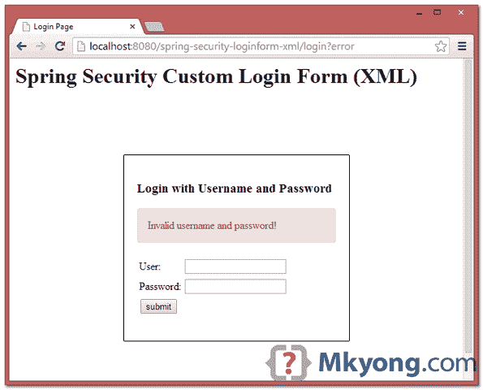

# Spring Security 自定义登录表单示例

> 原文：<http://web.archive.org/web/20230101150211/http://www.mkyong.com/spring-security/spring-security-form-login-example/>

默认情况下，如果没有指定登录表单，Spring Security 将自动创建一个默认的登录表单。请参考这个——[春安 hello world 示例](http://web.archive.org/web/20220309221809/http://www.mkyong.com/spring-security/spring-security-hello-world-example/)。

在本教程中，我们将向您展示如何为 Spring Security 创建一个定制的登录表单(XML 示例)。

使用的技术:

1.  弹簧 3.2.8 释放
2.  Spring Security 3.2.3 .发布
3.  Eclipse 4.2
4.  JDK 1.6
5.  maven3

**Note**
In this example, previous [Spring Security hello world example](http://web.archive.org/web/20220309221809/http://www.mkyong.com/spring-security/spring-security-hello-world-example/) will be reused, enhance it to support a custom login form.

## 1.项目演示

[//web.archive.org/web/20220309221809if_/https://www.youtube.com/embed/Y0QaOxnEn1Y](//web.archive.org/web/20220309221809if_/https://www.youtube.com/embed/Y0QaOxnEn1Y)

## 2.目录结构

查看本教程的最终目录结构。


## 3.Spring 安全配置

在 Spring XML 文件中定义了您的自定义登录表单。参见下面的解释:

1.  log in-page = "/log in "–显示自定义登录表单的页面
2.  认证-失败-url="/login？错误”-如果验证失败，请转到第`/login?error`页
3.  注销-成功-URL = "/登录？注销”——如果注销成功，转到视图`/logout`
4.  username-parameter = " username "–包含“用户名”的请求的名称。在 HTML 中，这是输入文本的名称。
5.  <csrf>–启用跨站请求伪造(CSRF)保护，参见此[链接](http://web.archive.org/web/20220309221809/https://spring.io/blog/2013/08/21/spring-security-3-2-0-rc1-highlights-csrf-protection/)。在 XML 中，默认情况下，CSRF 保护是禁用的。</csrf>

通常，我们不涉及登录或注销等认证处理，让 Spring 来处理，我们只处理成功或失败的页面来显示。

spring-security.xml

```java
 <beans:beans 
	xmlns:beans="http://www.springframework.org/schema/beans" 
	xmlns:xsi="http://www.w3.org/2001/XMLSchema-instance"
	xsi:schemaLocation="http://www.springframework.org/schema/beans
	http://www.springframework.org/schema/beans/spring-beans-3.0.xsd
	http://www.springframework.org/schema/security
	http://www.springframework.org/schema/security/spring-security-3.2.xsd">

	<http auto-config="true">
		<intercept-url pattern="/admin**" access="ROLE_USER" />
		<form-login 
		    login-page="/login" 
		    default-target-url="/welcome" 
			authentication-failure-url="/login?error" 
			username-parameter="username"
			password-parameter="password" />
		<logout logout-success-url="/login?logout" />
		<!-- enable csrf protection -->
		<csrf/>
	</http>

	<authentication-manager>
		<authentication-provider>
		  <user-service>
			<user name="mkyong" password="123456" authorities="ROLE_USER" />
		  </user-service>
		</authentication-provider>
	</authentication-manager>

</beans:beans> 
```

在上面的祝贺中，`/admin`及其子文件夹都有密码保护。

**Cross Site Request Forgery (CSRF) Protection**
If CSRF is enabled, you have to include a `_csrf.token` in the page you want to login or logout. Refer to below `login.jsp` and `admin.jsp` (logout form). Otherwise, both login and logout function will be failed.**Password in clear-text?**
A pretty bad idea, you should always hash the password with SHA algorithm, this tutorial show you how – Spring Security password hashing example.

## 4.自定义登录表单

一个定制的登录表单来匹配上面(步骤 3)的 Spring Security 祝贺。应该是不言自明的。

login.jsp

```java
 <%@ taglib prefix="c" uri="http://java.sun.com/jsp/jstl/core"%>
<html>
<head>
<title>Login Page</title>
<style>
.error {
	padding: 15px;
	margin-bottom: 20px;
	border: 1px solid transparent;
	border-radius: 4px;
	color: #a94442;
	background-color: #f2dede;
	border-color: #ebccd1;
}

.msg {
	padding: 15px;
	margin-bottom: 20px;
	border: 1px solid transparent;
	border-radius: 4px;
	color: #31708f;
	background-color: #d9edf7;
	border-color: #bce8f1;
}

#login-box {
	width: 300px;
	padding: 20px;
	margin: 100px auto;
	background: #fff;
	-webkit-border-radius: 2px;
	-moz-border-radius: 2px;
	border: 1px solid #000;
}
</style>
</head>
<body onload='document.loginForm.username.focus();'>

	<h1>Spring Security Custom Login Form (XML)</h1>

	<div id="login-box">

		<h2>Login with Username and Password</h2>

		<c:if test="${not empty error}">
			<div class="error">${error}</div>
		</c:if>
		<c:if test="${not empty msg}">
			<div class="msg">${msg}</div>
		</c:if>

		<form name='loginForm'
		  action="<c:url value='j_spring_security_check' />" method='POST'>

		  <table>
			<tr>
				<td>User:</td>
				<td><input type='text' name='username' value=''></td>
			</tr>
			<tr>
				<td>Password:</td>
				<td><input type='password' name='password' /></td>
			</tr>
			<tr>
				<td colspan='2'><input name="submit" type="submit"
					value="submit" /></td>
			</tr>
		  </table>

		  <input type="hidden" name="${_csrf.parameterName}"
			value="${_csrf.token}" />

		</form>
	</div>

</body>
</html> 
```

而另外两个 JSP 页面，btw `admin.jsp`是受 Spring Security 密码保护的。

hello.jsp

```java
 <%@page session="false"%>
<html>
<body>
	<h1>Title : ${title}</h1>	
	<h1>Message : ${message}</h1>	
</body>
</html> 
```

admin.jsp + logout

```java
 <%@taglib prefix="c" uri="http://java.sun.com/jsp/jstl/core"%>
<%@page session="true"%>
<html>
<body>
	<h1>Title : ${title}</h1>
	<h1>Message : ${message}</h1>

	<c:url value="/j_spring_security_logout" var="logoutUrl" />

	<!-- csrt for log out-->
	<form action="${logoutUrl}" method="post" id="logoutForm">
	  <input type="hidden" 
		name="${_csrf.parameterName}"
		value="${_csrf.token}" />
	</form>

	<script>
		function formSubmit() {
			document.getElementById("logoutForm").submit();
		}
	</script>

	<c:if test="${pageContext.request.userPrincipal.name != null}">
		<h2>
			Welcome : ${pageContext.request.userPrincipal.name} | <a
				href="javascript:formSubmit()"> Logout</a>
		</h2>
	</c:if>

</body>
</html> 
```

## 5.Spring MVC 控制器

简单的控制器。

HelloController.java

```java
 package com.mkyong.web.controller;

import org.springframework.stereotype.Controller;
import org.springframework.web.bind.annotation.RequestMapping;
import org.springframework.web.bind.annotation.RequestMethod;
import org.springframework.web.bind.annotation.RequestParam;
import org.springframework.web.servlet.ModelAndView;

@Controller
public class HelloController {

	@RequestMapping(value = { "/", "/welcome**" }, method = RequestMethod.GET)
	public ModelAndView welcomePage() {

		ModelAndView model = new ModelAndView();
		model.addObject("title", "Spring Security Custom Login Form");
		model.addObject("message", "This is welcome page!");
		model.setViewName("hello");
		return model;

	}

	@RequestMapping(value = "/admin**", method = RequestMethod.GET)
	public ModelAndView adminPage() {

		ModelAndView model = new ModelAndView();
		model.addObject("title", "Spring Security Custom Login Form");
		model.addObject("message", "This is protected page!");
		model.setViewName("admin");

		return model;

	}

	//Spring Security see this :
	@RequestMapping(value = "/login", method = RequestMethod.GET)
	public ModelAndView login(
		@RequestParam(value = "error", required = false) String error,
		@RequestParam(value = "logout", required = false) String logout) {

		ModelAndView model = new ModelAndView();
		if (error != null) {
			model.addObject("error", "Invalid username and password!");
		}

		if (logout != null) {
			model.addObject("msg", "You've been logged out successfully.");
		}
		model.setViewName("login");

		return model;

	}

} 
```

## 6.演示

6.1.欢迎页面–http://localhost:8080/spring-security-loginform-XML/


6.2 尝试访问`/admin`页面，Spring Security 会拦截请求并重定向到`/login`，显示您的自定义登录表单。


6.3.如果用户名和密码不正确，就会显示错误消息，Spring 会重定向到这个 URL `/login?error`。



6.4.如果用户名和密码正确，Spring 将重定向到最初请求的 URL 并显示页面。


6.5.尝试注销，会重定向到`/login?logout`页面。


## 下载源代码

Download it – [spring-security-custom-login-form-xml.zip](http://web.archive.org/web/20220309221809/http://www.mkyong.com/wp-content/uploads/2011/08/spring-security-custom-login-form-xml-1.zip) (15 KB)

## 参考

1.  [Spring Security Hello World XML 示例](http://web.archive.org/web/20220309221809/http://www.mkyong.com/spring-security/spring-security-hello-world-example/)
2.  [创建自定义登录表单](http://web.archive.org/web/20220309221809/https://docs.spring.io/spring-security/site/docs/3.2.0.RELEASE/guides/form.html)
3.  [春安 3.2.0.RC1 亮点:CSRF 保护](http://web.archive.org/web/20220309221809/https://spring.io/blog/2013/08/21/spring-security-3-2-0-rc1-highlights-csrf-protection/)

<input type="hidden" id="mkyong-current-postId" value="10025">