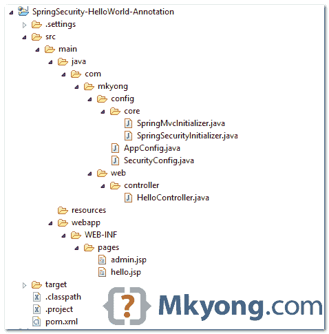
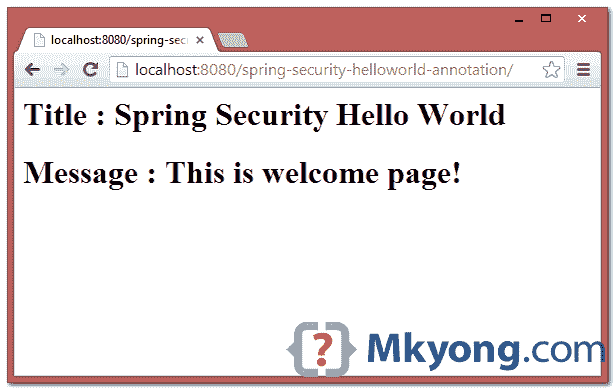
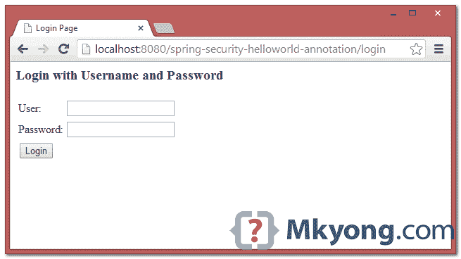
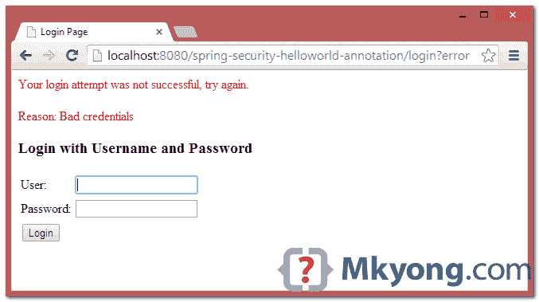
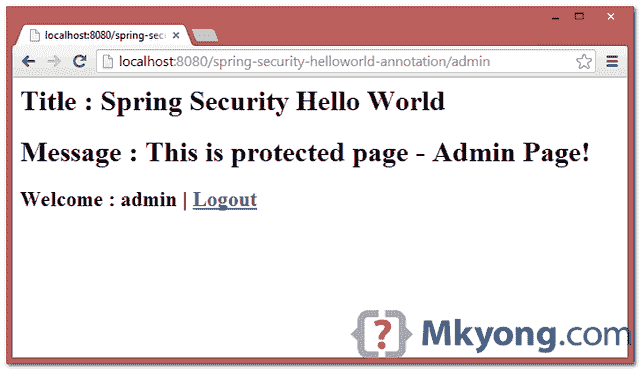
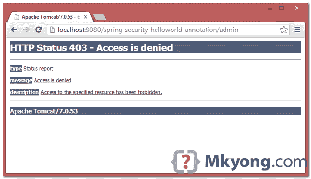

# Spring Security Hello World 注释示例

> 原文：<http://web.archive.org/web/20230101150211/http://www.mkyong.com/spring-security/spring-security-hello-world-annotation-example/>


在 preview [post](http://web.archive.org/web/20190304011458/http://www.mkyong.com/spring-security/spring-security-hello-world-example/) 中，我们使用 XML 文件来配置 Spring MVC 环境中的 Spring 安全性。在本教程中，我们将向您展示如何将之前基于 XML 的 Spring Security 项目转换为一个纯 Spring 注释项目。

使用的技术:

1.  弹簧 3.2.8 释放
2.  Spring Security 3.2.3 .发布
3.  Eclipse 4.2
4.  JDK 1.6
5.  maven3
6.  Tomcat 7 (Servlet 3.x)

**几个音符**

1.  本教程使用`WebApplicationInitializer`来自动加载 Spring Context Loader，它仅在 Servlet 3.x 容器中受支持，例如 Tomcat 7 和 Jetty 8。
2.  因为我们使用的是`WebApplicationInitializer`，所以不需要`web.xml`文件。
3.  旧的 Servlet 2.x 容器支持 Spring 安全注释，例如 Tomcat 6。如果使用经典的 XML 文件加载 Spring 上下文，本教程仍然能够部署在 Servlet 2.x 容器上，例如 Tomcat 6

## 1.项目演示

看看效果如何。

[//web.archive.org/web/20190304011458if_/http://www.youtube.com/embed/NKamWA6hDaU](//web.archive.org/web/20190304011458if_/http://www.youtube.com/embed/NKamWA6hDaU)

 <ins class="adsbygoogle" style="display:block; text-align:center;" data-ad-format="fluid" data-ad-layout="in-article" data-ad-client="ca-pub-2836379775501347" data-ad-slot="6894224149">## 2.目录结构

查看本教程的最终目录结构。

 <ins class="adsbygoogle" style="display:block" data-ad-client="ca-pub-2836379775501347" data-ad-slot="8821506761" data-ad-format="auto" data-ad-region="mkyongregion">## 3.Spring 安全依赖项

要使用 Spring security，需要`spring-security-web`和`spring-security-config`。

pom.xml

```java
 <properties>
		<jdk.version>1.6</jdk.version>
		<spring.version>3.2.8.RELEASE</spring.version>
		<spring.security.version>3.2.3.RELEASE</spring.security.version>
		<jstl.version>1.2</jstl.version>
	</properties>

	<dependencies>

		<!-- Spring 3 dependencies -->
		<dependency>
			<groupId>org.springframework</groupId>
			<artifactId>spring-core</artifactId>
			<version>${spring.version}</version>
		</dependency>

		<dependency>
			<groupId>org.springframework</groupId>
			<artifactId>spring-web</artifactId>
			<version>${spring.version}</version>
		</dependency>

		<dependency>
			<groupId>org.springframework</groupId>
			<artifactId>spring-webmvc</artifactId>
			<version>${spring.version}</version>
		</dependency>

		<!-- Spring Security -->
		<dependency>
			<groupId>org.springframework.security</groupId>
			<artifactId>spring-security-web</artifactId>
			<version>${spring.security.version}</version>
		</dependency>

		<dependency>
			<groupId>org.springframework.security</groupId>
			<artifactId>spring-security-config</artifactId>
			<version>${spring.security.version}</version>
		</dependency>

		<!-- jstl for jsp page -->
		<dependency>
			<groupId>jstl</groupId>
			<artifactId>jstl</artifactId>
			<version>${jstl.version}</version>
		</dependency>

	</dependencies> 
```

## 4.Spring MVC Web 应用程序

一个简单的控制器:

1.  如果 URL = `/welcome`或`/`，返回 hello 页面。
2.  如果 URL = `/admin`，返回管理页面。
3.  如果 URL = `/dba`，返回管理页面。

稍后，我们将保护`/admin`和`/dba`URL。

HelloController.java

```java
 package com.mkyong.web.controller;

import org.springframework.stereotype.Controller;
import org.springframework.web.bind.annotation.RequestMapping;
import org.springframework.web.bind.annotation.RequestMethod;
import org.springframework.web.servlet.ModelAndView;

@Controller
public class HelloController {

	@RequestMapping(value = { "/", "/welcome**" }, method = RequestMethod.GET)
	public ModelAndView welcomePage() {

		ModelAndView model = new ModelAndView();
		model.addObject("title", "Spring Security Hello World");
		model.addObject("message", "This is welcome page!");
		model.setViewName("hello");
		return model;

	}

	@RequestMapping(value = "/admin**", method = RequestMethod.GET)
	public ModelAndView adminPage() {

		ModelAndView model = new ModelAndView();
		model.addObject("title", "Spring Security Hello World");
		model.addObject("message", "This is protected page - Admin Page!");
		model.setViewName("admin");

		return model;

	}

	@RequestMapping(value = "/dba**", method = RequestMethod.GET)
	public ModelAndView dbaPage() {

		ModelAndView model = new ModelAndView();
		model.addObject("title", "Spring Security Hello World");
		model.addObject("message", "This is protected page - Database Page!");
		model.setViewName("admin");

		return model;

	}

} 
```

两个 JSP 页面。

hello.jsp

```java
 <%@page session="false"%>
<html>
<body>
	<h1>Title : ${title}</h1>	
	<h1>Message : ${message}</h1>	
</body>
</html> 
```

admin.jsp

```java
 <%@taglib prefix="c" uri="http://java.sun.com/jsp/jstl/core"%>
<%@page session="true"%>
<html>
<body>
	<h1>Title : ${title}</h1>
	<h1>Message : ${message}</h1>

	<c:if test="${pageContext.request.userPrincipal.name != null}">
		<h2>Welcome : ${pageContext.request.userPrincipal.name} 
                 | <a href="<c:url value="/logout" />" > Logout</a></h2>  
	</c:if>
</body>
</html> 
```

## 5.Spring 安全配置

*5.1* 创建一个 Spring 安全配置文件，并用`@EnableWebSecurity`标注

SecurityConfig.java

```java
 package com.mkyong.config;

import org.springframework.beans.factory.annotation.Autowired;
import org.springframework.context.annotation.Configuration;
import org.springframework.security.config.annotation.authentication.builders.AuthenticationManagerBuilder;
import org.springframework.security.config.annotation.web.builders.HttpSecurity;
import org.springframework.security.config.annotation.web.configuration.EnableWebSecurity;
import org.springframework.security.config.annotation.web.configuration.WebSecurityConfigurerAdapter;

@Configuration
@EnableWebSecurity
public class SecurityConfig extends WebSecurityConfigurerAdapter {

	@Autowired
	public void configureGlobal(AuthenticationManagerBuilder auth) throws Exception {
	  auth.inMemoryAuthentication().withUser("mkyong").password("123456").roles("USER");
	  auth.inMemoryAuthentication().withUser("admin").password("123456").roles("ADMIN");
	  auth.inMemoryAuthentication().withUser("dba").password("123456").roles("DBA");
	}

	@Override
	protected void configure(HttpSecurity http) throws Exception {

	  http.authorizeRequests()
		.antMatchers("/admin/**").access("hasRole('ROLE_ADMIN')")
		.antMatchers("/dba/**").access("hasRole('ROLE_ADMIN') or hasRole('ROLE_DBA')")
		.and().formLogin();

	}
} 
```

相当于 Spring Security xml 文件:

```java
 <http auto-config="true">
		<intercept-url pattern="/admin**" access="ROLE_ADMIN" />
		<intercept-url pattern="/dba**" access="ROLE_ADMIN,ROLE_DBA" />
	</http>

	<authentication-manager>
	  <authentication-provider>
	    <user-service>
		<user name="mkyong" password="123456" authorities="ROLE_USER" />
		<user name="admin" password="123456" authorities="ROLE_ADMIN" />
		<user name="dba" password="123456" authorities="ROLE_DBA" />
	    </user-service>
	  </authentication-provider>
	</authentication-manager> 
```

*5.2* 创建一个类扩展`AbstractSecurityWebApplicationInitializer`，它会自动加载`springSecurityFilterChain`。

SpringSecurityInitializer.java

```java
 package com.mkyong.config.core;

import org.springframework.security.web.context.AbstractSecurityWebApplicationInitializer;

public class SpringSecurityInitializer extends AbstractSecurityWebApplicationInitializer {
   //do nothing
} 
```

在`web.xml`文件中相当于 Spring Security:

```java
 <filter>
		<filter-name>springSecurityFilterChain</filter-name>
		<filter-class>org.springframework.web.filter.DelegatingFilterProxy
                </filter-class>
	</filter>

	<filter-mapping>
		<filter-name>springSecurityFilterChain</filter-name>
		<url-pattern>/*</url-pattern>
	</filter-mapping> 
```

## 6.Spring MVC 配置

*6.1* 一个 Config 类，定义视图的技术和导入上面的`SecurityConfig.java`。

AppConfig.java

```java
 package com.mkyong.config;

import org.springframework.context.annotation.Bean;
import org.springframework.context.annotation.ComponentScan;
import org.springframework.context.annotation.Configuration;
import org.springframework.context.annotation.Import;
import org.springframework.web.servlet.config.annotation.EnableWebMvc;
import org.springframework.web.servlet.view.InternalResourceViewResolver;
import org.springframework.web.servlet.view.JstlView;

@EnableWebMvc
@Configuration
@ComponentScan({ "com.mkyong.web.*" })
@Import({ SecurityConfig.class })
public class AppConfig {

	@Bean
	public InternalResourceViewResolver viewResolver() {
		InternalResourceViewResolver viewResolver 
                          = new InternalResourceViewResolver();
		viewResolver.setViewClass(JstlView.class);
		viewResolver.setPrefix("/WEB-INF/pages/");
		viewResolver.setSuffix(".jsp");
		return viewResolver;
	}

} 
```

相当于 Spring XML 文件:

```java
 <context:component-scan base-package="com.mkyong.web.*" />

	<bean
		class="org.springframework.web.servlet.view.InternalResourceViewResolver">
		<property name="prefix">
			<value>/WEB-INF/pages/</value>
		</property>
		<property name="suffix">
			<value>.jsp</value>
		</property>
	</bean> 
```

*6.2* 创建一个`Initializer`类，来加载一切。

SpringMvcInitializer.java

```java
 package com.mkyong.config.core;

import org.springframework.web.servlet.support.AbstractAnnotationConfigDispatcherServletInitializer;
import com.mkyong.config.AppConfig;

public class SpringMvcInitializer 
       extends AbstractAnnotationConfigDispatcherServletInitializer {

	@Override
	protected Class<?>[] getRootConfigClasses() {
		return new Class[] { AppConfig.class };
	}

	@Override
	protected Class<?>[] getServletConfigClasses() {
		return null;
	}

	@Override
	protected String[] getServletMappings() {
		return new String[] { "/" };
	}

} 
```

完成了。

**Note**
In Servlet 3.x container environment + Spring container will detect and loads the `Initializer` classes automatically.

## 7.演示

7.1.欢迎页面–http://localhost:8080/spring-security-hello world-annotation/welcome



7.2 尝试访问`/admin`页面，Spring Security 会拦截请求并重定向到`/login`，显示默认登录表单。



7.3.如果用户名和密码不正确，就会显示错误消息，Spring 会重定向到这个 URL `/login?error`。



7.4.如果用户名和密码正确，Spring 会将请求重定向到最初请求的 URL 并显示页面。



7.5.对于未授权用户，Spring 将显示 403 拒绝访问页面。例如，用户“mkyong”或“dba”试图访问`/admin` URL。



## 下载源代码

Download it – [spring-security-helloworld-annotation.zip](http://web.archive.org/web/20190304011458/http://www.mkyong.com/wp-content/uploads/2014/04/spring-security-helloworld-annotation.zip) (12 KB)

## 参考

1.  [春天的安全](http://web.archive.org/web/20190304011458/http://projects.spring.io/spring-security/)
2.  [Spring Security Java Config Preview:Web Security](http://web.archive.org/web/20190304011458/http://spring.io/blog/2013/07/03/spring-security-java-config-preview-web-security/)
3.  [Hello Spring MVC 安全 Java 配置](http://web.archive.org/web/20190304011458/http://docs.spring.io/spring-security/site/docs/3.2.x/guides/hellomvc.html)
4.  [维基百科:Java Servlet](http://web.archive.org/web/20190304011458/http://en.wikipedia.org/wiki/Java_Servlet)
5.  维基百科:阿帕奇雄猫
6.  [Spring Security Hello World XML 示例](http://web.archive.org/web/20190304011458/http://www.mkyong.com/spring-security/spring-security-hello-world-example/)

[hello world](http://web.archive.org/web/20190304011458/http://www.mkyong.com/tag/hello-world/) [spring security](http://web.archive.org/web/20190304011458/http://www.mkyong.com/tag/spring-security/)


