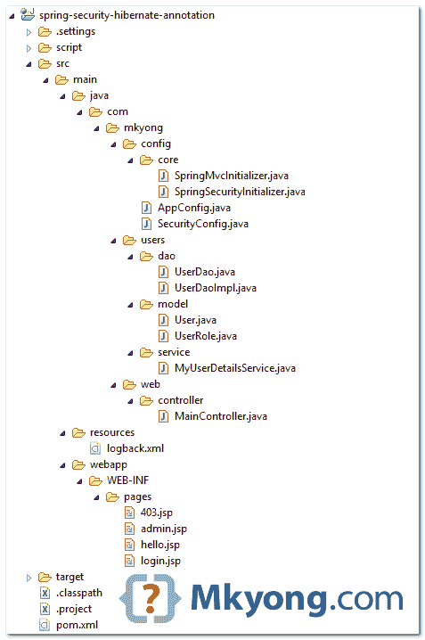
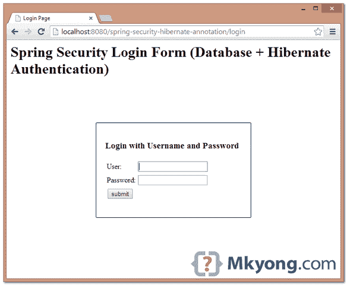
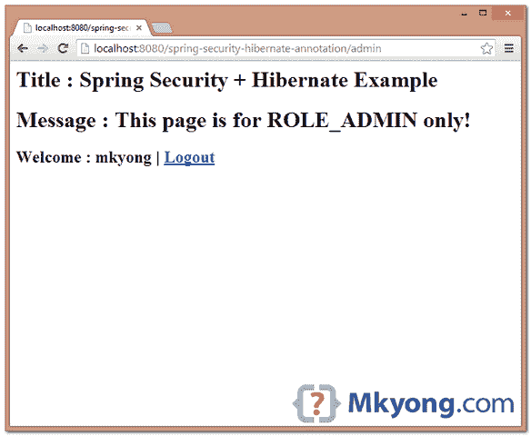
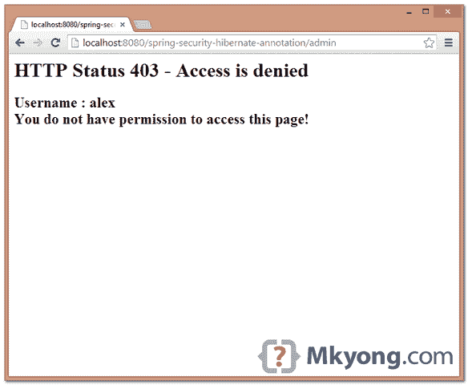

# Spring Security + Hibernate 注释示例

> 原文：<http://web.archive.org/web/20230101150211/http://www.mkyong.com/spring-security/spring-security-hibernate-annotation-example/>


在本教程中，先前的[Spring Security+hibernate 4 XML](http://web.archive.org/web/20190220134456/http://www.mkyong.com/spring-security/spring-security-hibernate-xml-example/)示例将被重用，并将其转换为基于注释的示例。

使用的技术:

1.  弹簧 3.2.8 释放
2.  Spring Security 3.2.3 .发布
3.  Hibernate 4.2.11 .最终版
4.  MySQL 服务器 5.6
5.  Tomcat 7 (Servlet 3.x 容器)

快速笔记:

1.  用`LocalSessionFactoryBuilder`创建一个会话工厂
2.  将会话工厂注入用户道
3.  将 UserDao 集成到一个自定义的`UserDetailsService`中，从数据库中加载用户。

## 1.项目目录

最终项目目录结构。

 ## 2.用户模型+映射文件

模型类及其基于注释的映射文件。

User.java

```java
 package com.mkyong.users.model;

import java.util.HashSet;
import java.util.Set;
import javax.persistence.Column;
import javax.persistence.Entity;
import javax.persistence.FetchType;
import javax.persistence.Id;
import javax.persistence.OneToMany;
import javax.persistence.Table;

@Entity
@Table(name = "users", catalog = "test")
public class User {

	private String username;
	private String password;
	private boolean enabled;
	private Set<UserRole> userRole = new HashSet<UserRole>(0);

	public User() {
	}

	public User(String username, String password, boolean enabled) {
		this.username = username;
		this.password = password;
		this.enabled = enabled;
	}

	public User(String username, String password, 
		boolean enabled, Set<UserRole> userRole) {
		this.username = username;
		this.password = password;
		this.enabled = enabled;
		this.userRole = userRole;
	}

	@Id
	@Column(name = "username", unique = true, 
		nullable = false, length = 45)
	public String getUsername() {
		return this.username;
	}

	public void setUsername(String username) {
		this.username = username;
	}

	@Column(name = "password", 
		nullable = false, length = 60)
	public String getPassword() {
		return this.password;
	}

	public void setPassword(String password) {
		this.password = password;
	}

	@Column(name = "enabled", nullable = false)
	public boolean isEnabled() {
		return this.enabled;
	}

	public void setEnabled(boolean enabled) {
		this.enabled = enabled;
	}

	@OneToMany(fetch = FetchType.LAZY, mappedBy = "user")
	public Set<UserRole> getUserRole() {
		return this.userRole;
	}

	public void setUserRole(Set<UserRole> userRole) {
		this.userRole = userRole;
	}

} 
```

UserRole.java

```java
 package com.mkyong.users.model;

import static javax.persistence.GenerationType.IDENTITY;
import javax.persistence.Column;
import javax.persistence.Entity;
import javax.persistence.FetchType;
import javax.persistence.GeneratedValue;
import javax.persistence.Id;
import javax.persistence.JoinColumn;
import javax.persistence.ManyToOne;
import javax.persistence.Table;
import javax.persistence.UniqueConstraint;

@Entity
@Table(name = "user_roles", catalog = "test", 
	uniqueConstraints = @UniqueConstraint(
		columnNames = { "role", "username" }))
public class UserRole{

	private Integer userRoleId;
	private User user;
	private String role;

	public UserRole() {
	}

	public UserRole(User user, String role) {
		this.user = user;
		this.role = role;
	}

	@Id
	@GeneratedValue(strategy = IDENTITY)
	@Column(name = "user_role_id", 
		unique = true, nullable = false)
	public Integer getUserRoleId() {
		return this.userRoleId;
	}

	public void setUserRoleId(Integer userRoleId) {
		this.userRoleId = userRoleId;
	}

	@ManyToOne(fetch = FetchType.LAZY)
	@JoinColumn(name = "username", nullable = false)
	public User getUser() {
		return this.user;
	}

	public void setUser(User user) {
		this.user = user;
	}

	@Column(name = "role", nullable = false, length = 45)
	public String getRole() {
		return this.role;
	}

	public void setRole(String role) {
		this.role = role;
	}

} 
```

 ## 3.道类

DAO 类，通过 Hibernate 从数据库加载数据。

UserDao.java

```java
 package com.mkyong.users.dao;

import com.mkyong.users.model.User;

public interface UserDao {

	User findByUserName(String username);

} 
```

UserDaoImpl.java

```java
 package com.mkyong.users.dao;

import java.util.ArrayList;
import java.util.List;

import org.hibernate.SessionFactory;
import org.springframework.beans.factory.annotation.Autowired;
import org.springframework.stereotype.Repository;

import com.mkyong.users.model.User;

@Repository
public class UserDaoImpl implements UserDao {

	@Autowired
	private SessionFactory sessionFactory;

	@SuppressWarnings("unchecked")
	public User findByUserName(String username) {

		List<User> users = new ArrayList<User>();

		users = sessionFactory.getCurrentSession()
			.createQuery("from User where username=?")
			.setParameter(0, username)
			.list();

		if (users.size() > 0) {
			return users.get(0);
		} else {
			return null;
		}

	}

} 
```

## 4.用户详细信息服务

使用`@Transactional`来声明一个事务方法。

MyUserDetailsService.java

```java
 package com.mkyong.users.service;

import java.util.ArrayList;
import java.util.HashSet;
import java.util.List;
import java.util.Set;
import org.springframework.beans.factory.annotation.Autowired;
import org.springframework.security.core.GrantedAuthority;
import org.springframework.security.core.authority.SimpleGrantedAuthority;
import org.springframework.security.core.userdetails.User;
import org.springframework.security.core.userdetails.UserDetails;
import org.springframework.security.core.userdetails.UserDetailsService;
import org.springframework.security.core.userdetails.UsernameNotFoundException;
import org.springframework.stereotype.Service;
import org.springframework.transaction.annotation.Transactional;

import com.mkyong.users.dao.UserDao;
import com.mkyong.users.model.UserRole;

@Service("userDetailsService")
public class MyUserDetailsService implements UserDetailsService {

	//get user from the database, via Hibernate
	@Autowired
	private UserDao userDao;

	@Transactional(readOnly=true)
	@Override
	public UserDetails loadUserByUsername(final String username) 
		throws UsernameNotFoundException {

		com.mkyong.users.model.User user = userDao.findByUserName(username);
		List<GrantedAuthority> authorities = 
                                      buildUserAuthority(user.getUserRole());

		return buildUserForAuthentication(user, authorities);

	}

	// Converts com.mkyong.users.model.User user to
	// org.springframework.security.core.userdetails.User
	private User buildUserForAuthentication(com.mkyong.users.model.User user, 
		List<GrantedAuthority> authorities) {
		return new User(user.getUsername(), user.getPassword(), 
			user.isEnabled(), true, true, true, authorities);
	}

	private List<GrantedAuthority> buildUserAuthority(Set<UserRole> userRoles) {

		Set<GrantedAuthority> setAuths = new HashSet<GrantedAuthority>();

		// Build user's authorities
		for (UserRole userRole : userRoles) {
			setAuths.add(new SimpleGrantedAuthority(userRole.getRole()));
		}

		List<GrantedAuthority> Result = new ArrayList<GrantedAuthority>(setAuths);

		return Result;
	}

} 
```

## 5.Spring 安全注释

用注释声明和绑定一切，阅读注释，它应该是不言自明的。

SecurityConfig.java

```java
 package com.mkyong.config;

import org.springframework.beans.factory.annotation.Autowired;
import org.springframework.beans.factory.annotation.Qualifier;
import org.springframework.context.annotation.Bean;
import org.springframework.context.annotation.Configuration;
import org.springframework.security.config.annotation.authentication.builders.AuthenticationManagerBuilder;
import org.springframework.security.config.annotation.web.builders.HttpSecurity;
import org.springframework.security.config.annotation.web.configuration.EnableWebSecurity;
import org.springframework.security.config.annotation.web.configuration.WebSecurityConfigurerAdapter;
import org.springframework.security.core.userdetails.UserDetailsService;
import org.springframework.security.crypto.bcrypt.BCryptPasswordEncoder;
import org.springframework.security.crypto.password.PasswordEncoder;

@Configuration
@EnableWebSecurity
public class SecurityConfig extends WebSecurityConfigurerAdapter {

	@Autowired
	@Qualifier("userDetailsService")
	UserDetailsService userDetailsService;

	@Autowired
	public void configureGlobal(AuthenticationManagerBuilder auth) throws Exception {
		auth.userDetailsService(userDetailsService).passwordEncoder(passwordEncoder());
	}

	@Override
	protected void configure(HttpSecurity http) throws Exception {

	    http.authorizeRequests().antMatchers("/admin/**")
		.access("hasRole('ROLE_ADMIN')").and().formLogin()
		.loginPage("/login").failureUrl("/login?error")
		.usernameParameter("username")
		.passwordParameter("password")
		.and().logout().logoutSuccessUrl("/login?logout")
		.and().csrf()
		.and().exceptionHandling().accessDeniedPage("/403");
	}

	@Bean
	public PasswordEncoder passwordEncoder(){
		PasswordEncoder encoder = new BCryptPasswordEncoder();
		return encoder;
	}

} 
```

使用`LocalSessionFactoryBuilder`创建一个会话工厂。

AppConfig.java

```java
 package com.mkyong.config;

import java.util.Properties;
import org.apache.commons.dbcp.BasicDataSource;
import org.hibernate.SessionFactory;
import org.springframework.context.annotation.Bean;
import org.springframework.context.annotation.ComponentScan;
import org.springframework.context.annotation.Configuration;
import org.springframework.context.annotation.Import;
import org.springframework.orm.hibernate4.HibernateTransactionManager;
import org.springframework.orm.hibernate4.LocalSessionFactoryBuilder;
import org.springframework.transaction.annotation.EnableTransactionManagement;
import org.springframework.web.servlet.config.annotation.EnableWebMvc;
import org.springframework.web.servlet.view.InternalResourceViewResolver;
import org.springframework.web.servlet.view.JstlView;

@EnableWebMvc
@Configuration
@ComponentScan({ "com.mkyong.*" })
@EnableTransactionManagement
@Import({ SecurityConfig.class })
public class AppConfig {

        @Bean
        public SessionFactory sessionFactory() {
                LocalSessionFactoryBuilder builder = 
			new LocalSessionFactoryBuilder(dataSource());
                builder.scanPackages("com.mkyong.users.model")
                      .addProperties(getHibernateProperties());

                return builder.buildSessionFactory();
        }

	private Properties getHibernateProperties() {
                Properties prop = new Properties();
                prop.put("hibernate.format_sql", "true");
                prop.put("hibernate.show_sql", "true");
                prop.put("hibernate.dialect", 
                    "org.hibernate.dialect.MySQL5Dialect");
                return prop;
        }

	@Bean(name = "dataSource")
	public BasicDataSource dataSource() {

		BasicDataSource ds = new BasicDataSource();
	        ds.setDriverClassName("com.mysql.jdbc.Driver");
		ds.setUrl("jdbc:mysql://localhost:3306/test");
		ds.setUsername("root");
		return ds;
	}

	//Create a transaction manager
	@Bean
        public HibernateTransactionManager txManager() {
                return new HibernateTransactionManager(sessionFactory());
        }

	@Bean
	public InternalResourceViewResolver viewResolver() {
		InternalResourceViewResolver viewResolver 
                             = new InternalResourceViewResolver();
		viewResolver.setViewClass(JstlView.class);
		viewResolver.setPrefix("/WEB-INF/pages/");
		viewResolver.setSuffix(".jsp");
		return viewResolver;
	}

} 
```

完成了。

## 6.项目演示

以下视频演示为 [Spring 安全数据库登录](http://web.archive.org/web/20190220134456/http://www.mkyong.com/spring-security/spring-security-form-login-using-database/)教程。由于本教程生成相同的输出，所以视频演示被重用。

[//web.archive.org/web/20190220134456if_/http://www.youtube.com/embed/2ms57c2EdUg](//web.archive.org/web/20190220134456if_/http://www.youtube.com/embed/2ms57c2EdUg)

6.1 进入密码保护页面:*http://localhost:8080/spring-security-hibernate-annotation/admin*，显示登录页面。



6.2 输入用户“mkyong”和密码“123456”。



6.3 使用用户“alex”和密码“123456”尝试访问`/admin`页面，将显示 403 页面。



## 下载源代码

Download it – [spring-security-hibernate-annotation.zip](http://web.archive.org/web/20190220134456/http://www.mkyong.com/wp-content/uploads/2014/05/spring-security-hibernate-annotation.zip) (35 KB)

## 参考

1.  [Spring Security + Hibernate XML 示例](http://web.archive.org/web/20190220134456/http://www.mkyong.com/spring-security/spring-security-hibernate-xml-example/)
2.  [春安你好世界注释示例](http://web.archive.org/web/20190220134456/http://www.mkyong.com/spring-security/spring-security-hello-world-annotation-example/)
3.  [LocalSessionFactoryBuilder JavaDoc](http://web.archive.org/web/20190220134456/http://docs.spring.io/spring/docs/3.2.x/javadoc-api/org/springframework/orm/hibernate4/LocalSessionFactoryBuilder.html)
4.  [春季 ORM–冬眠](http://web.archive.org/web/20190220134456/http://docs.spring.io/spring/docs/3.2.x/spring-framework-reference/htmlsingle/#orm-hibernate)
5.  [春季冬眠 4 LocalSessionFactoryBean JavaDoc](http://web.archive.org/web/20190220134456/http://docs.spring.io/spring/docs/3.2.x/javadoc-api/org/springframework/orm/hibernate4/LocalSessionFactoryBean.html)
6.  [春季交易管理](http://web.archive.org/web/20190220134456/http://docs.spring.io/spring/docs/3.2.x/spring-framework-reference/htmlsingle/#transaction)
7.  [Hibernate ORM 文档](http://web.archive.org/web/20190220134456/http://hibernate.org/orm/documentation/)
8.  [用 JDBC 的 Spring 安全表单登录数据库](http://web.archive.org/web/20190220134456/http://www.mkyong.com/spring-security/spring-security-form-login-using-database/)
9.  [休眠:没有为当前线程](http://web.archive.org/web/20190220134456/http://www.mkyong.com/spring/spring-hibernate-no-session-found-for-current-thread/)找到会话

[annotation](http://web.archive.org/web/20190220134456/http://www.mkyong.com/tag/annotation/) [spring hibernate](http://web.archive.org/web/20190220134456/http://www.mkyong.com/tag/spring-hibernate/) [spring security](http://web.archive.org/web/20190220134456/http://www.mkyong.com/tag/spring-security/)


