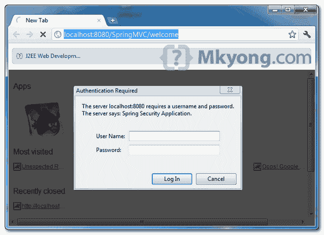

# Spring Security HTTP 基本认证示例

> 原文：<http://web.archive.org/web/20230101150211/http://www.mkyong.com/spring-security/spring-security-http-basic-authentication-example/>

配置 HTTP 基本身份验证后，web 浏览器将显示用户身份验证的登录对话框。本教程向您展示了如何在 Spring Security 中配置 HTTP 基本身份验证。

```java
 <http>
	<intercept-url pattern="/welcome*" access="ROLE_USER" />
	<http-basic />
  </http> 
```

最后一个 [Spring Security 基于表单的登录示例](http://web.archive.org/web/20190225102114/http://www.mkyong.com/spring-security/spring-security-form-login-example/)将被重用，但是切换身份验证以支持 HTTP basic。

## 1.春天安全

要启用 HTTP basic，只需将“ **form-login** ”更改为“ **http-basic** ”标签。

```java
 <beans:beans 
	xmlns:beans="http://www.springframework.org/schema/beans" 
	xmlns:xsi="http://www.w3.org/2001/XMLSchema-instance"
	xsi:schemaLocation="http://www.springframework.org/schema/beans
	http://www.springframework.org/schema/beans/spring-beans-3.0.xsd
	http://www.springframework.org/schema/security
	http://www.springframework.org/schema/security/spring-security-3.0.3.xsd">

	<!-- HTTP basic authentication in Spring Security -->
	<http>
		<intercept-url pattern="/welcome*" access="ROLE_USER" />
		<http-basic />
	</http>

	<authentication-manager>
	   <authentication-provider>
	       <user-service>
		   <user name="mkyong" password="123456" authorities="ROLE_USER" />
	       </user-service>
	   </authentication-provider>
	</authentication-manager>

</beans:beans> 
```

完了，就这样。

 <ins class="adsbygoogle" style="display:block; text-align:center;" data-ad-format="fluid" data-ad-layout="in-article" data-ad-client="ca-pub-2836379775501347" data-ad-slot="6894224149">## 2.演示

当访问安全的 URL 时，浏览器会自动显示一个登录对话框。

*网址:http://localhost:8080/spring MVC/welcome*

 <ins class="adsbygoogle" style="display:block" data-ad-client="ca-pub-2836379775501347" data-ad-slot="8821506761" data-ad-format="auto" data-ad-region="mkyongregion">## 下载源代码

Download it – [Spring-Security-HTTP-Basic-Authentication-Example.zip](http://web.archive.org/web/20190225102114/http://www.mkyong.com/wp-content/uploads/2011/08/Spring-Security-HTTP-Basic-Authentication-Example.zip) (9 KB)

## 参考

1.  [春日安全 hello world 示例](http://web.archive.org/web/20190225102114/http://www.mkyong.com/spring-security/spring-security-hello-world-example/)
2.  [Spring Security 基于表单的登录示例](http://web.archive.org/web/20190225102114/http://www.mkyong.com/spring-security/spring-security-form-login-example/)

[authentication](http://web.archive.org/web/20190225102114/http://www.mkyong.com/tag/authentication/) [spring security](http://web.archive.org/web/20190225102114/http://www.mkyong.com/tag/spring-security/)


