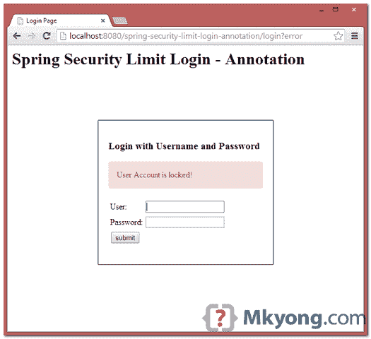
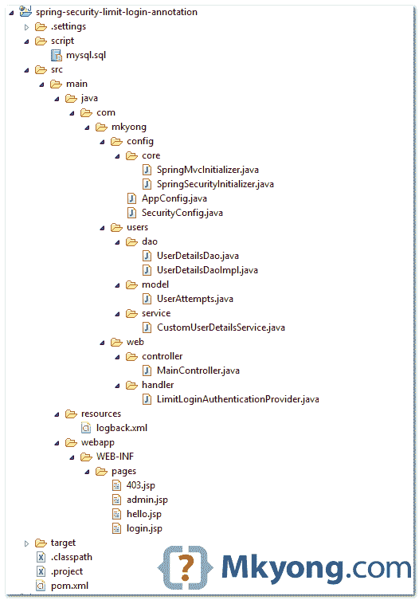
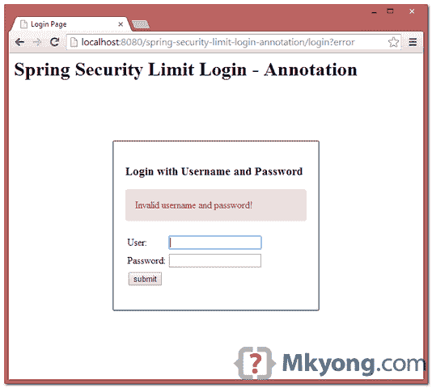
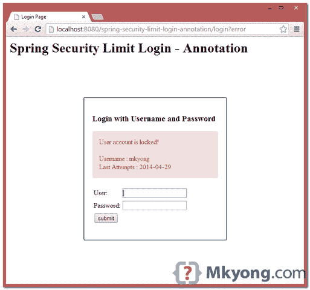
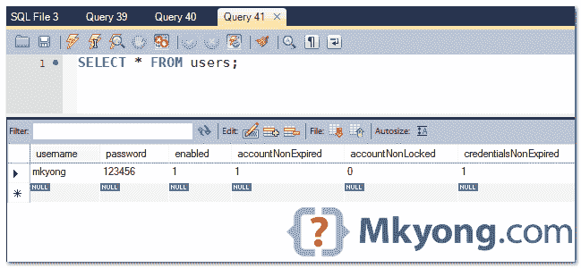

# Spring 安全性:限制登录尝试示例

> 原文：<http://web.archive.org/web/20230101150211/http://www.mkyong.com/spring-security/spring-security-limit-login-attempts-example/>



在本教程中，我们将向您展示如何在 Spring Security 中限制登录尝试，这意味着，如果用户尝试使用无效密码登录超过 3 次，系统将锁定该用户，使其无法再登录。

使用的技术和工具:

1.  弹簧 3.2.8 释放
2.  Spring Security 3.2.3 .发布
3.  春季 JDBC 3.2.3 .发布
4.  Eclipse 4.2
5.  JDK 1.6
6.  maven3
7.  MySQL 服务器 5.6
8.  Tomcat 7 (Servlet 3.x)

本教程的一些快速注释:

1.  将使用 MySQL 数据库。
2.  这是一个基于 Spring 安全注释的例子。
3.  创建一个包含“accountNonLocked”列的“users”表。
4.  创建一个“user_attempts”表来存储无效的登录尝试。
5.  将使用弹簧 JDBC。
6.  根据返回的异常显示自定义错误信息。
7.  创建自定义的“authenticationProvider”

## 1.解决办法

查看现有的 Spring Security 的身份验证类，已经实现了“锁定”特性。要启用限制登录尝试，您需要将`UserDetails.isAccountNonLocked`设置为 false。

DaoAuthenticationProvider.java

```java
 package org.springframework.security.authentication.dao;

public class DaoAuthenticationProvider 
	extends AbstractUserDetailsAuthenticationProvider {
	//...
} 
```

AbstractUserDetailsAuthenticationProvider.java

```java
 package org.springframework.security.authentication.dao;

public abstract class AbstractUserDetailsAuthenticationProvider 
    implements AuthenticationProvider, InitializingBean,
    MessageSourceAware {

    private class DefaultPreAuthenticationChecks implements UserDetailsChecker {
        public void check(UserDetails user) {
          if (!user.isAccountNonLocked()) {
              logger.debug("User account is locked");

          throw new LockedException(
              messages.getMessage("AbstractUserDetailsAuthenticationProvider.locked",
                 "User account is locked"), user);
          }
           //...
        }
    } 
```

 <ins class="adsbygoogle" style="display:block; text-align:center;" data-ad-format="fluid" data-ad-layout="in-article" data-ad-client="ca-pub-2836379775501347" data-ad-slot="6894224149">## 2.项目演示

[//web.archive.org/web/20190210095107if_/http://www.youtube.com/embed/vyoD4ALC43s](//web.archive.org/web/20190210095107if_/http://www.youtube.com/embed/vyoD4ALC43s)

 <ins class="adsbygoogle" style="display:block" data-ad-client="ca-pub-2836379775501347" data-ad-slot="8821506761" data-ad-format="auto" data-ad-region="mkyongregion">## 3.项目目录

查看最终项目结构(基于注释):



## 4.数据库ˌ资料库

下面是创建 users、user_roles 和 user_attempts 表的 MySQL 脚本。

4.1 创建一个“用户”表，列为“accountNonLocked”。

users.sql

```java
 CREATE  TABLE users (
  username VARCHAR(45) NOT NULL ,
  password VARCHAR(45) NOT NULL ,
  enabled TINYINT NOT NULL DEFAULT 1 ,
  accountNonExpired TINYINT NOT NULL DEFAULT 1 ,
  accountNonLocked TINYINT NOT NULL DEFAULT 1 ,
  credentialsNonExpired TINYINT NOT NULL DEFAULT 1,
  PRIMARY KEY (username)); 
```

4.2 创建一个“用户角色”表。

user_roles.sql

```java
 CREATE TABLE user_roles (
  user_role_id int(11) NOT NULL AUTO_INCREMENT,
  username varchar(45) NOT NULL,
  role varchar(45) NOT NULL,
  PRIMARY KEY (user_role_id),
  UNIQUE KEY uni_username_role (role,username),
  KEY fk_username_idx (username),
  CONSTRAINT fk_username FOREIGN KEY (username) REFERENCES users (username)); 
```

4.3 创建“用户尝试次数”表。

user_attempts.sql

```java
 CREATE TABLE user_attempts (
  id int(11) NOT NULL AUTO_INCREMENT,
  username varchar(45) NOT NULL,
  attempts varchar(45) NOT NULL,
  lastModified datetime NOT NULL,
  PRIMARY KEY (id)
); 
```

4.4 插入一个用户进行测试。

```java
 INSERT INTO users(username,password,enabled)
VALUES ('mkyong','123456', true);

INSERT INTO user_roles (username, role)
VALUES ('mkyong', 'ROLE_USER');
INSERT INTO user_roles (username, role)
VALUES ('mkyong', 'ROLE_ADMIN'); 
```

## 5.用户尝试类别

该类表示“用户尝试次数”表的数据。

UserAttempts.java

```java
 package com.mkyong.users.model;

import java.util.Date;

public class UserAttempts {

	private int id;
	private String username;
	private int attempts;
	private Date lastModified;

	//getter and setter

} 
```

## 6.道类

一个 DAO 类，用来更新无效的登录尝试，阅读注释，不言自明。

UserDetailsDao.java

```java
 package com.mkyong.users.dao;

import com.mkyong.users.model.UserAttempts;

public interface UserDetailsDao {

	void updateFailAttempts(String username);
	void resetFailAttempts(String username);
	UserAttempts getUserAttempts(String username);

} 
```

UserDetailsDaoImpl.java

```java
 package com.mkyong.users.dao;

import java.sql.ResultSet;
import java.sql.SQLException;
import java.util.Date;

import javax.annotation.PostConstruct;
import javax.sql.DataSource;

import org.springframework.beans.factory.annotation.Autowired;
import org.springframework.dao.EmptyResultDataAccessException;
import org.springframework.jdbc.core.RowMapper;
import org.springframework.jdbc.core.support.JdbcDaoSupport;
import org.springframework.security.authentication.LockedException;
import org.springframework.stereotype.Repository;

import com.mkyong.users.model.UserAttempts;

@Repository
public class UserDetailsDaoImpl extends JdbcDaoSupport implements UserDetailsDao {

	private static final String SQL_USERS_UPDATE_LOCKED = "UPDATE USERS SET accountNonLocked = ? WHERE username = ?";
	private static final String SQL_USERS_COUNT = "SELECT count(*) FROM USERS WHERE username = ?";

	private static final String SQL_USER_ATTEMPTS_GET = "SELECT * FROM USER_ATTEMPTS WHERE username = ?";
	private static final String SQL_USER_ATTEMPTS_INSERT = "INSERT INTO USER_ATTEMPTS (USERNAME, ATTEMPTS, LASTMODIFIED) VALUES(?,?,?)";
	private static final String SQL_USER_ATTEMPTS_UPDATE_ATTEMPTS = "UPDATE USER_ATTEMPTS SET attempts = attempts + 1, lastmodified = ? WHERE username = ?";
	private static final String SQL_USER_ATTEMPTS_RESET_ATTEMPTS = "UPDATE USER_ATTEMPTS SET attempts = 0, lastmodified = null WHERE username = ?";

	private static final int MAX_ATTEMPTS = 3;

	@Autowired
	private DataSource dataSource;

	@PostConstruct
	private void initialize() {
		setDataSource(dataSource);
	}

	@Override
	public void updateFailAttempts(String username) {

	  UserAttempts user = getUserAttempts(username);
	  if (user == null) {
		if (isUserExists(username)) {
			// if no record, insert a new
			getJdbcTemplate().update(SQL_USER_ATTEMPTS_INSERT, new Object[] { username, 1, new Date() });
		}
	  } else {

		if (isUserExists(username)) {
			// update attempts count, +1
			getJdbcTemplate().update(SQL_USER_ATTEMPTS_UPDATE_ATTEMPTS, new Object[] { new Date(), username});
		}

		if (user.getAttempts() + 1 >= MAX_ATTEMPTS) {
			// locked user
			getJdbcTemplate().update(SQL_USERS_UPDATE_LOCKED, new Object[] { false, username });
			// throw exception
			throw new LockedException("User Account is locked!");
		}

	  }

	}

	@Override
	public UserAttempts getUserAttempts(String username) {

	  try {

		UserAttempts userAttempts = getJdbcTemplate().queryForObject(SQL_USER_ATTEMPTS_GET,
			new Object[] { username }, new RowMapper<UserAttempts>() {
			public UserAttempts mapRow(ResultSet rs, int rowNum) throws SQLException {

				UserAttempts user = new UserAttempts();
				user.setId(rs.getInt("id"));
				user.setUsername(rs.getString("username"));
				user.setAttempts(rs.getInt("attempts"));
				user.setLastModified(rs.getDate("lastModified"));

				return user;
			}

		});
		return userAttempts;

	  } catch (EmptyResultDataAccessException e) {
		return null;
	  }

	}

	@Override
	public void resetFailAttempts(String username) {

	  getJdbcTemplate().update(
             SQL_USER_ATTEMPTS_RESET_ATTEMPTS, new Object[] { username });

	}

	private boolean isUserExists(String username) {

	  boolean result = false;

	  int count = getJdbcTemplate().queryForObject(
                            SQL_USERS_COUNT, new Object[] { username }, Integer.class);
	  if (count > 0) {
		result = true;
	  }

	  return result;
	}

} 
```

## 7.用户详细信息服务

默认情况下，`JdbcDaoImpl`会一直将`accountNonLocked`设置为 true，这不是我们想要的。查看源代码。

JdbcDaoImpl.java

```java
 package org.springframework.security.core.userdetails.jdbc;

public class JdbcDaoImpl extends JdbcDaoSupport implements UserDetailsService {
  //...
  protected List<UserDetails> loadUsersByUsername(String username) {
	return getJdbcTemplate().query(usersByUsernameQuery, new String[] {username}, new RowMapper<UserDetails>() {
	  public UserDetails mapRow(ResultSet rs, int rowNum) throws SQLException {
		String username = rs.getString(1);
		String password = rs.getString(2);
		boolean enabled = rs.getBoolean(3);
		return new User(username, password, enabled, true, true, true, AuthorityUtils.NO_AUTHORITIES);
	  }

  });
} 
```

为了节省开发时间，您可以扩展`JdbcDaoImpl`并覆盖`loadUsersByUsername`和`createUserDetails`来获得定制的`UserDetails`。

CustomUserDetailsService.java

```java
 package com.mkyong.users.service;

import java.sql.ResultSet;
import java.sql.SQLException;
import java.util.List;

import javax.annotation.PostConstruct;
import javax.sql.DataSource;

import org.springframework.beans.factory.annotation.Autowired;
import org.springframework.beans.factory.annotation.Value;
import org.springframework.jdbc.core.RowMapper;
import org.springframework.security.core.GrantedAuthority;
import org.springframework.security.core.authority.AuthorityUtils;
import org.springframework.security.core.userdetails.User;
import org.springframework.security.core.userdetails.UserDetails;
import org.springframework.security.core.userdetails.jdbc.JdbcDaoImpl;
import org.springframework.stereotype.Service;

/**
 * Reference org.springframework.security.core.userdetails.jdbc.JdbcDaoImpl
 * 
 * @author mkyong
 * 
 */
@Service("userDetailsService")
public class CustomUserDetailsService extends JdbcDaoImpl {

	@Autowired
	private DataSource dataSource;

	@PostConstruct
	private void initialize() {
		setDataSource(dataSource);
	}

	@Override
	@Value("select * from users where username = ?")
	public void setUsersByUsernameQuery(String usersByUsernameQueryString) {
		super.setUsersByUsernameQuery(usersByUsernameQueryString);
	}

	@Override
	@Value("select username, role from user_roles where username =?")
	public void setAuthoritiesByUsernameQuery(String queryString) {
		super.setAuthoritiesByUsernameQuery(queryString);
	}

	//override to get accountNonLocked  
	@Override
	public List<UserDetails> loadUsersByUsername(String username) {
	  return getJdbcTemplate().query(super.getUsersByUsernameQuery(), new String[] { username },
		new RowMapper<UserDetails>() {
		  public UserDetails mapRow(ResultSet rs, int rowNum) throws SQLException {
			String username = rs.getString("username");
			String password = rs.getString("password");
			boolean enabled = rs.getBoolean("enabled");
			boolean accountNonExpired = rs.getBoolean("accountNonExpired");
			boolean credentialsNonExpired = rs.getBoolean("credentialsNonExpired");
			boolean accountNonLocked = rs.getBoolean("accountNonLocked");

			return new User(username, password, enabled, accountNonExpired, credentialsNonExpired,
				accountNonLocked, AuthorityUtils.NO_AUTHORITIES);
		  }

	  });
	}

	//override to pass accountNonLocked
	@Override
	public UserDetails createUserDetails(String username, UserDetails userFromUserQuery,
			List<GrantedAuthority> combinedAuthorities) {
		String returnUsername = userFromUserQuery.getUsername();

		if (super.isUsernameBasedPrimaryKey()) {
		  returnUsername = username;
		}

		return new User(returnUsername, userFromUserQuery.getPassword(), 
                       userFromUserQuery.isEnabled(),
		       userFromUserQuery.isAccountNonExpired(), 
                       userFromUserQuery.isCredentialsNonExpired(),
			userFromUserQuery.isAccountNonLocked(), combinedAuthorities);
	}

} 
```

## 8.DaoAuthenticationProvider

创建一个自定义身份验证提供程序，对于每次无效的登录尝试，更新 user_attempts 表，如果达到最大尝试次数，则抛出`LockedException`。

LimitLoginAuthenticationProvider.java

```java
 package com.mkyong.web.handler;

import java.util.Date;

import org.springframework.beans.factory.annotation.Autowired;
import org.springframework.beans.factory.annotation.Qualifier;
import org.springframework.security.authentication.BadCredentialsException;
import org.springframework.security.authentication.LockedException;
import org.springframework.security.authentication.dao.DaoAuthenticationProvider;
import org.springframework.security.core.Authentication;
import org.springframework.security.core.AuthenticationException;
import org.springframework.security.core.userdetails.UserDetailsService;
import org.springframework.stereotype.Component;

import com.mkyong.users.dao.UserDetailsDao;
import com.mkyong.users.model.UserAttempts;

@Component("authenticationProvider")
public class LimitLoginAuthenticationProvider extends DaoAuthenticationProvider {

	@Autowired
	UserDetailsDao userDetailsDao;

	@Autowired
	@Qualifier("userDetailsService")
	@Override
	public void setUserDetailsService(UserDetailsService userDetailsService) {
		super.setUserDetailsService(userDetailsService);
	}

	@Override
	public Authentication authenticate(Authentication authentication) 
          throws AuthenticationException {

	  try {

		Authentication auth = super.authenticate(authentication);

		//if reach here, means login success, else an exception will be thrown
		//reset the user_attempts
		userDetailsDao.resetFailAttempts(authentication.getName());

		return auth;

	  } catch (BadCredentialsException e) {	

		//invalid login, update to user_attempts
		userDetailsDao.updateFailAttempts(authentication.getName());
		throw e;

	  } catch (LockedException e){

		//this user is locked!
		String error = "";
		UserAttempts userAttempts = 
                    userDetailsDao.getUserAttempts(authentication.getName());

               if(userAttempts!=null){
			Date lastAttempts = userAttempts.getLastModified();
			error = "User account is locked! <br><br>Username : " 
                           + authentication.getName() + "<br>Last Attempts : " + lastAttempts;
		}else{
			error = e.getMessage();
		}

	  throw new LockedException(error);
	}

	}

} 
```

## 9.弹簧控制器

一个标准的控制器类，参考`login`方法，它向你展示了如何摆弄会话值——“**SPRING _ SECURITY _ LAST _ EXCEPTION**”，并自定义错误消息。

MainController.java

```java
 package com.mkyong.web.controller;

import javax.servlet.http.HttpServletRequest;

import org.springframework.security.authentication.AnonymousAuthenticationToken;
import org.springframework.security.authentication.BadCredentialsException;
import org.springframework.security.authentication.LockedException;
import org.springframework.security.core.Authentication;
import org.springframework.security.core.context.SecurityContextHolder;
import org.springframework.security.core.userdetails.UserDetails;
import org.springframework.stereotype.Controller;
import org.springframework.web.bind.annotation.RequestMapping;
import org.springframework.web.bind.annotation.RequestMethod;
import org.springframework.web.bind.annotation.RequestParam;
import org.springframework.web.servlet.ModelAndView;

@Controller
public class MainController {

	@RequestMapping(value = { "/", "/welcome**" }, method = RequestMethod.GET)
	public ModelAndView defaultPage() {

		ModelAndView model = new ModelAndView();
		model.addObject("title", "Spring Security Limit Login - Annotation");
		model.addObject("message", "This is default page!");
		model.setViewName("hello");
		return model;

	}

	@RequestMapping(value = "/admin**", method = RequestMethod.GET)
	public ModelAndView adminPage() {

		ModelAndView model = new ModelAndView();
		model.addObject("title", "Spring Security Limit Login - Annotation");
		model.addObject("message", "This page is for ROLE_ADMIN only!");
		model.setViewName("admin");

		return model;

	}

	@RequestMapping(value = "/login", method = RequestMethod.GET)
	public ModelAndView login(
                @RequestParam(value = "error", required = false) String error,
		@RequestParam(value = "logout", required = false) String logout, 
                HttpServletRequest request) {

		ModelAndView model = new ModelAndView();
		if (error != null) {
			model.addObject("error", 
                           getErrorMessage(request, "SPRING_SECURITY_LAST_EXCEPTION"));
		}

		if (logout != null) {
			model.addObject("msg", "You've been logged out successfully.");
		}
		model.setViewName("login");

		return model;

	}

	//customize the error message
	private String getErrorMessage(HttpServletRequest request, String key){

		Exception exception = 
                   (Exception) request.getSession().getAttribute(key);

		String error = "";
		if (exception instanceof BadCredentialsException) {
			error = "Invalid username and password!";
		}else if(exception instanceof LockedException) {
			error = exception.getMessage();
		}else{
			error = "Invalid username and password!";
		}

		return error;
	}

	// for 403 access denied page
	@RequestMapping(value = "/403", method = RequestMethod.GET)
	public ModelAndView accesssDenied() {

		ModelAndView model = new ModelAndView();

		// check if user is login
		Authentication auth = SecurityContextHolder.getContext().getAuthentication();
		if (!(auth instanceof AnonymousAuthenticationToken)) {
			UserDetails userDetail = (UserDetails) auth.getPrincipal();
			System.out.println(userDetail);

			model.addObject("username", userDetail.getUsername());

		}

		model.setViewName("403");
		return model;

	}

} 
```

## 10.Spring 安全配置

附上您定制的`authenticationProvider`。

SecurityConfig.java

```java
 package com.mkyong.config;

import org.springframework.beans.factory.annotation.Autowired;
import org.springframework.beans.factory.annotation.Qualifier;
import org.springframework.context.annotation.Configuration;
import org.springframework.security.authentication.AuthenticationProvider;
import org.springframework.security.config.annotation.authentication.builders.AuthenticationManagerBuilder;
import org.springframework.security.config.annotation.web.builders.HttpSecurity;
import org.springframework.security.config.annotation.web.configuration.EnableWebSecurity;
import org.springframework.security.config.annotation.web.configuration.WebSecurityConfigurerAdapter;

@Configuration
@EnableWebSecurity
public class SecurityConfig extends WebSecurityConfigurerAdapter {

	@Autowired
	@Qualifier("authenticationProvider")
	AuthenticationProvider authenticationProvider;

	@Autowired
	public void configureGlobal(AuthenticationManagerBuilder auth) throws Exception {
		auth.authenticationProvider(authenticationProvider);
	}

	@Override
	protected void configure(HttpSecurity http) throws Exception {

		http.authorizeRequests().antMatchers("/admin/**")
		  .access("hasRole('ROLE_USER')").and().formLogin()
		  .loginPage("/login").failureUrl("/login?error")
			.usernameParameter("username")
			.passwordParameter("password")
		  .and().logout().logoutSuccessUrl("/login?logout").and().csrf();
	}
} 
```

完成了。

## 11.演示

演示页面–http://localhost:8080/spring-security-limit-log in-annotation/admin

11.1，第一次无效登录尝试，将显示一个正常的错误消息。



11.2，如果达到无效登录尝试的最大次数，将显示错误消息“用户帐户被锁定”。


11.3、如果用户处于“锁定”状态，仍然尝试再次登录。将显示锁定的详细信息。



11.4 查看“用户”表，如果“account non locked”= 0 或 false，则表示该用户处于锁定状态。



## 下载源代码

Download it – [spring-security-limit-login-annotation.zip](http://web.archive.org/web/20190210095107/http://www.mkyong.com/wp-content/uploads/2014/04/spring-security-limit-login-annotation.zip) (38 KB)Download it – [spring-security-limit-login-xml.zip](http://web.archive.org/web/20190210095107/http://www.mkyong.com/wp-content/uploads/2014/04/spring-security-limit-login-xml.zip) (32 KB)

## 参考

1.  StackOverflow:如何在 Spring Security 中限制登录尝试？
2.  [Spring 官方参考:核心服务-authenticationProvider](http://web.archive.org/web/20190210095107/http://docs.spring.io/spring-security/site/docs/3.2.3.RELEASE/reference/htmlsingle/#core-services)
3.  [Spring Security 自定义登录表单注释示例](http://web.archive.org/web/20190210095107/http://www.mkyong.com/spring-security/spring-security-custom-login-form-annotation-example/)
4.  [Spring DaoAuthenticationProvider JavaDoc](http://web.archive.org/web/20190210095107/http://docs.spring.io/spring-security/site/docs/3.2.3.RELEASE/apidocs/org/springframework/security/authentication/dao/DaoAuthenticationProvider.html)
5.  [Spring JdbcDaoImpl JavaDoc](http://web.archive.org/web/20190210095107/http://docs.spring.io/spring-security/site/docs/3.2.3.RELEASE/apidocs/org/springframework/security/core/userdetails/jdbc/JdbcDaoImpl.html)

[login](http://web.archive.org/web/20190210095107/http://www.mkyong.com/tag/login/) [spring security](http://web.archive.org/web/20190210095107/http://www.mkyong.com/tag/spring-security/)


