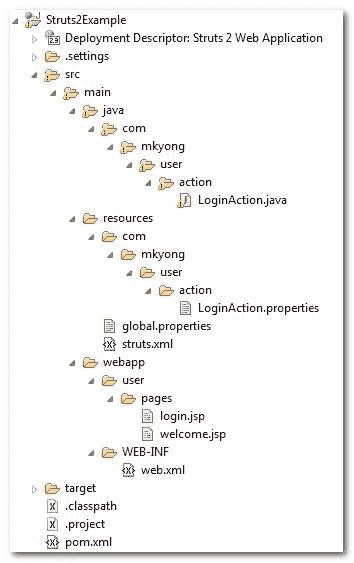
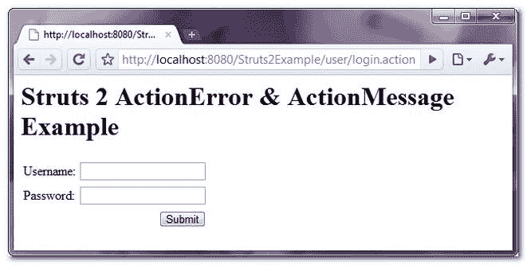
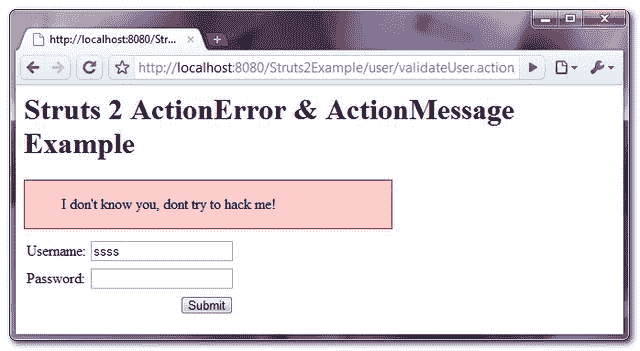
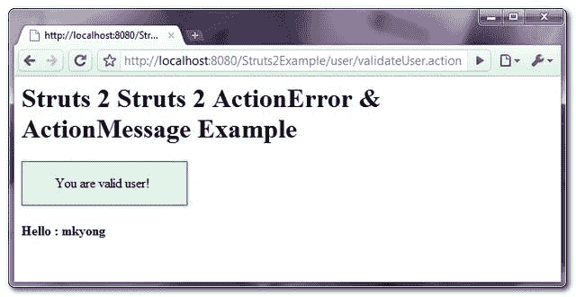

> 原文：<http://web.archive.org/web/20230101150211/http://www.mkyong.com/struts2/struts-2-actionerror-actionmessage-example/>

# struts 2 action error & action message 示例

Download It – [Struts2-ActionError-ActionMessage-Example.zip](http://web.archive.org/web/20190214231635/http://www.mkyong.com/wp-content/uploads/2010/06/Struts2-ActionError-ActionMessage-Example.zip)

展示 Struts 2 的 **ActionError** 和 **ActionMessage** 类用法的教程。

1.**action error**–用于向用户发送错误反馈信息–通过 **< s:actionerror/ >** 显示。

```java
 <s:if test="hasActionErrors()">
   <div class="errors">
      <s:actionerror/>
   </div>
</s:if> 
```

2.**action message**——用于向用户发送信息反馈消息，通过 **<显示 s:actionmessage/ >** 。

```java
 <s:if test="hasActionMessages()">
   <div class="welcome">
      <s:actionmessage/>
   </div>
</s:if> 
```

这是一个简单的登录表单，如果用户名不等于“mkyong ”,则显示错误消息(actionerror ),否则重定向到另一个页面并显示欢迎消息(actionmessage)。此外，所有标签和错误消息都是从资源包(属性文件)中检索的。

## 1.文件夹结构

查看此项目结构

 <ins class="adsbygoogle" style="display:block; text-align:center;" data-ad-format="fluid" data-ad-layout="in-article" data-ad-client="ca-pub-2836379775501347" data-ad-slot="6894224149">## 2.属性文件

存储消息的两个属性文件。

**登录操作.属性**

```java
 #Welcome messages
welcome.hello = Hello

#error message
username.required = Username is required
password.required = Password is required 
```

**global.properties**

```java
 #Global messages
global.username = Username
global.password = Password
global.submit = Submit
global.reset = Reset 
```

 <ins class="adsbygoogle" style="display:block" data-ad-client="ca-pub-2836379775501347" data-ad-slot="8821506761" data-ad-format="auto" data-ad-region="mkyongregion">## 3.行动

一个经典的 action 类，做一个简单的检查确保用户名等于“mkyong”，用 **addActionError()** 设置错误消息或者用 **addActionMessage()** 设置成功消息。

```java
 package com.mkyong.user.action;

import com.opensymphony.xwork2.ActionSupport;

public class LoginAction extends ActionSupport{

	private String username;
	private String password;

	public String getPassword() {
		return password;
	}

	public void setPassword(String password) {
		this.password = password;
	}

	public String getUsername() {
		return username;
	}

	public void setUsername(String username) {
		this.username = username;
	}

	//business logic
	public String execute() {

		return "SUCCESS";

	}

	//simple validation
	public void validate(){
		if("mkyong".equals(getUsername())){
			addActionMessage("You are valid user!");
		}else{
			addActionError("I don't know you, dont try to hack me!");
		}
	}
} 
```

## 4.JSP 视图

两个简单的 css 样式的 JSP 页面来定制错误消息。

**login.jsp**

```java
 <%@ page contentType="text/html; charset=UTF-8" %>
<%@ taglib prefix="s" uri="/struts-tags" %>
<html>
<head>

<style type="text/css">
.errors {
	background-color:#FFCCCC;
	border:1px solid #CC0000;
	width:400px;
	margin-bottom:8px;
}
.errors li{ 
	list-style: none; 
}
</style>

</head>

<body>
<h1>Struts 2 ActionError & ActionMessage Example</h1>

<s:if test="hasActionErrors()">
   <div class="errors">
      <s:actionerror/>
   </div>
</s:if>

<s:form action="validateUser">
	<s:textfield key="global.username" name="username"/>
	<s:password key="global.password" name="password"/>
	<s:submit key="global.submit" name="submit"/>
</s:form>

</body>
</html> 
```

**welcome.jsp**

```java
 <%@ page contentType="text/html; charset=UTF-8" %>
<%@ taglib prefix="s" uri="/struts-tags" %>
<html>
<head>

<style type="text/css">
.welcome {
	background-color:#DDFFDD;
	border:1px solid #009900;
	width:200px;
}
.welcome li{ 
	list-style: none; 
}
</style>

</head>
<body>
<h1>Struts 2 Struts 2 ActionError & ActionMessage Example</h1>

<s:if test="hasActionMessages()">
   <div class="welcome">
      <s:actionmessage/>
   </div>
</s:if>

<h2>

<s:property value="getText('welcome.hello')" /> : 
<s:property value="username"/>

</h2>

</body>
</html> 
```

## 5.struts.xml

把所有的联系在一起。

```java
 <?xml version="1.0" encoding="UTF-8" ?>
<!DOCTYPE struts PUBLIC
"-//Apache Software Foundation//DTD Struts Configuration 2.0//EN"
"http://struts.apache.org/dtds/struts-2.0.dtd">

<struts>

  <constant name="struts.custom.i18n.resources" value="global" />

  <package name="user" namespace="/user" extends="struts-default">
     <action name="login">
	 <result>pages/login.jsp</result>
     </action>
     <action name="validateUser" class="com.mkyong.user.action.LoginAction">
	 <result name="SUCCESS">pages/welcome.jsp</result>
	 <result name="input">pages/login.jsp</result>
     </action>
   </package>

</struts> 
```

In Struts 2, the functionality and usage of ActionError & ActionMessage are quite similar with Struts 1.

## 6.运行它

*http://localhost:8080/struts 2 example/user/log in . action*



用户名无效，显示带有的错误信息



用户名有效，显示欢迎消息



## 参考

1.  [验证感知文档](http://web.archive.org/web/20190214231635/http://struts.apache.org/2.0.11.2/struts2-core/apidocs/com/opensymphony/xwork2/ValidationAware.html)

[struts2](http://web.archive.org/web/20190214231635/http://www.mkyong.com/tag/struts2/)


