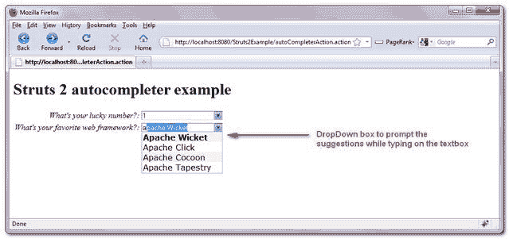
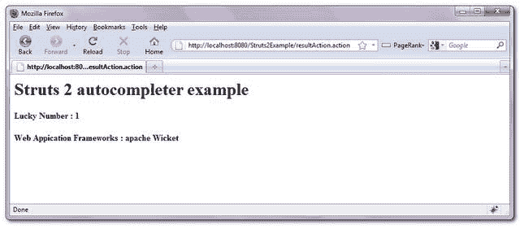

> 原文：<http://web.archive.org/web/20230101150211/http://www.mkyong.com/struts2/struts-2-autocompleter-example/>

# Struts 2 自动完成器示例

Download It – [Struts2-AutoCompleter-Example.zip](http://web.archive.org/web/20190304032710/http://www.mkyong.com/wp-content/uploads/2010/06/Struts2-AutoCompleter-Example.zip)

在 Struts 2 中， **< sx:autocompleter >** 标签是一个组合框，当用户在文本框中输入时，它会自动提示下拉建议列表。

This feature is implemented by dojo library, So, make sure you include “**struts2-dojo-plugin.jar**” as dependency library, put “**struts-dojo-tags**” tag on top of the page and output its header information via **<sx:head />**.

举个例子，

```java
 <%@ taglib prefix="sx" uri="/struts-dojo-tags" %>
<html>
<head>
<sx:head />
</head>
<body>
<sx:autocompleter label="What's your lucky number?" 
name="yourLuckyNumber" autoComplete="false"
list="{'1','12','13','14'}" /> 
```

产生以下 HTML

```java
 <html> 
<head> 
<script language="JavaScript" type="text/javascript"> 
    // Dojo configuration
    djConfig = {
        isDebug: false,
        bindEncoding: "UTF-8"
          ,baseRelativePath: "/Struts2Example/struts/dojo/"
          ,baseScriptUri: "/Struts2Example/struts/dojo/"
         ,parseWidgets : false

    };
</script> 
<script language="JavaScript" type="text/javascript"
        src="/Struts2Example/struts/dojo/struts_dojo.js"></script> 

<script language="JavaScript" type="text/javascript"
        src="/Struts2Example/struts/ajax/dojoRequire.js"></script> 

<link rel="stylesheet" href="/Struts2Example/struts/xhtml/styles.css" 
type="text/css"/> 

<script language="JavaScript" src="/Struts2Example/struts/utils.js" 
type="text/javascript"></script> 

<script language="JavaScript" src="/Struts2Example/struts/xhtml/validation.js" 
type="text/javascript"></script> 

<script language="JavaScript" src="/Struts2Example/struts/css_xhtml/validation.js" 
type="text/javascript"></script> 
</head> 
...
<tr>
<td class="tdLabel">
<label for="resultAction_yourLuckyNumber" class="label">
What's your lucky number?:</label></td>
<td>  
<select dojoType="struts:ComboBox" id="resultAction_yourLuckyNumber" 
autoComplete="false" name="yourLuckyNumber" 
keyName="yourLuckyNumberKey" visibleDownArrow="true" >
    <option value="1">1</option>
    <option value="12">12</option>
    <option value="13">13</option>
    <option value="14">14</option>
</select>
</td>
</tr>
<script language="JavaScript" type="text/javascript">
djConfig.searchIds.push("resultAction_yourLuckyNumber");</script> 
```

## Struts 2 <autocompleter>示例</autocompleter>

一个完整的 **< s:autocompleter >** 标签的例子，当用户在相应的文本框中输入时，生成下拉建议列表。

 <ins class="adsbygoogle" style="display:block; text-align:center;" data-ad-format="fluid" data-ad-layout="in-article" data-ad-client="ca-pub-2836379775501347" data-ad-slot="6894224149">## 1.pom.xml

下载 Struts 2 dojo 依赖库。

**pom.xml**

```java
 //...
    <!-- Struts 2 -->
    <dependency>
      <groupId>org.apache.struts</groupId>
	  <artifactId>struts2-core</artifactId>
	  <version>2.1.8</version>
    </dependency>

    <!-- Struts 2 Dojo Ajax Tags -->
    <dependency>
      <groupId>org.apache.struts</groupId>
	  <artifactId>struts2-dojo-plugin</artifactId>
	  <version>2.1.8</version>
    </dependency>
//... 
```

 <ins class="adsbygoogle" style="display:block" data-ad-client="ca-pub-2836379775501347" data-ad-slot="8821506761" data-ad-format="auto" data-ad-region="mkyongregion">## 2.动作类

Action 类来为" **autocompleter** "组件生成 web 框架选项列表。

**AutoCompleterAction.java**

```java
 package com.mkyong.common.action;

import java.util.ArrayList;
import java.util.List;

import com.opensymphony.xwork2.ActionSupport;

public class AutoCompleterAction extends ActionSupport{

	private List<String> webframeworks = new ArrayList<String>();

	private String yourFavWebFramework;
	private String yourLuckyNumber;

	public AutoCompleterAction(){
		webframeworks.add("Spring MVC");
		webframeworks.add("Struts 1.x");
		webframeworks.add("Struts 2.x");
		webframeworks.add("JavaServer Faces (JSF)");
		webframeworks.add("Google Web Toolkit (GWT)");
		webframeworks.add("Apache Wicket");
		webframeworks.add("Apache Click");
		webframeworks.add("Apache Cocoon");
		webframeworks.add("JBoss Seam");
		webframeworks.add("Stripes");
		webframeworks.add("Apache Tapestry");
		webframeworks.add("Others");
	}

	public String getYourLuckyNumber() {
		return yourLuckyNumber;
	}

	public void setYourLuckyNumber(String yourLuckyNumber) {
		this.yourLuckyNumber = yourLuckyNumber;
	}

	public String getYourFavWebFramework() {
		return yourFavWebFramework;
	}

	public void setYourFavWebFramework(String yourFavWebFramework) {
		this.yourFavWebFramework = yourFavWebFramework;
	}

	public List<String> getWebframeworks() {
		return webframeworks;
	}

	public void setWebframeworks(List<String> webframeworks) {
		this.webframeworks = webframeworks;
	}

	public String display() {
		return NONE;
	}

} 
```

## 3.结果页面

通过“ **< s:autocompleter >** ”标签渲染“ **autocompleter** ”组件，通过 Java list 和 OGNL 生成自动下拉建议列表。

**autocompleter.jsp**

```java
 <%@ taglib prefix="s" uri="/struts-tags" %>
<%@ taglib prefix="sx" uri="/struts-dojo-tags" %>

<html>
<head>
<sx:head />
</head>

<body>
<h1>Struts 2 autocompleter example</h1>

<s:form action="resultAction" namespace="/" method="POST" >

<sx:autocompleter label="What's your lucky number?" 
name="yourLuckyNumber" autoComplete="false"
list="{'1','12','13','14','21','22','23','24',
'31','32','33','34','41','42','43','44'}" />

<sx:autocompleter label="What's your favorite web framework?" 
list="webframeworks" name="yourFavWebFramework" />

<s:submit value="submit" name="submit" />

</s:form>

</body>
</html> 
```

**result.jsp**

```java
 <%@ taglib prefix="s" uri="/struts-tags" %>
<html>

<body>
<h1>Struts 2 autocompleter example</h1>

<h2>
   Lucky Number : <s:property value="yourLuckyNumber"/> 
</h2> 

<h2>
   Web Appication Frameworks : <s:property value="yourFavWebFramework"/> 
</h2> 

</body>
</html> 
```

## 3.struts.xml

全部链接起来~

```java
 <?xml version="1.0" encoding="UTF-8" ?>
<!DOCTYPE struts PUBLIC
"-//Apache Software Foundation//DTD Struts Configuration 2.0//EN"
"http://struts.apache.org/dtds/struts-2.0.dtd">

<struts>

 <constant name="struts.devMode" value="true" />

<package name="default" namespace="/" extends="struts-default">

  <action name="autoCompleterAction" 
	class="com.mkyong.common.action.AutoCompleterAction" 
        method="display">
	<result name="none">pages/autocompleter.jsp</result>
  </action>

  <action name="resultAction" 
        class="com.mkyong.common.action.AutoCompleterAction" >
	<result name="success">pages/result.jsp</result>
  </action>
</package>

</struts> 
```

## 4.演示

*http://localhost:8080/struts 2 example/autocomplete action . action*

Here’s another example to show the use of **JSON** data to provide a list of the select options to the **autocompleter** component – [Struts 2 autocompleter + JSON example](http://web.archive.org/web/20190304032710/http://www.mkyong.com/struts2/struts-2-autocompleter-json-example/).

## 参考

1.  [Struts 2 自动完成器文档](http://web.archive.org/web/20190304032710/http://struts.apache.org/2.1.8/docs/autocompleter.html)
2.  [Struts 2 ajax 和 javascript 配方](http://web.archive.org/web/20190304032710/http://struts.apache.org/2.0.14/docs/ajax-and-javascript-recipes.html)
3.  [Struts 2 组合框示例](http://web.archive.org/web/20190304032710/http://www.mkyong.com/struts2/struts-2-scombobox-combo-box-example/)

[auto complete](http://web.archive.org/web/20190304032710/http://www.mkyong.com/tag/auto-complete/) [struts2](http://web.archive.org/web/20190304032710/http://www.mkyong.com/tag/struts2/)


