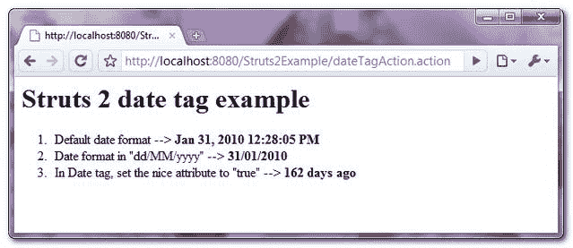

# Struts 2 日期标记示例

> 原文：<http://web.archive.org/web/20230101150211/http://www.mkyong.com/struts2/struts-2-date-tag-example/>

Download It – [Struts2-Date-Tag-Example.zip](http://web.archive.org/web/20190304032514/http://www.mkyong.com/wp-content/uploads/2010/07/Struts2-Date-Tag-Example.zip)

Struts 2 " **date** 标签用于以两种方式格式化日期对象:

1.  自定义日期格式(如“日/月/年”)。
2.  “nice”属性将日期格式化为易于阅读的符号，如“此日期是 162 天前”。

在本教程中，它展示了使用 Struts 2 " **date** "标记将日期对象格式化为"**自定义日期格式**"和"**易读符号**"。

## 1.行动

转发请求的操作类，并用预定义的日期初始化日期对象。

**date tagging . Java**

```java
 package com.mkyong.common.action;

import java.text.DateFormat;
import java.util.Calendar;
import java.util.Date;

import com.opensymphony.xwork2.ActionSupport;

public class DateTagAction extends ActionSupport{

	public Date customDate;

	public String execute() {

		Calendar cal = Calendar.getInstance();
		//set date to january 31, 2010
		cal.set(2010, 0, 31);
		Date newDate = cal.getTime();

		setCustomDate(newDate);

		return SUCCESS;

	}

	public Date getCustomDate() {
		return customDate;
	}

	public void setCustomDate(Date customDate) {
		this.customDate = customDate;
	}

} 
```

 ## 2.日期标签示例

一个 JSP 页面，展示了如何使用“ **date** 标记来格式化日期对象:

1.  默认日期格式。
2.  自定义日期格式。
3.  易读的符号。

**date.jsp**

```java
 <%@ taglib prefix="s" uri="/struts-tags" %>
 <html>
<head>
</head>

<body>
<h1>Struts 2 date tag example</h1>

<ol>

<li>
Default date format
--> <strong><s:date name="customDate" /></strong>
</li>

<li>
Date format in "dd/MM/yyyy"
--> <strong><s:date name="customDate" format="dd/MM/yyyy" /></strong>
</li>

<li>
In Date tag, set the nice attribute to "true"
--> <strong><s:date name="customDate" nice="true" /></strong>
</li>

</ol>

</body>
</html> 
```

 ## 3.struts.xml

链接一下~

```java
 <?xml version="1.0" encoding="UTF-8" ?>
<!DOCTYPE struts PUBLIC
"-//Apache Software Foundation//DTD Struts Configuration 2.0//EN"
"http://struts.apache.org/dtds/struts-2.0.dtd">

<struts>
 	<constant name="struts.devMode" value="true" />
	<package name="default" namespace="/" extends="struts-default">

		<action name="dateTagAction" 
			class="com.mkyong.common.action.DateTagAction" >
			<result name="success">pages/date.jsp</result>
		</action>

	</package>
</struts> 
```

## 4.演示

*http://localhost:8080/struts 2 example/datetagaction . action*

**输出**



## 参考

1.  [Struts 2 日期标签文档](http://web.archive.org/web/20190304032514/http://struts.apache.org/2.0.14/docs/date.html)

[date](http://web.archive.org/web/20190304032514/http://www.mkyong.com/tag/date/) [struts2](http://web.archive.org/web/20190304032514/http://www.mkyong.com/tag/struts2/)


