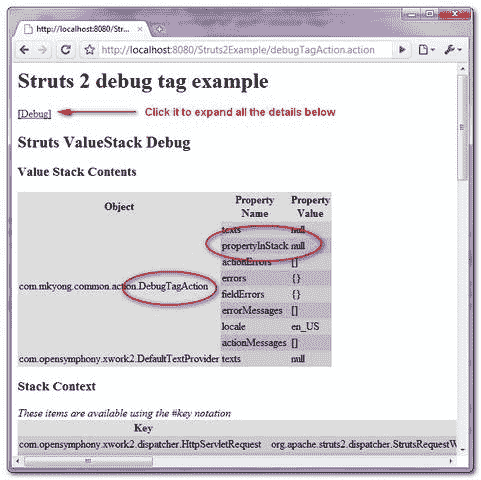

# Struts 2 调试标记示例

> 原文：<http://web.archive.org/web/20230101150211/http://www.mkyong.com/struts2/struts-2-debug-tag-example/>

Download It – [Struts2-Debug-Tag-Example.zip](http://web.archive.org/web/20190304032231/http://www.mkyong.com/wp-content/uploads/2010/07/Struts2-Debug-Tag-Example.zip)

在 Struts 2 中，“ **debug** 标签是一个非常有用的调试标签，用来输出“**值栈**的内容，以及 web 页面中的“**栈上下文**细节。在本教程中，它展示了在 JSP 页面中使用“ **debug** ”标记。

## 1.行动

一个简单的 Action 类，带有一个“ **propertyInStack** 属性，稍后显示在值堆栈中。

**DebugTagAction.java**

```java
 package com.mkyong.common.action;

import com.opensymphony.xwork2.ActionSupport;

public class DebugTagAction extends ActionSupport{

	public String propertyInStack;

	public String getPropertyInStack() {
		return propertyInStack;
	}

	public void setPropertyInStack(String propertyInStack) {
		this.propertyInStack = propertyInStack;
	}

} 
```

 ## 2.日期标签示例

一个 JSP 页面，显示使用" **debug** "标签输出系统的"**值栈**"和"**栈上下文**"。

**debug.jsp**

```java
 <%@ taglib prefix="s" uri="/struts-tags" %>
 <html>
<head>
</head>

<body>
<h1>Struts 2 debug tag example</h1>

<s:debug />

</body>
</html> 
```

The **<s:debug />** will generate a text link named “**debug**“, you need to click on the text link to expand the debugging details. ## 3.struts.xml

链接一下~

```java
 <?xml version="1.0" encoding="UTF-8" ?>
<!DOCTYPE struts PUBLIC
"-//Apache Software Foundation//DTD Struts Configuration 2.0//EN"
"http://struts.apache.org/dtds/struts-2.0.dtd">

<struts>
 	<constant name="struts.devMode" value="true" />
	<package name="default" namespace="/" extends="struts-default">

		<action name="debugTagAction" 
			class="com.mkyong.common.action.DebugTagAction" >
			<result name="success">pages/debug.jsp</result>
		</action>

	</package>
</struts> 
```

## 4.演示

*http://localhost:8080/struts 2 example/debugtagaction . action*

**输出**



## 参考

1.  [Struts 2 调试标签文档](http://web.archive.org/web/20190304032231/http://struts.apache.org/2.0.14/docs/debug.html)

[struts2](http://web.archive.org/web/20190304032231/http://www.mkyong.com/tag/struts2/)


