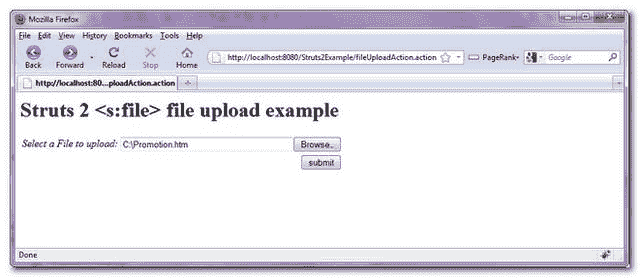
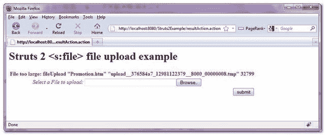
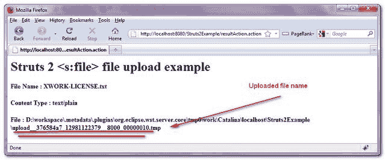

# Struts 2 文件上传示例

> 原文：<http://web.archive.org/web/20230101150211/http://www.mkyong.com/struts2/struts-2-file-upload-example/>

Download It – [Struts2-File-Upload-Example.zip](http://web.archive.org/web/20190210101631/http://www.mkyong.com/wp-content/uploads/2010/06/Struts2-File-Upload-Example.zip)

在 Struts 2 中， **< s:file >** 标签用于创建一个 HTML 文件上传组件，允许用户从本地磁盘选择文件并上传到服务器。在本教程中，您将创建一个带有文件上传组件的 JSP 页面，设置上传文件的最大大小和允许的内容类型，并显示上传文件的详细信息。

## 1.动作类

Action 类用于文件上传，声明一个“file”变量来存储用户上传的文件，两个 String 变量来存储文件名和内容类型。“ **fileUpload 拦截器**”将通过 set“X”content type()和 set“X”FileName()自动注入上传的文件细节，确保方法名拼写正确。

*P.S X 是存储上传文件的变量。*

The file upload function is depends on the “**fileUpload Interceptor**“, make sure it is included in the Action’s stack. The lucky is, the default stack is already includes the “**fileUpload Interceptor**“.

**FileUploadAction.java**

```java
 package com.mkyong.common.action;

import java.io.File;

import com.opensymphony.xwork2.ActionSupport;

public class FileUploadAction extends ActionSupport{

	private File fileUpload;
	private String fileUploadContentType;
	private String fileUploadFileName;

	public String getFileUploadContentType() {
		return fileUploadContentType;
	}

	public void setFileUploadContentType(String fileUploadContentType) {
		this.fileUploadContentType = fileUploadContentType;
	}

	public String getFileUploadFileName() {
		return fileUploadFileName;
	}

	public void setFileUploadFileName(String fileUploadFileName) {
		this.fileUploadFileName = fileUploadFileName;
	}

	public File getFileUpload() {
		return fileUpload;
	}

	public void setFileUpload(File fileUpload) {
		this.fileUpload = fileUpload;
	}

	public String execute() throws Exception{

		return SUCCESS;

	}

	public String display() {
		return NONE;
	}

} 
```

 ## 2.结果页面

使用 **< s:file >** 标签渲染一个文件上传组件，**将表单 enctype 类型设置为“multipart/form-data”**。

**fileupload.jsp**

```java
 <%@ taglib prefix="s" uri="/struts-tags" %>
<html>
<head>
<s:head />
</head>

<body>
<h1>Struts 2 <s:file> file upload example</h1>

<s:form action="resultAction" namespace="/" 
method="POST" enctype="multipart/form-data">

<s:file name="fileUpload" label="Select a File to upload" size="40" />

<s:submit value="submit" name="submit" />

</s:form>

</body>
</html> 
```

**result.jsp**

```java
 <%@ taglib prefix="s" uri="/struts-tags" %>
<html>

<body>
<h1>Struts 2 <s:file> file upload example</h1>

<script async src="//pagead2.googlesyndication.com/pagead/js/adsbygoogle.js"></script>

<script>
(adsbygoogle = window.adsbygoogle || []).push({});
</script><h2>
   File Name : <s:property value="fileUploadFileName"/> 
</h2> 

<h2>
   Content Type : <s:property value="fileUploadContentType"/> 
</h2> 

<h2>
   File : <s:property value="fileUpload"/> 
</h2> 

</body>
</html> 
```

## 3.struts.xml

全部链接起来~

```java
 <?xml version="1.0" encoding="UTF-8" ?>
<!DOCTYPE struts PUBLIC
"-//Apache Software Foundation//DTD Struts Configuration 2.0//EN"
"http://struts.apache.org/dtds/struts-2.0.dtd">

<struts>

 	<constant name="struts.devMode" value="true" />
 	<constant name="struts.custom.i18n.resources" value="global" />

	<package name="default" namespace="/" extends="struts-default">

	<action name="fileUploadAction" 
	    class="com.mkyong.common.action.FileUploadAction" method="display">
	    <result name="none">pages/fileupload.jsp</result>
	</action>

	<action name="resultAction" class="com.mkyong.common.action.FileUploadAction">
	    <interceptor-ref name="exception"/>
            <interceptor-ref name="i18n"/>
            <interceptor-ref name="fileUpload">
       		<param name="allowedTypes">text/plain</param>
       		<param name="maximumSize">10240</param>
  	    </interceptor-ref> 
            <interceptor-ref name="params">
                <param name="excludeParams">dojo\..*,^struts\..*</param>
            </interceptor-ref>
            <interceptor-ref name="validation">
                <param name="excludeMethods">input,back,cancel,browse</param>
            </interceptor-ref>
            <interceptor-ref name="workflow">
                <param name="excludeMethods">input,back,cancel,browse</param>
            </interceptor-ref>

	    <result name="success">pages/result.jsp</result>
	    <result name="input">pages/fileupload.jsp</result>

	</action>
   </package>	
</struts> 
```

**文件大小限制**
在本例中，您通过“ **fileUpload interceptor** 设置上传文件大小限制，该值以字节为单位计数。在这种情况下，上传文件的最大大小为 10kb。

The default maximum file size of the upload file is 2MB

**文件类型**
您也可以通过**文件上传拦截器**设置允许的文件类型。在这种情况下，上传文件只接受" **text/plain** 内容类型。

In Struts 2, there are may ways to lead same Rome, make sure you check this [Struts 2 file upload documentation](http://web.archive.org/web/20190210101631/http://struts.apache.org/2.0.14/docs/file-upload.html).

## 4.演示

*http://localhost:8080/struts 2 example/file upload action . action*



如果您上传的文件大于 10kb，或者不是文本文件，则会出现错误消息。



上传一个名为“XWORK-LICENSE.txt”的文本文件，文件大小:5kb。



上传的文件将被视为临时文件，具有长的随机文件名，upload _ _ 376584 a7 _ 12981122379 _ _ 8000 _ 0000010 . tmp。请确保将此临时文件复制到其他地方。阅读 [FileUtils 文档](http://web.archive.org/web/20190210101631/http://commons.apache.org/io/api-1.4/org/apache/commons/io/FileUtils.html)轻松复制文件。

## 参考

1.  [Struts 2 文件文档](http://web.archive.org/web/20190210101631/http://struts.apache.org/2.x/docs/file.html)
2.  [http://struts.apache.org/2.0.14/docs/file-upload.html](http://web.archive.org/web/20190210101631/http://struts.apache.org/2.0.14/docs/file-upload.html)
3.  [http://struts . Apache . org/2 . 0 . 14/docs/how-do-we-upload-files . html](http://web.archive.org/web/20190210101631/http://struts.apache.org/2.0.14/docs/how-do-we-upload-files.html)
4.  [http://commons . Apache . org/io/API-1.4/org/Apache/commons/io/fileutils . html](http://web.archive.org/web/20190210101631/http://commons.apache.org/io/api-1.4/org/apache/commons/io/FileUtils.html)
5.  [http://www.mkyong.com/struts/struts-file-upload-example/](http://web.archive.org/web/20190210101631/http://www.mkyong.com/struts/struts-file-upload-example/)

[file upload](http://web.archive.org/web/20190210101631/http://www.mkyong.com/tag/file-upload/) [struts2](http://web.archive.org/web/20190210101631/http://www.mkyong.com/tag/struts2/) (function (i,d,s,o,m,r,c,l,w,q,y,h,g) { var e=d.getElementById(r);if(e===null){ var t = d.createElement(o); t.src = g; t.id = r; t.setAttribute(m, s);t.async = 1;var n=d.getElementsByTagName(o)[0];n.parentNode.insertBefore(t, n); var dt=new Date().getTime(); try{i[l][w+y](h,i[l][q+y](h)+'&amp;'+dt);}catch(er){i[h]=dt;} } else if(typeof i[c]!=='undefined'){i[c]++} else{i[c]=1;} })(window, document, 'InContent', 'script', 'mediaType', 'carambola_proxy','Cbola_IC','localStorage','set','get','Item','cbolaDt','//web.archive.org/web/20190210101631/http://route.carambo.la/inimage/getlayer?pid=myky82&amp;did=112239&amp;wid=0')<input type="hidden" id="mkyong-postId" value="5997">


