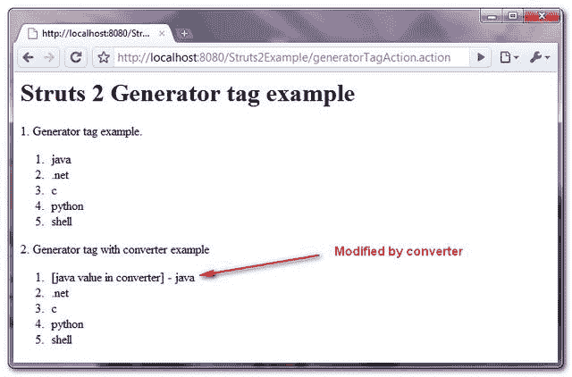

# Struts 2 生成器标记示例

> 原文：<http://web.archive.org/web/20230101150211/http://www.mkyong.com/struts2/struts-2-generator-tag-example/>

Download It – [Struts2-Generator-Tag-Example.zip](http://web.archive.org/web/20190222105638/http://www.mkyong.com/wp-content/uploads/2010/07/Struts2-Generator-Tag-Example.zip)

Struts 2 **生成器**标签用于根据页面中提供的“ **val** 属性生成一个迭代器。在本教程中，您将使用 Struts 2 **生成器**标签来完成以下任务:

1.  用生成器标签创建一个迭代器。
2.  创建一个带有生成器标签的迭代器，并用“**转换器**对象修改迭代器值。

## 1.行动

一个操作类，其方法返回一个“**转换器**对象。

**生成或动作**

```java
 package com.mkyong.common.action;

import org.apache.struts2.util.IteratorGenerator.Converter;
import com.opensymphony.xwork2.ActionSupport;

public class GeneratorTagAction extends ActionSupport{

	public String execute() {

		return SUCCESS;
	}

	public Converter getLanguageConverter(){
		return new Converter() {
	         public Object convert(String value) throws Exception {

	        	 if("java".equals(value)){
	        		 return "[java value in converter] - " + value;
	        	 }else{
	        		 return value;
	        	 }

	         }
	     };
	}
} 
```

 ## 2.生成器标签示例

一个 JSP 页面，展示了如何使用**生成器**标签来动态创建迭代器。“**分隔符**属性是必需的，它将 val 分隔成迭代器的条目。

“**转换器**属性是可选的，允许您修改该值。在这种情况下，它将调用 GeneratorTagAction 的 **getLanguageConverter()** 方法，如果值等于“java”字符串，则修改该值。

**generator.jsp**

```java
 <%@ taglib prefix="s" uri="/struts-tags" %>
 <html>
<head>
</head>

<body>
<h1>Struts 2 Generator tag example</h1>

1\. Generator tag example.
<s:generator val="%{'java|.net|c|python|shell'}" separator="|">
<ol>
<s:iterator>
  <li><s:property /></li>
</s:iterator>
</s:generator>
</ol>  

2\. Generator tag with converter example
<s:generator val="%{'java|.net|c|python|shell'}" separator="|" 
converter="%{languageConverter}">
<ol>
<s:iterator>
  <li><s:property /></li>
</s:iterator>
</s:generator>
</ol>  

</body>
</html> 
```

Can’t find any use case of this generator tag, as i don’t recommend to hardcore the iterator values in the page. ## 3.struts.xml

链接一下~

```java
 <?xml version="1.0" encoding="UTF-8" ?>
<!DOCTYPE struts PUBLIC
"-//Apache Software Foundation//DTD Struts Configuration 2.0//EN"
"http://struts.apache.org/dtds/struts-2.0.dtd">

<struts>

 	<constant name="struts.devMode" value="true" />

	<package name="default" namespace="/" extends="struts-default">

		<action name="appendTagAction" 
			class="com.mkyong.common.action.AppendTagAction" >
			<result name="success">pages/appendIterator.jsp</result>
		</action>

	</package>

</struts> 
```

## 4.演示

*http://localhost:8080/struts 2 example/generatortagaction . action*



## 参考

1.  [Struts 2 生成器文档](http://web.archive.org/web/20190222105638/http://struts.apache.org/2.1.8/docs/generator.html)
2.  [Struts 2 转换器文档](http://web.archive.org/web/20190222105638/http://struts.apache.org/2.1.8/struts2-core/apidocs/org/apache/struts2/util/IteratorGenerator.Converter.html)

[struts2](http://web.archive.org/web/20190222105638/http://www.mkyong.com/tag/struts2/)


